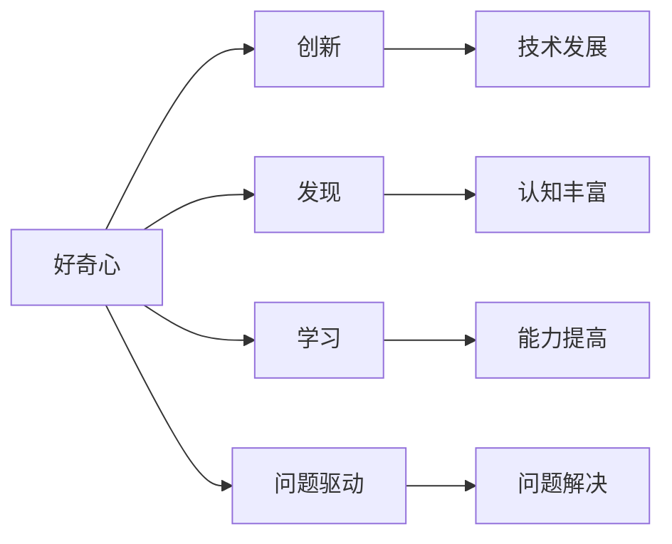

                 

**好奇心：创新与发现的源泉**

## 1. 背景介绍

好奇心是人类与生俱来的一种本能，它驱动着我们去探索未知、发现新事物，从而推动了人类文明的进步。在计算机科学领域，好奇心更是推动技术创新的关键动力。本文将深入探讨好奇心在计算机科学中的作用，并通过分析核心概念、算法原理、数学模型，以及项目实践，展示好奇心如何成为创新与发现的源泉。

## 2. 核心概念与联系

好奇心在计算机科学中的作用可以从以下几个核心概念中窥见一斑：

- **创新**：好奇心驱动着我们去挑战现状，寻找新的解决方案，从而推动技术的创新发展。
- **发现**：好奇心让我们去探索未知领域，发现新的现象、新的规律，从而丰富我们对世界的认知。
- **学习**：好奇心是一种强大的动机，它推动着我们不断学习新的技能、新的知识，从而提高我们的能力。
- **问题驱动**：好奇心常常源于对问题的关注，它驱动着我们去寻找问题的解决方案，从而推动技术的发展。

这些概念是相互联系的，它们共同构成了好奇心在计算机科学中的作用网络。下图是这些概念的 Mermaid 流程图表示：



## 3. 核心算法原理 & 具体操作步骤

好奇心常常驱动着我们去寻找更有效的算法，以解决复杂的问题。下面，我们以贪心算法为例，详细分析其原理与操作步骤。

### 3.1 算法原理概述

贪心算法是一种贪婪的选择策略，它在每一步都选择当前最优的选择，而不是从全局寻找最优解。这种策略在某些问题上非常有效，但并不保证能找到全局最优解。

### 3.2 算法步骤详解

贪心算法的一般步骤如下：

1. 初始化解空间，即所有可能的解。
2. 从解空间中选择当前最优解。
3. 将当前最优解加入解集中。
4. 更新解空间，去除已选择的解。
5. 重复步骤2-4，直到解空间为空。

### 3.3 算法优缺点

贪心算法的优点是简单易懂，且在某些问题上非常有效。其缺点是不保证能找到全局最优解，且不适用于所有问题。

### 3.4 算法应用领域

贪心算法广泛应用于图算法、网络流问题、背包问题等领域。例如，克鲁斯卡尔算法就是贪心算法的应用，用于求最小生成树。

## 4. 数学模型和公式 & 详细讲解 & 举例说明

好奇心常常驱动着我们去构建数学模型，以描述和理解复杂的现象。下面，我们以线性回归为例，详细分析其数学模型和公式。

### 4.1 数学模型构建

线性回归模型假设因变量 $y$ 与自变量 $x$ 之间的关系为线性关系，即 $y = wx + b + \epsilon$, 其中 $w$ 为回归系数， $b$ 为截距， $\epsilon$ 为误差项。

### 4.2 公式推导过程

线性回归的目标是找到最优的 $w$ 和 $b$, 使得误差平方和最小。即：

$$\min_{w, b} \sum_{i=1}^{n} (y_i - (wx_i + b))^2$$

通过求导并设置为零，可以得到 $w$ 和 $b$ 的解析解：

$$w = \frac{\sum_{i=1}^{n} (x_i - \bar{x})(y_i - \bar{y})}{\sum_{i=1}^{n} (x_i - \bar{x})^2}$$

$$b = \bar{y} - w\bar{x}$$

### 4.3 案例分析与讲解

例如，我们想预测房价与房屋面积的关系。我们可以收集一组房屋面积 $x$ 和对应的房价 $y$, 并使用线性回归模型拟合数据。通过计算 $w$ 和 $b$, 我们可以得到预测公式 $y = wx + b$, 从而预测未知房屋面积对应的房价。

## 5. 项目实践：代码实例和详细解释说明

好奇心常常驱动着我们去实践，去编写代码，以验证我们的想法。下面，我们以实现贪心算法为例，详细分析其代码实现。

### 5.1 开发环境搭建

我们将使用 Python 语言实现贪心算法。因此，我们需要安装 Python 环境，并安装 NumPy 等必要的库。

### 5.2 源代码详细实现

以下是贪心算法的 Python 实现：

```python
import numpy as np

def greedy_algorithm(capacity, weights, values):
    n = len(weights)
    selected = [False] * n
    total_value = 0
    for i in range(n):
        if weights[i] <= capacity:
            selected[i] = True
            total_value += values[i]
            capacity -= weights[i]
    return selected, total_value
```

### 5.3 代码解读与分析

这段代码实现了贪心算法，它接受背包容量 `capacity`, 物品重量 `weights`, 物品价值 `values` 作为输入，并返回选择的物品和总价值。在每一步，它选择当前最优的物品，即价值最大的物品，并更新背包容量。

### 5.4 运行结果展示

例如，我们有以下物品：

| 物品 | 重量 | 价值 |
|---|---|---|
| 1 | 2 | 3 |
| 2 | 3 | 4 |
| 3 | 1 | 2 |
| 4 | 4 | 5 |

如果背包容量为 5, 运行上述代码后，我们会得到选择物品 1, 2, 4, 总价值为 12 的结果。

## 6. 实际应用场景

好奇心常常驱动着我们去寻找新的应用场景，以推动技术的发展。例如，贪心算法在网络流问题中有着广泛的应用，它可以帮助我们找到网络中最大流的路径。又如，线性回归模型在数据挖掘领域有着广泛的应用，它可以帮助我们从数据中发现隐藏的规律。

### 6.1 未来应用展望

随着技术的发展，好奇心将驱动着我们去探索新的领域，发现新的应用场景。例如，在人工智能领域，好奇驱动学习 (Intrinsically Motivated Reinforcement Learning) 正在成为一个热门的研究方向，它旨在让智能体通过好奇心驱动去探索环境，从而学习新的知识。

## 7. 工具和资源推荐

好奇心常常驱动着我们去学习新的工具、新的资源，以提高我们的能力。以下是一些推荐的学习资源、开发工具和相关论文：

### 7.1 学习资源推荐

- 书籍：《算法导论》作者：罗伯特·塞奇威克、查尔斯·埃克斯雷
- 在线课程：Coursera 上的 "Machine Learning" 课程

### 7.2 开发工具推荐

- Python：一个强大的通用编程语言，广泛应用于数据分析、机器学习等领域。
- Jupyter Notebook：一个交互式计算环境，广泛应用于数据分析、机器学习等领域。

### 7.3 相关论文推荐

- "Intrinsically Motivated Reinforcement Learning"：一篇关于好奇驱动学习的综述论文。

## 8. 总结：未来发展趋势与挑战

好奇心是计算机科学发展的关键动力，它驱动着我们去创新、去发现、去学习。在未来，好奇心将继续推动技术的发展，但我们也面临着挑战。

### 8.1 研究成果总结

本文通过分析贪心算法、线性回归模型，以及项目实践，展示了好奇心如何成为创新与发现的源泉。

### 8.2 未来发展趋势

未来，好奇心将驱动着我们去探索新的领域，发现新的规律，从而推动技术的发展。例如，好奇驱动学习将成为人工智能领域的一个热门方向。

### 8.3 面临的挑战

然而，好奇心也面临着挑战。例如，如何在保护隐私的前提下收集和分析数据，如何在不造成负面影响的前提下推动技术创新，都是我们需要面对的挑战。

### 8.4 研究展望

未来，我们需要进一步研究好奇心在计算机科学中的作用，探索好奇心驱动学习等新的方向，以推动技术的发展。

## 9. 附录：常见问题与解答

- **Q：好奇心在计算机科学中的作用是什么？**
  - A：好奇心是计算机科学发展的关键动力，它驱动着我们去创新、去发现、去学习。

- **Q：贪心算法的优缺点是什么？**
  - A：贪心算法的优点是简单易懂，且在某些问题上非常有效。其缺点是不保证能找到全局最优解，且不适用于所有问题。

- **Q：线性回归模型的数学模型是什么？**
  - A：线性回归模型假设因变量 $y$ 与自变量 $x$ 之间的关系为线性关系，即 $y = wx + b + \epsilon$, 其中 $w$ 为回归系数， $b$ 为截距， $\epsilon$ 为误差项。

## 作者：禅与计算机程序设计艺术 / Zen and the Art of Computer Programming

