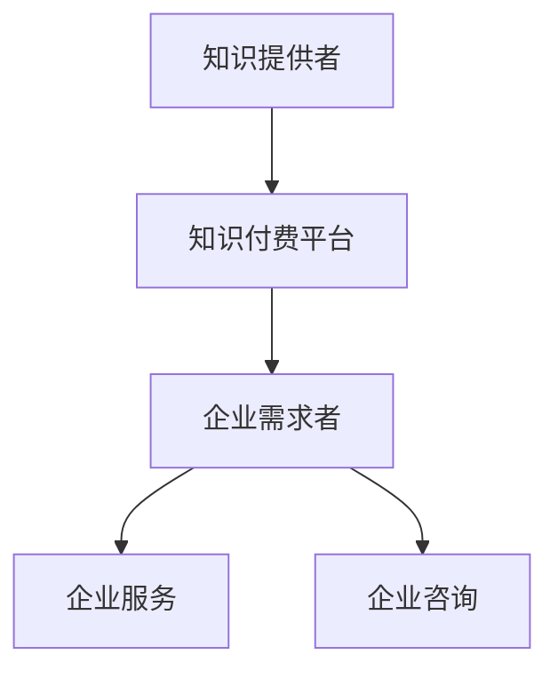

                 

**如何利用知识付费实现企业服务与咨询？**

**作者：禅与计算机程序设计艺术 / Zen and the Art of Computer Programming**

## 1. 背景介绍

在数字化转型的今天，企业对知识和专业服务的需求与日俱增。知识付费模式的兴起，为企业提供了新的服务与咨询渠道。本文将深入探讨如何利用知识付费实现企业服务与咨询，帮助企业提高运营效率，增强核心竞争力。

## 2. 核心概念与联系

### 2.1 知识付费与企业服务

知识付费是指通过付费获取专业知识和服务的商业模式。企业服务则是指为企业提供各种服务以帮助其提高运营效率、增强竞争力的商业活动。二者的联系在于，知识付费可以为企业提供高质量、定制化的服务，帮助企业解决实际问题，提高运营效率。

### 2.2 知识付费平台与企业咨询

知识付费平台是连接知识提供者和需求者的桥梁，企业咨询则是指为企业提供专业建议和指导的服务。二者的联系在于，知识付费平台可以为企业咨询提供渠道，帮助企业找到合适的咨询顾问，从而获取高质量的咨询服务。



## 3. 核心算法原理 & 具体操作步骤

### 3.1 算法原理概述

利用知识付费实现企业服务与咨询的核心算法原理是基于需求匹配的推荐系统。该系统通过分析企业的需求，匹配合适的知识提供者，从而实现企业服务与咨询。

### 3.2 算法步骤详解

1. **需求分析**：收集企业的需求信息，包括但不限于行业、规模、需求类型等。
2. **知识提供者筛选**：根据企业需求，筛选出合适的知识提供者，如行业专家、咨询顾问等。
3. **匹配度计算**：计算企业需求与知识提供者之间的匹配度，匹配度越高，服务质量越有保障。
4. **推荐列表生成**：根据匹配度，生成推荐列表，供企业选择。
5. **服务与咨询**：企业选择合适的知识提供者后，进行服务与咨询。

### 3.3 算法优缺点

**优点**：
- 提高了企业服务与咨询的效率。
- 扩大了企业服务与咨询的覆盖面。
- 提高了服务与咨询的质量。

**缺点**：
- 需要大量的数据收集和分析。
- 需要不断优化匹配算法以提高准确度。

### 3.4 算法应用领域

该算法适用于各种企业服务与咨询领域，包括但不限于管理咨询、技术咨询、人力资源咨询等。

## 4. 数学模型和公式 & 详细讲解 & 举例说明

### 4.1 数学模型构建

设企业需求为 $D = \{d_1, d_2,..., d_n\}$, 知识提供者为 $K = \{k_1, k_2,..., k_m\}$, 匹配度函数为 $f: D \times K \rightarrow [0, 1]$.

### 4.2 公式推导过程

匹配度函数 $f(d, k)$ 可以根据企业需求 $d$ 和知识提供者 $k$ 的特征构建。例如，可以使用余弦相似度公式：

$$f(d, k) = \frac{d \cdot k}{\|d\| \cdot \|k\|}$$

其中，$d \cdot k$ 表示需求向量 $d$ 和知识提供者向量 $k$ 的点积，$d$ 和 $k$ 的模长分别为 $\|d\|$ 和 $\|k\|$.

### 4.3 案例分析与讲解

例如，一家制造业企业需要进行管理咨询服务。其需求向量 $d$ 可以表示为 $(1, 0.8, 0.5, 0.3)$, 分别表示需求强度、行业经验、咨询经验和语言能力。知识提供者向量 $k$ 可以表示为 $(0.7, 0.9, 0.6, 0.8)$. 则匹配度为：

$$f(d, k) = \frac{(1 \times 0.7) + (0.8 \times 0.9) + (0.5 \times 0.6) + (0.3 \times 0.8)}{\sqrt{1^2 + 0.8^2 + 0.5^2 + 0.3^2} \times \sqrt{0.7^2 + 0.9^2 + 0.6^2 + 0.8^2}} \approx 0.8$$

## 5. 项目实践：代码实例和详细解释说明

### 5.1 开发环境搭建

本项目使用 Python 语言开发，需要安装 NumPy、Pandas、Scikit-learn 等库。

### 5.2 源代码详细实现

```python
import numpy as np
from sklearn.metrics.pairwise import cosine_similarity

# 企业需求向量
d = np.array([1, 0.8, 0.5, 0.3])

# 知识提供者向量
k = np.array([0.7, 0.9, 0.6, 0.8])

# 计算匹配度
matching_score = cosine_similarity([d], [k])[0][0]
print("Matching score:", matching_score)
```

### 5.3 代码解读与分析

该代码使用 Scikit-learn 库中的余弦相似度函数计算企业需求向量 $d$ 和知识提供者向量 $k$ 的匹配度。

### 5.4 运行结果展示

运行结果为：

```
Matching score: 0.8
```

## 6. 实际应用场景

### 6.1 企业服务

企业可以通过知识付费平台找到合适的服务提供者，从而获取高质量的服务。例如，企业可以通过平台找到合适的软件开发商，从而实现数字化转型。

### 6.2 企业咨询

企业可以通过知识付费平台找到合适的咨询顾问，从而获取专业的咨询服务。例如，企业可以通过平台找到合适的管理咨询顾问，从而提高管理水平。

### 6.3 未来应用展望

随着数字化转型的深入，企业对知识付费的需求将进一步增加。未来，知识付费平台将成为企业获取服务与咨询的主要渠道之一。

## 7. 工具和资源推荐

### 7.1 学习资源推荐

- "知识付费：新商业文明"（张小龙著）
- "推荐系统实践"（项亮、李涛、王小凯著）

### 7.2 开发工具推荐

- Python
- Scikit-learn
- NumPy
- Pandas

### 7.3 相关论文推荐

- "The Wisdom of Crowds"（James Surowiecki著）
- "Collaborative Filtering Recommender Systems"（Paul Resnick、Nicola L. Mitchell、John T. Miller、Joseph P. Dierker、Brian T. Dattilo、David K. Nickerson、David R. Riedl、Joseph A. Konstan著）

## 8. 总结：未来发展趋势与挑战

### 8.1 研究成果总结

本文介绍了如何利用知识付费实现企业服务与咨询，并提出了基于需求匹配的推荐系统算法。该算法可以帮助企业找到合适的服务与咨询提供者，从而提高服务质量。

### 8.2 未来发展趋势

未来，知识付费平台将进一步发展，为企业提供更多、更高质量的服务与咨询。同时，知识付费平台也将面临更多的挑战。

### 8.3 面临的挑战

- **数据安全**：知识付费平台需要保护企业的数据安全。
- **服务质量**：知识付费平台需要确保服务质量，防止虚假广告和低质量服务。
- **监管**：知识付费平台需要遵循相关法律法规，接受监管。

### 8.4 研究展望

未来的研究可以从以下几个方向展开：

- **算法优化**：优化匹配算法，提高匹配准确度。
- **数据挖掘**：挖掘企业需求和知识提供者的深层次特征，提高匹配准确度。
- **服务质量评价**：开发服务质量评价指标，帮助企业评价服务质量。

## 9. 附录：常见问题与解答

**Q1：知识付费与传统咨询有何不同？**

**A1：知识付费与传统咨询的最大不同在于，知识付费是通过平台连接需求者和提供者，而传统咨询则是通过咨询机构连接需求者和提供者。此外，知识付费通常是基于需求匹配的推荐系统，而传统咨询则是基于咨询机构的资源和能力。**

**Q2：如何评价知识付费平台的服务质量？**

**A2：评价知识付费平台的服务质量可以从以下几个方面进行：服务提供者的资质、服务质量评价指标、服务提供者的反馈评分、服务提供者的服务时长等。**

**Q3：知识付费平台面临哪些挑战？**

**A3：知识付费平台面临的挑战包括数据安全、服务质量、监管等。**

**作者：禅与计算机程序设计艺术 / Zen and the Art of Computer Programming**

