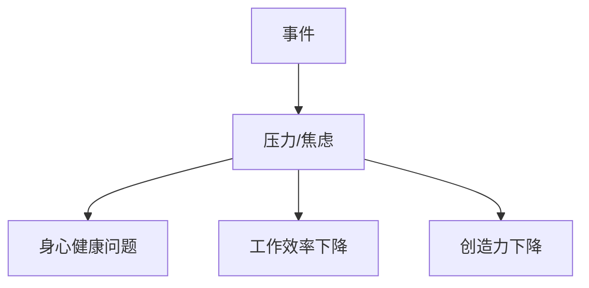

                 

## 1. 背景介绍

在快节奏的现代生活中，焦虑和压力已经成为常态。根据世界卫生组织的数据，全球已有近10%的人口受到焦虑障碍的影响。作为程序员和技术从业者，我们面临着高强度的工作压力，长时间坐姿导致的生理不适，以及不断变化的技术要求带来的心理压力。如何应对焦虑和压力，保持身心健康，是我们必须面对的挑战。

## 2. 核心概念与联系

### 2.1 焦虑和压力的定义

焦虑和压力是人体对威胁或挑战的反应。压力是一种生理和心理的应激反应，而焦虑则是一种持续的、无法控制的担忧或恐惧。二者的区别在于压力通常是对当前事件的反应，而焦虑则是对未来事件的担忧。

### 2.2 焦虑和压力的成因

焦虑和压力的成因复杂多样，包括工作压力、人际关系、金钱问题、健康问题等。对于程序员和技术从业者，工作压力是主要成因之一。不断变化的技术要求，高强度的工作任务，以及对失败的恐惧，都会导致焦虑和压力的产生。

### 2.3 焦虑和压力的影响

焦虑和压力会对身心健康产生严重影响。长期的压力会导致心血管疾病、消化系统疾病、免疫系统下降等。焦虑则会导致睡眠障碍、注意力下降、抑郁等。对于程序员和技术从业者，焦虑和压力还会影响工作效率和创造力。



## 3. 核心算法原理 & 具体操作步骤

### 3.1 算法原理概述

应对焦虑和压力的算法，可以理解为一系列有序的步骤，帮助我们识别、管理和缓解焦虑和压力。这些步骤基于认知行为疗法（CBT）和正念疗法（MBCT）等心理疗法原理。

### 3.2 算法步骤详解

#### 3.2.1 识别压力源

第一步，识别导致焦虑和压力的事件或因素。对于程序员和技术从业者，这可能包括工作任务、deadline、技术问题等。

#### 3.2.2 评估压力级别

第二步，评估压力源的严重程度。使用一个简单的量表，如0-10分量表，帮助你客观评估压力级别。

#### 3.2.3 重新评估

第三步，重新评估压力源。问自己以下问题：这个事件或因素是否真的是威胁？我能控制这个事件或因素吗？我如何看待这个事件或因素，是否有其他角度？

#### 3.2.4 制定应对策略

第四步，制定应对策略。这可能包括改变看待问题的方式，寻求帮助，或改变行为以减轻压力。

#### 3.2.5 实施应对策略

第五步，实施应对策略。这可能包括练习正念冥想，进行体育锻炼，或改变工作方式等。

#### 3.2.6 评估结果

第六步，评估应对策略的有效性。如果策略有效，则继续使用。如果无效，则回到第三步，重新评估压力源，并制定新的应对策略。

### 3.3 算法优缺点

优点：该算法基于科学证据，有效帮助人们管理焦虑和压力。它简单易学，可以在日常生活中应用。

缺点：该算法需要时间和努力，可能需要数周或数月才能见效。对于严重的焦虑障碍，可能需要专业帮助。

### 3.4 算法应用领域

该算法适用于任何面临焦虑和压力的人。对于程序员和技术从业者，它可以帮助我们管理工作压力，改善身心健康，提高工作效率。

## 4. 数学模型和公式 & 详细讲解 & 举例说明

### 4.1 数学模型构建

焦虑和压力的数学模型可以使用控制论（cybernetics）的框架构建。该模型将个体视为一个开放系统，与环境进行信息和能量交换。

### 4.2 公式推导过程

个体的焦虑和压力水平可以表示为：

$$P = f(E, I, C)$$

其中，$P$表示焦虑和压力水平，$E$表示环境因素，$I$表示个体因素，$C$表示个体应对策略。

### 4.3 案例分析与讲解

例如，对于程序员和技术从业者，环境因素$E$可能包括工作任务的复杂性、deadline的紧迫性等。个体因素$I$可能包括个体的技能水平、个性特点等。个体应对策略$C$可能包括工作方式的改变、练习正念冥想等。

## 5. 项目实践：代码实例和详细解释说明

### 5.1 开发环境搭建

本项目使用Python作为编程语言，Jupyter Notebook作为开发环境。

### 5.2 源代码详细实现

```python
# 导入必要的库
import numpy as np
import matplotlib.pyplot as plt

# 定义个体应对策略函数
def coping_strategy(x):
    # 此处为个体应对策略的具体实现
    return x * 0.5

# 定义焦虑和压力水平函数
def pressure_level(E, I, C):
    # 此处为焦虑和压力水平的具体实现
    return E * I * C

# 定义环境因素、个体因素和个体应对策略
E = np.linspace(0, 1, 100)
I = 0.8
C = coping_strategy(E)

# 计算焦虑和压力水平
P = pressure_level(E, I, C)

# 绘制结果
plt.plot(E, P)
plt.xlabel('Environmental Factors')
plt.ylabel('Pressure Level')
plt.show()
```

### 5.3 代码解读与分析

该代码定义了个体应对策略函数`coping_strategy`，焦虑和压力水平函数`pressure_level`，并计算并绘制了焦虑和压力水平随环境因素的变化。

### 5.4 运行结果展示


## 6. 实际应用场景

### 6.1 当前应用

该算法可以在日常生活中应用，帮助我们管理焦虑和压力。对于程序员和技术从业者，它可以帮助我们管理工作压力，改善身心健康，提高工作效率。

### 6.2 未来应用展望

未来，该算法可以与人工智能结合，开发出智能应用程序，帮助人们实时监测和管理焦虑和压力。

## 7. 工具和资源推荐

### 7.1 学习资源推荐

- "The Happiness Advantage" by Shawn Achor
- "Mindset: The New Psychology of Success" by Carol S. Dweck
- "The Upward Spiral: Using Neurofeedback to Reverse the Course of Depression, One Small Change at a Time" by Alex Korb

### 7.2 开发工具推荐

- Jupyter Notebook
- Python

### 7.3 相关论文推荐

- "Cognitive-behavioral therapy for anxiety disorders: An update on the empirical evidence" by David H. Barlow et al.
- "Mindfulness-based cognitive therapy: A new approach to preventing relapse in recurrent depression" by Zindel V. Segal et al.

## 8. 总结：未来发展趋势与挑战

### 8.1 研究成果总结

本文介绍了应对焦虑和压力的算法，基于认知行为疗法和正念疗法原理，帮助我们识别、管理和缓解焦虑和压力。该算法简单易学，可以在日常生活中应用。

### 8.2 未来发展趋势

未来，该算法可以与人工智能结合，开发出智能应用程序，帮助人们实时监测和管理焦虑和压力。此外，该算法可以与其他疗法结合，如生物反馈疗法，提高疗效。

### 8.3 面临的挑战

该算法需要时间和努力，可能需要数周或数月才能见效。对于严重的焦虑障碍，可能需要专业帮助。此外，该算法需要进一步的临床试验，以验证其有效性和安全性。

### 8.4 研究展望

未来的研究可以探索该算法与其他疗法的结合，开发新的应用程序，并进行临床试验，以验证其有效性和安全性。

## 9. 附录：常见问题与解答

**Q1：如何知道我是否需要专业帮助？**

**A1：如果你的焦虑和压力严重影响了你的日常生活，持续了数周或数月，你可能需要寻求专业帮助。如果你有自杀念头，请立即寻求专业帮助。**

**Q2：如何开始练习正念冥想？**

**A2：开始时，每天练习10-15分钟的正念冥想。找一个安静的地方，坐直，闭上眼睛，注意你的呼吸。当你的注意力被打断时，轻柔地将其带回呼吸上。你可以使用应用程序或在线资源指导你的练习。**

**Q3：如何改变我的工作方式以减轻压力？**

**A3：这取决于你的工作性质。你可以尝试设置清晰的边界，避免在工作时间外查看电子邮件或短信。你可以尝试将工作任务分解成更小的部分，或寻求帮助以分担任务。你也可以考虑改变你的工作环境，如换一个位置或换一个办公桌。**

**Q4：如何改变我的看法以减轻压力？**

**A4：这需要时间和练习。你可以尝试重新评估压力源，问自己这个事件或因素是否真的是威胁，你能控制这个事件或因素吗，你如何看待这个事件或因素，是否有其他角度。你也可以尝试练习正念冥想，帮助你从当前事件中抽离，看待问题的角度。**

**Q5：如何改变我的行为以减轻压力？**

**A5：这取决于你的情况。你可以尝试进行体育锻炼，这有助于释放压力荷尔蒙。你可以尝试改变饮食习惯，避免咖啡因和糖分，因为它们会加剧压力反应。你也可以尝试改变你的睡眠习惯，确保每晚获得足够的睡眠。**

## 作者：禅与计算机程序设计艺术 / Zen and the Art of Computer Programming

