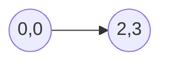
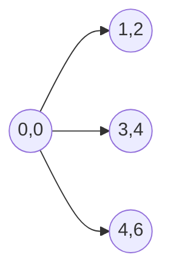
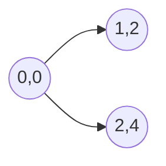

# 线性代数导引：实平面 R²

## 1. 背景介绍

### 1.1 问题的由来

线性代数是数学的一个分支，研究向量空间、向量、线性变换和线性方程组。它是现代数学和科学的基石，应用于物理学、工程学、计算机科学、经济学等众多领域。理解线性代数对于掌握这些学科至关重要。

实平面 R² 是最简单的向量空间之一，它由所有有序实数对 (x, y) 组成。它是理解更复杂向量空间和线性代数概念的理想起点。

### 1.2 研究现状

线性代数是一个成熟的数学领域，其基本理论和方法已经建立起来。然而，随着计算机科学和数据科学的兴起，线性代数在处理大规模数据和解决复杂问题方面发挥着越来越重要的作用。新的算法、应用和理论不断涌现。

### 1.3 研究意义

学习线性代数，特别是实平面 R²，具有以下意义：

* **建立数学基础:**  R² 是理解向量空间、线性变换和线性方程组等基本概念的理想起点。
* **应用于其他学科:**  线性代数广泛应用于物理学、工程学、计算机科学、经济学等领域。
* **解决实际问题:**  线性代数可以用来解决图像处理、机器学习、数据分析等领域的实际问题。

### 1.4 本文结构

本文将深入探讨实平面 R² 的核心概念、原理和应用。文章结构如下：

* **第二章：核心概念与联系**：介绍实平面 R² 的基本概念，包括向量、向量加法、标量乘法、线性组合、线性相关性、线性无关性、基和维度等。
* **第三章：核心算法原理 & 具体操作步骤**：介绍实平面 R² 中的常见算法，包括向量加法、标量乘法、线性组合、求解线性方程组等，并给出具体的代码实现。
* **第四章：数学模型和公式 & 详细讲解 & 举例说明**：介绍实平面 R² 中的数学模型和公式，例如向量范数、向量内积、向量夹角、矩阵表示等，并给出详细的讲解和举例说明。
* **第五章：项目实践：代码实例和详细解释说明**：通过一个实际的项目案例，演示如何使用 Python 代码实现实平面 R² 中的算法和应用。
* **第六章：实际应用场景**：介绍实平面 R² 在图像处理、机器学习、数据分析等领域的实际应用场景。
* **第七章：工具和资源推荐**：推荐学习线性代数和实平面 R² 的书籍、网站、软件等资源。
* **第八章：总结：未来发展趋势与挑战**：总结实平面 R² 的研究现状和未来发展趋势，并探讨面临的挑战。

## 2. 核心概念与联系

### 2.1 向量

在实平面 R² 中，一个向量可以用一个有序实数对 (x, y) 来表示，其中 x 和 y 分别表示向量在水平方向和垂直方向上的分量。

例如，向量 (2, 3) 表示一个从原点 (0, 0) 到点 (2, 3) 的有向线段。



### 2.2 向量加法

两个向量相加可以通过将它们对应的分量相加来实现。

例如，向量 (1, 2) 和向量 (3, 4) 的和为 (1+3, 2+4) = (4, 6)。



### 2.3 标量乘法

一个标量乘以一个向量可以通过将标量乘以向量的每个分量来实现。

例如，标量 2 乘以向量 (1, 2) 的结果为 (2*1, 2*2) = (2, 4)。



### 2.4 线性组合

一个向量的线性组合是指将该向量表示为其他向量和标量的乘积的和。

例如，向量 (4, 6) 可以表示为向量 (1, 2) 和向量 (3, 4) 的线性组合：

```
(4, 6) = 1*(1, 2) + 1*(3, 4)
```

### 2.5 线性相关性

如果一组向量中至少有一个向量可以表示为其他向量的线性组合，则称这组向量是线性相关的。

例如，向量 (1, 2) 和向量 (2, 4) 是线性相关的，因为 (2, 4) = 2*(1, 2)。

### 2.6 线性无关性

如果一组向量中没有一个向量可以表示为其他向量的线性组合，则称这组向量是线性无关的。

例如，向量 (1, 0) 和向量 (0, 1) 是线性无关的。

### 2.7 基

如果一组向量线性无关，并且可以线性组合出向量空间中的所有向量，则称这组向量是该向量空间的基。

例如，向量 (1, 0) 和向量 (0, 1) 是实平面 R² 的一组基。

### 2.8 维度

向量空间的维度是指该向量空间的基中向量的个数。

例如，实平面 R² 的维度为 2，因为它的一组基包含两个向量。

## 3. 核心算法原理 & 具体操作步骤

### 3.1 向量加法

**算法原理：** 将两个向量对应的分量相加。

**操作步骤：**

1. 将两个向量的对应分量相加。
2. 返回新的向量。

**代码实现：**

```python
def vector_addition(v1, v2):
  """
  计算两个向量的和。

  Args:
    v1: 第一个向量，表示为一个列表或元组。
    v2: 第二个向量，表示为一个列表或元组。

  Returns:
    两个向量的和，表示为一个列表。
  """
  return [v1[0] + v2[0], v1[1] + v2[1]]
```

### 3.2 标量乘法

**算法原理：** 将标量乘以向量的每个分量。

**操作步骤：**

1. 将标量乘以向量的每个分量。
2. 返回新的向量。

**代码实现：**

```python
def scalar_multiplication(scalar, v):
  """
  计算标量乘以向量的结果。

  Args:
    scalar: 标量。
    v: 向量，表示为一个列表或元组。

  Returns:
    标量乘以向量的结果，表示为一个列表。
  """
  return [scalar * v[0], scalar * v[1]]
```

### 3.3 线性组合

**算法原理：** 将多个向量和标量的乘积相加。

**操作步骤：**

1. 将每个向量乘以对应的标量。
2. 将所有结果向量相加。
3. 返回最终的向量。

**代码实现：**

```python
def linear_combination(vectors, scalars):
  """
  计算多个向量和标量的线性组合。

  Args:
    vectors: 向量列表，每个向量表示为一个列表或元组。
    scalars: 标量列表。

  Returns:
    多个向量和标量的线性组合结果，表示为一个列表。
  """
  result = [0, 0]
  for i in range(len(vectors)):
    result = vector_addition(result, scalar_multiplication(scalars[i], vectors[i]))
  return result
```

### 3.4 求解线性方程组

**算法原理：** 使用高斯消元法将增广矩阵化为行阶梯形矩阵，然后回代求解。

**操作步骤：**

1. 构造增广矩阵。
2. 使用高斯消元法将增广矩阵化为行阶梯形矩阵。
3. 回代求解。

**代码实现：**

```python
import numpy as np

def solve_linear_equations(A, b):
  """
  使用高斯消元法求解线性方程组 Ax = b。

  Args:
    A: 系数矩阵，表示为一个 NumPy 数组。
    b: 常数向量，表示为一个 NumPy 数组。

  Returns:
    解向量 x，表示为一个 NumPy 数组。
  """
  n = A.shape[0]
  Ab = np.hstack((A, b.reshape((n, 1))))
  for i in range(n):
    # 主元归一化
    pivot = Ab[i, i]
    Ab[i, :] = Ab[i, :] / pivot
    # 消元
    for j in range(i + 1, n):
      factor = Ab[j, i]
      Ab[j, :] = Ab[j, :] - factor * Ab[i, :]
  # 回代
  x = np.zeros(n)
  for i in range(n - 1, -1, -1):
    x[i] = Ab[i, -1]
    for j in range(i + 1, n):
      x[i] = x[i] - Ab[i, j] * x[j]
  return x
```

## 4. 数学模型和公式 & 详细讲解 & 举例说明

### 4.1 向量范数

向量 v = (x, y) 的范数定义为：

$$
||v|| = \sqrt{x^2 + y^2}
$$

它表示向量的大小或长度。

**举例说明：**

向量 (3, 4) 的范数为：

$$
||(3, 4)|| = \sqrt{3^2 + 4^2} = 5
$$

### 4.2 向量内积

两个向量 v = (x₁, y₁) 和 w = (x₂, y₂) 的内积定义为：

$$
v \cdot w = x₁x₂ + y₁y₂
$$

它表示两个向量之间的夹角和它们长度的乘积。

**举例说明：**

向量 (1, 2) 和向量 (3, 4) 的内积为：

$$
(1, 2) \cdot (3, 4) = 1*3 + 2*4 = 11
$$

### 4.3 向量夹角

两个向量 v 和 w 之间的夹角 θ 可以通过以下公式计算：

$$
cos(θ) = \frac{v \cdot w}{||v|| ||w||}
$$

**举例说明：**

向量 (1, 2) 和向量 (3, 4) 之间的夹角 θ 为：

$$
cos(θ) = \frac{(1, 2) \cdot (3, 4)}{||