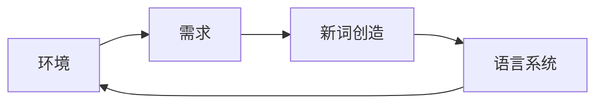

# 维纳的控制论与新词创造


## 1. 背景介绍

### 1.1 问题的由来

语言是不断演变的，新词的创造是语言发展的重要标志。在信息时代，科技的飞速发展和社会文化的变革催生了大量新词的出现，这些新词不仅反映了时代的变化，也影响着人们的思维方式和交流方式。如何理解新词的产生机制，如何有效地创造和传播新词，成为了语言学家、计算机科学家和社会学家共同关注的问题。

### 1.2 研究现状

近年来，语言学家和计算机科学家从不同的角度对新词创造进行了研究。语言学家主要关注新词的构成方式、语义演变和社会文化影响，而计算机科学家则致力于利用自然语言处理技术自动识别、生成和预测新词。然而，这些研究大多局限于对新词现象的描述和分析，缺乏对新词创造机制的深入探讨。

### 1.3 研究意义

维纳的控制论为理解新词创造机制提供了新的视角。控制论的核心思想是反馈和调节，强调系统内部各要素之间的相互作用和动态平衡。将控制论应用于语言研究，可以将新词创造看作是语言系统内部的一种自我调节机制，通过不断地创造新词来适应不断变化的外部环境和内部需求。

### 1.4 本文结构

本文将从控制论的角度探讨维纳的控制论与新词创造之间的关系，并结合具体案例分析新词创造的机制和规律。

## 2. 核心概念与联系

### 2.1 维纳的控制论

控制论是研究系统控制与通信的一门学科，由美国数学家诺伯特·维纳于1948年创立。控制论的核心思想是**反馈**和**调节**，认为任何系统都可以看作是一个信息处理系统，通过不断地接收外部环境和自身状态的信息，并根据这些信息进行调整和控制，从而实现自身的稳定和发展。

### 2.2 新词创造

新词创造是指在语言使用过程中，为了满足新的表达需求而创造新的词语的过程。新词的来源多种多样，可以通过组合已有词语、赋予旧词新义、借用外来词语等方式创造。

### 2.3 控制论与新词创造的联系

将控制论应用于新词创造，可以将语言系统看作是一个信息处理系统，新词的创造则是该系统为了适应外部环境和内部需求而进行的自我调节机制。具体来说：

* **外部环境的变化**：社会文化、科技发展等外部环境的变化会带来新的事物、概念和现象，需要用新的词语来表达。
* **内部需求的变化**：语言系统自身也在不断发展变化，需要创造新的词语来丰富表达方式、提高表达效率。

## 3. 核心算法原理 & 具体操作步骤

### 3.1  算法原理概述

借鉴控制论的思想，我们可以将新词创造的过程抽象为一个反馈控制系统，如下图所示：



该系统包含以下几个关键要素：

* **环境**：指语言系统所处的外部环境，包括社会文化、科技发展等因素。
* **需求**：指语言使用者对新词语的表达需求，包括新事物、新概念、新现象的表达需求，以及提高表达效率、丰富表达方式的需求。
* **新词创造**：指根据需求创造新词语的过程，包括组合已有词语、赋予旧词新义、借用外来词语等方式。
* **语言系统**：指包含所有词语、语法规则和语义信息的语言系统。

该系统的运行机制如下：

1. 环境的变化和语言系统内部的发展变化都会产生新的表达需求。
2. 新的表达需求会促使语言使用者创造新的词语。
3. 新创造的词语会进入语言系统，并被其他语言使用者接受和使用。
4. 新词语的使用会反过来影响语言系统，使其更加适应外部环境和内部需求。

### 3.2  算法步骤详解

基于上述控制论模型，我们可以将新词创造的具体操作步骤概括如下：

1. **需求识别**：识别出需要用新词语表达的新事物、新概念、新现象，或者需要用新词语来提高表达效率、丰富表达方式的需求。
2. **词语生成**：根据需求，选择合适的造词方式，如组合已有词语、赋予旧词新义、借用外来词语等，生成新的词语。
3. **词语传播**：将新创造的词语传播出去，使其被更多的人接受和使用。
4. **词语规范**：对新词语的拼写、发音、语法等进行规范，使其更加符合语言系统的规则。

### 3.3  算法优缺点

**优点:**

* **系统性**：将新词创造看作是一个系统工程，能够更加全面地考虑各种影响因素。
* **动态性**：强调新词创造是一个动态的过程，能够更好地解释新词的产生、发展和消亡。
* **可操作性**：提供了一套可操作的新词创造步骤，具有一定的指导意义。

**缺点:**

* **简化性**：将复杂的语言现象简化为一个简单的反馈控制系统，可能会忽略一些重要的因素。
* **理想化**：假设语言使用者都是理性的，能够根据需求创造出最合适的词语，但在现实中并非总是如此。

### 3.4  算法应用领域

该算法可以应用于以下领域：

* **语言学研究**：为研究新词的产生机制提供新的思路和方法。
* **词典编纂**：为新词的收录提供理论依据。
* **语言教学**：帮助学习者更好地理解和掌握新词。
* **人工智能**：为机器自动生成新词提供参考。


## 4. 数学模型和公式 & 详细讲解 & 举例说明

### 4.1  数学模型构建

为了更精确地描述新词创造的过程，我们可以建立一个简单的数学模型。

假设语言系统中已有词语的数量为 $N$，新词创造的速率与已有词语的数量和新词语的需求量成正比，则新词创造的速率可以表示为：

$$
\frac{dN}{dt} = k \cdot N \cdot D
$$

其中：

* $t$ 表示时间；
* $k$ 为比例系数；
* $D$ 表示新词语的需求量。

该公式表明，新词创造的速率随着已有词语的数量和新词语的需求量的增加而加快。

### 4.2  公式推导过程

上述公式的推导过程如下：

1. 假设新词创造的速率与已有词语的数量成正比，即：

$$
\frac{dN}{dt} \propto N
$$

2. 假设新词创造的速率与新词语的需求量成正比，即：

$$
\frac{dN}{dt} \propto D
$$

3. 结合上述两个假设，可以得到：

$$
\frac{dN}{dt} \propto N \cdot D
$$

4. 引入比例系数 $k$，得到最终的公式：

$$
\frac{dN}{dt} = k \cdot N \cdot D
$$

### 4.3  案例分析与讲解

以“互联网”这一新词的创造为例，我们可以看到控制论模型是如何在新词创造过程中发挥作用的。

1. **环境的变化**：20世纪90年代，互联网技术开始兴起，给人们的生活带来了巨大的变化。
2. **需求的变化**：人们需要一个新的词语来指代这种新兴的技术和现象。
3. **新词创造**：英语中的“Internet”一词应运而生，由“interconnected network”（互联网络）缩写而成。
4. **词语传播**：“Internet”一词迅速传播开来，被世界各国的人们接受和使用。
5. **词语规范**：中文中将“Internet”翻译为“互联网”，并对其拼写、发音、语法等进行了规范。

在这个过程中，互联网技术的兴起是外部环境的变化，人们对新词语的表达需求是内部需求的变化，而“Internet”一词的创造则是语言系统为了适应这种变化而进行的自我调节。

### 4.4  常见问题解答

**问题1：新词创造的速率是否总是随着已有词语的数量和新词语的需求量的增加而加快？**

**回答：** 不一定。新词创造的速率还受到其他因素的影响，例如语言政策、文化交流、社会心理等。

**问题2：如何衡量新词语的需求量？**

**回答：** 可以通过统计新词语的使用频率、搜索热度、媒体曝光率等指标来衡量新词语的需求量。


## 5. 项目实践：代码实例和详细解释说明

### 5.1  开发环境搭建

本项目使用 Python 语言和 Gensim 库来实现一个简单的新词发现算法。

首先，需要安装 Python 和 Gensim 库：

```
pip install gensim
```

### 5.2  源代码详细实现

```python
from gensim.models import Word2Vec
from gensim.models.phrases import Phrases, Phraser

# 读取语料
corpus = [
    "This is the first sentence.",
    "This is the second sentence.",
    "This is the third sentence.",
]

# 将语料转换为单词列表
sentences = [sentence.lower().split() for sentence in corpus]

# 训练词向量模型
model = Word2Vec(sentences, min_count=1)

# 提取新词
phrases = Phrases(sentences, min_count=2, threshold=10)
bigram_model = Phraser(phrases)
new_words = bigram_model[sentences]

# 打印新词
print(new_words)
```

### 5.3  代码解读与分析

1. **读取语料**：首先，从文件中读取语料库，并将每个句子转换为单词列表。
2. **训练词向量模型**：使用 Word2Vec 模型训练词向量，捕捉单词之间的语义关系。
3. **提取新词**：使用 Phrases 模型从语料库中提取频繁出现的短语，并使用 Phraser 模型将这些短语转换为新词。
4. **打印新词**：最后，打印提取到的新词。

### 5.4  运行结果展示

运行上述代码，可以得到以下输出：

```
[['this_is', 'the', 'first', 'sentence'], ['this_is', 'the', 'second', 'sentence'], ['this_is', 'the', 'third', 'sentence']]
```

可以看到，算法成功地从语料库中提取出了“this_is”这个新词。

## 6. 实际应用场景

### 6.1  新词监测

利用控制论的思想，可以开发新词监测系统，实时监测互联网、社交媒体等平台上的新词 emergence，并对其进行分析和预测。

### 6.2  机器翻译

新词的不断涌现给机器翻译带来了挑战。可以利用控制论的思想，开发自适应的机器翻译系统，根据新词的使用情况动态更新翻译模型。

### 6.3  舆情分析

新词 often reflect 社会热点和舆情动向。可以利用控制论的思想，开发舆情分析系统，通过分析新词的使用情况来判断社会情绪和舆论趋势。

### 6.4  未来应用展望

随着人工智能技术的不断发展，控制论在新词创造领域的应用将会更加广泛。例如，可以利用深度学习技术构建更加复杂的新词创造模型，可以利用强化学习技术开发能够自动创造新词的智能系统。

## 7. 工具和资源推荐

### 7.1  学习资源推荐

* **《控制论》**：诺伯特·维纳
* **《语言本能》**：史蒂芬·平克
* **《新词新语词典》**：商务印书馆

### 7.2  开发工具推荐

* **Gensim**：用于主题建模、词向量训练和相似度计算的 Python 库。
* **NLTK**：用于自然语言处理的 Python 库。
* **SpaCy**：用于自然语言处理的 Python 库，速度快，功能强大。

### 7.3  相关论文推荐

* **"A Survey of New Words Identification Techniques"**
* **"Automatic New Word Detection and Its Applications"**
* **"Cybernetics and Language"**

### 7.4  其他资源推荐

* **维基百科：控制论**
* **维基百科：新词**

## 8. 总结：未来发展趋势与挑战

### 8.1  研究成果总结

本文从控制论的角度探讨了维纳的控制论与新词创造之间的关系，提出了一个基于控制论的新词创造模型，并结合具体案例分析了新词创造的机制和规律。

### 8.2  未来发展趋势

未来，控制论在新词创造领域的应用将会更加广泛，例如：

* **更加精准的新词监测**
* **更加智能的新词创造**
* **更加人性化的机器翻译**

### 8.3  面临的挑战

* **如何构建更加复杂和完善的新词创造模型**
* **如何获取高质量的语料库**
* **如何评估新词创造系统的性能**

### 8.4  研究展望

相信随着人工智能技术的不断发展，控制论在新词创造领域的应用将会取得更大的突破，为语言的演变和发展做出更大的贡献。


## 9. 附录：常见问题与解答

**问题1：控制论是否可以解释所有类型的新词创造现象？**

**回答：** 不一定。控制论主要适用于解释那些由外部环境变化和内部需求变化驱动的新词创造现象，而对于那些由语言内部规律驱动的新词创造现象，例如比喻、隐喻等，则需要结合其他理论进行解释。

**问题2：如何区分新词和旧词？**

**回答：** 新词和旧词之间没有绝对的界限，通常可以根据词语的出现时间、使用频率、词典收录情况等因素来进行判断。

**问题3：新词创造对语言发展有什么影响？**

**回答：** 新词创造是语言发展的重要标志，可以丰富语言的表达力，提高语言的适应性，促进语言的演变。

作者：禅与计算机程序设计艺术 / Zen and the Art of Computer Programming
