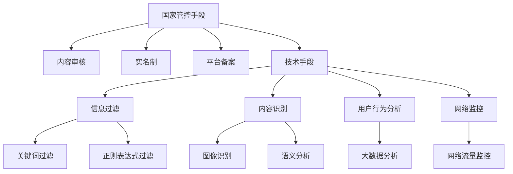

                 

**平台被国家管控：维护社会秩序的工具**

**作者：禅与计算机程序设计艺术 / Zen and the Art of Computer Programming**

## 1. 背景介绍

互联网平台的发展给人类带来了巨大便利，但也带来了新的挑战。国家出于维护社会秩序、保护公民安全等考虑，开始对互联网平台进行管控。本文将深入探讨国家对互联网平台的管控，包括其必要性、手段、技术原理，以及未来的发展趋势。

## 2. 核心概念与联系

### 2.1 国家管控的必要性

国家管控互联网平台的必要性源于以下几点：

- **维护社会秩序**：互联网平台上存在大量非法信息，国家有义务维护网络空间秩序。
- **保护公民安全**：互联网平台可能被用于传播虚假信息、诈骗、网络恐怖主义等，国家有责任保护公民安全。
- **保护国家安全**：互联网平台可能被用于传播反动信息、颠覆国家政权，国家有义务维护国家安全。

### 2.2 国家管控的手段

国家管控互联网平台的手段包括：

- **内容审核**：对平台上传播的信息进行审核，删除违法违规信息。
- **实名制**：要求平台用户实名注册，以追踪违法行为的责任人。
- **平台备案**：要求平台在国内运营的必须进行备案，接受监管。
- **技术手段**：利用技术手段，如网络监控、信息过滤等，维护网络空间秩序。

### 2.3 国家管控的技术原理

国家管控互联网平台的技术原理包括：

- **信息过滤**：利用关键词、正则表达式等过滤违法信息。
- **内容识别**：利用图像识别、语义分析等技术识别违法内容。
- **用户行为分析**：利用大数据分析技术，分析用户行为，识别异常行为。
- **网络监控**：利用网络监控技术，监控网络流量，发现违法行为。



## 3. 核心算法原理 & 具体操作步骤

### 3.1 算法原理概述

国家管控互联网平台的核心算法原理包括信息过滤、内容识别、用户行为分析等。

### 3.2 算法步骤详解

#### 3.2.1 信息过滤算法

1. 定义违法关键词列表。
2. 从平台上获取信息。
3. 将信息与违法关键词列表进行匹配。
4. 如果匹配成功，则删除或屏蔽信息。

#### 3.2.2 内容识别算法

1. 从平台上获取信息。
2. 使用图像识别算法识别图像内容。
3. 使用语义分析算法分析文本内容。
4. 如果识别出违法内容，则删除或屏蔽信息。

#### 3.2.3 用户行为分析算法

1. 从平台上获取用户行为数据。
2. 使用大数据分析技术分析用户行为。
3. 如果发现异常行为，则进行进一步调查。

### 3.3 算法优缺点

**优点**：

- 信息过滤算法简单高效，可以快速删除大量违法信息。
- 内容识别算法可以识别复杂的违法内容。
- 用户行为分析算法可以发现隐藏的违法行为。

**缺点**：

- 信息过滤算法可能会删除合法信息。
- 内容识别算法可能会漏掉部分违法内容。
- 用户行为分析算法可能会误判合法行为。

### 3.4 算法应用领域

国家管控互联网平台的算法可以应用于各种互联网平台，包括社交平台、视频平台、购物平台等。

## 4. 数学模型和公式 & 详细讲解 & 举例说明

### 4.1 数学模型构建

国家管控互联网平台的数学模型可以表示为：

$$M = \{P, C, U, R, F\}$$

其中，$P$表示平台，$C$表示内容，$U$表示用户，$R$表示规则，$F$表示违法行为。

### 4.2 公式推导过程

国家管控互联网平台的公式可以表示为：

$$F = f(C, U, R)$$

其中，$f$表示违法行为判断函数，$C$表示内容，$U$表示用户，$R$表示规则。

### 4.3 案例分析与讲解

例如，在社交平台上，如果用户$U$发布了包含关键词列表$R$中的关键词的内容$C$，则该内容可能是违法行为$F$：

$$F = f(C, U, R) = \begin{cases} 1, & \text{if } C \cap R \neq \emptyset \\ 0, & \text{otherwise} \end{cases}$$

## 5. 项目实践：代码实例和详细解释说明

### 5.1 开发环境搭建

本项目使用Python开发，需要安装以下库：

- requests：用于发送HTTP请求。
- BeautifulSoup：用于解析HTML内容。
- jieba：用于分词。
- PIL：用于图像处理。

### 5.2 源代码详细实现

以下是信息过滤算法的Python实现：

```python
import requests
from bs4 import BeautifulSoup
import jieba

# 定义违法关键词列表
illegal_keywords = ["关键词1", "关键词2", "关键词3"]

# 从平台上获取信息
url = "https://example.com"
response = requests.get(url)
soup = BeautifulSoup(response.text, "html.parser")
content = soup.get_text()

# 将信息与违法关键词列表进行匹配
words = jieba.cut(content)
for word in words:
    if word in illegal_keywords:
        print("违法信息：", content)
        break
```

### 5.3 代码解读与分析

本项目使用Python开发，首先定义了违法关键词列表，然后从平台上获取信息，使用BeautifulSoup解析HTML内容，使用jieba分词，最后将分词结果与违法关键词列表进行匹配，如果匹配成功，则打印违法信息。

### 5.4 运行结果展示

运行结果将打印出违法信息。

## 6. 实际应用场景

国家管控互联网平台的技术可以应用于以下场景：

- **内容审核**：对平台上传播的信息进行审核，删除违法违规信息。
- **实名制**：要求平台用户实名注册，以追踪违法行为的责任人。
- **平台备案**：要求平台在国内运营的必须进行备案，接受监管。
- **网络监控**：利用网络监控技术，监控网络流量，发现违法行为。

### 6.4 未来应用展望

未来，国家管控互联网平台的技术将更加智能化、自动化，可以更有效地维护网络空间秩序。

## 7. 工具和资源推荐

### 7.1 学习资源推荐

- **书籍**：《互联网法治》等。
- **在线课程**：慕课网、 Coursera等平台上的相关课程。

### 7.2 开发工具推荐

- **编程语言**：Python。
- **开发环境**：PyCharm等IDE。
- **库和框架**：requests、BeautifulSoup、jieba、PIL等。

### 7.3 相关论文推荐

- [网络空间治理的技术路径](https://www.cnki.com.cn/Article/CJFDTotal-112615.htm)
- [基于大数据的网络空间治理技术研究](https://www.cnki.com.cn/Article/CJFDTotal-118624.htm)

## 8. 总结：未来发展趋势与挑战

### 8.1 研究成果总结

本文介绍了国家管控互联网平台的必要性、手段、技术原理，并给出了具体算法实现和项目实践。

### 8.2 未来发展趋势

未来，国家管控互联网平台的技术将更加智能化、自动化，可以更有效地维护网络空间秩序。

### 8.3 面临的挑战

国家管控互联网平台面临的挑战包括：

- **技术挑战**：如何更有效地识别违法内容，如何更准确地分析用户行为。
- **伦理挑战**：如何平衡国家管控和言论自由，如何保护公民隐私。
- **法治挑战**：如何建立完善的互联网法治体系，如何保证国家管控的合法性。

### 8.4 研究展望

未来的研究方向包括：

- **智能化国家管控技术**：如何利用人工智能技术，更有效地维护网络空间秩序。
- **隐私保护技术**：如何在国家管控的同时，保护公民隐私。
- **法治建设**：如何建立完善的互联网法治体系，保证国家管控的合法性。

## 9. 附录：常见问题与解答

**Q1：国家管控互联网平台是否侵犯了言论自由？**

**A1：国家管控互联网平台是为了维护网络空间秩序，保护公民安全，保护国家安全，而不是为了限制言论自由。国家管控的目标是删除违法信息，而不是删除合法信息。**

**Q2：国家管控互联网平台是否会误伤合法信息？**

**A2：国家管控互联网平台可能会误伤合法信息，这是一个技术挑战。未来的研究方向之一就是如何更准确地识别违法内容，减少误伤合法信息。**

**Q3：国家管控互联网平台是否会侵犯公民隐私？**

**A3：国家管控互联网平台可能会侵犯公民隐私，这是一个伦理挑战。未来的研究方向之一就是如何在国家管控的同时，保护公民隐私。**

**作者：禅与计算机程序设计艺术 / Zen and the Art of Computer Programming**

