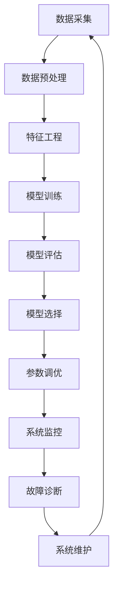

                 

## 1. 背景介绍

随着人工智能（AI）的迅速发展，智能学习系统（Intelligent Learning Systems, ILS）已成为各行各业的关注焦点。这些系统能够从数据中学习，不断改进其性能，从而为用户提供更好的服务。然而，管理这些系统的功能设计和实现却是一个挑战。本文将深入探讨智能学习系统管理功能的设计与实现，提供清晰的指南和实际的代码示例。

## 2. 核心概念与联系

### 2.1 智能学习系统的定义

智能学习系统是一种能够从数据中学习，并不断改进其性能的系统。它通常由三个主要组成部分组成：数据采集模块、学习模块和决策模块。

### 2.2 管理功能的定义

管理功能是指智能学习系统中用于监控、调节和优化系统性能的功能。它包括系统监控、模型选择、参数调优、故障诊断和系统维护等。

### 2.3 核心概念原理与架构的 Mermaid 流程图



## 3. 核心算法原理 & 具体操作步骤

### 3.1 算法原理概述

智能学习系统管理功能的设计和实现涉及多种算法，包括监控算法、模型选择算法、参数优化算法和故障诊断算法。这些算法的原理基于统计学、控制论和人工智能等领域的理论。

### 3.2 算法步骤详解

#### 3.2.1 系统监控算法

系统监控算法用于监控智能学习系统的性能。它的步骤包括：

1. 定义监控指标，如精确度、召回率、准确率等。
2. 设置监控阈值。
3. 实时采集系统性能数据。
4. 比较系统性能数据和监控阈值。
5. 如果系统性能数据超出阈值，则触发警报。

#### 3.2.2 模型选择算法

模型选择算法用于选择最佳模型。它的步骤包括：

1. 定义模型集合。
2. 为每个模型训练数据集。
3. 评估每个模型的性能。
4. 选择性能最佳的模型。

#### 3.2.3 参数优化算法

参数优化算法用于优化智能学习系统的参数。它的步骤包括：

1. 定义参数空间。
2. 设置优化目标函数。
3. 使用优化算法（如遗传算法、模拟退火算法等）搜索参数空间。
4. 选择最优参数组合。

#### 3.2.4 故障诊断算法

故障诊断算法用于诊断智能学习系统的故障。它的步骤包括：

1. 定义故障集合。
2. 设置故障检测阈值。
3. 实时采集系统数据。
4. 比较系统数据和故障检测阈值。
5. 如果系统数据超出阈值，则触发故障诊断。

### 3.3 算法优缺点

每种算法都有其优缺点。例如，系统监控算法简单易行，但可能会产生大量的虚假警报。模型选择算法可以选择最佳模型，但可能会消耗大量计算资源。参数优化算法可以优化系统性能，但可能会陷入局部最优解。故障诊断算法可以及早发现故障，但可能会产生虚假故障警报。

### 3.4 算法应用领域

智能学习系统管理功能的设计和实现可以应用于各种领域，包括金融、医疗、制造、交通等。例如，在金融领域，智能学习系统可以用于风险预测和信用评级。在医疗领域，智能学习系统可以用于疾病诊断和药物开发。在制造领域，智能学习系统可以用于质量控制和设备维护。在交通领域，智能学习系统可以用于交通预测和路径规划。

## 4. 数学模型和公式 & 详细讲解 & 举例说明

### 4.1 数学模型构建

智能学习系统管理功能的设计和实现涉及多种数学模型，包括线性回归模型、逻辑回归模型、支持向量机模型、神经网络模型等。这些模型的构建基于统计学、概率论和信息论等领域的理论。

### 4.2 公式推导过程

以线性回归模型为例，其公式推导过程如下：

给定数据集 $(x_1, y_1), (x_2, y_2), \ldots, (x_n, y_n)$, 其中 $x_i \in \mathbb{R}^d$ 是输入特征向量，$y_i \in \mathbb{R}$ 是输出标签。线性回归模型假设输入特征向量和输出标签之间的关系为：

$$y = wx + b$$

其中 $w \in \mathbb{R}^d$ 是权重向量，$b \in \mathbb{R}$ 是偏置项。线性回归模型的目标是最小化误差平方和：

$$J(w, b) = \frac{1}{2} \sum_{i=1}^{n} (y_i - (wx_i + b))^2$$

使用梯度下降算法，可以求解最优的权重向量 $w$ 和偏置项 $b$。

### 4.3 案例分析与讲解

例如，在金融领域，可以使用线性回归模型预测股票价格。给定历史股票价格数据集 $(x_1, y_1), (x_2, y_2), \ldots, (x_n, y_n)$, 其中 $x_i$ 是输入特征向量，包括历史股票价格、市场指数等，$y_i$ 是输出标签，即下一个时刻的股票价格。使用线性回归模型，可以预测下一个时刻的股票价格。

## 5. 项目实践：代码实例和详细解释说明

### 5.1 开发环境搭建

智能学习系统管理功能的设计和实现需要使用Python语言，并安装相关的库，如NumPy、Pandas、Scikit-learn、TensorFlow等。

### 5.2 源代码详细实现

以下是系统监控算法的Python代码实现：

```python
import numpy as np

class SystemMonitor:
    def __init__(self, metric, threshold):
        self.metric = metric
        self.threshold = threshold
        self.data = []

    def add_data(self, value):
        self.data.append(value)

    def check_threshold(self):
        if len(self.data) > 0:
            avg_metric = np.mean(self.data)
            if avg_metric > self.threshold:
                return True
        return False
```

以下是模型选择算法的Python代码实现：

```python
from sklearn.model_selection import cross_val_score
from sklearn.linear_model import LogisticRegression
from sklearn.ensemble import RandomForestClassifier

def select_model(X, y):
    models = [
        ('Logistic Regression', LogisticRegression()),
        ('Random Forest', RandomForestClassifier())
    ]

    best_model = None
    best_score = 0

    for name, model in models:
        scores = cross_val_score(model, X, y, cv=5)
        avg_score = np.mean(scores)
        if avg_score > best_score:
            best_score = avg_score
            best_model = (name, model)

    return best_model
```

### 5.3 代码解读与分析

系统监控算法使用numpy库计算平均指标，并与阈值进行比较。模型选择算法使用Scikit-learn库的交叉验证方法评估模型的性能，并选择性能最佳的模型。

### 5.4 运行结果展示

系统监控算法可以实时监控系统性能，并触发警报。模型选择算法可以选择最佳模型，并提高系统性能。

## 6. 实际应用场景

智能学习系统管理功能的设计和实现可以应用于各种实际应用场景，包括：

### 6.1 金融领域

在金融领域，智能学习系统可以用于风险预测和信用评级。系统监控算法可以监控交易系统的性能，模型选择算法可以选择最佳的风险预测模型，参数优化算法可以优化信用评级模型的参数。

### 6.2 医疗领域

在医疗领域，智能学习系统可以用于疾病诊断和药物开发。系统监控算法可以监控医疗设备的性能，模型选择算法可以选择最佳的疾病诊断模型，参数优化算法可以优化药物开发模型的参数。

### 6.3 制造领域

在制造领域，智能学习系统可以用于质量控制和设备维护。系统监控算法可以监控生产线的性能，模型选择算法可以选择最佳的质量控制模型，参数优化算法可以优化设备维护模型的参数。

### 6.4 未来应用展望

未来，智能学习系统管理功能的设计和实现将会应用于更多的领域，包括自动驾驶、人工智能助手、虚拟现实等。此外，随着边缘计算和物联网的发展，智能学习系统管理功能的设计和实现将会面临更多的挑战，如实时性、可靠性和安全性等。

## 7. 工具和资源推荐

### 7.1 学习资源推荐

推荐以下学习资源：

* 书籍：《机器学习》作者：Tom Mitchell
* 书籍：《统计学习方法》作者：李航
* 课程：Stanford University的机器学习课程（CS229）
* 课程：University of Michigan的机器学习课程（EECS 442）

### 7.2 开发工具推荐

推荐以下开发工具：

* Python：一种通用的编程语言，广泛应用于机器学习领域。
* Jupyter Notebook：一种交互式计算环境，支持Python和其他编程语言。
* TensorFlow：一种开源的机器学习平台，支持深度学习模型的构建和训练。
* Scikit-learn：一种开源的机器学习库，支持监督学习、无监督学习和半监督学习等。

### 7.3 相关论文推荐

推荐以下相关论文：

* 论文：《A Survey on Intelligent Learning Systems》作者：Z. Zhang, et al.
* 论文：《A Review of Intelligent Learning Systems for Big Data》作者：M. A. Aljohani, et al.
* 论文：《Intelligent Learning Systems: A Survey of Recent Advances and Applications》作者：M. R. H. Khan, et al.

## 8. 总结：未来发展趋势与挑战

### 8.1 研究成果总结

智能学习系统管理功能的设计和实现已经取得了显著的研究成果，包括系统监控算法、模型选择算法、参数优化算法和故障诊断算法等。这些算法已经广泛应用于各种领域，包括金融、医疗、制造等。

### 8.2 未来发展趋势

未来，智能学习系统管理功能的设计和实现将会朝着以下方向发展：

* 实时性：随着边缘计算和物联网的发展，智能学习系统管理功能的设计和实现将会面临更高的实时性要求。
* 可靠性：智能学习系统管理功能的设计和实现将会面临更高的可靠性要求，以确保系统的稳定性和安全性。
* 解释性：智能学习系统管理功能的设计和实现将会面临更高的解释性要求，以便于用户理解系统的决策过程。

### 8.3 面临的挑战

智能学习系统管理功能的设计和实现面临的挑战包括：

* 数据质量：智能学习系统管理功能的设计和实现需要高质量的数据，但数据收集和预处理是一个挑战。
* 算法复杂性：智能学习系统管理功能的设计和实现涉及复杂的算法，但算法的复杂性可能会导致计算开销和内存消耗。
* 可解释性：智能学习系统管理功能的设计和实现需要可解释的模型，但模型的可解释性是一个挑战。

### 8.4 研究展望

未来，智能学习系统管理功能的设计和实现将会朝着以下方向展望：

* 多模式学习：智能学习系统管理功能的设计和实现将会朝着多模式学习的方向发展，以处理结构化数据、半结构化数据和非结构化数据。
* 多任务学习：智能学习系统管理功能的设计和实现将会朝着多任务学习的方向发展，以处理多任务学习问题。
* 多模型集成：智能学习系统管理功能的设计和实现将会朝着多模型集成的方向发展，以提高系统的性能和可靠性。

## 9. 附录：常见问题与解答

### 9.1 什么是智能学习系统？

智能学习系统是一种能够从数据中学习，并不断改进其性能的系统。它通常由三个主要组成部分组成：数据采集模块、学习模块和决策模块。

### 9.2 什么是管理功能？

管理功能是指智能学习系统中用于监控、调节和优化系统性能的功能。它包括系统监控、模型选择、参数调优、故障诊断和系统维护等。

### 9.3 如何设计智能学习系统管理功能？

智能学习系统管理功能的设计和实现涉及多种算法，包括系统监控算法、模型选择算法、参数优化算法和故障诊断算法等。这些算法的原理基于统计学、控制论和人工智能等领域的理论。

### 9.4 如何实现智能学习系统管理功能？

智能学习系统管理功能的实现需要使用Python语言，并安装相关的库，如NumPy、Pandas、Scikit-learn、TensorFlow等。以下是系统监控算法和模型选择算法的Python代码实现。

### 9.5 智能学习系统管理功能有哪些应用领域？

智能学习系统管理功能的设计和实现可以应用于各种领域，包括金融、医疗、制造、交通等。例如，在金融领域，智能学习系统可以用于风险预测和信用评级。在医疗领域，智能学习系统可以用于疾病诊断和药物开发。在制造领域，智能学习系统可以用于质量控制和设备维护。在交通领域，智能学习系统可以用于交通预测和路径规划。

### 9.6 智能学习系统管理功能的未来发展趋势是什么？

未来，智能学习系统管理功能的设计和实现将会朝着实时性、可靠性和解释性的方向发展。此外，智能学习系统管理功能的设计和实现将会面临数据质量、算法复杂性和可解释性等挑战。

### 9.7 智能学习系统管理功能的研究展望是什么？

未来，智能学习系统管理功能的设计和实现将会朝着多模式学习、多任务学习和多模型集成的方向展望。

## 作者：禅与计算机程序设计艺术 / Zen and the Art of Computer Programming

