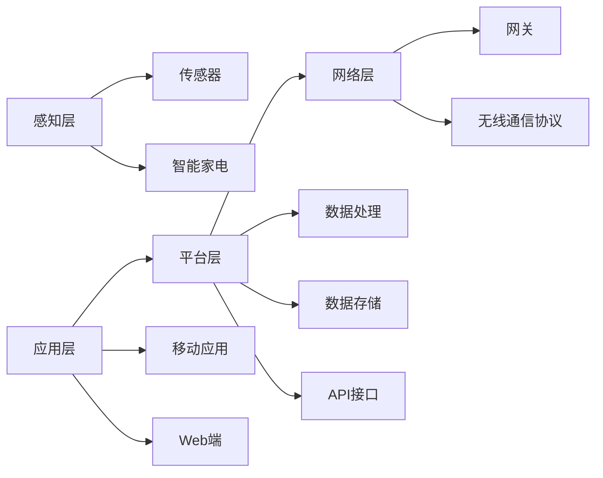

                 

## 智能家电创业：物联网家居的核心产品

> 关键词：物联网、物联网家居、智能家电、IoT、家庭自动化、智能家居系统

## 1. 背景介绍

随着物联网（IoT）技术的发展，智能家电逐渐成为家庭必需品，智能家居系统也开始走进千家万户。根据Statista的数据，全球智能家居市场规模预计将从2020年的980亿美元增长到2025年的1553亿美元。然而，要创立一家成功的智能家电企业，需要对物联网家居的核心产品和技术有深入的理解。本文将详细介绍物联网家居的核心产品，帮助创业者和技术爱好者更好地理解智能家电领域。

## 2. 核心概念与联系

### 2.1 物联网家居的定义

物联网家居是指将物联网技术应用于家庭环境，实现家电设备与家庭网络的连接，从而提供便利、舒适、安全和高效的家居生活体验。物联网家居系统由各种智能家电、传感器、控制器和网关组成，通过无线通信协议（如Zigbee、Z-Wave、Wi-Fi）连接，并通过移动应用或Web端进行控制和监测。

### 2.2 物联网家居的核心产品

物联网家居的核心产品包括智能家电、传感器、控制器和网关。智能家电是物联网家居系统的主要组成部分，包括智能照明（如智能灯泡、智能开关）、智能空调（如智能空调、智能风扇）、智能厨房电器（如智能冰箱、智能烤箱）、智能洗衣机、智能电视等。传感器用于监测家庭环境，如温度、湿度、气压、空气质量、运动检测等。控制器用于控制智能家电和传感器，并处理数据。网关则负责连接智能家电、传感器和控制器，并将数据传输到云端或本地服务器。

### 2.3 物联网家居系统架构

物联网家居系统的架构可以分为感知层、网络层、平台层和应用层。感知层由各种传感器和智能家电组成，用于采集家庭环境数据和控制家电设备。网络层由网关和无线通信协议组成，负责连接感知层和平台层。平台层则负责处理数据、存储数据和提供API接口。应用层则由移动应用和Web端组成，用于控制和监测智能家居系统。



## 3. 核心算法原理 & 具体操作步骤

### 3.1 算法原理概述

物联网家居系统需要处理大量的数据，因此需要高效的算法来处理和分析数据。常用的算法包括机器学习算法、数据挖掘算法和人工智能算法。

### 3.2 算法步骤详解

以机器学习算法为例，物联网家居系统可以使用监督学习算法（如线性回归、逻辑回归、支持向量机）或无监督学习算法（如K-means、聚类）来分析家庭环境数据。具体步骤如下：

1. 数据收集：收集家庭环境数据，如温度、湿度、气压、空气质量等。
2. 数据预处理：清洗数据，去除异常值，并对数据进行标准化。
3. 特征选择：选择有意义的特征，用于训练模型。
4. 模型选择：选择合适的机器学习算法，如线性回归、逻辑回归、支持向量机等。
5. 模型训练：使用训练数据训练模型。
6. 模型评估：使用测试数据评估模型的性能。
7. 模型部署：将模型部署到物联网家居系统中，用于预测和控制家电设备。

### 3.3 算法优缺点

机器学习算法在物联网家居系统中具有以下优点：

* 可以学习和适应家庭环境的变化。
* 可以预测家电设备的故障和维护需求。
* 可以提供个性化的家居生活体验。

然而，机器学习算法也存在以下缺点：

* 需要大量的数据来训练模型。
* 模型的性能取决于数据的质量。
* 模型的解释性较差，难以理解模型的决策过程。

### 3.4 算法应用领域

机器学习算法在物联网家居系统中的应用领域包括：

* 家庭能源管理：预测家庭能源消耗，优化能源使用。
* 家庭安全：检测家庭入侵和火灾，提供安全保护。
* 家庭健康：监测家庭成员的健康状况，提供个性化的健康建议。
* 家庭娱乐：提供个性化的娱乐体验，如智能音响、智能电视等。

## 4. 数学模型和公式 & 详细讲解 & 举例说明

### 4.1 数学模型构建

物联网家居系统需要处理大量的数据，因此需要构建数学模型来描述家庭环境和家电设备的状态。常用的数学模型包括线性回归模型、逻辑回归模型和支持向量机模型。

### 4.2 公式推导过程

以线性回归模型为例，假设家庭环境数据为$\mathbf{x}$，家电设备状态为$y$，则线性回归模型的公式为：

$$y = \mathbf{w}^T\mathbf{x} + b$$

其中，$\mathbf{w}$为权重向量， $b$为偏置项。通过最小化误差平方和，可以求得$\mathbf{w}$和$b$的值。

### 4.3 案例分析与讲解

假设我们要构建一个线性回归模型来预测家庭空调的能耗。家庭环境数据包括温度、湿度和气压，家电设备状态为空调能耗。则线性回归模型的公式为：

$$能耗 = w_1 \times 温度 + w_2 \times 湿度 + w_3 \times 气压 + b$$

其中，$w_1$，$w_2$，$w_3$为权重向量， $b$为偏置项。通过收集大量的家庭环境数据和空调能耗数据，并使用最小平方法求得权重向量和偏置项，我们可以构建一个预测空调能耗的线性回归模型。

## 5. 项目实践：代码实例和详细解释说明

### 5.1 开发环境搭建

要开发物联网家居系统，需要搭建开发环境。常用的开发环境包括：

* 编程语言：Python、JavaScript、Java等。
* 开发平台：Arduino、Raspberry Pi、ESP8266等。
* 云平台：AWS IoT、Azure IoT Hub、Google Cloud IoT等。
* 无线通信协议：Zigbee、Z-Wave、Wi-Fi等。

### 5.2 源代码详细实现

以开发智能照明系统为例，我们可以使用Arduino开发平台和Zigbee无线通信协议来实现。以下是源代码的详细实现：

```cpp
#include <Zigbee.h>

#define LED_PIN 13

Zigbee zigbee(9600, 10, 11);

void setup() {
  pinMode(LED_PIN, OUTPUT);
  zigbee.begin();
}

void loop() {
  ZigbeeMessage msg = zigbee.receive();

  if (msg.isValid()) {
    if (msg.getCommand() == "turnOn") {
      digitalWrite(LED_PIN, HIGH);
    } else if (msg.getCommand() == "turnOff") {
      digitalWrite(LED_PIN, LOW);
    }
  }
}
```

### 5.3 代码解读与分析

在源代码中，我们使用Arduino开发平台和Zigbee无线通信协议来实现智能照明系统。我们定义了LED_PIN为13，并使用Zigbee库来初始化Zigbee模块。在setup()函数中，我们设置LED_PIN为输出模式，并初始化Zigbee模块。在loop()函数中，我们使用zigbee.receive()函数接收Zigbee消息。如果消息有效，我们根据消息的命令来控制LED的状态。

### 5.4 运行结果展示

当我们发送"turnOn"命令时，LED灯会点亮。当我们发送"turnOff"命令时，LED灯会熄灭。通过这种方式，我们可以远程控制智能照明系统。

## 6. 实际应用场景

### 6.1 家庭能源管理

物联网家居系统可以帮助家庭管理能源消耗。通过监测家庭环境数据和家电设备状态，物联网家居系统可以预测家庭能源消耗，并提供个性化的能源管理建议。例如，物联网家居系统可以自动调节空调温度，以节省能源消耗。

### 6.2 家庭安全

物联网家居系统可以帮助家庭提高安全性。通过监测家庭环境数据和家电设备状态，物联网家居系统可以检测家庭入侵和火灾，并提供安全保护。例如，物联网家居系统可以自动关闭电器设备，以防止火灾发生。

### 6.3 家庭健康

物联网家居系统可以帮助家庭监测家庭成员的健康状况。通过监测家庭环境数据和家电设备状态，物联网家居系统可以提供个性化的健康建议。例如，物联网家居系统可以监测空气质量，并提供相应的健康建议。

### 6.4 未来应用展望

未来，物联网家居系统将会更加智能化和个性化。物联网家居系统将会使用人工智能技术来学习和适应家庭环境的变化，并提供更加个性化的家居生活体验。此外，物联网家居系统将会与其他物联网系统（如智能城市、智能交通）连接，提供更加便利和高效的生活体验。

## 7. 工具和资源推荐

### 7.1 学习资源推荐

要学习物联网家居系统，需要掌握物联网、机器学习和人工智能等相关技术。以下是一些推荐的学习资源：

* 书籍：《物联网技术与应用》《机器学习》《人工智能：一种现代 Approach》等。
* 在线课程：Coursera、Udacity、edX等平台上的物联网、机器学习和人工智能课程。
* 论坛：Stack Overflow、Arduino Forum、Raspberry Pi Forum等。

### 7.2 开发工具推荐

要开发物联网家居系统，需要使用相关的开发工具。以下是一些推荐的开发工具：

* 编程语言：Python、JavaScript、Java等。
* 开发平台：Arduino、Raspberry Pi、ESP8266等。
* 云平台：AWS IoT、Azure IoT Hub、Google Cloud IoT等。
* 无线通信协议：Zigbee、Z-Wave、Wi-Fi等。

### 7.3 相关论文推荐

要了解物联网家居系统的最新进展，需要阅读相关的学术论文。以下是一些推荐的学术论文：

* "A Survey on Internet of Things: Architecture, Protocols, and Applications"（物联网综述：架构、协议和应用）
* "Machine Learning for Internet of Things: A Survey"（物联网机器学习综述）
* "Deep Learning for Internet of Things: A Survey"（物联网深度学习综述）

## 8. 总结：未来发展趋势与挑战

### 8.1 研究成果总结

物联网家居系统是物联网技术在家庭环境中的应用，可以提供便利、舒适、安全和高效的家居生活体验。本文介绍了物联网家居系统的核心产品和技术，并提供了具体的开发实例和应用场景。

### 8.2 未来发展趋势

未来，物联网家居系统将会更加智能化和个性化。物联网家居系统将会使用人工智能技术来学习和适应家庭环境的变化，并提供更加个性化的家居生活体验。此外，物联网家居系统将会与其他物联网系统（如智能城市、智能交通）连接，提供更加便利和高效的生活体验。

### 8.3 面临的挑战

然而，物联网家居系统也面临着一些挑战。首先，物联网家居系统需要处理大量的数据，需要高效的算法来处理和分析数据。其次，物联网家居系统需要保护家庭隐私和安全，需要使用加密技术来保护数据。最后，物联网家居系统需要与其他物联网系统连接，需要使用统一的通信协议和标准。

### 8.4 研究展望

未来，物联网家居系统的研究将会集中在以下几个方向：

* 智能家电的能源管理和控制。
* 家庭安全和健康监测。
* 物联网家居系统的安全和隐私保护。
* 物联网家居系统的标准化和统一。

## 9. 附录：常见问题与解答

### 9.1 什么是物联网家居？

物联网家居是指将物联网技术应用于家庭环境，实现家电设备与家庭网络的连接，从而提供便利、舒适、安全和高效的家居生活体验的系统。

### 9.2 物联网家居的核心产品是什么？

物联网家居的核心产品包括智能家电、传感器、控制器和网关。

### 9.3 物联网家居系统的架构是什么？

物联网家居系统的架构可以分为感知层、网络层、平台层和应用层。

### 9.4 物联网家居系统需要哪些算法？

物联网家居系统需要使用机器学习算法、数据挖掘算法和人工智能算法来处理和分析数据。

### 9.5 物联网家居系统的应用场景有哪些？

物联网家居系统的应用场景包括家庭能源管理、家庭安全和家庭健康监测等。

### 9.6 物联网家居系统面临的挑战是什么？

物联网家居系统面临的挑战包括数据处理、安全和隐私保护、标准化和统一等。

### 9.7 物联网家居系统的未来发展趋势是什么？

物联网家居系统的未来发展趋势包括智能化和个性化、与其他物联网系统连接等。

## 作者：禅与计算机程序设计艺术 / Zen and the Art of Computer Programming

