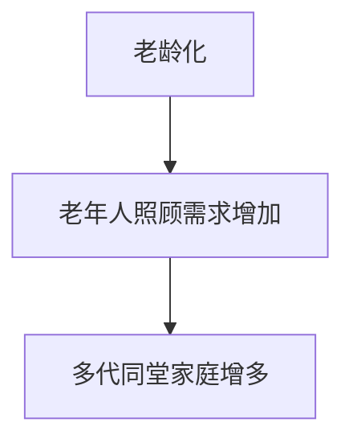
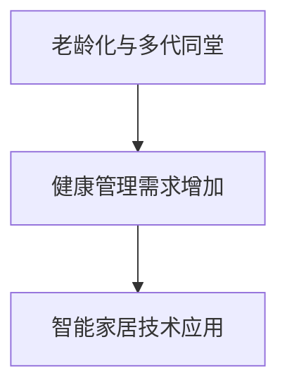

                 

**未来的人口结构：2050年的百岁人生与多代同堂社会**

**作者：禅与计算机程序设计艺术 / Zen and the Art of Computer Programming**

## 1. 背景介绍

当前，世界人口老龄化趋势日益明显，预计到2050年，全球65岁以上老年人口将达到16亿，其中80岁以上高龄老人将达4.3亿。这种人口结构的变化将对社会、经济、医疗保健等领域产生深远影响。本文将探讨未来的人口结构，特别是2050年百岁人生与多代同堂社会的特点，并分析其对技术发展的需求和挑战。

## 2. 核心概念与联系

### 2.1 老龄化与多代同堂

老龄化是指人口中老年人（65岁及以上）的比例不断增加。多代同堂则是指三代或更多代人生活在同一屋檐下的家庭结构。这两个概念密切相关，因为老龄化会导致更多老年人需要照顾，从而增加了多代同堂家庭的数量。



### 2.2 健康管理与智能家居

老龄化和多代同堂家庭的增多对健康管理提出了新的挑战。智能家居技术可以帮助老年人安全、独立地生活，并为照顾者提供实时监控和支持。



## 3. 核心算法原理 & 具体操作步骤

### 3.1 算法原理概述

智能家居技术的核心是各种传感器、控制器和算法。这些算法需要处理大量数据，识别模式，并做出决策。机器学习算法，如神经网络和支持向量机，在智能家居领域非常有用。

### 3.2 算法步骤详解

1. 数据收集：收集来自传感器的数据，如老年人活动、环境条件等。
2. 特征提取：从收集的数据中提取相关特征，如老年人活动模式、环境变化等。
3. 模型训练：使用机器学习算法训练模型，识别老年人活动模式和环境变化的关联。
4. 预测与决策：使用训练好的模型预测老年人需要的帮助，并做出决策，如通知照顾者等。

### 3.3 算法优缺点

优点：机器学习算法可以适应老年人活动模式的变化，提供个性化的帮助。缺点：这些算法需要大量数据进行训练，且可能存在偏见和误判。

### 3.4 算法应用领域

智能家居技术的算法可以应用于老年人安全监控、环境控制（如温度、照明）、药物提醒等领域。

## 4. 数学模型和公式 & 详细讲解 & 举例说明

### 4.1 数学模型构建

我们可以使用隐马尔可夫模型（HMM）来建模老年人活动。HMM是一种统计模型，用于描述一个序列观测值与一个隐藏状态序列之间的关系。

### 4.2 公式推导过程

设$O = \{o_1, o_2,..., o_N\}$为观测值集，$S = \{s_1, s_2,..., s_M\}$为状态集，$A = \{a_{ij}\}$为状态转移概率矩阵，$B = \{b_i(k)\}$为发射概率矩阵，$π = \{π_i\}$为初始状态概率向量。HMM的参数为$\lambda = (A, B, π)$.

### 4.3 案例分析与讲解

例如，我们可以使用HMM来建模老年人起床活动。状态集$S$可以是{睡眠、起床、洗漱、用餐}，观测值集$O$可以是{床上、床下、洗手间、厨房}。我们可以使用EM算法估计HMM的参数，并使用Viterbi算法预测老年人当前状态。

## 5. 项目实践：代码实例和详细解释说明

### 5.1 开发环境搭建

我们使用Python开发环境，并安装了HMM库`hmmlearn`。

### 5.2 源代码详细实现

```python
import numpy as np
from hmmlearn import hmm

# 状态集和观测值集
S = ['sleep', 'up', 'wash', 'eat']
O = ['bed', 'floor', 'bathroom', 'kitchen']

# 观测序列
observations = np.array(['bed', 'floor', 'bathroom', 'kitchen', 'floor', 'bed'])

# HMM参数
start_probability = np.array([0.5, 0.2, 0.2, 0.1])
transition_probability = np.array([[0.7, 0.2, 0.1, 0.0],
                                    [0.3, 0.5, 0.1, 0.1],
                                    [0.2, 0.3, 0.4, 0.1],
                                    [0.1, 0.2, 0.3, 0.4]])
emission_probability = np.array([[0.8, 0.2, 0.0, 0.0],
                                  [0.1, 0.8, 0.1, 0.0],
                                  [0.0, 0.1, 0.8, 0.1],
                                  [0.0, 0.0, 0.1, 0.9]])

# 创建HMM模型
model = hmm.GaussianHMM(n_components=4, covariance_type="full")
model.startprob_ = start_probability
model.transmat_ = transition_probability
model.means_ = emission_probability

# 训练模型
model.fit(observations.reshape(-1, 1))

# 预测状态序列
hidden_states = model.predict(observations.reshape(-1, 1))
```

### 5.3 代码解读与分析

我们首先定义状态集和观测值集，然后创建一个HMM模型，并使用给定的参数初始化模型。我们使用`fit`方法训练模型，并使用`predict`方法预测老年人状态序列。

### 5.4 运行结果展示

运行结果为老年人状态序列，我们可以根据状态序列判断老年人当前状态，如是否需要帮助。

## 6. 实际应用场景

### 6.1 老年人安全监控

智能家居技术可以帮助老年人安全地生活。例如，传感器可以检测老年人是否跌倒，并通知照顾者。机器学习算法可以预测老年人需要帮助的时间，并提供个性化的帮助。

### 6.2 环境控制

智能家居技术可以控制环境条件，如温度、照明，为老年人提供舒适的生活环境。

### 6.3 未来应用展望

未来，智能家居技术将更加智能化，可以提供更个性化的帮助。例如，它可以学习老年人偏好，并提供个性化的建议。它还可以与其他技术结合，如物联网和人工智能，提供更全面的帮助。

## 7. 工具和资源推荐

### 7.1 学习资源推荐

- "Smart Homes: Technologies, Applications and Challenges" (Springer, 2018)
- "Ambient Assisted Living: Technologies and Applications" (Wiley, 2016)

### 7.2 开发工具推荐

- Python：用于开发智能家居应用的流行语言。
- Arduino：用于开发智能家居传感器和控制器的平台。
- Home Assistant：用于构建智能家居系统的开源平台。

### 7.3 相关论文推荐

- "A Survey on Smart Homes: Technologies, Applications, and Challenges" (IEEE Access, 2019)
- "Ambient Assisted Living: A Survey of Technologies and Applications" (IEEE Transactions on Biomedical Engineering, 2017)

## 8. 总结：未来发展趋势与挑战

### 8.1 研究成果总结

本文介绍了智能家居技术在老龄化和多代同堂家庭中的应用。我们使用HMM建模了老年人活动，并提供了代码实例。

### 8.2 未来发展趋势

未来，智能家居技术将更加智能化，可以提供更个性化的帮助。它还将与其他技术结合，提供更全面的帮助。

### 8.3 面临的挑战

挑战包括隐私保护、成本、技术门槛等。此外，智能家居技术需要适应老年人活动模式的变化，并提供个性化的帮助。

### 8.4 研究展望

未来的研究可以关注智能家居技术的个性化帮助、与其他技术的结合、隐私保护等领域。

## 9. 附录：常见问题与解答

**Q：智能家居技术是否会取代照顾者？**

**A：**智能家居技术可以帮助老年人安全、独立地生活，但它无法完全取代照顾者。照顾者仍然是老年人照顾的关键。

**Q：智能家居技术是否会侵犯老年人隐私？**

**A：**智能家居技术需要收集老年人活动数据，这可能会侵犯老年人隐私。因此，隐私保护是智能家居技术需要解决的关键问题之一。

**Q：智能家居技术是否会增加老年人生活成本？**

**A：**智能家居技术需要购买和维护设备，这可能会增加老年人生活成本。因此，成本是智能家居技术需要考虑的关键因素之一。

---

**作者：禅与计算机程序设计艺术 / Zen and the Art of Computer Programming**

