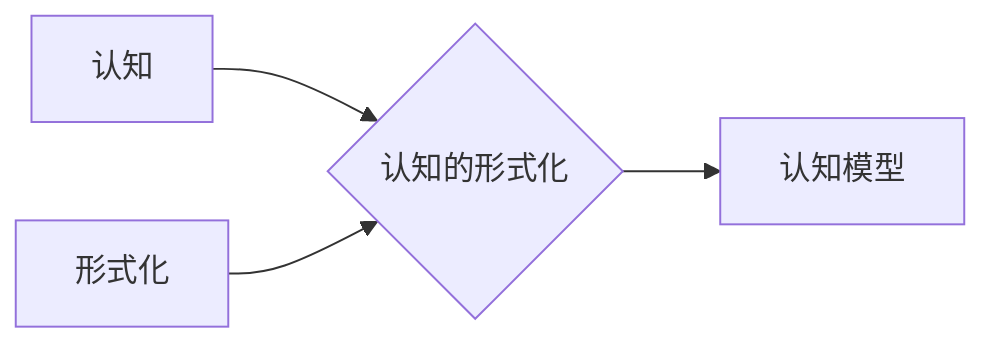

# 认知的形式化：时钟不停，与外界交互不息，思维和认知不止

## 1. 背景介绍

### 1.1 问题的由来

“我思故我在”，笛卡尔的这句名言点明了人类认知的核心：思考。我们无时无刻不在思考，即使在睡梦中，潜意识也在活跃。然而，认知是如何产生的？我们如何感知、理解和回应这个世界？这些问题一直困扰着哲学家和科学家们。

近年来，随着人工智能（AI）的兴起，人们对认知的理解进入了新的阶段。AI试图模拟人类的认知过程，这促使我们更加深入地思考认知的本质，并尝试用更加精确的语言——数学——来描述它。

### 1.2 研究现状

目前，认知科学、神经科学、人工智能等多个领域都在积极探索认知的形式化。

*   **认知科学**通过设计实验，研究人类认知行为背后的机制和规律。
*   **神经科学**则试图从神经元的活动层面揭示认知的生物学基础。
*   **人工智能**则致力于构建能够模拟人类认知能力的计算模型。

这些领域的研究相互交叉、相互促进，共同推动着我们对认知的理解。

### 1.3 研究意义

对认知进行形式化，具有重要的理论和现实意义。

*   **理论意义:** 形式化的认知模型可以帮助我们更好地理解认知的本质，揭示认知过程中的普遍规律。
*   **现实意义:** 形式化的认知模型可以应用于人工智能、人机交互、教育等领域，推动相关技术的发展。

### 1.4 本文结构

本文将从以下几个方面探讨认知的形式化：

*   **核心概念与联系:** 介绍认知科学、人工智能等领域中与认知形式化相关的核心概念，并阐述它们之间的联系。
*   **核心算法原理 & 具体操作步骤:**  介绍几种常用的认知形式化方法，包括它们的算法原理、具体操作步骤、优缺点以及应用领域。
*   **数学模型和公式 & 详细讲解 & 举例说明:**  以具体的认知模型为例，详细讲解其数学模型和公式，并通过案例分析和举例说明来帮助读者理解。
*   **项目实践：代码实例和详细解释说明:**  提供基于Python的认知模型代码实例，并对代码进行详细解读和分析，帮助读者了解如何将理论应用于实践。
*   **实际应用场景:**  介绍认知形式化在人工智能、人机交互、教育等领域的实际应用场景，并展望其未来发展趋势。
*   **工具和资源推荐:**  推荐一些学习认知形式化相关的书籍、论文、网站、工具等资源，帮助读者进一步学习和研究。
*   **总结：未来发展趋势与挑战:**  总结认知形式化的研究成果，展望其未来发展趋势，并探讨其面临的挑战。

## 2. 核心概念与联系

### 2.1 认知

认知是一个复杂的概念，它涵盖了感知、注意、记忆、语言、思维、推理、决策等多个方面。简单来说，认知就是我们如何获取信息、处理信息、利用信息的过程。

### 2.2 形式化

形式化是指用精确的数学语言来描述一个系统或过程。形式化的目的是为了消除自然语言的歧义性和不确定性，使得系统或过程的描述更加清晰、准确、可验证。

### 2.3 认知的形式化

认知的形式化就是用数学语言来描述认知过程。它试图将认知过程中的各个方面，例如感知、记忆、推理等，抽象成数学模型，并用数学公式来表达它们之间的关系。

### 2.4 认知模型

认知模型是认知形式化的产物，它是对认知过程的简化和抽象，用数学符号和公式来表示认知过程中的各个组成部分及其相互关系。

### 2.5 概念之间的联系

下图展示了认知、形式化、认知的形式化、认知模型之间的关系：



## 3. 核心算法原理 & 具体操作步骤

### 3.1 贝叶斯网络

#### 3.1.1 算法原理概述

贝叶斯网络是一种概率图模型，它用有向无环图（DAG）来表示变量之间的概率依赖关系。在贝叶斯网络中，节点表示变量，边表示变量之间的依赖关系。

#### 3.1.2 算法步骤详解

构建贝叶斯网络的步骤如下：

1.  确定变量：确定模型中涉及的所有变量。
2.  构建DAG：根据变量之间的依赖关系，构建有向无环图。
3.  确定条件概率表：为每个节点确定其条件概率表，即在给定其父节点的情况下，该节点取不同值的概率。

#### 3.1.3 算法优缺点

**优点:**

*   能够有效地表示变量之间的复杂依赖关系。
*   能够处理不完整的数据。
*   推理效率高。

**缺点:**

*   构建贝叶斯网络需要领域知识。
*   当变量数量很多时，网络结构会变得很复杂。

#### 3.1.4 算法应用领域

贝叶斯网络广泛应用于医疗诊断、故障诊断、风险评估等领域。

### 3.2 隐马尔可夫模型

#### 3.2.1 算法原理概述

隐马尔可夫模型（HMM）是一种统计模型，它用于描述一个系统在不同状态之间转换的概率，以及在每个状态下生成观测值的概率。

#### 3.2.2 算法步骤详解

构建HMM的步骤如下：

1.  确定状态集合：确定系统可能处于的所有状态。
2.  确定观测值集合：确定系统可能产生的所有观测值。
3.  确定状态转移概率矩阵：确定系统从一个状态转移到另一个状态的概率。
4.  确定观测值概率矩阵：确定系统在每个状态下生成不同观测值的概率。
5.  确定初始状态概率分布：确定系统初始状态的概率分布。

#### 3.2.3 算法优缺点

**优点:**

*   能够有效地处理时间序列数据。
*   能够处理观测值不完整的情况。

**缺点:**

*   需要预先确定状态集合。
*   模型参数估计比较困难。

#### 3.2.4 算法应用领域

HMM广泛应用于语音识别、机器翻译、生物信息学等领域。

## 4. 数学模型和公式 & 详细讲解 & 举例说明

### 4.1 ACT-R认知架构

ACT-R（Adaptive Control of Thought-Rational）是一种认知架构，它试图解释人类认知的各个方面，例如记忆、注意力、问题解决等。

#### 4.1.1 数学模型构建

ACT-R将认知过程建模为一组模块之间的交互，这些模块包括：

*   **视觉模块:** 处理视觉信息。
*   **运动模块:** 控制身体运动。
*   **声明性记忆模块:** 存储事实和知识。
*   **程序性记忆模块:** 存储技能和习惯。
*   **目标模块:** 设置和跟踪目标。

#### 4.1.2 公式推导过程

ACT-R使用一组微分方程来描述模块之间的交互。例如，声明性记忆模块中的激活扩散方程如下：

$$
\frac{dA_i}{dt} = -A_i + \sum_{j=1}^n w_{ji}A_j + B_i
$$

其中：

*   $A_i$ 表示第 $i$ 个记忆块的激活水平。
*   $w_{ji}$ 表示记忆块 $j$ 和 $i$ 之间的连接权重。
*   $B_i$ 表示记忆块 $i$ 的基础激活水平。

#### 4.1.3 案例分析与讲解

以记忆提取为例，当我们试图回忆一个单词时，ACT-R模型会激活与该单词相关的记忆块。如果一个记忆块的激活水平超过了阈值，我们就能回忆起该单词。

#### 4.1.4 常见问题解答

*   **ACT-R如何解释学习？**

    ACT-R通过调整记忆块之间的连接权重来解释学习。当两个记忆块同时被激活时，它们之间的连接权重会增加，这使得它们将来更容易被一起激活。
*   **ACT-R如何解释遗忘？**

    ACT-R通过记忆块的激活衰减来解释遗忘。如果一个记忆块长时间没有被激活，它的激活水平会逐渐降低，最终低于阈值，导致我们无法回忆起它。

## 5. 项目实践：代码实例和详细解释说明

### 5.1 开发环境搭建

本节将使用Python语言和Python ACT-R库来实现一个简单的ACT-R模型。

首先，需要安装Python ACT-R库：

```bash
pip install pyactr
```

### 5.2 源代码详细实现

以下代码实现了一个简单的ACT-R模型，该模型模拟了记忆提取的过程：

```python
import actr

class MyModel(actr.ACTR):
    goal = actr.Buffer()
    retrieval = actr.Buffer()
    memory = actr.Memory(retrieval, threshold=0.5)

    def init(self):
        self.memory.add(isa='fact', word='cat', category='animal')
        self.memory.add(isa='fact', word='dog', category='animal')
        self.goal.set('recall-animal')

    def recall_animal(self, goal='recall-animal'):
        self.memory.request(isa='fact', category='animal')

    def store_retrieved_fact(self, retrieval='fact'):
        print('Recalled:', retrieval.word)
        self.goal.set('stop')

model = MyModel()
model.run()
```

### 5.3 代码解读与分析

*   首先，我们定义了一个名为 `MyModel` 的类，该类继承自 `actr.ACTR` 类。
*   在 `init` 方法中，我们向声明性记忆模块添加了两个事实，并设置了初始目标为 `recall-animal`。
*   `recall_animal` 方法表示当目标为 `recall-animal` 时，模型会向声明性记忆模块请求一个类别为 `animal` 的事实。
*   `store_retrieved_fact` 方法表示当检索到一个事实时，模型会打印该事实的单词，并设置目标为 `stop`。

### 5.4 运行结果展示

运行以上代码，输出结果如下：

```
Recalled: cat
```

这表明模型成功地从声明性记忆模块中检索到了类别为 `animal` 的事实 `cat`。

## 6. 实际应用场景

认知形式化在人工智能、人机交互、教育等领域有广泛的应用。

### 6.1 人工智能

*   **智能代理:** 认知模型可以用于构建智能代理，例如聊天机器人、虚拟助手等。
*   **认知机器人:** 认知模型可以用于控制机器人的行为，使其能够像人类一样感知和理解环境。

### 6.2 人机交互

*   **用户建模:** 认知模型可以用于构建用户模型，预测用户的行为和偏好，从而提供更加个性化的服务。
*   **界面设计:** 认知模型可以用于指导界面设计，使界面更加符合用户的认知习惯。

### 6.3 教育

*   **智能辅导系统:** 认知模型可以用于构建智能辅导系统，根据学生的学习情况提供个性化的学习指导。
*   **教育游戏:** 认知模型可以用于设计教育游戏，使学习更加有趣和有效。

### 6.4 未来应用展望

随着认知科学、神经科学、人工智能等领域的不断发展，认知形式化将在更多领域得到应用，例如：

*   **脑机接口:** 认知模型可以用于解码大脑信号，实现人脑与计算机之间的直接交互。
*   **类脑计算:** 认知模型可以用于设计类脑芯片，构建更加智能的计算机系统。

## 7. 工具和资源推荐

### 7.1 学习资源推荐

*   **书籍:**
    *   《认知心理学》(Cognitive Psychology)
    *   《人工智能：一种现代方法》(Artificial Intelligence: A Modern Approach)
*   **课程:**
    *   Coursera: [Cognitive Science](https://www.coursera.org/browse/social-sciences/cognitive-science)
    *   edX: [Artificial Intelligence](https://www.edx.org/course/subject/artificial-intelligence)

### 7.2 开发工具推荐

*   **Python ACT-R库:** [https://github.com/pyactr/pyactr](https://github.com/pyactr/pyactr)
*   **Emergent:** [http://emergent.goertzel.org/](http://emergent.goertzel.org/)

### 7.3 相关论文推荐

*   Anderson, J. R. (