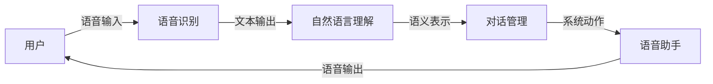

# 语音助手技术在CUI中的详细应用

## 1. 背景介绍

### 1.1 问题的由来

随着互联网和移动设备的普及，人们越来越习惯于使用图形用户界面（GUI）与计算机进行交互。然而，在某些情况下，例如驾驶、运动或视觉障碍人士使用计算机时，传统的GUI交互方式就显得不太方便。此时，基于语音的交互方式，即对话式用户界面（CUI），就成为了一个重要的替代方案。

语音助手作为CUI的一种典型应用，近年来发展迅速。从苹果的Siri到亚马逊的Alexa，再到谷歌的Google Assistant，语音助手已经渗透到我们生活的方方面面。语音助手的兴起，也推动了语音识别、自然语言理解、对话管理等人工智能技术的快速发展。

### 1.2 研究现状

目前，语音助手技术在CUI中的应用已经取得了显著的成果。例如：

* **语音识别技术**已经能够达到很高的准确率，可以准确地将用户的语音转换为文本。
* **自然语言理解技术**也取得了长足的进步，可以更好地理解用户的意图，并给出相应的回应。
* **对话管理技术**可以使语音助手与用户进行更加自然、流畅的对话。

然而，语音助手技术在CUI中的应用仍然面临着一些挑战，例如：

* **环境噪声**会影响语音识别的准确率。
* **用户的口音、语速、语气**等因素也会对语音识别和自然语言理解造成干扰。
* **如何设计更加自然、流畅的对话流程**也是一个需要解决的问题。

### 1.3 研究意义

语音助手技术在CUI中的应用具有重要的现实意义。

* **方便用户操作**: 语音助手可以帮助用户更加方便地使用计算机，尤其是在不方便使用GUI的情况下。
* **提高效率**: 语音助手可以帮助用户快速完成一些简单的任务，例如设置闹钟、查询天气等。
* **提升用户体验**: 语音助手可以与用户进行更加自然、流畅的对话，提升用户的使用体验。

### 1.4 本文结构

本文将详细介绍语音助手技术在CUI中的应用，主要内容包括：

* **核心概念与联系**: 介绍语音助手、CUI、语音识别、自然语言理解、对话管理等核心概念，并阐述它们之间的联系。
* **核心算法原理 & 具体操作步骤**: 详细介绍语音识别、自然语言理解、对话管理等核心算法的原理，并给出具体的实现步骤。
* **数学模型和公式 & 详细讲解 & 举例说明**: 介绍语音助手技术中常用的数学模型和公式，并结合具体案例进行讲解。
* **项目实践：代码实例和详细解释说明**: 提供一个简单的语音助手项目实例，并对代码进行详细的解释说明。
* **实际应用场景**: 介绍语音助手技术在智能家居、车联网、医疗健康等领域的应用。
* **工具和资源推荐**: 推荐一些学习语音助手技术的书籍、网站、开源项目等资源。
* **总结：未来发展趋势与挑战**: 对语音助手技术在CUI中的应用进行总结，并展望其未来发展趋势和挑战。


## 2. 核心概念与联系

### 2.1 语音助手

语音助手是一种基于语音交互的软件代理，它能够理解用户的语音指令，并执行相应的操作或提供相应的信息。

### 2.2 对话式用户界面 (CUI)

对话式用户界面 (CUI) 是一种人机交互方式，它允许用户通过自然语言与计算机进行交互。

### 2.3 语音识别 (ASR)

语音识别 (ASR) 是将人类语音转换为文本的技术。

### 2.4 自然语言理解 (NLU)

自然语言理解 (NLU) 是使计算机能够理解人类语言的技术。

### 2.5 对话管理 (DM)

对话管理 (DM) 是控制人机对话流程的技术。

### 2.6 核心概念之间的联系

下图展示了语音助手、CUI、语音识别、自然语言理解、对话管理等核心概念之间的联系：



## 3. 核心算法原理 & 具体操作步骤

### 3.1 语音识别

#### 3.1.1 算法原理概述

语音识别主要采用声学模型、语言模型和解码器来实现。

* **声学模型**：用于将语音信号转换为声学特征序列。
* **语言模型**: 用于描述语言的统计规律，例如词语出现的概率。
* **解码器**: 用于在声学模型和语言模型的指导下，找到最匹配输入语音的文本序列。

#### 3.1.2 算法步骤详解

1. **预处理**: 对输入的语音信号进行预加重、分帧、加窗等预处理操作。
2. **特征提取**: 从预处理后的语音信号中提取声学特征，例如MFCC特征。
3. **声学模型训练**: 使用大量的语音数据训练声学模型，例如使用深度神经网络 (DNN) 训练声学模型。
4. **语言模型训练**: 使用大量的文本数据训练语言模型，例如使用n-gram模型训练语言模型。
5. **解码**: 使用训练好的声学模型和语言模型，对输入的语音信号进行解码，得到最匹配的文本序列。

#### 3.1.3 算法优缺点

* **优点**:
    * 识别准确率高。
    * 可以识别多种语言。
* **缺点**:
    * 对环境噪声敏感。
    * 计算复杂度高。

### 3.2 自然语言理解

#### 3.2.1 算法原理概述

自然语言理解主要采用意图识别和槽位填充来实现。

* **意图识别**: 识别用户意图，例如用户是想查询天气、播放音乐还是设置闹钟。
* **槽位填充**: 提取用户指令中的关键信息，例如查询天气时需要提取的地点和时间。

#### 3.2.2 算法步骤详解

1. **分词**: 将用户输入的文本分割成词语序列。
2. **词性标注**: 对每个词语进行词性标注，例如名词、动词、形容词等。
3. **命名实体识别**: 识别文本中的命名实体，例如人名、地名、机构名等。
4. **句法分析**: 分析句子的语法结构，例如主谓宾结构。
5. **意图识别**: 根据句子的语义信息，识别用户的意图。
6. **槽位填充**: 根据预先定义的槽位，提取用户指令中的关键信息。

#### 3.2.3 算法优缺点

* **优点**:
    * 可以理解用户的复杂语义。
    * 可以处理多种语言。
* **缺点**:
    * 对语言的依赖性强。
    * 训练数据获取困难。

### 3.3 对话管理

#### 3.3.1 算法原理概述

对话管理主要采用状态机或深度强化学习来实现。

* **状态机**: 使用状态和状态转移来描述对话流程。
* **深度强化学习**: 使用强化学习算法训练对话策略。

#### 3.3.2 算法步骤详解

1. **状态定义**: 定义对话状态空间，例如用户提问状态、系统回答状态等。
2. **动作定义**: 定义系统可以采取的动作，例如回答问题、询问问题等。
3. **状态转移函数**: 定义状态之间的转移关系，例如用户提问后，系统进入回答状态。
4. **奖励函数**: 定义每个状态的奖励值，例如回答问题正确得到正奖励，回答问题错误得到负奖励。
5. **策略学习**: 使用强化学习算法训练对话策略，使得系统能够在与用户交互的过程中最大化累积奖励。

#### 3.3.3 算法优缺点

* **优点**:
    * 可以实现复杂的对话流程。
    * 可以根据用户的反馈动态调整对话策略。
* **缺点**:
    * 状态空间和动作空间的设计比较困难。
    * 训练数据获取困难。

## 4. 数学模型和公式 & 详细讲解 & 举例说明

### 4.1 语音识别中的隐马尔可夫模型 (HMM)

#### 4.1.1 数学模型构建

隐马尔可夫模型 (HMM) 是一种统计模型，用于描述一个系统在不同状态之间的转移以及每个状态下的观测值。

HMM 可以用一个五元组表示：

$$
\lambda = (S, O, A, B, \pi)
$$

其中：

* $S$ 是状态集合，表示系统可能处于的所有状态。
* $O$ 是观测值集合，表示系统在每个状态下可能产生的所有观测值。
* $A$ 是状态转移概率矩阵，表示系统从一个状态转移到另一个状态的概率。
* $B$ 是观测值概率矩阵，表示系统在每个状态下产生某个观测值的概率。
* $\pi$ 是初始状态概率分布，表示系统初始状态的概率分布。

#### 4.1.2 公式推导过程

HMM 的三个基本问题：

* **评估问题**: 给定一个 HMM 模型 $\lambda$ 和一个观测值序列 $O$，计算 $P(O|\lambda)$，即在给定模型下观测到该观测值序列的概率。
* **解码问题**: 给定一个 HMM 模型 $\lambda$ 和一个观测值序列 $O$，找到最有可能产生该观测值序列的状态序列 $S$。
* **学习问题**: 给定一个观测值序列 $O$，找到最有可能产生该观测值序列的 HMM 模型 $\lambda$。

#### 4.1.3 案例分析与讲解

以语音识别为例，假设我们要识别数字 "0" 到 "9" 的语音。

* **状态集合**: $S = \{0, 1, 2, 3, 4, 5, 6, 7, 8, 9\}$，表示数字 "0" 到 "9" 的十个状态。
* **观测值集合**: $O = \{a, b, c, ..., z\}$，表示语音信号经过特征提取后得到的音素。
* **状态转移概率矩阵**: $A = [a_{ij}]$，其中 $a_{ij}$ 表示从状态 $i$ 转移到状态 $j$ 的概率。
* **观测值概率矩阵**: $B = [b_{jk}]$，其中 $b_{jk}$ 表示在状态 $j$ 下产生观测值 $k$ 的概率。
* **初始状态概率分布**: $\pi = [\pi_i]$，其中 $\pi_i$ 表示初始状态为 $i$ 的概率。

给定一个语音信号，我们可以使用 HMM 模型来识别该语音信号对应的数字。

### 4.2 自然语言理解中的词向量模型 (Word Embedding)

#### 4.2.1 数学模型构建

词向量模型 (Word Embedding) 是将词语映射到向量空间的技术，使得语义相似的词语在向量空间中的距离较近。

#### 4.2.2 公式推导过程

常用的词向量模型有 Word2Vec 和 GloVe。

* **Word2Vec**: 使用神经网络模型来学习词向量，包括 CBOW 模型和 Skip-gram 模型。
* **GloVe**: 使用全局词共现矩阵来学习词向量。

#### 4.2.3 案例分析与讲解

以 Word2Vec 的 CBOW 模型为例，假设我们要学习词语 "apple" 的词向量。

1. **构建训练样本**: 从语料库中提取包含词语 "apple" 的句子，例如 "I like to eat apple"。
2. **定义上下文窗口**: 定义上下文窗口大小为 2，表示考虑 "apple" 前后各两个词语作为上下文。
3. **输入层**: 将上下文词语的 one-hot 向量作为输入。
4. **隐藏层**: 将输入层向量乘以权重矩阵，得到隐藏层向量。
5. **输出层**: 使用 softmax 函数将隐藏层向量转换为概率分布，表示每个词语是目标词语的概率。
6. **损失函数**: 使用交叉熵损失函数计算预测概率分布与真实概率分布之间的差异。
7. **反向传播**: 使用梯度下降算法更新模型参数，使得损失函数最小化。

### 4.3 对话管理中的马尔可夫决策过程 (MDP)

#### 4.3.1 数学模型构建

马尔可夫决策过程 (MDP) 是一种用于描述决策过程的数学框架，它假设系统的下一个状态只与当前状态和当前采取的动作有关，而与之前的状态和动作无关。

MDP 可以用一个五元组表示：

$$
M = (S, A, P, R, \gamma)
$$

其中：

* $S$ 是状态集合，表示系统可能处于的所有状态。
* $A$ 是动作集合，表示系统可以采取的所有动作。
* $P$ 是状态转移概率函数，表示系统在状态 $s$ 下采取动作 $a$ 后转移到状态 $s'$ 的概率。
* $R$ 是奖励函数，表示系统在状态 $s$ 下采取动作 $a$ 后获得的奖励。
* $\gamma$ 是折扣因子，表示未来奖励的价值。

#### 4.3.2 公式推导过程

MDP 的目标是找到一个最优策略 $\pi^*$，使得系统在该策略下获得的累积奖励最大化。

#### 4.3.3 案例分析与讲解

以对话系统为例，假设我们要设计一个订餐对话系统。

* **状态集合**: $S = \{询问菜品, 询问数量, 确认订单, 结束对话\}$，表示对话系统可能处于的四种状态。
* **动作集合**: $A = \{推荐菜品, 询问数量, 确认订单, 结束对话\}$，表示对话系统可以采取的四种动作。
* **状态转移概率函数**: $P(s'|s, a)$，表示对话系统在状态 $s$ 下采取动作 $a$ 后转移到状态 $s'$ 的概率。
* **奖励函数**: $R(s, a)$，表示对话系统在状态 $s$ 下采取动作 $a$ 后获得的奖励，例如成功完成订单获得正奖励，对话失败获得负奖励。
* **折扣因子**: $\gamma$，表示未来奖励的价值。

我们可以使用强化学习算法来训练对话系统的策略，使得对话系统能够在与用户交互的过程中最大化累积奖励。

## 5. 项目实践：代码实例和详细解释说明

### 5.1 开发环境搭建

本项目使用 Python 语言开发，需要安装以下 Python 包：

* speech_recognition
* pyaudio
* gTTS
* playsound

可以使用 pip 命令安装以上 Python 包：

```
pip install speech_recognition pyaudio gTTS playsound
```

### 5.2 源代码详细实现

```python
import speech_recognition as sr
from gtts import gTTS
from playsound import playsound

# 初始化语音识别器
r = sr.Recognizer()

# 定义语音助手函数
def voice_assistant():
    # 使用麦克风作为音频源
    with sr.Microphone() as source:
        print("请说出您的指令：")
        # 监听用户的语音输入
        audio = r.listen(source)

    try:
        # 将语音转换为文本
        text = r.recognize_google(audio, language="zh-CN")
        print("您说的是：" + text)

        # 处理用户的指令
        if "你好" in text:
            # 语音合成
            tts = gTTS(text="你好，请问有什么可以帮您？", lang="zh-CN")
            tts.save("hello.mp3")
            # 播放语音
            playsound("hello.mp3")
        elif "再见" in text:
            # 语音合成
            tts = gTTS(text="再见！", lang="zh-CN")
            tts.save("bye.mp3")
            # 播放语音
            playsound("bye.mp3")
        else:
            # 语音合成
            tts = gTTS(text="对不起，我没有听懂您的指令。", lang="zh-CN")
            tts.save("error.mp3")
            # 播放语音
            playsound("error.mp3")

    except sr.UnknownValueError:
        print("无法识别语音")
    except sr.RequestError as e:
        print("无法请求结果：{0}".format(e))

# 运行语音助手
voice_assistant()
```

### 5.3 代码解读与分析

* 首先，我们使用 `speech_recognition` 包初始化语音识别器。
* 然后，我们定义了一个 `voice_assistant()` 函数，该函数使用麦克风作为音频源，监听用户的语音输入，并将语音转换为文本。
* 接下来，我们使用 `if-elif-else` 语句处理用户的指令。如果用户说 "你好"，则语音助手会回复 "你好，请问有什么可以帮您？"；如果用户说 "再见"，则语音助手会回复 "再见！"；否则，语音助手会回复 "对不起，我没有听懂您的指令。"。
* 最后，我们调用 `voice_assistant()` 函数运行语音助手。

### 5.4 运行结果展示

运行代码后，语音助手会提示用户说出指令。例如，如果用户说 "你好"，则语音助手会回复 "你好，请问有什么可以帮您？"。

## 6. 实际应用场景

### 6.1 智能家居

语音助手可以用于控制智能家居设备，例如灯光、空调、电视等。

### 6.2 车联网

语音助手可以用于车载导航、娱乐、通讯等功能。

### 6.3 医疗健康

语音助手可以用于医疗咨询、健康管理等方面。

### 6.4 未来应用展望

随着人工智能技术的不断发展，语音助手技术在CUI中的应用将会越来越广泛，例如：

* **更加智能化的对话**: 语音助手将能够理解更加复杂的语义，并进行更加自然、流畅的对话。
* **更加个性化的服务**: 语音助手将能够根据用户的兴趣爱好、使用习惯等提供更加个性化的服务。
* **更加广泛的应用领域**: 语音助手将应用于更多的领域，例如教育、金融、电商等。

## 7. 工具和资源推荐

### 7.1 学习资源推荐

* **书籍**:
    * 《Python自然语言处理》
    * 《统计学习方法》
    * 《深度学习》
* **网站**:
    * [https://www.nltk.org/](https://www.nltk.org/)
    * [https://radimrehurek.com/gensim/](https://radimrehurek.com/gensim/)
    * [https://www.tensorflow.org/](https://www.tensorflow.org/)

### 7.2 开发工具推荐

* **Python**: [https://www.python.org/](https://www.python.org/)
* **Anaconda**: [https://www.anaconda.com/](https://www.anaconda.com/)
* **PyCharm**: [https://www.jetbrains.com/pycharm/](https://www.jetbrains.com/pycharm/)

### 7.3 相关论文推荐

* [BERT: Pre-training of Deep Bidirectional Transformers for Language Understanding](https://arxiv.org/abs/1810.04805)
* [GPT-3: Language Models are Few-Shot Learners](https://arxiv.org/abs/2005.14165)

### 7.4 其他资源推荐

* **GitHub**: [https://github.com/](https://github.com/)
* **Stack Overflow**: [https://stackoverflow.com/](https://stackoverflow.com/)

## 8. 总结：未来发展趋势与挑战

### 8.1 研究成果总结

语音助手技术在CUI中的应用已经取得了显著的成果，例如语音识别、自然语言理解、对话管理等技术都已经取得了长足的进步。

### 8.2 未来发展趋势

未来，语音助手技术在CUI中的应用将会更加智能化、个性化和广泛化。

### 8.3 面临的挑战

* **环境噪声**: 环境噪声会影响语音识别的准确率。
* **用户的口音、语速、语气**: 用户的口音、语速、语气等因素也会对语音识别和自然语言理解造成干扰。
* **对话流程设计**: 如何设计更加自然、流畅的对话流程也是一个需要解决的问题。
* **隐私保护**: 语音助手需要收集用户的语音数据，如何保护用户的隐私也是一个需要关注的问题。

### 8.4 研究展望

未来，语音助手技术在CUI中的应用将会更加注重以下几个方面：

* **多模态交互**: 语音助手将结合语音、图像、视频等多种模态信息进行交互。
* **情感计算**: 语音助手将能够识别用户的情绪，并进行更加人性化的交互。
* **知识图谱**: 语音助手将整合更加丰富的知识图谱，提供更加准确、全面的信息。

## 9. 附录：常见问题与解答

### 9.1 如何提高语音识别的准确率？

* 使用高质量的麦克风。
* 在安静的环境下使用语音识别。
* 使用标准的语音进行识别。

### 9.2 如何设计更加自然、流畅的对话流程？

* 使用多轮对话机制。
* 使用上下文信息。
* 使用情感计算技术。

### 9.3 如何保护用户的隐私？

* 对用户的语音数据进行加密存储。
* 仅收集用户必要的语音数据。
* 明确告知用户语音数据的用途。

作者：禅与计算机程序设计艺术 / Zen and the Art of Computer Programming
