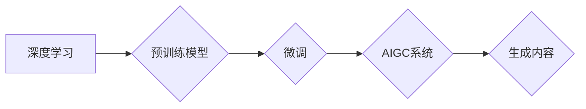

> AIGC, 文本生成, 图像生成, 代码生成, 深度学习, Transformer, 

## 1. 背景介绍

近年来，人工智能（AI）技术取得了飞速发展，特别是深度学习的突破，使得人工智能在各个领域展现出强大的应用潜力。其中，AIGC（人工智能生成内容）作为人工智能发展的重要方向之一，引起了广泛关注。AIGC是指利用人工智能技术自动生成各种类型的内容，例如文本、图像、音频、视频等。

AIGC技术能够帮助人们更高效地创作内容，解放人力资源，并为人们提供更加个性化、智能化的服务体验。例如，AIGC可以帮助作家创作小说，帮助设计师生成设计稿，帮助程序员编写代码，甚至可以帮助人们创作音乐和绘画作品。

## 2. 核心概念与联系

AIGC的核心概念包括：

* **深度学习:** AIGC技术的基础是深度学习算法，特别是Transformer模型。Transformer模型能够学习语言的复杂结构和语义关系，从而实现对文本、图像等数据的理解和生成。
* **生成模型:** 生成模型是AIGC的核心技术之一，它能够从已有的数据中学习模式，并生成新的数据。常见的生成模型包括：
    * **GAN (Generative Adversarial Networks):** 
    * **VAEs (Variational Autoencoders):** 
    * **Transformer-based models:** 
* **预训练模型:** 预训练模型是在海量数据上训练的深度学习模型，它已经具备了对语言和图像的初步理解能力。AIGC系统通常会利用预训练模型作为基础，并进行针对性的微调，以实现特定任务的生成。

**Mermaid 流程图:**



## 3. 核心算法原理 & 具体操作步骤

### 3.1  算法原理概述

AIGC的核心算法原理是利用深度学习模型学习数据中的模式，并根据学习到的模式生成新的数据。常见的AIGC算法包括：

* **Transformer模型:** Transformer模型是一种基于注意力机制的深度学习模型，它能够有效地学习语言的复杂结构和语义关系。

* **GAN模型:** GAN模型由两个网络组成：生成器和判别器。生成器试图生成逼真的数据，而判别器试图区分真实数据和生成数据。通过不断的对抗训练，生成器能够生成越来越逼真的数据。

* **VAEs模型:** VAEs模型通过编码器将数据压缩成低维表示，然后通过解码器将低维表示解码回原始数据。VAEs模型能够学习数据的潜在结构，并生成新的数据。

### 3.2  算法步骤详解

以Transformer模型为例，AIGC算法的具体操作步骤如下：

1. **数据预处理:** 将原始数据进行清洗、格式化和编码，使其能够被模型理解。
2. **模型训练:** 利用预训练的Transformer模型，对预处理后的数据进行训练，学习数据的模式和结构。
3. **模型微调:** 根据具体的AIGC任务，对训练好的模型进行微调，使其能够更好地生成目标类型的内容。
4. **内容生成:** 将输入的文本或其他数据作为模型的输入，模型根据学习到的模式生成新的内容。
5. **内容评估:** 对生成的內容进行评估，例如使用BLEU、ROUGE等指标评估文本生成的质量，或使用人类评价评估图像生成的质量。

### 3.3  算法优缺点

**优点:**

* **生成高质量内容:** AIGC算法能够生成高质量的文本、图像、音频等内容，满足人们对内容的多样化需求。
* **提高效率:** AIGC能够自动生成内容，解放人力资源，提高工作效率。
* **个性化定制:** AIGC能够根据用户的需求生成个性化的内容，提供更加定制化的服务体验。

**缺点:**

* **数据依赖:** AIGC算法依赖于海量数据进行训练，数据质量直接影响生成内容的质量。
* **伦理问题:** AIGC技术可能被用于生成虚假信息、侵犯版权等，需要谨慎使用并制定相应的伦理规范。
* **技术挑战:** AIGC技术还面临着许多技术挑战，例如如何生成更加真实、更加有创意的内容，如何解决模型的偏见问题等。

### 3.4  算法应用领域

AIGC技术在各个领域都有广泛的应用前景，例如：

* **内容创作:** 自动生成新闻报道、小说、诗歌、剧本等内容。
* **设计领域:** 自动生成设计稿、产品原型、建筑模型等。
* **教育领域:** 自动生成学习材料、个性化辅导等。
* **娱乐领域:** 自动生成游戏场景、动画、音乐等。
* **营销领域:** 自动生成广告文案、营销邮件等。

## 4. 数学模型和公式 & 详细讲解 & 举例说明

### 4.1  数学模型构建

AIGC算法通常基于深度学习模型，其数学模型主要包括：

* **神经网络:** 神经网络是一种模仿人脑神经网络结构的计算模型，其核心是神经元和连接权重。

* **激活函数:** 激活函数用于引入非线性，使神经网络能够学习复杂的模式。常见的激活函数包括ReLU、Sigmoid、Tanh等。

* **损失函数:** 损失函数用于衡量模型预测结果与真实值的差距，模型训练的目标是最小化损失函数。常见的损失函数包括交叉熵损失、均方误差等。

### 4.2  公式推导过程

Transformer模型的核心是注意力机制，其数学公式如下：

$$
Attention(Q, K, V) = \frac{exp(Q \cdot K^T / \sqrt{d_k})}{exp(Q \cdot K^T / \sqrt{d_k})} \cdot V
$$

其中：

* $Q$：查询矩阵
* $K$：键矩阵
* $V$：值矩阵
* $d_k$：键向量的维度

注意力机制能够学习到输入序列中不同元素之间的关系，并赋予不同的权重，从而更好地理解上下文信息。

### 4.3  案例分析与讲解

例如，在文本生成任务中，Transformer模型可以利用注意力机制学习到句子中每个词语与其他词语之间的关系，从而生成更加流畅、更加自然的文本。

## 5. 项目实践：代码实例和详细解释说明

### 5.1  开发环境搭建

AIGC项目开发环境通常包括：

* **操作系统:** Linux、macOS等
* **编程语言:** Python
* **深度学习框架:** TensorFlow、PyTorch等
* **GPU:** 加速深度学习模型训练

### 5.2  源代码详细实现

以下是一个简单的文本生成代码示例，使用PyTorch框架和Transformer模型：

```python
import torch
import torch.nn as nn

class Transformer(nn.Module):
    def __init__(self, vocab_size, embedding_dim, num_heads, num_layers):
        super(Transformer, self).__init__()
        # ... (模型结构定义)

    def forward(self, x):
        # ... (模型前向传播)

# 实例化模型
model = Transformer(vocab_size=10000, embedding_dim=512, num_heads=8, num_layers=6)

# 加载预训练模型权重
model.load_state_dict(torch.load("pretrained_model.pth"))

# 输入文本
input_text = "The cat sat on the"

# 生成文本
generated_text = model.generate_text(input_text)

print(generated_text)
```

### 5.3  代码解读与分析

* **模型结构:** Transformer模型由编码器和解码器组成，编码器用于学习输入文本的语义表示，解码器用于根据编码器的输出生成文本。
* **注意力机制:** Transformer模型的核心是注意力机制，它能够学习到输入序列中不同元素之间的关系，并赋予不同的权重。
* **预训练模型:** 预训练模型在海量数据上训练，已经具备了对语言的初步理解能力，可以提高AIGC系统的性能。

### 5.4  运行结果展示

运行上述代码，可以生成基于输入文本的续写文本。例如，输入文本为“The cat sat on the”，生成的文本可能为“mat”。

## 6. 实际应用场景

### 6.1  新闻报道生成

AIGC可以自动生成新闻报道，例如根据新闻事件的关键词和相关信息，自动生成新闻标题、新闻正文等。

### 6.2  小说创作辅助

AIGC可以帮助作家创作小说，例如根据故事梗概和人物设定，自动生成情节、对话等。

### 6.3  代码生成

AIGC可以帮助程序员编写代码，例如根据需求描述，自动生成代码片段或整个程序。

### 6.4  未来应用展望

AIGC技术在未来将有更广泛的应用，例如：

* **个性化教育:** 根据学生的学习情况，自动生成个性化的学习材料和辅导。
* **虚拟助手:** 更智能、更自然的虚拟助手，能够理解用户的自然语言指令，并提供更精准的帮助。
* **创意设计:** 帮助设计师生成更具创意的设计方案，例如服装设计、建筑设计等。

## 7. 工具和资源推荐

### 7.1  学习资源推荐

* **书籍:**
    * 《深度学习》
    * 《Transformer模型详解》
* **在线课程:**
    * Coursera上的深度学习课程
    * fast.ai上的深度学习课程

### 7.2  开发工具推荐

* **深度学习框架:** TensorFlow、PyTorch
* **文本处理工具:** NLTK、spaCy
* **图像处理工具:** OpenCV

### 7.3  相关论文推荐

* 《Attention Is All You Need》
* 《BERT: Pre-training of Deep Bidirectional Transformers for Language Understanding》

## 8. 总结：未来发展趋势与挑战

### 8.1  研究成果总结

AIGC技术取得了显著的进展，能够生成高质量的文本、图像、音频等内容，并应用于多个领域。

### 8.2  未来发展趋势

* **模型能力提升:** 模型规模、参数量、训练数据量将继续增加，模型能力将进一步提升。
* **多模态生成:** AIGC将从单模态生成发展到多模态生成，例如文本-图像、文本-音频的联合生成。
* **个性化定制:** AIGC将更加注重个性化定制，根据用户的需求生成更加符合其偏好的内容。

### 8.3  面临的挑战

* **数据安全:** AIGC模型训练需要大量数据，数据安全和隐私保护是一个重要挑战。
* **伦理问题:** AIGC技术可能被用于生成虚假信息、侵犯版权等，需要制定相应的伦理规范。
* **可解释性:** AIGC模型的决策过程往往难以理解，提高模型的可解释性是一个重要挑战。

### 8.4  研究展望

未来，AIGC技术将继续发展，并对人类社会产生更深远的影响。我们需要加强对AIGC技术的研究，并制定相应的政策和规范，确保其安全、伦理和可持续发展。

## 9. 附录：常见问题与解答

**Q1: AIGC技术与传统内容创作有什么区别？**

**A1:** AIGC技术能够自动生成内容，而传统内容创作需要人工创作。AIGC技术可以提高效率，但仍然需要人类进行监督和指导。

**Q2: AIGC技术是否会取代人类内容创作者？**

**A2:** AIGC技术可以辅助人类内容创作者，但不会完全取代他们。人类仍然需要发挥创造力和审美能力，为内容创作提供方向和指导。

**Q3: 如何确保AIGC生成的內容的质量和准确性？**

**A3:** AIGC生成的內容的质量和准确性取决于训练数据的质量和模型的训练效果。需要使用高质量的数据进行训练，并不断优化模型参数，才能生成高质量的內容。

**Q4: AIGC技术有哪些伦理问题？**

**A4:** AIGC技术可能被用于生成