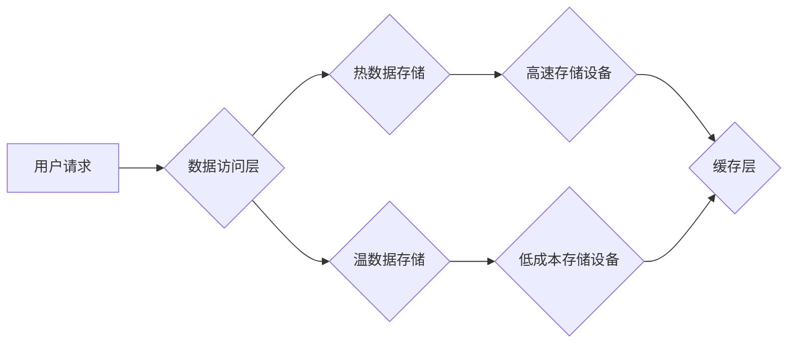

> Hot-Warm冗余, 存储系统, 数据冗余, 热数据, 温数据, 性能优化, 存储成本

## 1. 背景介绍

随着大数据时代的到来，数据存储和处理的需求日益增长。传统的存储系统架构难以满足对高性能、高可用性和低成本的需求。为了解决这些问题，Hot-Warm冗余设计应运而生。

Hot-Warm冗余是一种数据存储策略，它将数据划分为“热数据”和“温数据”两类，并采用不同的存储方式和冗余机制来优化性能和成本。

* **热数据**是指经常被访问的数据，例如在线交易数据、实时监控数据等。
* **温数据**是指访问频率较低的，但仍然需要保留的数据，例如历史交易数据、备份数据等。

Hot-Warm冗余设计通过将热数据存储在高速、高性能的存储设备上，而将温数据存储在低成本、低性能的存储设备上，从而实现性能和成本的平衡。

## 2. 核心概念与联系

Hot-Warm冗余设计的核心概念是将数据按照访问频率进行分类，并采用不同的存储策略和冗余机制。

**架构图：**



**核心概念：**

* **数据分类:** 根据数据访问频率将数据分为热数据和温数据。
* **存储策略:** 热数据采用高速、高性能的存储设备，温数据采用低成本、低性能的存储设备。
* **冗余机制:** 热数据采用高冗余机制，例如RAID，以确保数据可用性。温数据采用低冗余机制，例如副本，以降低存储成本。

## 3. 核心算法原理 & 具体操作步骤

### 3.1  算法原理概述

Hot-Warm冗余设计的核心算法是数据分类算法，它根据数据的访问频率将数据划分为热数据和温数据。

**数据分类算法:**

* **基于访问频率:** 统计数据的访问频率，将访问频率高的数据分类为热数据，访问频率低的分类为温数据。
* **基于数据类型:** 根据数据的类型，例如实时数据、历史数据等，进行分类。
* **基于业务需求:** 根据业务需求，例如数据重要性、数据更新频率等，进行分类。

### 3.2  算法步骤详解

1. **数据采集:** 收集数据的访问频率、数据类型、业务需求等信息。
2. **数据分析:** 对收集到的数据进行分析，确定数据的访问频率分布、数据类型分布、业务需求分布等。
3. **数据分类:** 根据数据分析结果，将数据划分为热数据和温数据。
4. **数据迁移:** 将热数据迁移到高速存储设备，将温数据迁移到低成本存储设备。
5. **监控和调整:** 定期监控数据的访问频率，并根据实际情况调整数据的分类和迁移策略。

### 3.3  算法优缺点

**优点:**

* **性能优化:** 将热数据存储在高速存储设备上，可以提高数据访问速度。
* **成本降低:** 将温数据存储在低成本存储设备上，可以降低存储成本。
* **可用性提升:** 热数据采用高冗余机制，可以提高数据可用性。

**缺点:**

* **复杂性增加:** 需要设计和维护复杂的分类和迁移机制。
* **数据迁移成本:** 数据迁移需要消耗时间和资源。
* **数据一致性:** 需要保证热数据和温数据的一致性。

### 3.4  算法应用领域

Hot-Warm冗余设计广泛应用于以下领域:

* **云计算:** 云服务提供商可以使用Hot-Warm冗余设计来优化存储资源的利用率。
* **大数据分析:** 大数据分析平台可以使用Hot-Warm冗余设计来提高数据处理速度。
* **金融交易:** 金融交易系统可以使用Hot-Warm冗余设计来保证交易数据的实时性和安全性。

## 4. 数学模型和公式 & 详细讲解 & 举例说明

### 4.1  数学模型构建

Hot-Warm冗余设计可以采用以下数学模型来描述数据分类和存储策略:

* **数据访问频率模型:**

$$
f(t) = \alpha \cdot e^{-\beta \cdot t}
$$

其中:

* $f(t)$ 表示数据在时间 $t$ 的访问频率。
* $\alpha$ 和 $\beta$ 是模型参数，可以根据实际数据进行调整。

* **存储成本模型:**

$$
C(s) = \gamma \cdot s + \delta \cdot r
$$

其中:

* $C(s)$ 表示存储成本。
* $s$ 是存储容量。
* $r$ 是冗余度。
* $\gamma$ 和 $\delta$ 是模型参数，可以根据实际情况进行调整。

### 4.2  公式推导过程

根据数据访问频率模型和存储成本模型，可以推导出以下公式:

* **热数据存储容量:**

$$
s_h = \int_0^T f(t) dt
$$

* **温数据存储容量:**

$$
s_w = \int_T^\infty f(t) dt
$$

* **总存储成本:**

$$
C = \gamma \cdot (s_h + s_w) + \delta \cdot (r_h + r_w)
$$

其中:

* $s_h$ 和 $s_w$ 分别是热数据和温数据的存储容量。
* $r_h$ 和 $r_w$ 分别是热数据和温数据的冗余度。

### 4.3  案例分析与讲解

假设一个数据中心需要存储100TB的数据，其中热数据访问频率为100次/秒，温数据访问频率为10次/秒。

根据数据访问频率模型，可以计算出热数据和温数据的存储容量。

根据存储成本模型，可以计算出不同冗余度下的存储成本。

通过比较不同冗余度下的存储成本，可以选择最优的冗余策略。

## 5. 项目实践：代码实例和详细解释说明

### 5.1  开发环境搭建

* 操作系统: Ubuntu 20.04
* 编程语言: Python 3.8
* 存储库: Redis, MySQL

### 5.2  源代码详细实现

```python
# 热数据存储
import redis

r = redis.Redis(host='localhost', port=6379, db=0)

# 温数据存储
import mysql.connector

mydb = mysql.connector.connect(
  host="localhost",
  user="your_username",
  password="your_password",
  database="your_database"
)

mycursor = mydb.cursor()

# 数据分类算法
def classify_data(data):
  # 根据访问频率、数据类型、业务需求等进行分类
  if data['access_frequency'] > 100:
    return 'hot'
  else:
    return 'warm'

# 数据迁移
def migrate_data(data):
  if data['category'] == 'hot':
    r.set(data['id'], data['value'])
  else:
    sql = "INSERT INTO warm_data (id, value) VALUES (%s, %s)"
    val = (data['id'], data['value'])
    mycursor.execute(sql, val)
    mydb.commit()

# 数据访问
def access_data(id):
  if data['category'] == 'hot':
    return r.get(id)
  else:
    sql = "SELECT value FROM warm_data WHERE id = %s"
    mycursor.execute(sql, (id,))
    result = mycursor.fetchone()
    return result[0]
```

### 5.3  代码解读与分析

* **热数据存储:** 使用Redis作为热数据存储，Redis具有高性能、低延迟的特点，适合存储经常访问的数据。
* **温数据存储:** 使用MySQL作为温数据存储，MySQL具有强大的数据管理能力，适合存储历史数据。
* **数据分类算法:** 根据数据访问频率、数据类型、业务需求等进行分类。
* **数据迁移:** 将热数据存储在Redis中，将温数据存储在MySQL中。
* **数据访问:** 根据数据分类结果，从相应的存储系统中访问数据。

### 5.4  运行结果展示

通过运行上述代码，可以实现热数据和温数据的存储、分类、迁移和访问。

## 6. 实际应用场景

Hot-Warm冗余设计在以下实际应用场景中得到了广泛应用:

### 6.1  云计算平台

云计算平台可以利用Hot-Warm冗余设计来优化存储资源的利用率。例如，将用户上传的图片和视频数据划分为热数据和温数据，将热数据存储在高速存储设备上，将温数据存储在低成本存储设备上。

### 6.2  大数据分析平台

大数据分析平台可以利用Hot-Warm冗余设计来提高数据处理速度。例如，将实时数据存储在高速存储设备上，将历史数据存储在低成本存储设备上，从而提高数据分析的效率。

### 6.3  金融交易系统

金融交易系统可以利用Hot-Warm冗余设计来保证交易数据的实时性和安全性。例如，将实时交易数据存储在高速存储设备上，将历史交易数据存储在低成本存储设备上，从而保证交易数据的实时性和安全性。

### 6.4  未来应用展望

随着数据量的不断增长，Hot-Warm冗余设计将越来越重要。未来，Hot-Warm冗余设计将应用于更多领域，例如物联网、人工智能等。

## 7. 工具和资源推荐

### 7.1  学习资源推荐

* **书籍:**
    * 《分布式系统设计》
    * 《云计算架构》
* **在线课程:**
    * Coursera: Distributed Systems
    * Udemy: Cloud Computing Architectures

### 7.2  开发工具推荐

* **存储库:** Redis, MySQL, MongoDB
* **编程语言:** Python, Java, Go
* **云平台:** AWS, Azure, GCP

### 7.3  相关论文推荐

* **Hot-Warm Data Management in Cloud Storage Systems**
* **A Survey of Hot-Warm Data Management Techniques**

## 8. 总结：未来发展趋势与挑战

### 8.1  研究成果总结

Hot-Warm冗余设计是一种有效的存储优化策略，它可以提高数据访问速度、降低存储成本、提升数据可用性。

### 8.2  未来发展趋势

* **智能数据分类:** 利用机器学习等技术，实现更加智能的数据分类。
* **动态冗余调整:** 根据数据访问频率动态调整冗余度，优化存储成本和数据可用性。
* **多层次存储:** 将数据存储在多层次的存储设备上，实现更加灵活的存储策略。

### 8.3  面临的挑战

* **数据分类的准确性:** 数据分类算法的准确性直接影响到Hot-Warm冗余设计的效果。
* **数据迁移的效率:** 数据迁移需要消耗时间和资源，需要提高数据迁移的效率。
* **数据一致性的保证:** 需要保证热数据和温数据的一致性。

### 8.4  研究展望

未来，Hot-Warm冗余设计将继续发展，并应用于更多领域。研究者将继续探索新的数据分类算法、动态冗余调整机制和多层次存储策略，以提高Hot-Warm冗余设计的性能和效率。

## 9. 附录：常见问题与解答

**问题:** Hot-Warm冗余设计是否适用于所有数据？

**答案:** Hot-Warm冗余设计适用于访问频率不同的数据，但对于访问频率非常低的冷数据，可能不适用。

**问题:** Hot-Warm冗余设计会增加系统复杂度吗？

**答案:** 确实，Hot-Warm冗余设计会增加系统复杂度，但它可以带来更高的性能和更低的成本，因此值得考虑。

**问题:** 如何选择合适的冗余度？

**