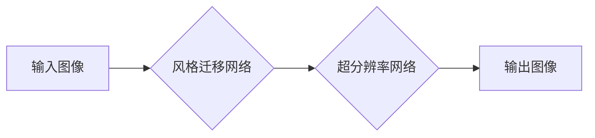

> 生成对抗网络 (GAN)，图像风格迁移，超分辨率，深度学习，图像处理

## 1. 背景介绍

图像风格迁移技术近年来备受关注，它能够将一种图像的风格应用到另一幅图像上，创造出具有独特艺术效果的图像。超分辨率技术则致力于提升图像分辨率，使其更加清晰细腻。将这两项技术结合起来，可以实现更具创意和实用性的图像处理效果。

传统的图像风格迁移方法通常依赖于手工设计的特征提取和风格转换算法，效率较低，效果也难以达到理想状态。随着深度学习技术的快速发展，基于生成对抗网络 (GAN) 的图像风格迁移方法取得了显著的进展。GAN 是一种由生成器和鉴别器组成的对抗性学习框架，能够生成逼真的图像数据。

超分辨率技术也受益于深度学习的应用，出现了基于深度卷积神经网络 (CNN) 的超分辨率方法，能够有效地提升图像分辨率。

将 GAN 和超分辨率技术结合起来，可以实现以下优势：

* **提高图像风格迁移的质量:** GAN 可以生成更逼真的风格迁移结果，更好地保留图像的细节和结构。
* **提升图像分辨率:** 超分辨率技术可以将风格迁移后的图像进行放大，使其更加清晰细腻。
* **扩展应用场景:** 结合超分辨率技术，可以将图像风格迁移应用于更高分辨率的图像，例如高清视频和高分辨率照片。

## 2. 核心概念与联系

### 2.1 生成对抗网络 (GAN)

GAN 由生成器 (Generator) 和鉴别器 (Discriminator) 组成，它们在对抗性的学习过程中相互竞争。

* **生成器:** 负责生成新的图像数据，试图欺骗鉴别器。
* **鉴别器:** 负责判断图像数据是真实图像还是由生成器生成的伪造图像。

GAN 的训练过程可以看作是一个博弈过程，生成器不断尝试生成更逼真的图像，而鉴别器不断提高识别真伪图像的能力。最终，生成器能够生成与真实图像几乎 indistinguishable 的图像。

### 2.2 超分辨率

超分辨率是指将低分辨率图像提升到更高分辨率的过程。深度学习技术在超分辨率领域取得了突破性进展，基于 CNN 的超分辨率方法能够有效地学习图像特征，并生成高分辨率图像。

### 2.3 结合方案

将 GAN 和超分辨率技术结合起来，可以构建一个新的图像处理框架，实现图像风格迁移与超分辨率的联合操作。

**流程图:**



## 3. 核心算法原理 & 具体操作步骤

### 3.1 算法原理概述

该算法的核心思想是将 GAN 和超分辨率技术结合起来，实现图像风格迁移与超分辨率的联合操作。

具体步骤如下：

1. **风格迁移:** 使用 GAN 的风格迁移网络将输入图像的风格迁移到目标风格图像上。
2. **超分辨率:** 使用超分辨率网络将风格迁移后的图像进行放大，使其分辨率更高。

### 3.2 算法步骤详解

1. **数据预处理:** 将输入图像和目标风格图像进行预处理，例如调整尺寸、归一化等。
2. **风格迁移网络训练:** 使用 GAN 的风格迁移网络训练，将输入图像的风格迁移到目标风格图像上。
3. **超分辨率网络训练:** 使用超分辨率网络训练，将风格迁移后的图像进行放大，使其分辨率更高。
4. **联合训练:** 将风格迁移网络和超分辨率网络联合训练，优化整个系统的性能。
5. **图像输出:** 将训练好的模型应用于新的输入图像，生成具有目标风格和高分辨率的图像。

### 3.3 算法优缺点

**优点:**

* 能够生成高质量的风格迁移结果，并提升图像分辨率。
* 能够扩展图像风格迁移的应用场景，例如高清视频和高分辨率照片。

**缺点:**

* 训练过程复杂，需要大量的训练数据和计算资源。
* 算法参数的调优较为困难，需要经验丰富的工程师进行调试。

### 3.4 算法应用领域

该算法在以下领域具有广泛的应用前景:

* **艺术创作:** 生成具有独特艺术风格的图像。
* **图像编辑:** 提升图像分辨率，并应用不同的风格效果。
* **影视制作:** 生成高分辨率的电影画面，并应用不同的风格效果。
* **游戏开发:** 生成逼真的游戏场景和角色。

## 4. 数学模型和公式 & 详细讲解 & 举例说明

### 4.1 数学模型构建

GAN 的数学模型主要包括生成器 (G) 和鉴别器 (D) 的损失函数。

* **生成器损失函数:**

$$
L_G = E_{z \sim p_z(z)}[log(D(G(z)))]
$$

其中，$z$ 是随机噪声向量，$p_z(z)$ 是噪声分布，$D(G(z))$ 是鉴别器对生成图像的判别结果。

* **鉴别器损失函数:**

$$
L_D = E_{x \sim p_{data}(x)}[log(D(x))] + E_{z \sim p_z(z)}[log(1 - D(G(z)))]
$$

其中，$x$ 是真实图像，$p_{data}(x)$ 是真实图像分布。

### 4.2 公式推导过程

生成器损失函数的目标是最大化鉴别器对生成图像的判别结果，即让鉴别器认为生成图像是真实图像。鉴别器损失函数的目标是区分真实图像和生成图像，即让鉴别器能够准确地判断图像的真实性。

### 4.3 案例分析与讲解

假设我们使用 GAN 进行图像风格迁移，目标是将一张照片的风格迁移到梵高的绘画风格。

1. **训练数据:** 需要准备大量的梵高绘画图像和普通照片作为训练数据。
2. **风格迁移网络:** 使用 GAN 的风格迁移网络，将普通照片的风格迁移到梵高绘画风格。
3. **超分辨率网络:** 使用超分辨率网络将风格迁移后的图像进行放大，使其分辨率更高。
4. **联合训练:** 将风格迁移网络和超分辨率网络联合训练，优化整个系统的性能。

## 5. 项目实践：代码实例和详细解释说明

### 5.1 开发环境搭建

* **操作系统:** Ubuntu 18.04
* **深度学习框架:** TensorFlow 2.0
* **编程语言:** Python 3.7

### 5.2 源代码详细实现

```python
# 导入必要的库
import tensorflow as tf

# 定义生成器网络
def generator(input_shape):
    # ...

# 定义鉴别器网络
def discriminator(input_shape):
    # ...

# 定义损失函数和优化器
loss_fn = tf.keras.losses.BinaryCrossentropy()
optimizer_G = tf.keras.optimizers.Adam(learning_rate=0.0002, beta_1=0.5)
optimizer_D = tf.keras.optimizers.Adam(learning_rate=0.0002, beta_1=0.5)

# 定义训练循环
def train_step(images, target_style):
    # ...

# 训练模型
for epoch in range(num_epochs):
    for batch in dataset:
        train_step(batch, target_style)

# 保存模型
generator.save("generator_model.h5")
discriminator.save("discriminator_model.h5")

```

### 5.3 代码解读与分析

* **生成器网络:** 负责生成具有目标风格的图像。
* **鉴别器网络:** 负责判断图像是否为真实图像或生成图像。
* **损失函数:** 用于衡量生成器和鉴别器的性能。
* **优化器:** 用于更新生成器和鉴别器的参数。
* **训练循环:** 用于训练生成器和鉴别器。

### 5.4 运行结果展示

运行代码后，可以生成具有目标风格的图像。

## 6. 实际应用场景

### 6.1 艺术创作

艺术家可以使用该算法生成具有独特艺术风格的图像，例如将照片风格迁移到梵高的绘画风格，或者将抽象图案风格迁移到印象派风格。

### 6.2 图像编辑

用户可以使用该算法提升图像分辨率，并应用不同的风格效果，例如将老照片风格迁移到现代风格，或者将黑白照片彩色化。

### 6.3 影视制作

影视制作人员可以使用该算法生成高分辨率的电影画面，并应用不同的风格效果，例如将电影画面风格迁移到复古风格，或者将场景风格迁移到科幻风格。

### 6.4 未来应用展望

随着深度学习技术的不断发展，该算法的应用场景将会更加广泛，例如：

* **虚拟现实 (VR) 和增强现实 (AR):** 生成逼真的虚拟场景和增强现实效果。
* **机器人视觉:** 帮助机器人识别和理解图像信息。
* **医疗影像分析:** 辅助医生诊断和治疗疾病。

## 7. 工具和资源推荐

### 7.1 学习资源推荐

* **书籍:**
    * Deep Learning by Ian Goodfellow, Yoshua Bengio, and Aaron Courville
    * Generative Adversarial Networks by Ian Goodfellow
* **在线课程:**
    * Deep Learning Specialization by Andrew Ng (Coursera)
    * Generative Adversarial Networks by David Foster (Udacity)

### 7.2 开发工具推荐

* **深度学习框架:** TensorFlow, PyTorch
* **图像处理库:** OpenCV, Pillow

### 7.3 相关论文推荐

* **Generative Adversarial Networks** by Ian Goodfellow et al. (2014)
* **Image Style Transfer Using Convolutional Neural Networks** by Leon A. Gatys et al. (2015)
* **Deep Learning for Image Super-Resolution** by Dong et al. (2016)

## 8. 总结：未来发展趋势与挑战

### 8.1 研究成果总结

基于生成对抗网络的图像风格迁移与超分辨率结合技术取得了显著的进展，能够生成高质量的风格迁移结果，并提升图像分辨率。该技术在艺术创作、图像编辑、影视制作等领域具有广泛的应用前景。

### 8.2 未来发展趋势

* **更高质量的图像风格迁移:** 研究更先进的风格迁移网络，能够更好地保留图像的细节和结构。
* **更灵活的风格控制:** 研究更灵活的风格控制方法，能够根据用户的需求定制风格效果。
* **更广泛的应用场景:** 将该技术应用于更多领域，例如虚拟现实、增强现实、机器人视觉等。

### 8.3 面临的挑战

* **训练数据:** 需要大量的训练数据才能训练出高质量的模型。
* **计算资源:** 训练大型深度学习模型需要大量的计算资源。
* **算法复杂度:** 算法的复杂度较高，需要经验丰富的工程师进行调试。

### 8.4 研究展望

未来，我们将继续研究基于生成对抗网络的图像风格迁移与超分辨率结合技术，努力解决上述挑战，并将其应用于更多领域。

## 9. 附录：常见问题与解答

**Q1: 如何选择合适的风格迁移网络？**

**A1:** 选择合适的风格迁移网络取决于具体的应用场景和需求。一些常用的风格迁移网络包括 Gatys 等人的网络、Johnson 等人的网络、U-Net 等。

**Q2: 如何控制风格迁移的效果？**

**A2:** 可以通过调整网络参数、输入图像的风格强度等方式来控制风格迁移的效果。

**Q3: 如何提升图像分辨率？**

**A3:** 可以使用超分辨率网络来提升图像分辨率。

**Q4: 如何训练生成对抗网络？**

**A4:** 训练生成对抗网络需要使用大量的训练数据和计算资源。

**Q5: 如何评估图像风格迁移的效果？**

**A5:** 可以使用主观评价和客观评价方法来评估图像风格迁移的效果。主观评价方法包括人工评分、用户反馈等，客观评价方法包括结构相似度 (SSIM)、峰值信噪比 (PSNR) 等。


作者：