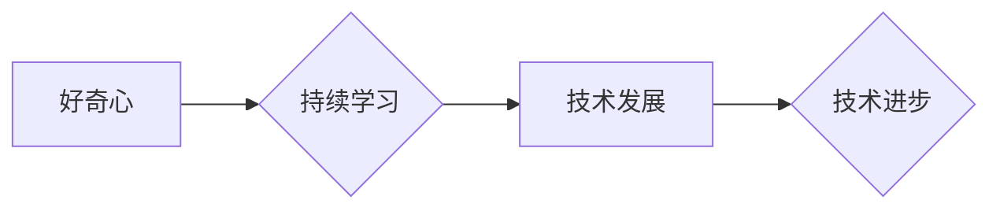

>  好奇心、持续学习、人工智能、深度学习、机器学习、算法、数据科学、技术发展

## 1. 背景介绍

在瞬息万变的科技时代，知识更新的速度比以往任何时候都更快。新技术层出不穷，旧技术不断被淘汰。在这个充满挑战和机遇的环境中，好奇心和持续学习成为了技术人员生存和发展的关键。

好奇心是人类的天性，也是推动科技进步的原动力。它让我们对未知事物充满渴望，不断探索和发现。持续学习则是将好奇心转化为行动的动力，让我们不断积累知识，提升技能，适应不断变化的科技环境。

对于技术人员来说，好奇心和持续学习不仅是个人成长和发展的必要条件，也是企业竞争力的关键因素。那些能够保持好奇心，不断学习新知识和新技能的技术人员，才能在激烈的竞争中脱颖而出，为企业创造更大的价值。

## 2. 核心概念与联系

### 2.1  好奇心

好奇心是一种内在的驱动力，它让我们对未知事物充满渴望，想要探索和理解。好奇心可以激发我们的学习兴趣，让我们主动寻求知识，并不断挑战自我。

### 2.2  持续学习

持续学习是指终身学习的一种方式，它强调的是不断学习新知识和新技能，并将其应用于实际工作中。持续学习可以帮助我们保持竞争力，适应不断变化的社会环境。

### 2.3  技术发展

技术发展是一个不断迭代的过程，新技术不断涌现，旧技术不断被淘汰。为了适应技术发展，技术人员需要不断学习新知识和新技能，才能保持竞争力。

**Mermaid 流程图**



## 3. 核心算法原理 & 具体操作步骤

### 3.1  算法原理概述

深度学习算法是一种基于人工神经网络的机器学习算法，它能够从海量数据中学习复杂的模式和特征。深度学习算法的核心是多层神经网络，每一层神经元都连接到下一层的多个神经元，通过层层传递信息，最终输出预测结果。

### 3.2  算法步骤详解

1. **数据预处理:** 将原始数据进行清洗、转换和特征工程，使其适合深度学习算法的训练。
2. **网络结构设计:** 根据具体任务需求，设计深度神经网络的结构，包括神经元的数量、连接方式和激活函数等。
3. **模型训练:** 使用训练数据训练深度神经网络，通过调整网络参数，使模型的预测结果与真实值尽可能接近。
4. **模型评估:** 使用测试数据评估模型的性能，并根据评估结果进行模型调优。
5. **模型部署:** 将训练好的模型部署到实际应用场景中，用于预测和决策。

### 3.3  算法优缺点

**优点:**

* 能够学习复杂的模式和特征，在图像识别、自然语言处理等领域取得了突破性进展。
* 能够自动提取特征，减少人工特征工程的成本。
* 随着数据量的增加，模型性能会不断提升。

**缺点:**

* 训练数据量要求高，需要大量的labeled数据。
* 计算资源消耗大，训练时间长。
* 模型解释性差，难以理解模型的决策过程。

### 3.4  算法应用领域

深度学习算法广泛应用于以下领域:

* **图像识别:** 人脸识别、物体检测、图像分类等。
* **自然语言处理:** 机器翻译、文本摘要、情感分析等。
* **语音识别:** 语音转文本、语音助手等。
* **推荐系统:** 商品推荐、内容推荐等。
* **医疗诊断:** 疾病诊断、影像分析等。

## 4. 数学模型和公式 & 详细讲解 & 举例说明

### 4.1  数学模型构建

深度学习算法的核心是多层神经网络，每个神经元接收多个输入信号，并通过激活函数进行处理，输出一个信号。神经网络的结构可以表示为一个 directed acyclic graph (DAG)，其中每个节点代表一个神经元，每个边代表一个连接。

### 4.2  公式推导过程

深度学习算法的训练过程是通过反向传播算法来实现的。反向传播算法的核心是计算每个神经元的梯度，并根据梯度更新神经元的权重和偏置。

**损失函数:**

$$
L = \frac{1}{N} \sum_{i=1}^{N} (y_i - \hat{y}_i)^2
$$

其中:

* $L$ 是损失函数
* $N$ 是样本数量
* $y_i$ 是真实值
* $\hat{y}_i$ 是预测值

**梯度下降算法:**

$$
\theta = \theta - \alpha \nabla L(\theta)
$$

其中:

* $\theta$ 是模型参数
* $\alpha$ 是学习率
* $\nabla L(\theta)$ 是损失函数对模型参数的梯度

### 4.3  案例分析与讲解

**举例说明:**

假设我们训练一个简单的深度神经网络来识别手写数字。网络结构包括两层神经元，第一层有10个神经元，第二层有10个神经元。训练数据包含10000张手写数字图片，每张图片都标注了对应的数字。

通过反向传播算法，我们可以计算每个神经元的梯度，并根据梯度更新神经元的权重和偏置。随着训练的进行，模型的预测精度会不断提升。最终，我们可以使用训练好的模型来识别新的手写数字图片。

## 5. 项目实践：代码实例和详细解释说明

### 5.1  开发环境搭建

为了实现深度学习算法的项目实践，我们需要搭建一个合适的开发环境。常用的开发环境包括：

* **Python:** 深度学习框架的编程语言
* **TensorFlow/PyTorch:** 深度学习框架
* **GPU:** 加速深度学习训练的硬件

### 5.2  源代码详细实现

```python
import tensorflow as tf

# 定义模型结构
model = tf.keras.models.Sequential([
    tf.keras.layers.Dense(128, activation='relu', input_shape=(784,)),
    tf.keras.layers.Dense(10, activation='softmax')
])

# 编译模型
model.compile(optimizer='adam',
              loss='sparse_categorical_crossentropy',
              metrics=['accuracy'])

# 训练模型
model.fit(x_train, y_train, epochs=10)

# 评估模型
loss, accuracy = model.evaluate(x_test, y_test)
print('Test loss:', loss)
print('Test accuracy:', accuracy)
```

### 5.3  代码解读与分析

这段代码实现了简单的深度神经网络模型训练。

* `tf.keras.models.Sequential` 定义了一个顺序模型，神经层按顺序连接。
* `tf.keras.layers.Dense` 定义了一个全连接层，每个神经元都连接到上一层的每个神经元。
* `activation='relu'` 指定了激活函数为ReLU函数。
* `input_shape=(784,)` 指定了输入数据的形状。
* `optimizer='adam'` 指定了优化器为Adam算法。
* `loss='sparse_categorical_crossentropy'` 指定了损失函数为类别交叉熵损失函数。
* `metrics=['accuracy']` 指定了评估指标为准确率。
* `model.fit()` 函数用于训练模型。
* `model.evaluate()` 函数用于评估模型。

### 5.4  运行结果展示

训练完成后，我们可以使用测试数据评估模型的性能。输出结果会显示测试集上的损失值和准确率。

## 6. 实际应用场景

深度学习算法在各个领域都有广泛的应用场景，例如：

### 6.1  图像识别

* **人脸识别:** 用于解锁手机、验证身份、监控安全等。
* **物体检测:** 用于自动驾驶、安防监控、工业自动化等。
* **图像分类:** 用于医学影像诊断、产品分类、内容推荐等。

### 6.2  自然语言处理

* **机器翻译:** 将一种语言翻译成另一种语言。
* **文本摘要:** 自动生成文本的简短摘要。
* **情感分析:** 分析文本的情感倾向，用于市场调研、客户服务等。

### 6.3  语音识别

* **语音转文本:** 将语音转换为文本，用于语音助手、听写软件等。
* **语音合成:** 将文本转换为语音，用于语音导航、语音播报等。

### 6.4  未来应用展望

随着深度学习算法的不断发展，未来将有更多新的应用场景出现，例如：

* **个性化教育:** 根据学生的学习情况提供个性化的学习方案。
* **精准医疗:** 根据患者的基因信息和病史提供个性化的治疗方案。
* **自动写作:** 自动生成新闻报道、小说、诗歌等。

## 7. 工具和资源推荐

### 7.1  学习资源推荐

* **在线课程:** Coursera、edX、Udacity 等平台提供深度学习相关的在线课程。
* **书籍:** 《深度学习》、《神经网络与深度学习》等书籍。
* **博客:** TensorFlow、PyTorch 等框架的官方博客。

### 7.2  开发工具推荐

* **TensorFlow:** Google 开发的开源深度学习框架。
* **PyTorch:** Facebook 开发的开源深度学习框架。
* **Keras:** TensorFlow 上的深度学习 API。

### 7.3  相关论文推荐

* **AlexNet:** 《ImageNet Classification with Deep Convolutional Neural Networks》
* **VGGNet:** 《Very Deep Convolutional Networks for Large-Scale Image Recognition》
* **ResNet:** 《Deep Residual Learning for Image Recognition》

## 8. 总结：未来发展趋势与挑战

### 8.1  研究成果总结

深度学习算法取得了显著的成果，在图像识别、自然语言处理、语音识别等领域取得了突破性进展。

### 8.2  未来发展趋势

* **模型更深更广:** 探索更深层次、更广阔结构的神经网络。
* **数据更丰富更有效:** 利用更多数据类型和数据增强技术提高模型性能。
* **算法更智能更高效:** 研究更智能、更有效的深度学习算法。
* **应用更广泛更深入:** 将深度学习应用于更多领域，解决更复杂的问题。

### 8.3  面临的挑战

* **数据隐私和安全:** 深度学习算法需要大量数据，如何保护数据隐私和安全是一个重要挑战。
* **模型解释性和可信度:** 深度学习模型的决策过程难以解释，如何提高模型的解释性和可信度是一个重要问题。
* **计算资源消耗:** 深度学习算法训练需要大量的计算资源，如何降低计算资源消耗是一个重要挑战。

### 8.4  研究展望

未来，深度学习研究将继续朝着更智能、更安全、更可解释的方向发展。


## 9. 附录：常见问题与解答

### 9.1  深度学习和机器学习的区别是什么？

机器学习是人工智能的一个子领域，它通过算法学习数据中的模式，并做出预测或决策。深度学习是机器学习的一种特殊形式，它使用多层神经网络来模拟人类大脑的学习过程。

### 9.2  如何选择合适的深度学习框架？

选择深度学习框架需要考虑以下因素:

* **项目需求:** 不同的项目对框架的功能和性能有不同的要求。
* **开发经验:** 选择自己熟悉的框架可以提高开发效率。
* **社区支持:** 拥有活跃社区支持的框架可以获得更多帮助和资源。

### 9.3  如何提高深度学习模型的性能？

提高深度学习模型性能的方法包括:

* **增加训练数据:** 更多的训练数据可以帮助模型学习更复杂的模式。
* **调整模型结构:** 尝试不同的模型结构，例如增加神经层数、改变神经元数量等。
* **优化超参数:** 超参数是模型训练过程中的参数，例如学习率、批处理大小