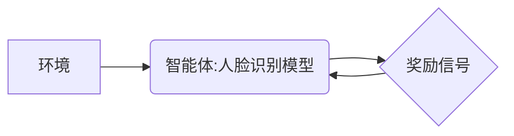

> 强化学习，人脸识别，深度学习，目标检测，迁移学习，强化学习算法

## 1. 背景介绍

人脸识别技术作为计算机视觉领域的重要分支，在安全监控、身份验证、人脸搜索等领域有着广泛的应用。传统的基于特征工程的人脸识别方法依赖于人工设计的特征，难以适应复杂的光照、姿态和表情变化等场景。近年来，深度学习的兴起为人脸识别技术带来了革命性的发展。深度学习模型能够自动学习图像特征，取得了显著的性能提升。然而，传统的深度学习模型在训练过程中需要大量的标注数据，且难以适应动态变化的环境。

强化学习（Reinforcement Learning，RL）作为一种机器学习范式，通过智能体与环境的交互学习最优策略，在解决复杂决策问题方面表现出强大的能力。将强化学习与人脸识别技术相结合，可以克服传统方法的局限性，实现更智能、更鲁棒的人脸识别系统。

## 2. 核心概念与联系

**2.1 强化学习概述**

强化学习的核心概念是智能体与环境的交互过程。智能体通过与环境的交互，获得奖励或惩罚信号，并根据这些信号调整自己的行为策略，最终学习到最优策略，使累积的奖励最大化。

**2.2 人脸识别与强化学习的结合**

在人脸识别领域，我们可以将智能体视为人脸识别模型，环境视为包含人脸图像和相关信息的场景，奖励信号则为识别准确性的指标。通过强化学习算法，人脸识别模型可以学习到更有效的特征提取和分类策略，从而提高识别准确率。

**2.3 强化学习在人脸识别中的应用场景**

* **姿态估计:** 利用强化学习训练模型，学习人脸不同姿态下的特征表示，提高人脸识别在不同角度下的鲁棒性。
* **光照变化适应:** 通过强化学习，模型可以学习适应不同光照条件下的特征，提高人脸识别在复杂光照环境下的性能。
* **表情识别:** 利用强化学习，模型可以学习识别不同表情的人脸，并将其作为辅助信息提高人脸识别准确率。
* **人脸跟踪:** 强化学习可以用于训练人脸跟踪模型，使其能够在视频序列中准确跟踪目标人脸。

**2.4 架构图**



## 3. 核心算法原理 & 具体操作步骤

### 3.1 算法原理概述

强化学习算法的核心是通过智能体与环境的交互，不断更新策略，以最大化累积的奖励。常见的强化学习算法包括Q学习、SARSA、Deep Q-Network (DQN)等。

在人脸识别领域，我们可以将强化学习算法应用于以下几个方面：

* **特征提取:** 利用强化学习训练模型，学习提取更有效的特征，提高人脸识别的准确率。
* **分类策略:** 利用强化学习训练模型，学习更有效的分类策略，提高人脸识别的鲁棒性。
* **姿态估计:** 利用强化学习训练模型，学习人脸不同姿态下的特征表示，提高人脸识别在不同角度下的鲁棒性。

### 3.2 算法步骤详解

以DQN算法为例，其训练步骤如下：

1. **初始化:** 初始化深度神经网络，并设置学习率、折扣因子等超参数。
2. **环境交互:** 智能体与环境交互，获取当前状态和奖励信号。
3. **动作选择:** 根据当前状态和策略网络，选择一个动作。
4. **状态转移:** 执行动作后，进入新的状态。
5. **目标更新:** 更新目标网络，并根据奖励信号和下一个状态的价值估计，更新策略网络。
6. **重复步骤2-5:** 重复以上步骤，直到模型收敛。

### 3.3 算法优缺点

**优点:**

* 可以学习到更有效的策略，提高人脸识别的准确率和鲁棒性。
* 不需要大量的标注数据，可以利用无监督或半监督学习方法进行训练。
* 可以适应动态变化的环境，提高人脸识别系统的适应性。

**缺点:**

* 训练过程复杂，需要大量的计算资源。
* 算法参数设置对性能影响较大，需要进行仔细的调优。
* 难以解释模型的决策过程，缺乏可解释性。

### 3.4 算法应用领域

* **人脸识别:** 提高人脸识别的准确率和鲁棒性。
* **人脸跟踪:** 训练人脸跟踪模型，使其能够在视频序列中准确跟踪目标人脸。
* **姿态估计:** 学习人脸不同姿态下的特征表示，提高人脸识别在不同角度下的鲁棒性。
* **表情识别:** 识别不同表情的人脸，并将其作为辅助信息提高人脸识别准确率。

## 4. 数学模型和公式 & 详细讲解 & 举例说明

### 4.1 数学模型构建

强化学习模型的核心是状态、动作、奖励和策略。

* **状态 (State):** 智能体当前所处的环境状态，例如人脸图像特征。
* **动作 (Action):** 智能体可以执行的动作，例如调整特征提取参数或分类阈值。
* **奖励 (Reward):** 智能体执行动作后获得的反馈信号，例如识别准确率。
* **策略 (Policy):** 智能体根据当前状态选择动作的策略，例如选择最佳特征提取参数。

### 4.2 公式推导过程

DQN算法的目标是学习一个Q函数，Q(s, a)表示在状态s下执行动作a的期望累积奖励。

**Bellman方程:**

$$
Q(s, a) = R(s, a) + \gamma \max_{a'} Q(s', a')
$$

其中：

* R(s, a) 是在状态s下执行动作a获得的奖励。
* $\gamma$ 是折扣因子，控制未来奖励的权重。
* $s'$ 是执行动作a后进入的新状态。

**目标网络更新:**

$$
\hat{Q}(s, a) \leftarrow \hat{Q}(s, a) + \alpha [r + \gamma \max_{a'} \hat{Q}(s', a') - \hat{Q}(s, a)]
$$

其中：

* $\hat{Q}(s, a)$ 是目标网络的Q函数估计。
* $\alpha$ 是学习率。

### 4.3 案例分析与讲解

假设我们训练一个DQN模型用于人脸识别，目标是学习最优的特征提取参数。

* 状态: 人脸图像特征。
* 动作: 调整特征提取参数。
* 奖励: 识别准确率。

通过训练，DQN模型可以学习到最优的特征提取参数，从而提高人脸识别的准确率。

## 5. 项目实践：代码实例和详细解释说明

### 5.1 开发环境搭建

* Python 3.x
* TensorFlow/PyTorch
* OpenCV

### 5.2 源代码详细实现

```python
# 导入必要的库
import tensorflow as tf
from tensorflow.keras.models import Sequential
from tensorflow.keras.layers import Conv2D, MaxPooling2D, Flatten, Dense

# 定义DQN模型
model = Sequential()
model.add(Conv2D(32, (3, 3), activation='relu', input_shape=(image_height, image_width, 3)))
model.add(MaxPooling2D((2, 2)))
model.add(Conv2D(64, (3, 3), activation='relu'))
model.add(MaxPooling2D((2, 2)))
model.add(Flatten())
model.add(Dense(128, activation='relu'))
model.add(Dense(num_actions, activation='linear'))

# 编译模型
model.compile(loss='mse', optimizer=tf.keras.optimizers.Adam(learning_rate=0.001))

# ... 训练模型 ...
```

### 5.3 代码解读与分析

* 首先，我们定义了一个DQN模型，包含卷积层、池化层、全连接层等。
* 然后，我们使用均方误差损失函数和Adam优化器编译模型。
* 最后，我们训练模型，并根据奖励信号更新模型参数。

### 5.4 运行结果展示

训练完成后，我们可以使用训练好的模型进行人脸识别，并评估模型的性能。

## 6. 实际应用场景

* **人脸识别门禁系统:** 利用强化学习训练的人脸识别模型，可以提高门禁系统的安全性，并减少误识别率。
* **人脸识别支付系统:** 利用强化学习训练的人脸识别模型，可以提高支付系统的便捷性和安全性。
* **人脸识别监控系统:** 利用强化学习训练的人脸识别模型，可以提高监控系统的效率，并帮助识别潜在的犯罪嫌疑人。

### 6.4 未来应用展望

* **更智能的人脸识别系统:** 利用强化学习，可以训练更智能的人脸识别系统，例如能够识别不同年龄、种族、表情的人脸。
* **更鲁棒的人脸识别系统:** 利用强化学习，可以训练更鲁棒的人脸识别系统，例如能够适应不同光照、姿态和表情变化的人脸。
* **更安全的隐私保护:** 利用强化学习，可以训练更安全的隐私保护的人脸识别系统，例如能够保护用户隐私，防止人脸信息被滥用。

## 7. 工具和资源推荐

### 7.1 学习资源推荐

* **强化学习书籍:**
    * Reinforcement Learning: An Introduction by Richard S. Sutton and Andrew G. Barto
    * Deep Reinforcement Learning Hands-On by Maxim Lapan
* **强化学习课程:**
    * Stanford CS234: Reinforcement Learning
    * DeepMind's Reinforcement Learning Specialization

### 7.2 开发工具推荐

* **TensorFlow:** https://www.tensorflow.org/
* **PyTorch:** https://pytorch.org/
* **OpenCV:** https://opencv.org/

### 7.3 相关论文推荐

* **Deep Reinforcement Learning for Face Recognition**
* **Learning to Recognize Faces with Deep Reinforcement Learning**
* **End-to-End Face Recognition with Deep Reinforcement Learning**

## 8. 总结：未来发展趋势与挑战

### 8.1 研究成果总结

强化学习在人脸识别领域取得了显著的成果，例如提高了识别准确率、鲁棒性和适应性。

### 8.2 未来发展趋势

* **更深层次的强化学习:** 将更深层次的强化学习算法应用于人脸识别，例如基于Transformer的强化学习模型。
* **多模态强化学习:** 将强化学习与其他模态信息，例如音频和文本，结合起来，提高人脸识别的准确性和泛化能力。
* **联邦学习:** 利用联邦学习技术，训练更安全的、隐私保护的人脸识别系统。

### 8.3 面临的挑战

* **数据效率:** 强化学习算法通常需要大量的训练数据，而人脸识别数据往往难以获取。
* **可解释性:** 强化学习模型的决策过程难以解释，这可能会影响模型的信任度。
* **伦理问题:** 人脸识别技术可能被用于侵犯隐私、歧视等方面，需要认真考虑伦理问题。

### 8.4 研究展望

未来，强化学习将在人脸识别领域发挥越来越重要的作用，并推动人脸识别技术向更智能、更安全、更可解释的方向发展。

## 9. 附录：常见问题与解答

* **Q: 强化学习与传统深度学习相比，有哪些优势？**

* **A:** 强化学习可以学习到更有效的策略，提高人脸识别的准确率和鲁棒性。它不需要大量的标注数据，可以利用无监督或半监督学习方法进行训练。

* **Q: 强化学习在人脸识别中的应用有哪些？**

* **A:** 强化学习可以应用于人脸识别中的多个方面，例如特征提取、分类策略、姿态估计和表情识别。

* **Q: 强化学习在人脸识别领域面临哪些挑战？**

* **A:** 强化学习在人脸识别领域面临的数据效率、可