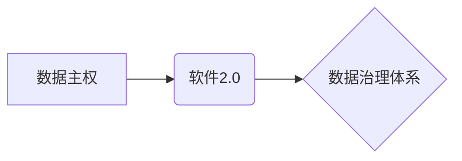

> 数据主权,软件2.0,数据治理,数据安全,数据隐私,去中心化,区块链,人工智能

## 1. 背景介绍

数据已成为当今社会最宝贵的资源，其价值远超传统资源。然而，数据集中化、数据安全和隐私泄露等问题日益突出，阻碍了数据价值的充分释放。数据主权的概念应运而生，旨在赋予数据所有者对数据拥有、控制和利用的自主权。

软件2.0，作为数据主权时代的必然产物，旨在通过去中心化、智能化、可信化的技术手段，重构数据治理体系，实现数据安全、隐私保护和价值最大化。

## 2. 核心概念与联系

**2.1 数据主权**

数据主权是指数据所有者对自身数据拥有、控制和利用的自主权。它包括以下几个方面：

* **数据所有权:** 数据所有者拥有数据的所有权，可以决定数据的用途和共享方式。
* **数据控制权:** 数据所有者可以控制数据的访问、使用和修改。
* **数据利用权:** 数据所有者可以根据自身需求，利用数据进行分析、决策和商业活动。

**2.2 软件2.0**

软件2.0是指基于区块链、人工智能等新技术的下一代软件架构。它具有以下特点：

* **去中心化:** 软件不再依赖于单一中心，而是由多个节点共同维护和运行。
* **智能化:** 软件能够自动执行任务，并根据数据变化进行智能决策。
* **可信化:** 软件运行过程透明可追溯，能够保证数据的安全性和可靠性。

**2.3 数据治理体系**

数据治理体系是指管理和控制数据生命周期的所有流程和机制。它包括数据策略、数据标准、数据安全、数据隐私等方面。

**2.4 关系图**



## 3. 核心算法原理 & 具体操作步骤

**3.1 算法原理概述**

软件2.0的实现依赖于多种核心算法，例如：

* **区块链技术:** 用于构建去中心化的数据存储和管理系统。
* **人工智能技术:** 用于数据分析、智能决策和自动化执行。
* **加密技术:** 用于保障数据安全和隐私保护。

**3.2 算法步骤详解**

1. **数据加密:** 将原始数据加密，防止未经授权的访问。
2. **数据分片:** 将数据分割成多个片段，分散存储在不同的节点上。
3. **数据链路:** 将数据片段链接成区块链，保证数据完整性和不可篡改性。
4. **智能合约:** 使用智能合约自动执行数据访问、使用和共享规则。
5. **数据分析:** 利用人工智能技术对数据进行分析，挖掘数据价值。

**3.3 算法优缺点**

**优点:**

* **数据安全:** 数据加密和分片技术保障数据安全。
* **数据隐私:** 智能合约和数据访问控制机制保护数据隐私。
* **数据可信:** 区块链技术保证数据完整性和不可篡改性。
* **数据价值最大化:** 智能分析和自动化执行提高数据利用效率。

**缺点:**

* **技术复杂:** 软件2.0的实现需要复杂的算法和技术支持。
* **成本高昂:** 建设和维护去中心化数据平台需要较高的成本。
* **监管挑战:** 数据主权和去中心化带来的监管挑战需要进一步探索。

**3.4 算法应用领域**

* **医疗健康:** 保护患者隐私，实现医疗数据的共享和协同。
* **金融科技:** 加强金融数据的安全性和可信度，促进金融创新。
* **供应链管理:** 提高供应链透明度和可追溯性，防范欺诈和假冒。
* **教育科技:** 打造个性化学习平台，保障学生数据安全和隐私。

## 4. 数学模型和公式 & 详细讲解 & 举例说明

**4.1 数学模型构建**

数据主权博弈可以建模为一个博弈论模型，其中参与者包括数据所有者、数据使用者和数据平台。每个参与者都有自己的利益目标，通过数据交易和使用规则的制定来实现利益最大化。

**4.2 公式推导过程**

假设数据所有者拥有数据量为 $D$，数据使用者愿意支付的价格为 $P$，数据平台的交易费用为 $F$。则数据所有者获得的收益为：

$$
R_D = P \cdot D - F
$$

数据使用者获得的收益为：

$$
R_U = D \cdot V - P
$$

其中 $V$ 为数据对数据使用者带来的价值。

**4.3 案例分析与讲解**

例如，一家医疗机构拥有大量患者数据，希望将其用于医疗研究。数据使用者，例如一家制药公司，愿意支付一定的费用获取这些数据，用于开发新药。数据平台，例如一个数据交易平台，负责撮合数据交易，并收取交易费用。

在数据主权博弈中，医疗机构需要权衡数据价值和隐私保护，选择合适的交易方式和价格。制药公司需要评估数据价值和交易成本，决定是否参与数据交易。数据平台需要制定合理的交易规则和收费标准，保证平台的稳定运行。

## 5. 项目实践：代码实例和详细解释说明

**5.1 开发环境搭建**

* 操作系统: Ubuntu 20.04 LTS
* 编程语言: Python 3.8
* 开发工具: PyCharm

**5.2 源代码详细实现**

```python
# 数据加密模块
from cryptography.fernet import Fernet

def encrypt_data(data, key):
    f = Fernet(key)
    encrypted_data = f.encrypt(data.encode())
    return encrypted_data

# 数据分片模块
def split_data(data, num_chunks):
    chunk_size = len(data) // num_chunks
    return [data[i * chunk_size:(i + 1) * chunk_size] for i in range(num_chunks)]

# 区块链模块
class Blockchain:
    def __init__(self):
        self.chain = []

    def add_block(self, data):
        # ...

# 智能合约模块
class SmartContract:
    def __init__(self):
        # ...

    def execute(self, data):
        # ...
```

**5.3 代码解读与分析**

* 数据加密模块使用Fernet库对数据进行加密，确保数据安全。
* 数据分片模块将数据分割成多个片段，分散存储在不同的节点上。
* 区块链模块使用Python实现简单的区块链结构，保证数据完整性和不可篡改性。
* 智能合约模块使用Python实现简单的智能合约功能，自动执行数据访问、使用和共享规则。

**5.4 运行结果展示**

运行上述代码，可以实现数据加密、分片、区块链存储和智能合约执行等功能。

## 6. 实际应用场景

**6.1 医疗健康**

* **电子病历共享:** 患者可以授权医疗机构共享其电子病历，方便医生进行诊断和治疗。
* **临床研究:** 研究机构可以收集患者数据进行临床研究，促进医疗技术进步。
* **药物研发:** 制药公司可以利用患者数据进行药物研发，开发更有效的药物。

**6.2 金融科技**

* **信用评分:** 金融机构可以利用用户数据进行信用评分，提高贷款审批效率。
* **反欺诈:** 金融机构可以利用用户数据进行反欺诈，防止金融犯罪。
* **个性化金融服务:** 金融机构可以利用用户数据提供个性化金融服务，满足用户多样化需求。

**6.3 供应链管理**

* **产品追溯:** 消费者可以追溯产品的来源和生产过程，保障产品安全和质量。
* **库存管理:** 企业可以实时掌握库存情况，优化库存管理。
* **物流配送:** 企业可以优化物流配送路线，提高配送效率。

**6.4 未来应用展望**

随着数据主权和软件2.0技术的不断发展，其应用场景将更加广泛，例如：

* **教育科技:** 打造个性化学习平台，保障学生数据安全和隐私。
* **智能家居:** 实现智能家居设备的互联互通，保障用户隐私和安全。
* **城市管理:** 利用数据进行城市管理，提高城市效率和居民生活质量。

## 7. 工具和资源推荐

**7.1 学习资源推荐**

* **书籍:**
    * 《数据主权》
    * 《软件2.0》
    * 《区块链技术》
* **在线课程:**
    * Coursera: 数据主权与隐私保护
    * edX: 区块链技术与应用
* **技术博客:**
    * Coindesk
    * Ethereum.org

**7.2 开发工具推荐**

* **区块链开发平台:**
    * Ethereum
    * Hyperledger Fabric
* **人工智能开发平台:**
    * TensorFlow
    * PyTorch
* **数据分析工具:**
    * Apache Spark
    * Hadoop

**7.3 相关论文推荐**

* 《数据主权的理论框架》
* 《软件2.0的架构设计》
* 《区块链技术在数据治理中的应用》

## 8. 总结：未来发展趋势与挑战

**8.1 研究成果总结**

数据主权和软件2.0技术为数据治理体系的重构提供了新的思路和方法。通过去中心化、智能化、可信化的技术手段，可以有效解决数据安全、隐私保护和价值最大化等问题。

**8.2 未来发展趋势**

* **数据主权标准化:** 随着数据主权概念的普及，将会有更多标准和规范的制定，规范数据主权的实现方式。
* **数据主权市场化:** 数据交易平台将更加成熟，数据主权将成为一种可交易的资产。
* **数据主权技术融合:** 数据主权技术将与其他新兴技术，例如人工智能、物联网等融合，实现更广泛的应用。

**8.3 面临的挑战**

* **技术复杂性:** 数据主权和软件2.0技术的实现需要克服技术复杂性，需要更多的研究和开发投入。
* **监管挑战:** 数据主权和去中心化带来的监管挑战需要进一步探索，需要制定相应的法律法规。
* **社会认知:** 数据主权的概念需要进一步普及，需要提高公众对数据主权的认识和理解。

**8.4 研究展望**

未来，我们将继续深入研究数据主权和软件2.0技术，探索其在不同领域的应用，推动数据治理体系的重构，实现数据价值的充分释放。

## 9. 附录：常见问题与解答

**9.1 数据主权如何实现？**

数据主权可以通过技术手段实现，例如：

* 数据加密: 对数据进行加密，防止未经授权的访问。
* 数据分片: 将数据分割成多个片段，分散存储在不同的节点上。
* 区块链技术: 使用区块链技术保证数据完整性和不可篡改性。
* 智能合约: 使用智能合约自动执行数据访问、使用和共享规则。

**9.2 软件2.0有哪些优势？**

软件2.0具有以下优势:

* 数据安全: 数据加密和分片技术保障数据安全。
* 数据隐私: 智能合约和数据访问控制机制保护数据隐私。
* 数据可信: 区块链技术保证数据完整性和不可篡改性。
* 数据价值最大化: 智能分析和自动化执行提高数据利用效率。

**9.3 数据主权和隐私保护的关系是什么？**

数据主权是数据隐私保护的基础。通过赋予数据所有者对数据拥有、控制和利用的自主权，可以有效保障数据隐私。

**9.4 数据主权的未来发展趋势是什么？**

数据主权将朝着以下方向发展:

* 数据主权标准化
* 数据主权市场化
* 数据主权技术融合


作者：禅与计算机程序设计艺术 / Zen and the Art of Computer