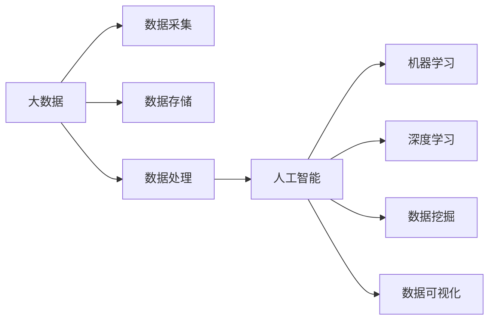

                 

**大数据、人工智能、机器学习、深度学习、数据挖掘、数据可视化、数据治理、数据安全**

## 1. 背景介绍

在当今信息爆炸的时代，数据已成为一种新的生产要素，大数据技术的发展为人工智能的进步提供了强大的支撑。本文将围绕李飞飞女士的贡献和AI大数据的未来展开讨论。

## 2. 核心概念与联系

### 2.1 大数据与人工智能

大数据和人工智能是当今最热门的两个概念，它们密切相关，相辅相成。大数据为人工智能提供了丰富的数据源，而人工智能则帮助我们从大数据中提取有价值的信息。下图展示了大数据与人工智能的关系：



### 2.2 李飞飞与人工智能

李飞飞女士是人工智能领域的先驱，她在机器学习、计算机视觉和语言处理等领域做出了突出贡献。她领导的团队开发了第一个商业成功的手写识别系统，并创立了人工智能研究领域的许多基准测试。她的工作对当今的人工智能技术产生了深远的影响。

## 3. 核心算法原理 & 具体操作步骤

### 3.1 机器学习算法原理概述

机器学习是人工智能的一个分支，它涉及使计算机能够在没有被明确编程的情况下学习和改进的算法。机器学习算法可以分为监督学习、无监督学习和强化学习三大类。

### 3.2 机器学习算法步骤详解

1. 数据收集：收集与问题相关的数据。
2. 数据预处理：清洗、转换和标准化数据。
3. 特征选择：选择最相关的特征。
4. 模型选择：选择合适的机器学习算法。
5. 模型训练：使用训练数据训练模型。
6. 模型评估：评估模型的性能。
7. 模型优化：优化模型的性能。
8. 模型部署：将模型部署到生产环境中。

### 3.3 机器学习算法优缺点

优点：能够从数据中学习，无需明确编程；可以处理复杂的非线性关系；可以处理高维数据。

缺点：需要大量的数据；计算复杂度高；模型解释性差；易受过拟合影响。

### 3.4 机器学习算法应用领域

机器学习广泛应用于图像识别、语音识别、自然语言处理、推荐系统、医疗诊断等领域。

## 4. 数学模型和公式 & 详细讲解 & 举例说明

### 4.1 数学模型构建

在机器学习中，我们通常使用线性回归、逻辑回归、支持向量机、决策树等模型。这些模型都可以用数学公式表示。

### 4.2 公式推导过程

以线性回归为例，其目标是找到一条直线，使得数据点到这条直线的距离最小。数学公式如下：

$$y = wx + b$$

其中，$y$是目标变量，$x$是特征变量，$w$是权重，$b$是偏置项。我们可以使用梯度下降算法来最小化误差平方和，从而找到最优的$w$和$b$。

### 4.3 案例分析与讲解

例如，我们想预测房价。我们可以使用线性回归模型，其中特征变量$x$是房屋的面积，目标变量$y$是房屋的价格。我们可以使用梯度下降算法来训练模型，并使用测试数据来评估模型的性能。

## 5. 项目实践：代码实例和详细解释说明

### 5.1 开发环境搭建

我们将使用Python和Scikit-learn库来实现线性回归模型。我们需要安装Python和Scikit-learn，并导入必要的库。

```python
import numpy as np
from sklearn.linear_model import LinearRegression
from sklearn.model_selection import train_test_split
from sklearn.metrics import mean_squared_error
```

### 5.2 源代码详细实现

```python
# 加载数据
X = np.array([[1], [2], [3], [4], [5]])
y = np.array([2, 4, 5, 4, 5])

# 将数据分为训练集和测试集
X_train, X_test, y_train, y_test = train_test_split(X, y, test_size=0.2, random_state=42)

# 创建线性回归模型
model = LinearRegression()

# 训练模型
model.fit(X_train, y_train)

# 预测测试集
y_pred = model.predict(X_test)

# 评估模型
mse = mean_squared_error(y_test, y_pred)
print(f'Mean Squared Error: {mse}')
```

### 5.3 代码解读与分析

我们首先导入必要的库，然后加载数据。我们将数据分为训练集和测试集，并创建一个线性回归模型。我们使用训练数据训练模型，并使用测试数据评估模型的性能。我们使用均方误差来评估模型的性能。

### 5.4 运行结果展示

运行代码后，我们可以看到均方误差的值。这个值越小，说明模型的性能越好。

## 6. 实际应用场景

### 6.1 当前应用

大数据和人工智能在各个领域得到广泛应用，例如金融、医疗、交通、零售等。它们帮助我们提高效率、降低成本、改善服务质量。

### 6.2 未来应用展望

未来，大数据和人工智能将继续发展，并将应用于更多领域。例如，它们将帮助我们实现智能城市、智能制造、智能交通等。此外，它们还将帮助我们解决全球性问题，如气候变化、疾病预防等。

## 7. 工具和资源推荐

### 7.1 学习资源推荐

推荐阅读《机器学习》一书，该书由斯坦福大学的Andrew Ng编写，是机器学习领域的经典著作。此外，还可以关注机器学习领域的顶级会议，如NIPS、ICML、CVPR等。

### 7.2 开发工具推荐

推荐使用Python和Scikit-learn库来实现机器学习模型。此外，还可以使用TensorFlow、PyTorch等深度学习库。

### 7.3 相关论文推荐

推荐阅读李飞飞女士的论文《ImageNet Large Scale Visual Recognition Challenge》和《Deep Learning》一文。

## 8. 总结：未来发展趋势与挑战

### 8.1 研究成果总结

本文介绍了大数据与人工智能的关系，并详细介绍了机器学习算法的原理、步骤、优缺点和应用领域。此外，还介绍了数学模型的构建、公式推导过程和案例分析。最后，还提供了项目实践的代码实例和工具资源推荐。

### 8.2 未来发展趋势

未来，大数据和人工智能将继续发展，并将应用于更多领域。此外，它们还将帮助我们解决全球性问题，如气候变化、疾病预防等。

### 8.3 面临的挑战

然而，大数据和人工智能也面临着挑战，如数据安全、数据隐私、算法偏见等。我们需要解决这些挑战，才能实现大数据和人工智能的可持续发展。

### 8.4 研究展望

未来的研究方向包括但不限于：深度学习、强化学习、无监督学习、解释性AI、可解释AI、数据治理、数据安全等。

## 9. 附录：常见问题与解答

**Q1：什么是大数据？**

A1：大数据是指无法用常规软件工具进行处理的大容量、高速度、多样化、可变性的数据。

**Q2：什么是人工智能？**

A2：人工智能是指模拟或实现人类智能的机器或软件系统。

**Q3：什么是机器学习？**

A3：机器学习是指使计算机能够在没有被明确编程的情况下学习和改进的算法。

**Q4：什么是深度学习？**

A4：深度学习是指一种机器学习方法，它使用神经网络模型来模拟人脑的学习过程。

**Q5：什么是数据挖掘？**

A5：数据挖掘是指从大量数据中提取有用的信息和模式的过程。

**Q6：什么是数据可视化？**

A6：数据可视化是指使用图形和图表来表示数据的过程。

**Q7：什么是数据治理？**

A7：数据治理是指确保数据的完整性、一致性、准确性和可用性的过程。

**Q8：什么是数据安全？**

A8：数据安全是指保护数据免受未经授权访问、泄露、篡改或删除的过程。

**Q9：什么是算法偏见？**

A9：算法偏见是指算法在处理数据时表现出的偏见，导致结果不公平或不准确。

**Q10：如何解决算法偏见？**

A10：解决算法偏见需要从数据收集、数据预处理、模型选择、模型评估等各个阶段考虑偏见问题，并使用公平性指标来评估模型的公平性。

## 作者：禅与计算机程序设计艺术 / Zen and the Art of Computer Programming

