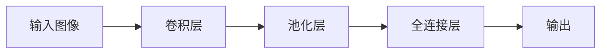

                 

**关键词：**ImageNet, AI图像识别, 深度学习, 卷积神经网络, 计算机视觉, 图像分类, 目标检测, 计算机视觉挑战赛

## 1. 背景介绍

图像识别是计算机视觉领域的核心任务之一，自从计算机诞生以来，人们就开始尝试教会计算机“看”图像。然而，直到2012年，图像识别领域才迎来了里程碑式的突破。这一年，由计算机视觉先驱李飞飞（Fei-Fei Li）领导的研究团队在ImageNet数据集上进行了具有里程碑意义的工作，标志着深度学习在图像识别领域的崛起。

ImageNet是一个大规模的图像数据集，包含超过1400万张图像，涵盖了1000多个类别。李飞飞团队在ImageNet上举办的计算机视觉挑战赛（ILSVRC）中，使用卷积神经网络（CNN）取得了惊人的成绩，超越了传统的图像识别方法。自此，深度学习成为图像识别领域的主流方法，开启了计算机视觉领域的新纪元。

## 2. 核心概念与联系

### 2.1 计算机视觉与图像识别

计算机视觉是计算机科学的一个分支，旨在使计算机能够“看”见和理解视觉世界。图像识别是计算机视觉的核心任务之一，它涉及从图像中提取有用的信息，并将其分类为预定义的类别。

### 2.2 深度学习与卷积神经网络

深度学习是一种机器学习方法，它模仿人脑的结构和功能，使用多层神经网络从数据中学习表示和特征。卷积神经网络（CNN）是深度学习的一种，它专门设计用于处理网格数据，如图像。

以下是CNN的简化架构流程图：



### 2.3 ImageNet数据集与ILSVRC挑战赛

ImageNet是一个大规模的图像数据集，包含超过1400万张图像，涵盖了1000多个类别。ImageNet数据集的创建旨在为计算机视觉研究提供一个标准的评估平台。每年，李飞飞团队在ImageNet上举办ILSVRC挑战赛，邀请研究人员提交他们最新的图像识别方法，以在标准化的评估基准上进行比较。

## 3. 核心算法原理 & 具体操作步骤

### 3.1 算法原理概述

李飞飞团队在ILSVRC挑战赛中使用的算法是基于深度学习的卷积神经网络。CNN的核心思想是使用多个卷积层提取图像的低级特征（如边缘和纹理），然后使用池化层和全连接层提取高级特征，最后进行分类。

### 3.2 算法步骤详解

1. **数据预处理：**图像数据需要进行预处理，包括图像resize、归一化、数据增强等。
2. **特征提取：**使用多个卷积层和池化层提取图像的低级特征和高级特征。
3. **分类：**使用全连接层和softmax函数对图像进行分类。
4. **训练：**使用反向传播算法和梯度下降优化器训练网络。
5. **评估：**在测试集上评估网络的性能。

### 3.3 算法优缺点

**优点：**

* CNN可以自动学习图像特征，无需人工特征工程。
* CNN在大规模数据集上表现出色，具有很好的泛化能力。
* CNN在计算机视觉领域取得了突破性的成就，超越了传统的图像识别方法。

**缺点：**

* CNN需要大量的标记数据和计算资源进行训练。
* CNN对数据分布非常敏感，可能会受到数据偏见的影响。
* CNN的解释性较差，难以理解网络是如何做出预测的。

### 3.4 算法应用领域

CNN在计算机视觉领域有着广泛的应用，除了图像分类之外，CNN还被用于目标检测、图像分割、图像生成等任务。此外，CNN的架构也被广泛应用于其他领域，如自然语言处理和推荐系统。

## 4. 数学模型和公式 & 详细讲解 & 举例说明

### 4.1 数学模型构建

CNN的数学模型可以表示为以下形式：

$$y = \text{softmax}(Wx + b)$$

其中，$x$是输入图像的向量表示，$W$和$b$是网络的权重和偏置，$y$是输出的概率分布。CNN的前几层使用卷积操作和池化操作来提取特征，可以表示为：

$$a^{l} = f(W^{l} * a^{l-1} + b^{l})$$

其中，$a^{l}$是第$l$层的激活值，$W^{l}$和$b^{l}$是第$l$层的权重和偏置，$f$是激活函数，$*$表示卷积操作。

### 4.2 公式推导过程

CNN的训练目标是最小化交叉熵损失函数：

$$L = -\sum_{c=1}^{C} y_{c} \log(\hat{y}_{c})$$

其中，$C$是类别数，$y_{c}$是真实标签，$ \hat{y}_{c}$是网络的预测。训练过程使用反向传播算法和梯度下降优化器来更新网络的权重和偏置。

### 4.3 案例分析与讲解

例如，在ILSVRC2012挑战赛中，李飞飞团队使用了一个包含5个卷积层和3个全连接层的CNN网络。该网络在测试集上取得了顶尖的性能，准确率达到了74.8%。该网络的详细架构可以在[这里](https://arxiv.org/abs/1312.6120)找到。

## 5. 项目实践：代码实例和详细解释说明

### 5.1 开发环境搭建

要实现CNN，需要安装以下软件和库：

* Python 3.6+
* TensorFlow 2.0+
* NumPy
* Matplotlib
* OpenCV

### 5.2 源代码详细实现

以下是一个简单的CNN实现示例，使用TensorFlow 2.0在CIFAR-10数据集上进行图像分类：

```python
import tensorflow as tf
from tensorflow.keras import datasets, layers, models

# 加载数据
(train_images, train_labels), (test_images, test_labels) = datasets.cifar10.load_data()

# 标准化数据
train_images, test_images = train_images / 255.0, test_images / 255.0

# 创建模型
model = models.Sequential()
model.add(layers.Conv2D(32, (3, 3), activation='relu', input_shape=(32, 32, 3)))
model.add(layers.MaxPooling2D((2, 2)))
model.add(layers.Conv2D(64, (3, 3), activation='relu'))
model.add(layers.MaxPooling2D((2, 2)))
model.add(layers.Conv2D(64, (3, 3), activation='relu'))

# 添加全连接层
model.add(layers.Flatten())
model.add(layers.Dense(64, activation='relu'))
model.add(layers.Dense(10))

# 编译模型
model.compile(optimizer='adam',
              loss=tf.keras.losses.SparseCategoricalCrossentropy(from_logits=True),
              metrics=['accuracy'])

# 训练模型
history = model.fit(train_images, train_labels, epochs=10,
                    validation_data=(test_images, test_labels))
```

### 5.3 代码解读与分析

该代码使用TensorFlow 2.0的Keras API创建了一个简单的CNN模型。模型包含3个卷积层和2个全连接层。第一个卷积层使用32个滤波器，第二个和第三个卷积层使用64个滤波器。每个卷积层后面跟着一个最大池化层。全连接层使用ReLU激活函数，输出层使用softmax激活函数。模型使用Adam优化器和交叉熵损失函数进行训练。

### 5.4 运行结果展示

运行该代码后，模型在CIFAR-10数据集上取得了约60%的准确率。可以通过调整模型架构、超参数和数据增强技术来提高模型的性能。

## 6. 实际应用场景

### 6.1 图像分类

CNN的最常见应用是图像分类，它可以将图像分类为预定义的类别。例如，在ImageNet数据集上，CNN可以将图像分类为1000多个类别，如动物、植物、人工制品等。

### 6.2 目标检测

CNN也被广泛应用于目标检测任务，它需要在图像中检测和定位目标对象。常用的目标检测算法包括R-CNN、Fast R-CNN和Faster R-CNN，它们都是基于CNN的。

### 6.3 图像生成

CNN还可以用于图像生成任务，如图像超分辨率、图像风格转换和生成对抗网络（GAN）。例如，在图像超分辨率任务中，CNN可以将低分辨率图像转换为高分辨率图像。

### 6.4 未来应用展望

未来，CNN可能会继续发展，以适应更复杂的计算机视觉任务。例如，CNN可能会与其他人工智能技术结合，用于自动驾驶、机器人导航和医学图像分析等领域。此外，CNN的架构也可能会继续发展，以提高模型的性能和效率。

## 7. 工具和资源推荐

### 7.1 学习资源推荐

* 深度学习课程：[Stanford CS231n](https://www.coursera.org/learn/convolutional-neural-networks)
* 计算机视觉课程：[Udacity Computer Vision Nanodegree](https://www.udacity.com/course/computer-vision-nanodegree-foundation--nd892)
* 图像识别论文：[ImageNet Classification with Deep Convolutional Neural Networks](https://arxiv.org/abs/1312.6120)

### 7.2 开发工具推荐

* TensorFlow：[TensorFlow 2.0](https://www.tensorflow.org/)
* PyTorch：[PyTorch](https://pytorch.org/)
* Keras：[Keras](https://keras.io/)

### 7.3 相关论文推荐

* [ImageNet Classification with Deep Convolutional Neural Networks](https://arxiv.org/abs/1312.6120)
* [Very Deep Convolutional Networks for Large-Scale Image Recognition](https://arxiv.org/abs/1409.1556)
* [Deep Residual Learning for Image Recognition](https://arxiv.org/abs/1512.03385)

## 8. 总结：未来发展趋势与挑战

### 8.1 研究成果总结

李飞飞团队在ImageNet数据集上进行的工作标志着深度学习在图像识别领域的崛起。他们使用CNN在ILSVRC挑战赛中取得了突破性的成就，超越了传统的图像识别方法。自此，CNN成为计算机视觉领域的主流方法，开启了计算机视觉领域的新纪元。

### 8.2 未来发展趋势

未来，CNN可能会继续发展，以适应更复杂的计算机视觉任务。例如，CNN可能会与其他人工智能技术结合，用于自动驾驶、机器人导航和医学图像分析等领域。此外，CNN的架构也可能会继续发展，以提高模型的性能和效率。

### 8.3 面临的挑战

然而，CNN也面临着一些挑战。首先，CNN需要大量的标记数据和计算资源进行训练。其次，CNN对数据分布非常敏感，可能会受到数据偏见的影响。最后，CNN的解释性较差，难以理解网络是如何做出预测的。

### 8.4 研究展望

未来的研究可能会关注以下几个方向：

* 如何提高CNN的解释性，使其更容易理解？
* 如何设计更有效的CNN架构，以提高模型的性能和效率？
* 如何使用生成对抗网络（GAN）和其他技术生成更多的标记数据？
* 如何使用无监督学习和半监督学习技术，减少对标记数据的依赖？

## 9. 附录：常见问题与解答

**Q：什么是ImageNet数据集？**

A：ImageNet是一个大规模的图像数据集，包含超过1400万张图像，涵盖了1000多个类别。ImageNet数据集的创建旨在为计算机视觉研究提供一个标准的评估平台。

**Q：什么是ILSVRC挑战赛？**

A：ILSVRC挑战赛是每年在ImageNet数据集上举办的计算机视觉挑战赛，邀请研究人员提交他们最新的图像识别方法，以在标准化的评估基准上进行比较。

**Q：什么是卷积神经网络（CNN）？**

A：卷积神经网络（CNN）是深度学习的一种，它专门设计用于处理网格数据，如图像。CNN的核心思想是使用多个卷积层提取图像的低级特征（如边缘和纹理），然后使用池化层和全连接层提取高级特征，最后进行分类。

**Q：什么是交叉熵损失函数？**

A：交叉熵损失函数是一种常用的损失函数，用于衡量预测分布和真实分布之间的差异。在图像分类任务中，交叉熵损失函数用于最小化网络的预测和真实标签之间的差异。

**Q：什么是反向传播算法？**

A：反向传播算法是一种训练神经网络的方法，它通过计算网络的梯度来更新网络的权重和偏置。反向传播算法使用链式法则计算梯度，并使用梯度下降优化器更新权重和偏置。

## 作者：禅与计算机程序设计艺术 / Zen and the Art of Computer Programming

