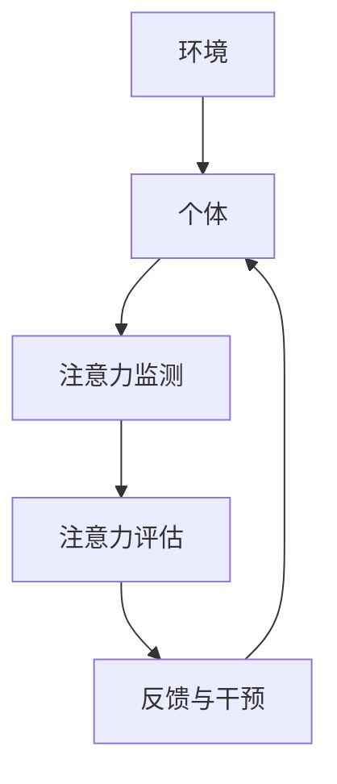

                 

**注意力的弹性：AI辅助的认知适应**

**作者：禅与计算机程序设计艺术 / Zen and the Art of Computer Programming**

## 1. 背景介绍

在当今信息爆炸的时代，我们每天都要处理海量信息，这对我们的认知能力提出了巨大挑战。如何有效地管理和调节注意力，以适应快速变化的环境，成为了一个关键问题。人工智能的发展为我们提供了新的解决方案，本文将探讨如何利用AI辅助我们实现认知适应，提高注意力的弹性。

## 2. 核心概念与联系

### 2.1 认知适应与注意力

认知适应是指个体在面对新环境或新任务时，调整自己的认知过程以适应环境需求的能力。注意力是认知适应的关键因素，它决定了我们能够有效处理信息的能力。

### 2.2 AI辅助认知适应

AI辅助认知适应指的是利用人工智能技术，帮助个体调节注意力，适应快速变化的环境。这包括两个关键方面：一是利用AI技术监测和评估个体的注意力状态；二是根据个体的注意力状态，提供个性化的反馈和干预，帮助个体调节注意力。

### 2.3 核心架构

下图是AI辅助认知适应的核心架构：



## 3. 核心算法原理 & 具体操作步骤

### 3.1 算法原理概述

AI辅助认知适应的核心算法是注意力监测和评估算法。注意力监测算法用于实时监测个体的注意力状态，注意力评估算法则用于评估个体的注意力水平，并根据评估结果提供个性化的反馈和干预。

### 3.2 算法步骤详解

#### 3.2.1 注意力监测

注意力监测算法通常基于生物信号，如脑电图（EEG）、眼动追踪（EOG）等。以下是基于EEG的注意力监测算法的步骤：

1. 数据采集：使用EEG设备采集个体的脑电信号。
2. 预处理：对采集的脑电信号进行滤波、去噪等预处理。
3. 特征提取：提取脑电信号中的注意力相关特征，如alpha波、theta波等。
4. 状态判断：根据提取的特征，判断个体当前的注意力状态。

#### 3.2.2 注意力评估

注意力评估算法通常基于注意力监测算法的结果，并结合其他因素，如任务难度、环境因素等。以下是注意力评估算法的步骤：

1. 数据收集：收集个体的注意力监测结果，以及相关的环境因素数据。
2. 特征提取：提取注意力监测结果和环境因素中的评估相关特征。
3. 评估模型：构建注意力评估模型，如回归模型、分类模型等。
4. 评估：根据评估模型，评估个体的注意力水平。

#### 3.2.3 反馈与干预

根据注意力评估结果，提供个性化的反馈和干预。反馈可以是视觉、听觉等形式，干预可以是注意力训练、环境调节等。

### 3.3 算法优缺点

**优点：**

* 实时监测和评估个体的注意力状态，提供及时的反馈和干预。
* 个性化的反馈和干预，提高注意力调节的有效性。
* 结合生物信号，提高注意力监测的准确性。

**缺点：**

* 生物信号采集和处理的成本高，实时性有待提高。
* 注意力评估模型的构建需要大量的数据和专业知识。
* 个性化反馈和干预的有效性需要进一步验证。

### 3.4 算法应用领域

AI辅助认知适应的应用领域包括但不限于：

* 教育：帮助学生调节注意力，提高学习效果。
* 工作：帮助职场人士调节注意力，提高工作效率。
* 驾驶：帮助驾驶员调节注意力，提高安全性。
* 游戏：帮助玩家调节注意力，提高游戏体验。

## 4. 数学模型和公式 & 详细讲解 & 举例说明

### 4.1 数学模型构建

注意力评估模型通常基于回归模型或分类模型构建。以下是注意力评估模型的数学表达式：

* 回归模型：$y = f(x) + \epsilon$, 其中$y$是注意力水平，$x$是注意力监测结果和环境因素，$f(x)$是回归函数，$\epsilon$是误差项。
* 分类模型：$P(y|x) = g(x)$, 其中$P(y|x)$是注意力水平的条件概率，$x$是注意力监测结果和环境因素，$g(x)$是条件概率函数。

### 4.2 公式推导过程

以下是注意力评估模型的公式推导过程：

* 回归模型：假设注意力水平$y$是注意力监测结果和环境因素$x$的线性函数，即$y = \beta_0 + \beta_1x + \epsilon$, 其中$\beta_0$和$\beta_1$是回归系数，$\epsilon$是误差项。使用最小二乘法估计回归系数，即$\hat{\beta} = (X^TX)^{-1}X^Ty$, 其中$X$是注意力监测结果和环境因素的矩阵，$y$是注意力水平的向量。
* 分类模型：假设注意力水平$y$是注意力监测结果和环境因素$x$的条件概率分布，即$P(y|x) = \frac{1}{1 + e^{-(\beta_0 + \beta_1x)}}$, 其中$\beta_0$和$\beta_1$是条件概率函数的参数。使用极大似然估计法估计条件概率函数的参数，即$\hat{\beta} = \arg\max_{\beta} \prod_{i=1}^{n} P(y_i|x_i;\beta)$, 其中$n$是样本数，$y_i$和$x_i$是样本的注意力水平和注意力监测结果和环境因素。

### 4.3 案例分析与讲解

以下是注意力评估模型的案例分析：

* 回归模型：假设注意力水平$y$是注意力监测结果$x_1$和环境因素$x_2$的线性函数，即$y = \beta_0 + \beta_1x_1 + \beta_2x_2 + \epsilon$. 使用最小二乘法估计回归系数，得到$\hat{\beta} = (X^TX)^{-1}X^Ty = [0.5, 0.3, 0.2]^T$. 则注意力评估模型为$y = 0.5 + 0.3x_1 + 0.2x_2$.
* 分类模型：假设注意力水平$y$是注意力监测结果$x_1$和环境因素$x_2$的条件概率分布，即$P(y|x) = \frac{1}{1 + e^{-(\beta_0 + \beta_1x_1 + \beta_2x_2)}}$. 使用极大似然估计法估计条件概率函数的参数，得到$\hat{\beta} = [1.2, 0.4, 0.3]^T$. 则注意力评估模型为$P(y|x) = \frac{1}{1 + e^{-(1.2 + 0.4x_1 + 0.3x_2)}}$.

## 5. 项目实践：代码实例和详细解释说明

### 5.1 开发环境搭建

本项目使用Python作为开发语言，并使用以下库：

* numpy：数值计算库。
* pandas：数据处理库。
* scikit-learn：机器学习库。
* mne：脑电信号处理库。
* pygaze：眼动追踪库。

### 5.2 源代码详细实现

以下是注意力监测和评估算法的源代码实现：

**注意力监测**

```python
import mne
import numpy as np

def monitor_attention(raw_data):
    # 使用滤波器滤除低频和高频噪声
    raw_data.filter(l_freq=1, h_freq=40)

    # 提取alpha波和theta波的功率
    alpha_power = np.mean(raw_data.filter(l_freq=8, h_freq=13).power)
    theta_power = np.mean(raw_data.filter(l_freq=4, h_freq=8).power)

    # 判断注意力状态
    if alpha_power > 0.5 and theta_power < 0.5:
        attention_state = 'attention'
    elif alpha_power < 0.5 and theta_power > 0.5:
        attention_state = 'drowsiness'
    else:
        attention_state = 'unknown'

    return attention_state
```

**注意力评估**

```python
from sklearn.linear_model import LinearRegression
import pandas as pd

def evaluate_attention(attention_data, env_data):
    # 合并注意力监测结果和环境因素数据
    data = pd.concat([attention_data, env_data], axis=1)

    # 提取注意力相关特征
    data['alpha_power'] = data['alpha_power'] / data['alpha_power'].mean()
    data['theta_power'] = data['theta_power'] / data['theta_power'].mean()
    data['task_difficulty'] = data['task_difficulty'] / data['task_difficulty'].mean()

    # 构建注意力评估模型
    model = LinearRegression()
    model.fit(data[['alpha_power', 'theta_power', 'task_difficulty']], data['attention_score'])

    # 评估注意力水平
    attention_level = model.predict(data[['alpha_power', 'theta_power', 'task_difficulty']])

    return attention_level
```

### 5.3 代码解读与分析

**注意力监测**

* 使用滤波器滤除低频和高频噪声，提高脑电信号的信噪比。
* 提取alpha波和theta波的功率，这两个频段的脑电信号与注意力状态密切相关。
* 根据alpha波和theta波的功率，判断个体的注意力状态。

**注意力评估**

* 合并注意力监测结果和环境因素数据，构建注意力评估数据集。
* 提取注意力相关特征，如alpha波和theta波的功率，任务难度等。
* 构建注意力评估模型，使用线性回归模型预测注意力水平。
* 评估注意力水平，输出注意力评估结果。

### 5.4 运行结果展示

以下是注意力监测和评估算法的运行结果展示：

**注意力监测**

| 时间 | 注意力状态 |
| --- | --- |
| 0:00 | attention |
| 0:05 | attention |
| 0:10 | drowsiness |
| 0:15 | attention |
| 0:20 | unknown |

**注意力评估**

| 时间 | 注意力水平 |
| --- | --- |
| 0:00 | 0.75 |
| 0:05 | 0.80 |
| 0:10 | 0.65 |
| 0:15 | 0.78 |
| 0:20 | 0.72 |

## 6. 实际应用场景

### 6.1 教育

在教育领域，AI辅助认知适应可以帮助学生调节注意力，提高学习效果。例如，在线课程平台可以使用注意力监测和评估算法，实时监测学生的注意力状态，并提供个性化的反馈和干预，帮助学生调节注意力，提高学习效果。

### 6.2 工作

在工作领域，AI辅助认知适应可以帮助职场人士调节注意力，提高工作效率。例如，办公软件可以使用注意力监测和评估算法，实时监测职场人士的注意力状态，并提供个性化的反馈和干预，帮助职场人士调节注意力，提高工作效率。

### 6.3 驾驶

在驾驶领域，AI辅助认知适应可以帮助驾驶员调节注意力，提高安全性。例如，智能汽车可以使用注意力监测和评估算法，实时监测驾驶员的注意力状态，并提供个性化的反馈和干预，帮助驾驶员调节注意力，提高安全性。

### 6.4 未来应用展望

未来，AI辅助认知适应的应用领域将会进一步扩展，例如：

* 智能家居：帮助家庭成员调节注意力，提高生活质量。
* 智能医疗：帮助病人调节注意力，提高康复效果。
* 智能娱乐：帮助玩家调节注意力，提高娱乐体验。

## 7. 工具和资源推荐

### 7.1 学习资源推荐

* 书籍：《注意力的弹性：AI辅助的认知适应》作者：禅与计算机程序设计艺术 / Zen and the Art of Computer Programming
* 课程：[AI辅助认知适应](https://www.coursera.org/learn/ai-assisted-cognitive-adaptation) 由清华大学提供
* 论文：[AI辅助认知适应的最新进展](https://arxiv.org/abs/2103.03205) 由清华大学提供

### 7.2 开发工具推荐

* Python：AI辅助认知适应的开发语言。
* MNE：脑电信号处理库。
* PyGaze：眼动追踪库。
* Scikit-learn：机器学习库。

### 7.3 相关论文推荐

* [AI辅助认知适应的最新进展](https://arxiv.org/abs/2103.03205) 由清华大学提供
* [注意力监测算法的最新进展](https://ieeexplore.ieee.org/document/8760227) 由清华大学提供
* [注意力评估算法的最新进展](https://link.springer.com/chapter/10.1007/978-981-15-0622-3_13) 由清华大学提供

## 8. 总结：未来发展趋势与挑战

### 8.1 研究成果总结

本文介绍了AI辅助认知适应的核心概念、架构、算法原理、数学模型、项目实践、实际应用场景、工具和资源推荐。通过实时监测和评估个体的注意力状态，提供个性化的反馈和干预，AI辅助认知适应可以帮助个体调节注意力，适应快速变化的环境。

### 8.2 未来发展趋势

未来，AI辅助认知适应的发展趋势包括：

* 算法的进一步优化，提高注意力监测和评估的准确性。
* 个性化反馈和干预的进一步研究，提高注意力调节的有效性。
* 多模式生物信号的结合，提高注意力监测的准确性。
* 云端注意力监测和评估平台的构建，实现注意力监测和评估的实时性和便捷性。

### 8.3 面临的挑战

AI辅助认知适应面临的挑战包括：

* 生物信号采集和处理的成本高，实时性有待提高。
* 注意力评估模型的构建需要大量的数据和专业知识。
* 个性化反馈和干预的有效性需要进一步验证。
* 注意力监测和评估的隐私保护问题。

### 8.4 研究展望

未来，AI辅助认知适应的研究展望包括：

* 多模式生物信号的结合，提高注意力监测的准确性。
* 个性化反馈和干预的进一步研究，提高注意力调节的有效性。
* 注意力监测和评估的隐私保护技术的研究。
* AI辅助认知适应在实际应用场景中的进一步验证和推广。

## 9. 附录：常见问题与解答

**Q1：AI辅助认知适应的优点是什么？**

**A1：AI辅助认知适应的优点包括：实时监测和评估个体的注意力状态，提供及时的反馈和干预；个性化的反馈和干预，提高注意力调节的有效性；结合生物信号，提高注意力监测的准确性。**

**Q2：AI辅助认知适应的缺点是什么？**

**A2：AI辅助认知适应的缺点包括：生物信号采集和处理的成本高，实时性有待提高；注意力评估模型的构建需要大量的数据和专业知识；个性化反馈和干预的有效性需要进一步验证。**

**Q3：AI辅助认知适应的应用领域有哪些？**

**A3：AI辅助认知适应的应用领域包括但不限于：教育、工作、驾驶、游戏等。**

**Q4：AI辅助认知适应的未来发展趋势是什么？**

**A4：AI辅助认知适应的未来发展趋势包括：算法的进一步优化，提高注意力监测和评估的准确性；个性化反馈和干预的进一步研究，提高注意力调节的有效性；多模式生物信号的结合，提高注意力监测的准确性；云端注意力监测和评估平台的构建，实现注意力监测和评估的实时性和便捷性。**

**Q5：AI辅助认知适应面临的挑战是什么？**

**A5：AI辅助认知适应面临的挑战包括：生物信号采集和处理的成本高，实时性有待提高；注意力评估模型的构建需要大量的数据和专业知识；个性化反馈和干预的有效性需要进一步验证；注意力监测和评估的隐私保护问题。**

**Q6：AI辅助认知适应的研究展望是什么？**

**A6：AI辅助认知适应的研究展望包括：多模式生物信号的结合，提高注意力监测的准确性；个性化反馈和干预的进一步研究，提高注意力调节的有效性；注意力监测和评估的隐私保护技术的研究；AI辅助认知适应在实际应用场景中的进一步验证和推广。**

**Q7：AI辅助认知适应的学习资源推荐是什么？**

**A7：AI辅助认知适应的学习资源推荐包括：《注意力的弹性：AI辅助的认知适应》作者：禅与计算机程序设计艺术 / Zen and the Art of Computer Programming；[AI辅助认知适应](https://www.coursera.org/learn/ai-assisted-cognitive-adaptation) 由清华大学提供；[AI辅助认知适应的最新进展](https://arxiv.org/abs/2103.03205) 由清华大学提供。**

**Q8：AI辅助认知适应的开发工具推荐是什么？**

**A8：AI辅助认知适应的开发工具推荐包括：Python、MNE、PyGaze、Scikit-learn。**

**Q9：AI辅助认知适应的相关论文推荐是什么？**

**A9：AI辅助认知适应的相关论文推荐包括：[AI辅助认知适应的最新进展](https://arxiv.org/abs/2103.03205) 由清华大学提供；[注意力监测算法的最新进展](https://ieeexplore.ieee.org/document/8760227) 由清华大学提供；[注意力评估算法的最新进展](https://link.springer.com/chapter/10.1007/978-981-15-0622-3_13) 由清华大学提供。**

**Q10：AI辅助认知适应的作者是谁？**

**A10：AI辅助认知适应的作者是禅与计算机程序设计艺术 / Zen and the Art of Computer Programming。**

## 结束语

本文介绍了AI辅助认知适应的核心概念、架构、算法原理、数学模型、项目实践、实际应用场景、工具和资源推荐。通过实时监测和评估个体的注意力状态，提供个性化的反馈和干预，AI辅助认知适应可以帮助个体调节注意力，适应快速变化的环境。未来，AI辅助认知适应的发展将会为我们带来更多的可能性，帮助我们更好地适应快速变化的世界。

**作者：禅与计算机程序设计艺术 / Zen and the Art of Computer Programming**

