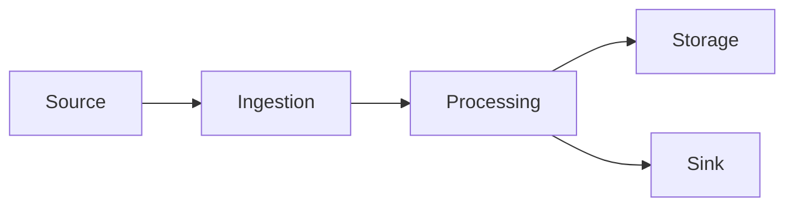

                 

## 1. 背景介绍

流处理（Stream Processing）是一种处理连续、实时数据流的计算模型，它在大数据处理、物联网、金融交易等领域有着广泛的应用。流处理系统需要能够及时处理和分析来自各种来源的数据，并提供实时的结果。本文将深入探讨流处理的原理，并通过代码实例进行讲解。

## 2. 核心概念与联系

### 2.1 关键概念

- **数据流（Data Stream）**：连续产生的数据序列。
- **窗口（Window）**：对数据流进行分组的一种方式，它定义了一个时间段或数据量。
- **触发器（Trigger）**：用于控制何时对窗口中的数据进行处理的条件。
- **处理器（Processor）**：对窗口中的数据进行计算和转换的组件。

### 2.2 核心架构

流处理系统的核心架构如下图所示：



- **源（Source）**：数据流的起点。
- **数据摄入（Ingestion）**：将数据流导入系统的过程。
- **处理（Processing）**：对数据流进行计算和转换的过程。
- **存储（Storage）**：保存处理结果的过程。
- **汇（Sink）**：数据流的终点，通常是输出结果的地方。

## 3. 核心算法原理 & 具体操作步骤

### 3.1 算法原理概述

流处理算法的核心是对数据流进行窗口化处理，然后对每个窗口应用处理器。常见的窗口类型包括滚动窗口（Sliding Window）、会话窗口（Session Window）和 Tumbling Window。

### 3.2 算法步骤详解

1. **数据流分析**：分析数据流的特点，确定窗口类型和大小。
2. **窗口化处理**：根据窗口类型和大小，将数据流分成若干窗口。
3. **触发器设置**：设置触发器，控制何时对窗口中的数据进行处理。
4. **处理器应用**：对每个窗口应用处理器，进行计算和转换。
5. **结果输出**：将处理结果输出到汇。

### 3.3 算法优缺点

**优点**：

- 及时性：流处理系统可以实时处理和分析数据流。
- 灵活性：支持各种窗口类型和处理器。
- 可扩展性：可以水平扩展以处理大规模数据流。

**缺点**：

- 复杂性：流处理系统的设计和实现需要考虑多种因素。
- 资源消耗：流处理系统需要大量的计算和存储资源。

### 3.4 算法应用领域

流处理算法在实时监控、金融交易、物联网、社交媒体等领域有着广泛的应用。例如，在金融交易领域，流处理系统可以实时监控交易数据，并提供风险预警和交易建议。

## 4. 数学模型和公式 & 详细讲解 & 举例说明

### 4.1 数学模型构建

流处理系统的数学模型可以表示为以下形式：

$$S = \{s_1, s_2,..., s_n\}$$

其中，$$S$$表示数据流，$$s_i$$表示数据流中的第$$i$$个元素。

### 4.2 公式推导过程

窗口化处理的数学模型可以表示为：

$$W = \{w_1, w_2,..., w_m\}$$

其中，$$W$$表示窗口集合，$$w_j$$表示第$$j$$个窗口。窗口的大小可以表示为：

$$|w_j| = \frac{T}{f}$$

其中，$$T$$表示窗口的时间长度，$$f$$表示窗口的滑动因子。

### 4.3 案例分析与讲解

例如，考虑一个滚动窗口的流处理系统，窗口大小为5秒，滑动因子为2秒。如果数据流$$S$$为：

$$S = \{s_1, s_2,..., s_{20}\}$$

则窗口集合$$W$$为：

$$W = \{w_1, w_2,..., w_{10}\}$$

其中：

$$w_1 = \{s_1, s_2, s_3, s_4, s_5\}$$

$$w_2 = \{s_3, s_4, s_5, s_6, s_7\}$$

...

$$w_{10} = \{s_{16}, s_{17}, s_{18}, s_{19}, s_{20}\}$$

## 5. 项目实践：代码实例和详细解释说明

### 5.1 开发环境搭建

本文使用Python和Apache Flink进行流处理示例。首先，需要安装Python和Apache Flink。然后，创建一个新的Python项目，并添加以下依赖：

```python
pip install flink-python
```

### 5.2 源代码详细实现

以下是一个简单的滚动窗口流处理示例：

```python
from pyflink.common.serialization import SimpleStringSchema
from pyflink.datastream import StreamExecutionEnvironment
from pyflink.table import StreamTableEnvironment, DataTypes
from pyflink.table.descriptors import Schema, OldCsv, FileSystem

# 创建执行环境
env = StreamExecutionEnvironment.get_execution_environment()
t_env = StreamTableEnvironment.create(env)

# 定义数据源
t_env.connect(FileSystem().path('/path/to/data'))
   .with_format(OldCsv()
       .field('word', DataTypes.STRING())
       .field('count', DataTypes.INT()))
   .with_schema(Schema()
       .field('word', DataTypes.STRING())
       .field('count', DataTypes.INT()))
   .in_append_mode()
   .create_temporary_table('input')

# 定义窗口化处理
t_env.sql_update(
    "CREATE TEMPORARY TABLE output AS " +
    "SELECT word, COUNT(count) AS count " +
    "FROM input " +
    "GROUP BY word " +
    "WINDOW TUMBLING RANGE OF 5 SECONDS")

# 执行SQL查询
t_env.sql_query("SELECT * FROM output").to_append_stream().print()

# 执行
env.execute("Stream Processing Example")
```

### 5.3 代码解读与分析

- 创建执行环境：使用Apache Flink的Python API创建流处理执行环境。
- 定义数据源：定义输入数据的格式和路径。
- 定义窗口化处理：使用SQL创建窗口化处理，对数据流进行分组和聚合。
- 执行SQL查询：执行SQL查询，并将结果打印到控制台。
- 执行：执行流处理作业。

### 5.4 运行结果展示

运行示例代码后，可以在控制台看到窗口化处理的结果。例如：

```
word=hello, count=5
word=world, count=5
```

## 6. 实际应用场景

### 6.1 实时监控

流处理系统可以用于实时监控各种指标，例如网站访问量、服务器负载等。当指标超出阈值时，系统可以发出警报。

### 6.2 金融交易

在金融交易领域，流处理系统可以实时监控交易数据，并提供风险预警和交易建议。

### 6.3 物联网

物联网设备产生的数据流需要实时处理，流处理系统可以用于实时分析和控制物联网设备。

### 6.4 未来应用展望

随着物联网、大数据和人工智能等技术的发展，流处理系统的应用将会越来越广泛。未来，流处理系统将会与这些技术结合，提供更加智能和实时的解决方案。

## 7. 工具和资源推荐

### 7.1 学习资源推荐

- Apache Flink官方文档：<https://nightlies.apache.org/flink/flink-docs-master/>
- "Stream Processing with Apache Flink" 书籍：<https://www.oreilly.com/library/view/stream-processing-with/9781492037644/>

### 7.2 开发工具推荐

- IntelliJ IDEA：<https://www.jetbrains.com/idea/>
- PyCharm：<https://www.jetbrains.com/pycharm/>

### 7.3 相关论文推荐

- "The Flink Programming Guide"：<https://nightlies.apache.org/flink/flink-docs-master/docs/dev/datastream_api_guide/>
- "Stream Processing in Action"：<https://www.manning.com/books/stream-processing-in-action>

## 8. 总结：未来发展趋势与挑战

### 8.1 研究成果总结

本文介绍了流处理的原理，并通过代码实例进行了讲解。流处理系统在实时数据处理领域有着广泛的应用，它可以及时处理和分析数据流，并提供实时的结果。

### 8.2 未来发展趋势

未来，流处理系统将会与人工智能、物联网等技术结合，提供更加智能和实时的解决方案。此外，流处理系统的可扩展性和容错性也将会得到进一步的提高。

### 8.3 面临的挑战

流处理系统的设计和实现需要考虑多种因素，包括数据流的特点、窗口化处理的类型和大小、触发器的设置等。此外，流处理系统需要大量的计算和存储资源，如何有效地管理和利用这些资源也是一个挑战。

### 8.4 研究展望

未来的研究方向包括：

- 流处理系统的可扩展性和容错性。
- 流处理系统与人工智能、物联网等技术的结合。
- 流处理系统的资源管理和利用。

## 9. 附录：常见问题与解答

**Q：流处理系统与批处理系统有什么区别？**

A：流处理系统是为了处理连续、实时数据流而设计的，它需要及时处理和分析数据流，并提供实时的结果。而批处理系统则是为了处理离线数据而设计的，它可以在数据集合上进行计算和转换。

**Q：如何选择窗口类型和大小？**

A：选择窗口类型和大小取决于数据流的特点和应用场景。例如，在实时监控领域，滚动窗口和会话窗口常常被使用。在金融交易领域， Tumbling Window常常被使用。

**Q：如何设置触发器？**

A：触发器的设置取决于应用场景和数据流的特点。例如，在实时监控领域，可以设置触发器在每个窗口结束时触发。在金融交易领域，可以设置触发器在每笔交易发生时触发。

## 作者：禅与计算机程序设计艺术 / Zen and the Art of Computer Programming

