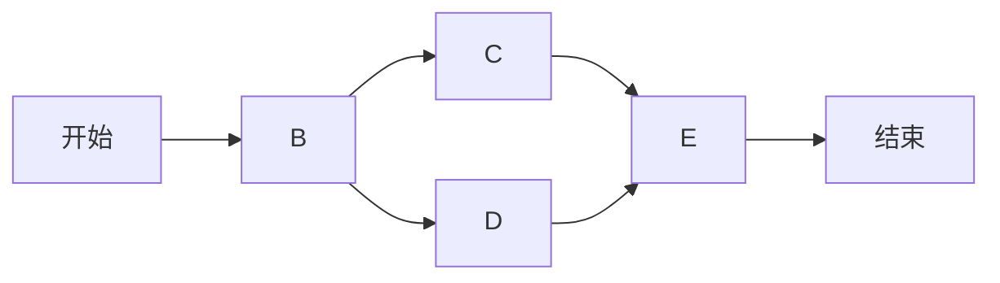

# 需求分析、项目管理、系统规划能力核心培养

## 1. 背景介绍

### 1.1 问题的由来

在当今快节奏的软件开发环境中,需求分析、项目管理和系统规划是确保项目成功的关键因素。然而,许多软件工程师和开发人员往往缺乏这些核心技能,导致项目延期、超支或最终失败。这些问题的根源在于传统的软件工程教育过于注重编码和技术细节,而忽视了需求分析、项目管理和系统规划等软技能的培养。

### 1.2 研究现状

近年来,业界和学术界都意识到了这一问题的严重性。一些公司开始在内部培训课程中加入需求分析、项目管理和系统规划的内容。同时,一些大学也开设了相关的课程或将其纳入软件工程课程的一部分。然而,这些努力往往是零散的,缺乏系统性和全面性。

### 1.3 研究意义

培养软件工程师的需求分析、项目管理和系统规划能力,对于提高软件项目的成功率、降低风险和提高效率至关重要。掌握这些技能不仅能够帮助开发人员更好地理解客户需求,制定合理的项目计划和里程碑,还能够促进跨团队协作,提高代码质量和可维护性。此外,这些技能也有助于软件工程师在职业生涯中获得更大的发展空间和晋升机会。

### 1.4 本文结构

本文将从以下几个方面深入探讨需求分析、项目管理和系统规划能力的培养:

1. 核心概念与联系
2. 核心原理和具体操作步骤
3. 数学模型和公式
4. 项目实践:代码实例和详细解释
5. 实际应用场景
6. 工具和资源推荐
7. 总结:未来发展趋势与挑战

## 2. 核心概念与联系

需求分析、项目管理和系统规划是软件开发过程中的三个关键环节,它们相互关联,缺一不可。

**需求分析**是指明确理解和记录客户或用户对系统的期望和需求。它包括收集需求、分析需求、验证需求和管理需求变更等活动。需求分析是软件开发的基础,直接影响着后续的设计、编码和测试阶段。

**项目管理**是指对软件开发项目的计划、组织、监控和控制,以确保项目按时、按质量、按预算完成。它包括制定项目计划、组建项目团队、分配资源、监控进度、管理风险等活动。良好的项目管理能够提高项目的可预测性和可控性。

**系统规划**是指对软件系统的整体架构、模块划分、接口定义和技术选型进行设计和规划。它是软件开发过程中的关键一环,直接影响着系统的可扩展性、可维护性和性能。系统规划需要考虑各种非功能性需求,如安全性、可靠性、可用性等。

这三个环节相互影响、相互依赖。需求分析为项目管理和系统规划提供了基础输入,项目管理为需求分析和系统规划提供了时间和资源约束,而系统规划则为需求分析和项目管理提供了技术路线图和架构支持。只有将这三个环节有机结合,才能确保软件开发项目的顺利进行和最终成功。

## 3. 核心算法原理 & 具体操作步骤

### 3.1 算法原理概述

需求分析、项目管理和系统规划虽然没有固定的算法,但是它们都遵循一些通用的原则和最佳实践。这些原则和实践可以被视为一种"软算法",指导我们有效地完成相应的任务。

**需求分析原理**:

- 以用户为中心:需求分析应该始终围绕用户的实际需求展开,而不是基于开发人员的假设或偏好。
- 迭代式分析:需求分析不是一次性的活动,而是一个持续的过程,需要不断地收集反馈、验证和优化需求。
- 可追溯性:每个需求都应该有明确的来源和理由,并与相关的设计和测试用例相关联,以确保需求的完整性和一致性。

**项目管理原理**:

- 分而治之:将项目分解为可管理的任务和里程碑,并合理分配资源和责任。
- 风险管理:主动识别、评估和应对项目中的各种风险,以最大限度降低风险对项目的影响。
- 持续监控:持续跟踪项目的进度、质量和成本,及时发现并解决偏差。

**系统规划原理**:

- 模块化设计:将系统划分为相对独立的模块,每个模块负责特定的功能或职责,从而提高系统的可维护性和可扩展性。
- 接口抽象:明确定义模块之间的接口,使得模块之间的依赖关系最小化,提高系统的灵活性和可重用性。
- 非功能性需求考虑:在系统规划阶段就应该充分考虑安全性、可靠性、性能等非功能性需求,而不是将它们留到最后才处理。

### 3.2 算法步骤详解

#### 需求分析步骤

1. **需求收集**:通过与利益相关方(如客户、用户、开发人员等)进行访谈、调查、观察等方式,收集原始需求。
2. **需求分析**:对收集到的原始需求进行审查、分类、优先级排序和冲突解决,形成规范化的需求文档。
3. **需求验证**:通过原型设计、用例分析、形式验证等方法,确保需求的完整性、一致性和可实现性。
4. **需求管理**:建立需求变更控制流程,对需求的变更进行评估、审批和跟踪,确保需求的可追溯性。

#### 项目管理步骤

1. **项目启动**:明确项目目标、范围、约束条件和里程碑,组建项目团队。
2. **项目计划**:根据需求和约束条件,制定项目计划,包括工作分解结构(WBS)、进度安排、资源分配等。
3. **项目执行**:按照项目计划组织实施,协调各方资源,解决问题和冲突。
4. **项目监控**:持续跟踪项目进度、质量、成本和风险,并采取纠正措施。
5. **项目收尾**:完成最终交付,进行项目评审和总结,知识转移。

#### 系统规划步骤

1. **需求分析**:深入理解系统的功能需求和非功能性需求,明确系统边界。
2. **架构设计**:根据需求,选择合适的架构模式(如分层架构、微服务架构等),划分系统的逻辑模块。
3. **模块设计**:为每个模块定义接口和职责,确定模块内部的实现细节。
4. **技术选型**:评估并选择合适的编程语言、框架、中间件、数据库等技术。
5. **非功能性设计**:设计满足安全性、可靠性、性能等非功能性需求的解决方案。

### 3.3 算法优缺点

**优点**:

- 提供了一种结构化和规范化的方法,有利于提高效率和质量。
- 强调迭代式改进,能够及时发现和解决问题。
- 注重风险管理和持续监控,有助于控制项目风险。
- 模块化设计和接口抽象提高了系统的可维护性和可扩展性。

**缺点**:

- 需要投入大量的时间和人力进行需求分析、项目管理和系统规划。
- 对团队成员的软技能要求较高,需要专门的培训和经验积累。
- 过于严格遵循流程可能会导致僵化,影响创新和灵活性。
- 系统规划阶段的决策错误可能会带来严重的后果,需要反复验证和评估。

### 3.4 算法应用领域

需求分析、项目管理和系统规划原理和步骤在软件开发领域有广泛的应用,但也可以推广到其他领域,如:

- 产品开发
- 工程建设
- 业务流程优化
- 组织变革
- 科研项目

只要是涉及复杂系统的分析、规划和管理,都可以借鉴和应用这些原理和步骤。

## 4. 数学模型和公式 & 详细讲解 & 举例说明

### 4.1 数学模型构建

在需求分析、项目管理和系统规划中,我们可以借助一些数学模型和公式来量化和优化相关的决策和过程。

#### 需求优先级模型

我们可以使用**AnalyticHierarchyProcess(AHP)**模型来确定需求的优先级。AHP是一种将复杂决策问题分解为层次结构,并通过数学计算得出最优解的方法。

在需求优先级模型中,我们可以将需求分为不同的层次,如:

- 目标层:项目的总体目标
- 准则层:评估需求优先级的标准,如重要性、紧迫性、成本等
- 方案层:具体的需求

然后,我们可以通过构建判断矩阵和计算特征向量,得到每个需求的权重,从而确定优先级。

$$
A=\begin{bmatrix}
    1       & w_{12} & \cdots & w_{1n} \
    w_{21} & 1      & \cdots & w_{2n} \
    \vdots & \vdots & \ddots & \vdots \
    w_{n1} & w_{n2} & \cdots & 1
\end{bmatrix}
$$

其中$A$是判断矩阵,$w_{ij}$表示第i个准则相对于第j个准则的重要程度。通过计算$A$的特征值和特征向量,我们可以得到每个准则的权重向量$W$。

#### 项目进度模型

在项目管理中,我们可以使用**CriticalPathMethod(CPM)**和**ProgramEvaluationandReviewTechnique(PERT)**等模型来计算关键路径和估算项目持续时间。

CPM假设每个活动的持续时间是确定的,而PERT则考虑了持续时间的不确定性,使用乐观时间、最可能时间和悲观时间的加权平均值作为估计。

对于一个包含n个活动的项目,我们可以构建如下网络模型:

其中节点表示事件,边表示活动。我们可以计算每个事件的最早发生时间(ES)和最晚发生时间(LS),以确定关键路径和总体工期。

$$
\begin{align}
ES_j &= \max\limits_{i\in P_j}\{ES_i + d_{ij}\} \
LS_j &= \min\limits_{k\in S_j}\{LS_k - d_{jk}\}
\end{align}
$$

其中$P_j$表示所有直接前驱活动的集合,$S_j$表示所有直接后继活动的集合,$d_{ij}$表示活动$(i,j)$的持续时间。

如果$ES_j = LS_j$,则活动$(i,j)$位于关键路径上。

### 4.2 公式推导过程

以AHP需求优先级模型为例,我们可以推导出计算准则权重的过程。

首先,我们构建判断矩阵$A$,其中$a_{ij}$表示第i个准则相对于第j个准则的重要程度。根据矩阵的性质,我们有:

$$
a_{ij} = \frac{1}{a_{ji}}, \quad a_{ii} = 1
$$

我们希望找到一个权重向量$W = (w_1, w_2, \cdots, w_n)^T$,使得:

$$
AW = nW
$$

即$W$是$A$的特征向量,对应的特征值是$n$。

我们可以将上式改写为:

$$
(A - nI)W = 0
$$

由于$A$是一个正reciprocal矩阵,根据Perron-Frobenius定理,它有一个最大特征值$\lambda_{max}$,对应的特征向量的分量都是正数。

我们可以通过计算$A$的特征值和特征向量,找到最大特征值$\lambda_{max}$对应的特征向量,将其归一化后即可得到权重向量$W$。

$$
W = \frac{1}{\sum\limits_{i=1}^n w_i} \begin{pmatrix}