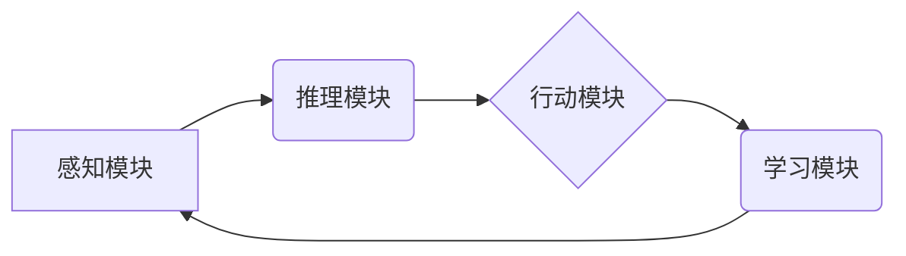

# AI Agent: AI的下一个风口 下一代软件可以不必是软件

> 关键词：

> AI Agent, 智能代理, 软件架构,  人工智能,  下一代软件,  无代码开发,  自动化

## 1. 背景介绍

软件行业正处于一个前所未有的变革时期。随着人工智能 (AI) 技术的飞速发展，传统的软件开发模式面临着前所未有的挑战。传统的软件开发流程依赖于人类编写代码，这不仅耗时耗力，而且难以应对复杂系统的需求。

AI Agent 作为一种新兴的软件开发模式，正在改变软件开发的格局。AI Agent 是一种能够自主学习、推理和决策的软件实体，它可以自动生成代码、测试代码和部署代码，从而极大地提高软件开发效率和质量。

## 2. 核心概念与联系

**2.1 AI Agent 的定义**

AI Agent 是一种能够感知环境、做出决策并执行行动的智能实体。它可以是软件程序、机器人或其他类型的智能系统。AI Agent 的核心特征包括：

* **自主性:** AI Agent 可以独立完成任务，无需人类干预。
* **学习能力:** AI Agent 可以从经验中学习，不断改进自己的性能。
* **推理能力:** AI Agent 可以根据已有的知识和信息进行推理，做出合理的决策。
* **交互性:** AI Agent 可以与环境和用户进行交互，获取信息和反馈。

**2.2 AI Agent 与软件开发的关系**

AI Agent 可以被看作是一种新型的软件开发工具。它可以帮助开发人员自动化许多重复性的任务，例如代码生成、测试和部署。

**2.3 AI Agent 的架构**

AI Agent 的架构通常包括以下几个部分：

* **感知模块:** 用于感知环境信息，例如用户输入、传感器数据等。
* **推理模块:** 用于根据感知到的信息进行推理，做出决策。
* **行动模块:** 用于执行决策，例如控制机器人、生成代码等。
* **学习模块:** 用于从经验中学习，不断改进自己的性能。



## 3. 核心算法原理 & 具体操作步骤

**3.1 算法原理概述**

AI Agent 的核心算法原理包括机器学习、深度学习、自然语言处理等。

* **机器学习:**  AI Agent 可以通过学习从数据中提取模式和规律，从而提高其决策能力。
* **深度学习:**  深度学习是一种更高级的机器学习方法，它使用多层神经网络来模拟人类大脑的学习过程。
* **自然语言处理:**  自然语言处理 (NLP) 允许 AI Agent 理解和生成人类语言，从而与用户进行更自然的交互。

**3.2 算法步骤详解**

AI Agent 的开发流程通常包括以下几个步骤：

1. **数据收集和预处理:** 收集相关数据并进行预处理，例如清洗、转换和特征提取。
2. **模型选择和训练:** 选择合适的机器学习模型，并使用训练数据对其进行训练。
3. **模型评估和优化:** 使用测试数据评估模型的性能，并根据评估结果进行模型优化。
4. **部署和监控:** 将训练好的模型部署到实际环境中，并进行持续监控和维护。

**3.3 算法优缺点**

**优点:**

* **自动化:** AI Agent 可以自动化许多重复性的任务，提高开发效率。
* **智能化:** AI Agent 可以根据环境和用户需求做出智能决策。
* **可扩展性:** AI Agent 可以轻松扩展到处理更复杂的任务。

**缺点:**

* **数据依赖:** AI Agent 的性能取决于训练数据的质量。
* **解释性:** AI Agent 的决策过程可能难以解释，这可能会导致信任问题。
* **安全风险:** AI Agent 的恶意利用可能会带来安全风险。

**3.4 算法应用领域**

AI Agent 的应用领域非常广泛，包括：

* **软件开发:** 自动生成代码、测试代码和部署代码。
* **客户服务:** 提供智能客服，自动回答用户问题。
* **医疗保健:** 辅助医生诊断疾病、制定治疗方案。
* **金融服务:** 进行风险评估、欺诈检测。

## 4. 数学模型和公式 & 详细讲解 & 举例说明

**4.1 数学模型构建**

AI Agent 的行为可以被建模为马尔可夫决策过程 (MDP)。MDP 由以下几个要素组成：

* **状态空间 (S):** AI Agent 可能处于的所有状态。
* **动作空间 (A):** AI Agent 可以执行的所有动作。
* **转移概率 (P):** 从一个状态执行一个动作后转移到另一个状态的概率。
* **奖励函数 (R):** AI Agent 在每个状态执行每个动作获得的奖励。

**4.2 公式推导过程**

MDP 的目标是找到一个策略 (π)，使得 AI Agent 在长期的交互过程中获得最大的总奖励。策略 π 是一个映射关系，将每个状态映射到一个动作。

Bellman 方程是 MDP 的核心公式，它描述了状态价值函数 (V) 的更新规则：

$$V(s) = \max_a \left[ R(s, a) + \gamma \sum_{s'} P(s' | s, a) V(s') \right]$$

其中：

* $V(s)$ 是状态 $s$ 的价值函数。
* $R(s, a)$ 是在状态 $s$ 执行动作 $a$ 获得的奖励。
* $\gamma$ 是折扣因子，控制未来奖励的权重。
* $P(s' | s, a)$ 是从状态 $s$ 执行动作 $a$ 转移到状态 $s'$ 的概率。

**4.3 案例分析与讲解**

例如，考虑一个 AI Agent 在玩游戏中的场景。

* 状态空间：游戏中的所有游戏状态。
* 动作空间：游戏中的所有可执行动作，例如移动、攻击、使用道具等。
* 转移概率：执行一个动作后进入下一个状态的概率。
* 奖励函数：在某个状态获得奖励，例如击杀敌人、收集物品等。

通过使用 Bellman 方程，AI Agent 可以学习到一个策略，使得它在游戏中获得尽可能高的分数。

## 5. 项目实践：代码实例和详细解释说明

**5.1 开发环境搭建**

AI Agent 的开发环境通常包括以下软件：

* Python 编程语言
* TensorFlow 或 PyTorch 深度学习框架
* Jupyter Notebook 或 VS Code 代码编辑器

**5.2 源代码详细实现**

以下是一个简单的 AI Agent 代码示例，使用 TensorFlow 框架实现一个简单的 Q-learning 算法：

```python
import tensorflow as tf

# 定义 Q-网络
model = tf.keras.Sequential([
    tf.keras.layers.Dense(64, activation='relu'),
    tf.keras.layers.Dense(64, activation='relu'),
    tf.keras.layers.Dense(num_actions)
])

# 定义损失函数和优化器
loss_fn =
 tf.keras.losses.MeanSquaredError()
optimizer = tf.keras.optimizers.Adam()

# 训练 Q-网络
for episode in range(num_episodes):
    # ... (游戏环境交互逻辑)
    # 计算 Q-值
    q_values = model(state)
    # 选择动作
    action = tf.argmax(q_values, axis=1)
    # 执行动作
    next_state, reward, done = env.step(action)
    # 更新 Q-值
    with tf.GradientTape() as tape:
        target_q_values = reward + gamma * tf.reduce_max(model(next_state), axis=1)
        loss = loss_fn(target_q_values, q_values)
    gradients = tape.gradient(loss, model.trainable_variables)
    optimizer.apply_gradients(zip(gradients, model.trainable_variables))
    # ... (其他游戏逻辑)

```

**5.3 代码解读与分析**

这段代码实现了 Q-learning 算法，用于训练一个 AI Agent 在游戏环境中学习策略。

* Q-网络是一个深度神经网络，用于估计每个状态下每个动作的 Q-值。
* 损失函数用于衡量 Q-网络的预测误差。
* 优化器用于更新 Q-网络的参数，使其能够更好地预测 Q-值。
* 训练过程通过与游戏环境交互，收集数据并更新 Q-网络的参数。

**5.4 运行结果展示**

训练好的 AI Agent 可以被部署到游戏环境中，并执行学习到的策略。

## 6. 实际应用场景

**6.1 软件开发**

AI Agent 可以自动生成代码、测试代码和部署代码，从而极大地提高软件开发效率和质量。例如，可以使用 AI Agent 自动生成 CRUD 操作的代码，或者自动测试代码中的 bug。

**6.2 客户服务**

AI Agent 可以提供智能客服，自动回答用户问题，例如常见问题解答、订单查询等。

**6.3 医疗保健**

AI Agent 可以辅助医生诊断疾病、制定治疗方案，例如根据患者的症状和病史，推荐可能的诊断结果和治疗方案。

**6.4 未来应用展望**

AI Agent 的应用场景还在不断扩展，未来可能会应用于更多领域，例如教育、金融、交通等。

## 7. 工具和资源推荐

**7.1 学习资源推荐**

* **书籍:**
    * 《Reinforcement Learning: An Introduction》 by Richard S. Sutton and Andrew G. Barto
    * 《Deep Learning》 by Ian Goodfellow, Yoshua Bengio, and Aaron Courville
* **在线课程:**
    * Coursera: Reinforcement Learning Specialization
    * Udacity: Deep Learning Nanodegree

**7.2 开发工具推荐**

* **TensorFlow:** https://www.tensorflow.org/
* **PyTorch:** https://pytorch.org/
* **Jupyter Notebook:** https://jupyter.org/
* **VS Code:** https://code.visualstudio.com/

**7.3 相关论文推荐**

* **Deep Q-Network (DQN):** https://arxiv.org/abs/1312.5602
* **Proximal Policy Optimization (PPO):** https://arxiv.org/abs/1707.06347

## 8. 总结：未来发展趋势与挑战

**8.1 研究成果总结**

AI Agent 技术近年来取得了显著进展，在许多领域取得了成功应用。

**8.2 未来发展趋势**

未来 AI Agent 技术的发展趋势包括：

* **更强大的学习能力:** AI Agent 将能够学习更复杂的任务，并从更少的数据中学习。
* **更强的解释性:** AI Agent 的决策过程将更加透明，更容易被理解。
* **更广泛的应用场景:** AI Agent 将应用于更多领域，例如自动驾驶、机器人、医疗保健等。

**8.3 面临的挑战**

AI Agent 技术也面临着一些挑战，例如：

* **数据安全:** AI Agent 的训练数据可能包含敏感信息，需要确保数据安全。
* **伦理问题:** AI Agent 的决策可能会产生伦理问题，需要制定相应的伦理规范。
* **可解释性:** AI Agent 的决策过程可能难以解释，需要提高其可解释性。

**8.4 研究展望**

未来研究方向包括：

* **开发更强大的学习算法:** 研究更有效的学习算法，使 AI Agent 能够学习更复杂的任务。
* **提高 AI Agent 的可解释性:** 研究方法提高 AI Agent 的决策可解释性，使其决策更加透明。
* **解决 AI Agent 的伦理问题:** 研究 AI Agent 的伦理问题，制定相应的伦理规范。

## 9. 附录：常见问题与解答

**9.1 如何选择合适的 AI Agent 算法？**

选择合适的 AI Agent 算法取决于具体的应用场景和任务需求。例如，对于简单的任务，可以使用 Q-learning 算法；对于更复杂的任务，可以使用 DQN 算法或 PPO 算法。

**9.2 如何训练 AI Agent？**

训练 AI Agent 需要准备训练数据、选择合适的算法和模型，并使用训练数据训练模型。

**9.3 如何部署 AI Agent？**

部署 AI Agent 可以将其部署到云端、边缘设备或其他硬件平台。

**9.4 AI Agent 是否会取代人类？**

AI Agent 可以自动化许多任务，但它并不会完全取代人类。人类仍然需要负责制定策略、监督 AI Agent 的工作，以及解决 AI Agent 无法解决的问题。


作者：禅与计算机程序设计艺术 / Zen and the Art of Computer Programming