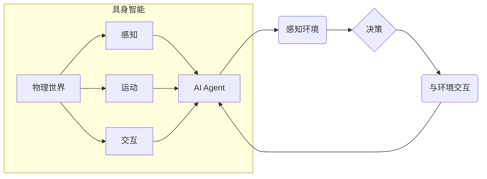

> AI Agent, 智能体, 具身智能, 强化学习, 决策推理, 认知科学, 人工智能

## 1. 背景介绍

人工智能（AI）技术近年来取得了飞速发展，从语音识别、图像识别到自然语言处理，AI已经渗透到我们生活的方方面面。然而，我们离真正意义上的通用人工智能（AGI）还有很长的路要走。

当前主流的AI模型大多是基于数据驱动的，它们通过学习海量数据来识别模式并做出预测。然而，这种模式识别能力在面对复杂、动态的环境时往往显得捉襟见肘。

为了突破这一瓶颈，智能体（AI Agent）的概念应运而生。智能体是一种能够感知环境、做出决策并与环境交互的智能系统。它不仅能够识别模式，更重要的是能够根据环境的变化灵活调整策略，并最终实现预设的目标。

## 2. 核心概念与联系

**2.1 智能体（AI Agent）**

智能体是人工智能领域的核心概念之一，它是一个能够感知环境、做出决策并与环境交互的智能系统。智能体可以是软件程序、机器人或其他任何能够执行任务的实体。

**2.2 具身智能（Embodied Intelligence）**

具身智能是指将智能体与物理世界相结合，使其能够感知和操作物理环境的智能。具身智能强调智能体的感知能力、运动能力和交互能力，认为智能的本质是与环境的互动和协作。

**2.3 关系图**



**2.4 联系**

智能体与具身智能之间存在着密切的联系。具身智能是智能体的一种特殊形式，它赋予智能体感知和操作物理世界的能力，从而使其能够更好地理解和应对复杂的环境。

## 3. 核心算法原理 & 具体操作步骤

**3.1 算法原理概述**

智能体通常采用强化学习（Reinforcement Learning，RL）算法进行训练。强化学习是一种机器学习方法，它通过奖励和惩罚机制来训练智能体，使其能够在与环境交互的过程中学习最优策略。

**3.2 算法步骤详解**

1. **环境建模:** 首先需要建立一个环境模型，该模型描述了智能体所处的环境以及环境中可执行的动作。
2. **状态空间定义:** 定义智能体在环境中可能存在的各种状态，每个状态都对应着环境的当前情况。
3. **动作空间定义:** 定义智能体可以执行的各种动作，每个动作都会导致环境状态发生变化。
4. **奖励函数设计:** 设计一个奖励函数，该函数将根据智能体的动作和环境状态分配奖励或惩罚。
5. **策略学习:** 使用强化学习算法，例如Q-learning或Deep Q-Network（DQN），训练智能体学习一个策略，该策略能够在不同状态下选择最优动作，从而最大化累积奖励。

**3.3 算法优缺点**

**优点:**

* 能够学习复杂、动态的环境
* 不需要明确的规则和知识
* 可以通过不断与环境交互进行学习和改进

**缺点:**

* 训练过程可能需要大量的时间和资源
* 奖励函数的设计至关重要，如果设计不当，可能会导致智能体学习到不期望的行为

**3.4 算法应用领域**

* 机器人控制
* 游戏人工智能
* 自动驾驶
* 金融交易
* 医疗诊断

## 4. 数学模型和公式 & 详细讲解 & 举例说明

**4.1 数学模型构建**

智能体与环境的交互过程可以用马尔可夫决策过程（Markov Decision Process，MDP）模型来描述。

MDP模型包含以下几个要素：

* 状态空间 S：智能体可能存在的各种状态。
* 动作空间 A：智能体可以执行的各种动作。
* 转移概率矩阵 P：描述从一个状态执行一个动作后转移到另一个状态的概率。
* 奖励函数 R：描述在某个状态执行某个动作后获得的奖励。
* 折扣因子 γ：控制未来奖励的权重。

**4.2 公式推导过程**

智能体的目标是找到一个策略 π，该策略能够最大化累积奖励。

最大化累积奖励的数学公式如下：

$$
V^{\pi}(s) = \max_{\pi} \sum_{t=0}^{\infty} \gamma^t R(s_t, a_t)
$$

其中：

* $V^{\pi}(s)$ 是策略 π 下状态 s 的价值函数。
* $R(s_t, a_t)$ 是在状态 $s_t$ 执行动作 $a_t$ 后获得的奖励。
* $\gamma$ 是折扣因子。

**4.3 案例分析与讲解**

例如，在一个简单的迷宫环境中，智能体的目标是找到通往出口的路径。

* 状态空间 S：迷宫中的每个格子。
* 动作空间 A：向上、向下、向左、向右四个方向。
* 转移概率矩阵 P：描述从一个格子移动到另一个格子的概率。
* 奖励函数 R：到达出口时获得最大奖励，其他情况下获得较小的奖励。

通过强化学习算法，智能体可以学习到一个策略，该策略能够在迷宫中找到最优路径，从而最大化累积奖励。

## 5. 项目实践：代码实例和详细解释说明

**5.1 开发环境搭建**

* Python 3.x
* TensorFlow 或 PyTorch 深度学习框架
* OpenAI Gym 或其他强化学习环境

**5.2 源代码详细实现**

```python
import gym
import tensorflow as tf

# 定义智能体模型
class Agent(tf.keras.Model):
    def __init__(self):
        super(Agent, self).__init__()
        # 定义神经网络结构
        self.dense1 = tf.keras.layers.Dense(64, activation='relu')
        self.dense2 = tf.keras.layers.Dense(32, activation='relu')
        self.output = tf.keras.layers.Dense(4, activation='softmax')

    def call(self, state):
        x = self.dense1(state)
        x = self.dense2(x)
        return self.output(x)

# 创建智能体实例
agent = Agent()

# 定义强化学习算法
def train(env, agent, epochs=1000):
    for epoch in range(epochs):
        state = env.reset()
        done = False
        while not done:
            # 选择动作
            action = agent(state)
            # 执行动作
            next_state, reward, done, _ = env.step(action)
            # 更新智能体模型
            agent.train_on_batch(state, reward)
            # 更新状态
            state = next_state

# 训练智能体
train(gym.make('CartPole-v1'), agent)

# 测试智能体
state = env.reset()
while True:
    action = agent(state)
    state, reward, done, _ = env.step(action)
    env.render()
    if done:
        break
```

**5.3 代码解读与分析**

* 代码首先定义了一个智能体模型，该模型是一个简单的多层感知机。
* 然后定义了一个强化学习算法，该算法使用梯度下降法更新智能体模型的权重。
* 训练过程是通过与环境交互来学习的，智能体会根据环境的反馈调整自己的策略。
* 测试过程是通过让智能体与环境交互，并观察其行为。

**5.4 运行结果展示**

运行代码后，智能体将在 CartPole 环境中学习平衡杆的行为。

## 6. 实际应用场景

**6.1 机器人控制**

智能体可以用于控制机器人，使其能够自主完成各种任务，例如导航、抓取、组装等。

**6.2 游戏人工智能**

智能体可以用于开发游戏中的 AI 敌人，使其能够做出更智能、更具挑战性的行为。

**6.3 自动驾驶**

智能体可以用于开发自动驾驶系统，使其能够感知周围环境并做出安全、高效的驾驶决策。

**6.4 金融交易**

智能体可以用于开发金融交易系统，使其能够根据市场变化自动进行交易，并最大化收益。

**6.5 医疗诊断**

智能体可以用于辅助医生进行医疗诊断，例如分析医学图像、预测疾病风险等。

**6.6 未来应用展望**

随着人工智能技术的不断发展，智能体将在更多领域得到应用，例如个性化教育、智能家居、智慧城市等。

## 7. 工具和资源推荐

**7.1 学习资源推荐**

* 强化学习：强化学习：算法、策略和应用
* 深度强化学习：深度强化学习
* OpenAI Gym：https://gym.openai.com/

**7.2 开发工具推荐**

* TensorFlow：https://www.tensorflow.org/
* PyTorch：https://pytorch.org/

**7.3 相关论文推荐**

* Deep Q-Network (DQN)
* Proximal Policy Optimization (PPO)
* Trust Region Policy Optimization (TRPO)

## 8. 总结：未来发展趋势与挑战

**8.1 研究成果总结**

近年来，智能体领域取得了显著进展，例如DQN、PPO等算法的提出，以及在游戏、机器人控制等领域的成功应用。

**8.2 未来发展趋势**

* **更强大的计算能力:** 随着计算能力的提升，智能体能够处理更复杂的环境和任务。
* **更丰富的感知能力:** 智能体将能够感知更多种类的信息，例如图像、声音、文本等。
* **更强的推理能力:** 智能体将能够进行更复杂的推理和决策，例如规划、预测、解释等。
* **更安全的智能体:** 如何确保智能体的安全性和可靠性是未来研究的重要方向。

**8.3 面临的挑战**

* **数据获取和标注:** 强化学习算法需要大量的训练数据，而获取和标注高质量的数据仍然是一个挑战。
* **算法效率:** 训练智能体通常需要很长时间，如何提高算法效率是未来研究的重要方向。
* **可解释性:** 智能体的决策过程往往难以理解，如何提高智能体的可解释性是未来研究的重要方向。

**8.4 研究展望**

未来，智能体将朝着更智能、更安全、更可解释的方向发展，并将在更多领域发挥重要作用。


## 9. 附录：常见问题与解答

**9.1 Q: 什么是智能体？**

**A:** 智能体是一种能够感知环境、做出决策并与环境交互的智能系统。

**9.2 Q: 智能体与传统AI有什么区别？**

**A:** 传统AI主要依赖于规则和知识，而智能体则通过与环境交互学习，并能够适应变化的环境。

**9.3 Q: 强化学习是什么？**

**A:** 强化学习是一种机器学习方法，它通过奖励和惩罚机制来训练智能体，使其能够学习最优策略。

**9.4 Q: 智能体有哪些应用场景？**

**A:** 智能体可以应用于机器人控制、游戏人工智能、自动驾驶、金融交易、医疗诊断等领域。


作者：禅与计算机程序设计艺术 / Zen and the Art of Computer Programming 
<end_of_turn>