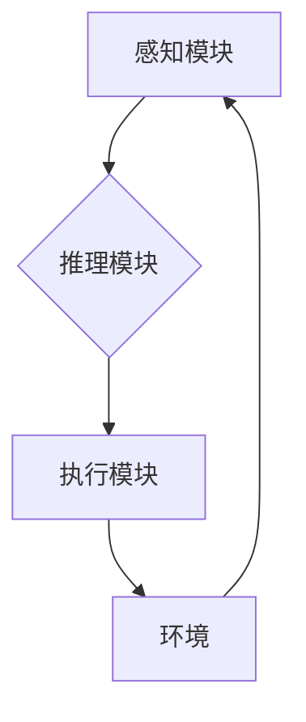

> AI Agent, 生产力提升, 智能自动化, 机器学习, 深度学习, 自然语言处理

## 1. 背景介绍

在当今数字化时代，人工智能（AI）正以惊人的速度发展，深刻地改变着我们生活的方方面面。其中，AI Agent作为人工智能领域的重要分支，凭借其自主学习、决策和执行任务的能力，展现出巨大的潜力，为生产力的提升提供了新的机遇。

传统生产模式往往依赖于人工操作和流程，效率低下，容易出现人为错误。而AI Agent能够通过自动化执行重复性任务、优化流程、提供数据分析和决策支持等方式，显著提高生产效率和降低成本。

## 2. 核心概念与联系

**2.1 AI Agent的概念**

AI Agent是一种能够感知环境、做出决策并执行行动的智能体。它通常由以下几个核心组件组成：

* **感知模块:** 收集环境信息，例如传感器数据、文本、图像等。
* **推理模块:** 分析感知到的信息，做出决策和计划。
* **执行模块:** 执行决策，与环境进行交互。
* **学习模块:** 从经验中学习，不断改进决策和行为。

**2.2 AI Agent与生产力提升的联系**

AI Agent能够通过以下方式提升生产力：

* **自动化执行重复性任务:** AI Agent可以自动执行重复性、规则性任务，例如数据录入、文件处理、客户服务等，解放人力，提高效率。
* **优化流程:** AI Agent可以分析现有流程，识别瓶颈和冗余环节，并提出优化方案，提高流程效率。
* **提供数据分析和决策支持:** AI Agent可以收集和分析大量数据，提供数据驱动的决策支持，帮助企业做出更明智的决策。
* **个性化服务:** AI Agent可以根据用户的需求和喜好，提供个性化的服务，例如推荐产品、提供定制化解决方案等。

**2.3 AI Agent的架构**



## 3. 核心算法原理 & 具体操作步骤

**3.1 算法原理概述**

AI Agent的决策和行为通常基于机器学习算法。常见的机器学习算法包括：

* **监督学习:** 利用标记数据训练模型，预测未来结果。例如，分类、回归等。
* **无监督学习:** 从未标记数据中发现模式和结构。例如，聚类、降维等。
* **强化学习:** 通过试错学习，最大化奖励。例如，游戏AI、机器人控制等。

**3.2 算法步骤详解**

以监督学习为例，其基本步骤如下：

1. **数据收集和预处理:** 收集相关数据，并进行清洗、转换、特征工程等预处理。
2. **模型选择:** 根据任务需求选择合适的模型，例如线性回归、决策树、支持向量机等。
3. **模型训练:** 利用标记数据训练模型，调整模型参数，使其能够准确预测未来结果。
4. **模型评估:** 使用测试数据评估模型的性能，例如准确率、召回率、F1-score等。
5. **模型部署:** 将训练好的模型部署到实际应用场景中，用于预测和决策。

**3.3 算法优缺点**

* **优点:** 能够学习复杂关系，自动发现模式，提高预测精度。
* **缺点:** 需要大量标记数据，训练时间长，容易过拟合。

**3.4 算法应用领域**

* **图像识别:** 人脸识别、物体检测、图像分类等。
* **自然语言处理:** 文本分类、情感分析、机器翻译等。
* **推荐系统:** 商品推荐、内容推荐、用户画像等。
* **预测分析:** 销售预测、风险评估、故障诊断等。

## 4. 数学模型和公式 & 详细讲解 & 举例说明

**4.1 数学模型构建**

假设我们有一个分类问题，目标是将数据点分类到不同的类别中。我们可以使用逻辑回归模型来构建数学模型。

逻辑回归模型的输出是一个概率值，表示数据点属于某个类别的概率。该概率值通过sigmoid函数计算得到：

$$
p(y=1|x) = \frac{1}{1 + e^{-(w^T x + b)}}
$$

其中：

* $p(y=1|x)$ 是数据点 $x$ 属于类别 1 的概率。
* $w$ 是模型参数，代表特征的权重。
* $x$ 是数据点的特征向量。
* $b$ 是模型参数，代表偏置项。

**4.2 公式推导过程**

逻辑回归模型的目标是最大化似然函数，即最大化所有数据点属于其预测类别的概率的乘积。

$$
L(w,b) = \prod_{i=1}^{n} p(y_i|x_i)^{y_i} (1-p(y_i|x_i))^{(1-y_i)}
$$

其中：

* $n$ 是数据点的数量。
* $y_i$ 是第 $i$ 个数据点的真实类别。

通过对数似然函数，可以将乘积转化为求和，方便求解：

$$
l(w,b) = \sum_{i=1}^{n} [y_i \log(p(y_i|x_i)) + (1-y_i) \log(1-p(y_i|x_i))]
$$

**4.3 案例分析与讲解**

假设我们有一个数据集，包含关于学生的学习成绩和学习时间的信息。我们想要预测学生的学习成绩是否优秀。

我们可以使用逻辑回归模型，将学习时间作为特征，预测学生是否优秀。通过训练模型，我们可以得到模型参数 $w$ 和 $b$。

然后，我们可以使用这些参数预测新的学生的学习成绩是否优秀。例如，如果一个学生的学习时间为 10 小时，我们可以使用公式计算出其学习成绩优秀概率。

## 5. 项目实践：代码实例和详细解释说明

**5.1 开发环境搭建**

* Python 3.x
* TensorFlow 或 PyTorch 等深度学习框架
* Jupyter Notebook 或 VS Code 等开发环境

**5.2 源代码详细实现**

```python
import tensorflow as tf

# 定义模型
model = tf.keras.models.Sequential([
    tf.keras.layers.Dense(128, activation='relu', input_shape=(10,)),
    tf.keras.layers.Dense(64, activation='relu'),
    tf.keras.layers.Dense(1, activation='sigmoid')
])

# 编译模型
model.compile(optimizer='adam',
              loss='binary_crossentropy',
              metrics=['accuracy'])

# 训练模型
model.fit(x_train, y_train, epochs=10)

# 评估模型
loss, accuracy = model.evaluate(x_test, y_test)
print('Loss:', loss)
print('Accuracy:', accuracy)
```

**5.3 代码解读与分析**

* 我们使用 TensorFlow 框架构建了一个简单的逻辑回归模型。
* 模型包含三个全连接层，分别有 128、64 和 1 个神经元。
* 激活函数使用 ReLU 函数，输出层使用 sigmoid 函数，用于生成概率值。
* 我们使用 Adam 优化器，损失函数为二分类交叉熵，评估指标为准确率。
* 我们使用训练数据训练模型，并使用测试数据评估模型性能。

**5.4 运行结果展示**

训练完成后，我们可以查看模型的损失值和准确率。

## 6. 实际应用场景

**6.1 工业自动化**

AI Agent可以自动执行生产线上的重复性任务，例如装配、焊接、搬运等，提高生产效率和降低成本。

**6.2 金融服务**

AI Agent可以用于风险评估、欺诈检测、客户服务等，提高金融服务的效率和安全性。

**6.3 医疗保健**

AI Agent可以辅助医生诊断疾病、制定治疗方案、管理患者信息等，提高医疗服务的质量和效率。

**6.4 教育培训**

AI Agent可以提供个性化的学习辅导、自动批改作业、评估学生学习进度等，提高教育培训的效率和效果。

**6.5 未来应用展望**

随着人工智能技术的不断发展，AI Agent将在更多领域得到应用，例如：

* 智能家居：自动控制家电、调节环境温度、提供个性化服务等。
* 自动驾驶：自动驾驶汽车、无人机等。
* 人机交互：更自然、更智能的人机交互方式。

## 7. 工具和资源推荐

**7.1 学习资源推荐**

* **书籍:**
    * 《人工智能：现代方法》
    * 《深度学习》
    * 《机器学习》
* **在线课程:**
    * Coursera
    * edX
    * Udacity

**7.2 开发工具推荐**

* **Python:** 
    * TensorFlow
    * PyTorch
    * scikit-learn
* **其他工具:**
    * Jupyter Notebook
    * VS Code

**7.3 相关论文推荐**

* **Reinforcement Learning: An Introduction**
* **Deep Learning**
* **A Survey of Transfer Learning**

## 8. 总结：未来发展趋势与挑战

**8.1 研究成果总结**

近年来，AI Agent领域取得了显著进展，例如：

* **模型性能提升:** 深度学习算法的不断发展，使得 AI Agent 的性能大幅提升。
* **应用场景拓展:** AI Agent 的应用场景不断拓展，覆盖了多个领域。
* **开源工具发展:** 越来越多的开源工具和平台，推动了 AI Agent 的发展。

**8.2 未来发展趋势**

* **更智能的 AI Agent:** 能够更好地理解和响应人类需求，具备更强的自主学习和决策能力。
* **更广泛的应用场景:** AI Agent 将应用于更多领域，例如医疗保健、教育培训、智能家居等。
* **更安全的 AI Agent:** 确保 AI Agent 的安全性和可靠性，防止其被恶意利用。

**8.3 面临的挑战**

* **数据获取和隐私保护:** AI Agent 的训练需要大量数据，如何获取高质量数据并保护用户隐私是一个挑战。
* **算法解释性和可信度:** AI Agent 的决策过程往往难以解释，如何提高算法的透明度和可信度是一个重要问题。
* **伦理和社会影响:** AI Agent 的发展可能带来一些伦理和社会问题，例如就业替代、算法偏见等，需要引起重视和讨论。

**8.4 研究展望**

未来，AI Agent 研究将继续朝着更智能、更安全、更可解释的方向发展。

## 9. 附录：常见问题与解答

**9.1 如何选择合适的 AI Agent 模型？**

选择合适的 AI Agent 模型需要根据具体任务需求和数据特点进行选择。例如，对于分类任务，可以使用逻辑回归、支持向量机等模型；对于预测任务，可以使用线性回归、决策树等模型。

**9.2 如何训练和评估 AI Agent 模型？**

训练和评估 AI Agent 模型需要使用训练数据和测试数据。训练数据用于训练模型，测试数据用于评估模型性能。常用的评估指标包括准确率、召回率、F1-score等。

**9.3 如何部署 AI Agent 模型？**

部署 AI Agent 模型可以将其集成到应用程序中，或者将其部署到云平台上。

作者：禅与计算机程序设计艺术 / Zen and the Art of Computer Programming


<end_of_turn>