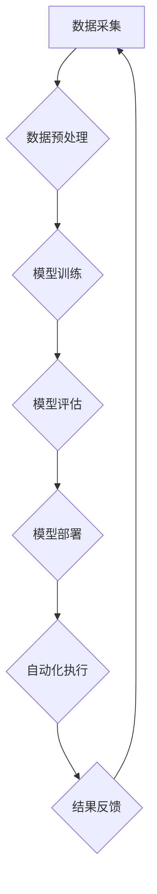

>  人工智能，自动化，深度学习，机器学习，自然语言处理，计算机视觉，机器人技术，自动化时代

## 1. 背景介绍

人工智能（AI）技术近年来发展迅速，从最初的局限于特定领域的应用，逐渐发展到涵盖各个领域的广泛应用。随着深度学习算法的突破和计算能力的提升，AI技术已经进入了一个新的发展阶段——AI2.0时代。

AI2.0时代的特点是：

* **更强的泛化能力:** AI2.0模型能够从更少的数据中学习，并应用于更广泛的场景。
* **更强的解释性:** AI2.0模型的决策过程更加透明，更容易被人类理解。
* **更强的交互性:** AI2.0模型能够与人类进行更自然的交互，例如对话、协作等。
* **更强的自主性:** AI2.0模型能够自主学习和进化，不断提升自己的能力。

AI2.0时代的到来将深刻地改变我们的生活和工作方式，自动化将成为一个不可避免的趋势。

## 2. 核心概念与联系

**2.1 自动化**

自动化是指利用技术手段，使生产、工作或其他过程自动进行，减少或消除人工干预的过程。

**2.2 人工智能**

人工智能是指模拟人类智能的计算机系统。人工智能技术包括机器学习、深度学习、自然语言处理、计算机视觉等。

**2.3 AI2.0时代**

AI2.0时代是指人工智能技术进入了一个新的发展阶段，其特点是更强的泛化能力、更强的解释性、更强的交互性和更强的自主性。

**2.4 自动化时代的来临**

随着AI2.0技术的不断发展，自动化将成为一个不可避免的趋势。自动化将应用于各个领域，例如制造业、金融业、医疗保健业等。

**2.5  AI2.0时代自动化流程图**



## 3. 核心算法原理 & 具体操作步骤

**3.1 算法原理概述**

深度学习算法是AI2.0时代的核心算法之一。深度学习算法是一种基于多层神经网络的机器学习算法。

**3.2 算法步骤详解**

1. **数据准备:** 收集和预处理数据，例如清洗数据、特征工程等。
2. **模型构建:** 设计和构建多层神经网络模型。
3. **模型训练:** 使用训练数据训练模型，调整模型参数，使模型能够准确地预测输出。
4. **模型评估:** 使用测试数据评估模型的性能，例如准确率、召回率等。
5. **模型部署:** 将训练好的模型部署到实际应用场景中。

**3.3 算法优缺点**

**优点:**

* 能够从海量数据中学习到复杂的特征。
* 泛化能力强，能够应用于不同的场景。
* 性能优异，能够达到人类水平甚至超越人类水平。

**缺点:**

* 训练数据量大，需要大量的计算资源。
* 模型解释性差，难以理解模型的决策过程。
* 容易受到数据偏差的影响。

**3.4 算法应用领域**

深度学习算法应用于各个领域，例如：

* **计算机视觉:** 图像识别、物体检测、图像分割等。
* **自然语言处理:** 文本分类、机器翻译、语音识别等。
* **推荐系统:** 商品推荐、内容推荐等。
* **医疗诊断:** 疾病诊断、影像分析等。

## 4. 数学模型和公式 & 详细讲解 & 举例说明

**4.1 数学模型构建**

深度学习模型通常由多层神经网络组成，每层神经网络由多个神经元组成。每个神经元接收来自上一层的输入，并通过激活函数进行处理，输出到下一层。

**4.2 公式推导过程**

深度学习模型的训练过程是通过反向传播算法来实现的。反向传播算法的核心思想是：

1. 计算模型输出与真实值的误差。
2. 根据误差反向传播，更新每个神经元的权重和偏置。

**4.3 案例分析与讲解**

例如，在图像识别任务中，深度学习模型可以学习到图像中不同物体特征的表示。

**假设我们有一个包含10个神经元的隐藏层，每个神经元接收来自上一层的输入，并通过ReLU激活函数进行处理。**

**ReLU激活函数的公式如下：**

$$
f(x) = max(0, x)
$$

**其中，x是输入值。**

**隐藏层神经元的输出可以表示为：**

$$
h_i = f(w_i^T x + b_i)
$$

**其中，$w_i$是第i个神经元的权重向量，$b_i$是第i个神经元的偏置，$x$是上一层的输入向量。**

**4.4  数学公式举例说明**

**损失函数:**

$$
L = \frac{1}{N} \sum_{i=1}^{N} (y_i - \hat{y}_i)^2
$$

**其中，$N$是样本数量，$y_i$是真实值，$\hat{y}_i$是模型预测值。**

**梯度下降算法:**

$$
\theta = \theta - \alpha \nabla L(\theta)
$$

**其中，$\theta$是模型参数，$\alpha$是学习率，$\nabla L(\theta)$是损失函数的梯度。**

## 5. 项目实践：代码实例和详细解释说明

**5.1 开发环境搭建**

* Python 3.x
* TensorFlow 或 PyTorch
* Jupyter Notebook

**5.2 源代码详细实现**

```python
import tensorflow as tf

# 定义模型
model = tf.keras.models.Sequential([
    tf.keras.layers.Dense(128, activation='relu', input_shape=(784,)),
    tf.keras.layers.Dense(10, activation='softmax')
])

# 编译模型
model.compile(optimizer='adam',
              loss='sparse_categorical_crossentropy',
              metrics=['accuracy'])

# 训练模型
model.fit(x_train, y_train, epochs=10)

# 评估模型
loss, accuracy = model.evaluate(x_test, y_test)
print('Test loss:', loss)
print('Test accuracy:', accuracy)
```

**5.3 代码解读与分析**

* 代码首先定义了一个简单的深度学习模型，包含两层全连接神经网络。
* 模型使用ReLU激活函数和softmax激活函数。
* 模型使用Adam优化器，损失函数为sparse_categorical_crossentropy，评估指标为准确率。
* 代码使用训练数据训练模型，并使用测试数据评估模型的性能。

**5.4 运行结果展示**

训练完成后，代码会输出测试集上的损失值和准确率。

## 6. 实际应用场景

**6.1 自动化制造**

* 机器人自动化生产线，提高生产效率和产品质量。
* 自动化检测系统，识别产品缺陷，提高产品质量。

**6.2 自动化金融**

* 自动化交易系统，根据市场数据自动进行交易。
* 风险管理系统，自动识别和评估金融风险。

**6.3 自动化医疗保健**

* 自动化诊断系统，辅助医生诊断疾病。
* 自动化药物研发，加速药物研发过程。

**6.4 未来应用展望**

* 自动化驾驶
* 自动化客服
* 自动化教育

## 7. 工具和资源推荐

**7.1 学习资源推荐**

* **书籍:**
    * 深度学习
    * 人工智能：一个现代方法
* **在线课程:**
    * Coursera: 深度学习
    * Udacity: 
    * fast.ai: 深度学习课程

**7.2 开发工具推荐**

* TensorFlow
* PyTorch
* Keras

**7.3 相关论文推荐**

* ImageNet Classification with Deep Convolutional Neural Networks
* AlexNet

## 8. 总结：未来发展趋势与挑战

**8.1 研究成果总结**

AI2.0时代，人工智能技术取得了长足的进步，自动化技术也得到了广泛应用。

**8.2 未来发展趋势**

* 更强的泛化能力
* 更强的解释性
* 更强的交互性
* 更强的自主性

**8.3 面临的挑战**

* 数据安全和隐私保护
* 算法偏见和公平性
* 人工智能伦理问题

**8.4 研究展望**

未来，人工智能技术将继续发展，自动化将更加广泛地应用于各个领域。我们需要加强对人工智能技术的研究和应用，并积极应对人工智能带来的挑战。

## 9. 附录：常见问题与解答

**9.1 什么是AI2.0时代？**

AI2.0时代是指人工智能技术进入了一个新的发展阶段，其特点是更强的泛化能力、更强的解释性、更强的交互性和更强的自主性。

**9.2 自动化有哪些应用场景？**

自动化应用于各个领域，例如制造业、金融业、医疗保健业等。

**9.3 如何学习人工智能技术？**

可以通过阅读书籍、参加在线课程、参与开源项目等方式学习人工智能技术。


作者：禅与计算机程序设计艺术 / Zen and the Art of Computer Programming 
<end_of_turn>