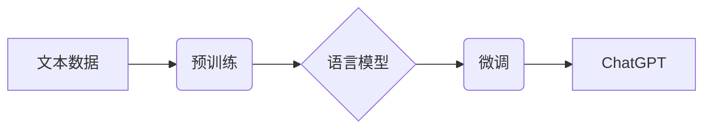

> AIGC, ChatGPT, 自然语言处理, 语言模型, 训练数据, 应用场景, 未来趋势

## 1. 背景介绍

近年来，人工智能（AI）技术取得了飞速发展，其中，生成式人工智能（AIGC）作为人工智能领域的新兴方向，备受关注。AIGC是指利用人工智能技术，从文本、图像、音频等数据中生成新的内容，例如文本创作、图像生成、音乐作曲等。

ChatGPT作为一款基于Transformer架构的强大语言模型，代表了AIGC技术的最新进展。它由OpenAI公司开发，能够理解和生成人类语言，并具备广泛的应用场景。本文将深入探讨ChatGPT的原理、技术、应用以及未来发展趋势，帮助读者了解AIGC技术的魅力和潜力。

## 2. 核心概念与联系

### 2.1 自然语言处理（NLP）

自然语言处理（NLP）是人工智能领域的一个重要分支，旨在使计算机能够理解、处理和生成人类语言。NLP技术涵盖了文本分析、语音识别、机器翻译等多个方面。

### 2.2 语言模型

语言模型是NLP领域的核心技术之一，它通过学习大量的文本数据，建立语言的统计规律和语法结构，从而能够预测下一个词语或句子。常见的语言模型包括n-gram模型、隐马尔可夫模型（HMM）和循环神经网络（RNN）。

### 2.3 Transformer架构

Transformer是一种新型的深度学习架构，它通过自注意力机制（Self-Attention）有效地捕捉文本中的长距离依赖关系，从而在机器翻译、文本摘要等任务中取得了优异的性能。ChatGPT正是基于Transformer架构构建的。

**Mermaid 流程图**

## 3. 核心算法原理 & 具体操作步骤

### 3.1 算法原理概述

ChatGPT的核心算法原理是基于Transformer架构的预训练语言模型。它通过大量的文本数据进行预训练，学习语言的语法结构、语义关系和上下文信息。预训练后的语言模型可以用于各种下游任务，例如文本生成、对话系统、机器翻译等。

### 3.2 算法步骤详解

1. **数据收集和预处理:** 收集大量的文本数据，并进行清洗、分词、标记等预处理操作。
2. **模型训练:** 使用Transformer架构构建语言模型，并利用预处理后的文本数据进行训练。训练过程中，模型会学习语言的统计规律和语法结构。
3. **微调:** 将预训练后的语言模型微调到特定的下游任务，例如对话系统、文本生成等。微调过程通常使用较小的数据集，并调整模型参数以适应特定任务。
4. **文本生成:** 使用微调后的语言模型生成新的文本内容。

### 3.3 算法优缺点

**优点:**

* 强大的文本生成能力
* 能够理解和生成自然流畅的语言
* 可用于多种下游任务

**缺点:**

* 训练成本高
* 容易受到训练数据的影响
* 缺乏常识和世界知识

### 3.4 算法应用领域

* **对话系统:** 开发更智能、更自然的对话机器人。
* **文本生成:** 自动生成新闻报道、小说、诗歌等文本内容。
* **机器翻译:** 实现更高效、更准确的机器翻译。
* **代码生成:** 自动生成代码片段，提高开发效率。

## 4. 数学模型和公式 & 详细讲解 & 举例说明

### 4.1 数学模型构建

ChatGPT的核心数学模型是Transformer架构，它基于自注意力机制和多头注意力机制。

**自注意力机制:**

自注意力机制允许模型关注输入序列中的不同位置，并计算每个词语与其他词语之间的相关性。

**公式:**

$$
Attention(Q, K, V) = softmax(\frac{QK^T}{\sqrt{d_k}})V
$$

其中：

* $Q$：查询矩阵
* $K$：键矩阵
* $V$：值矩阵
* $d_k$：键向量的维度

**多头注意力机制:**

多头注意力机制将自注意力机制应用于多个不同的子空间，从而能够捕捉到更丰富的语义信息。

**公式:**

$$
MultiHeadAttention(Q, K, V) = Concat(head_1, head_2, ..., head_h)W^O
$$

其中：

* $head_i$：第i个子空间的注意力输出
* $h$：注意力头的数量
* $W^O$：最终输出层的权重矩阵

### 4.2 公式推导过程

自注意力机制的公式推导过程如下：

1. 将输入序列 $X$ 转换为查询矩阵 $Q$、键矩阵 $K$ 和值矩阵 $V$。
2. 计算每个词语与其他词语之间的相关性，即注意力权重。
3. 使用注意力权重对值矩阵进行加权求和，得到每个词语的注意力输出。
4. 将所有词语的注意力输出拼接起来，得到最终的注意力输出。

### 4.3 案例分析与讲解

假设我们有一个句子 "The cat sat on the mat"，使用自注意力机制可以计算每个词语与其他词语之间的相关性。例如，"cat" 与 "sat" 之间存在较强的相关性，因为它们描述了同一个动作。

## 5. 项目实践：代码实例和详细解释说明

### 5.1 开发环境搭建

ChatGPT的开发环境需要安装Python、PyTorch或TensorFlow等深度学习框架，以及一些必要的库，例如transformers、torchtext等。

### 5.2 源代码详细实现

ChatGPT的源代码开源，可以从GitHub上下载。

### 5.3 代码解读与分析

ChatGPT的源代码主要包含以下部分：

* 模型架构定义
* 数据加载和预处理
* 模型训练和评估
* 文本生成

### 5.4 运行结果展示

使用ChatGPT可以生成各种类型的文本内容，例如：

* 诗歌
* 小说
* 代码
* 邮件

## 6. 实际应用场景

### 6.1 文本生成

ChatGPT可以用于自动生成各种类型的文本内容，例如新闻报道、博客文章、产品描述等。

### 6.2 对话系统

ChatGPT可以用于构建更智能、更自然的对话机器人，例如客服机器人、聊天机器人等。

### 6.3 机器翻译

ChatGPT可以用于实现更高效、更准确的机器翻译。

### 6.4 未来应用展望

ChatGPT的未来应用前景广阔，例如：

* 教育领域：个性化学习、智能辅导
* 医疗领域：疾病诊断、医疗咨询
* 娱乐领域：游戏剧本创作、虚拟人物对话

## 7. 工具和资源推荐

### 7.1 学习资源推荐

* **书籍:**
    * 《深度学习》
    * 《自然语言处理》
* **在线课程:**
    * Coursera
    * edX
* **博客和论坛:**
    * Hugging Face
    * TensorFlow Blog

### 7.2 开发工具推荐

* **Python:** 
* **PyTorch:** 
* **TensorFlow:** 
* **transformers:** 

### 7.3 相关论文推荐

* **Attention Is All You Need:** https://arxiv.org/abs/1706.03762
* **BERT: Pre-training of Deep Bidirectional Transformers for Language Understanding:** https://arxiv.org/abs/1810.04805

## 8. 总结：未来发展趋势与挑战

### 8.1 研究成果总结

ChatGPT的出现标志着AIGC技术的重大突破，它展现了人工智能在文本生成领域的强大能力。

### 8.2 未来发展趋势

* **模型规模和性能提升:** 未来，AIGC模型的规模和性能将会进一步提升，能够生成更复杂、更具创造性的内容。
* **多模态生成:** AIGC模型将能够处理多种模态数据，例如文本、图像、音频等，实现多模态内容的生成。
* **个性化定制:** AIGC模型将能够根据用户的需求进行个性化定制，生成符合用户偏好的内容。

### 8.3 面临的挑战

* **数据安全和隐私:** AIGC模型的训练需要大量数据，如何保证数据安全和隐私是一个重要的挑战。
* **伦理和社会影响:** AIGC技术可能会带来一些伦理和社会问题，例如内容虚假、版权侵权等，需要引起重视和讨论。
* **可解释性和透明度:** AIGC模型的决策过程往往难以理解，如何提高模型的可解释性和透明度是一个重要的研究方向。

### 8.4 研究展望

未来，AIGC技术将继续发展，并应用于越来越多的领域，为人类社会带来更多便利和价值。

## 9. 附录：常见问题与解答

**Q1: ChatGPT 是开源的吗？**

A1: 是的，ChatGPT 的源代码开源，可以从 GitHub 上下载。

**Q2: 如何使用 ChatGPT 生成文本？**

A2: 可以使用 Python 和 transformers 库调用 ChatGPT 模型进行文本生成。

**Q3: ChatGPT 的训练数据是什么？**

A3: ChatGPT 的训练数据包括大量的文本数据，例如书籍、文章、代码等。

**Q4: ChatGPT 是否可以理解中文？**

A4: 可以，ChatGPT 支持多种语言，包括中文。

**Q5: ChatGPT 的未来发展趋势是什么？**

A5: 未来，ChatGPT 的模型规模和性能将会进一步提升，并应用于更多领域。

作者：禅与计算机程序设计艺术 / Zen and the Art of Computer Programming 
<end_of_turn>