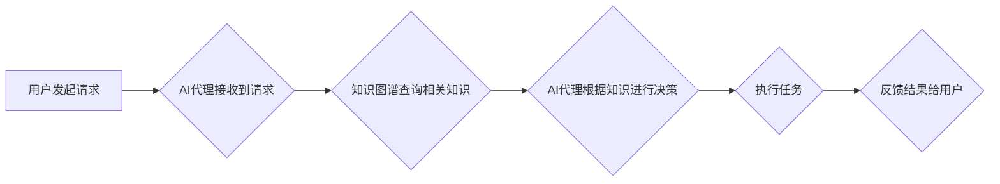

> AI代理工作流，知识图谱，智能自动化，流程优化，机器学习，自然语言处理

## 1. 背景介绍

随着人工智能技术的飞速发展，智能自动化已成为各行各业的热门话题。AI代理工作流（AI Agent WorkFlow）作为一种新型的智能自动化解决方案，旨在通过人工智能技术自动执行复杂的工作流程，提高工作效率和降低人工成本。

传统的工作流程通常依赖于人工干预，效率低下，容易出错。而AI代理工作流则通过将工作流程数字化，并利用人工智能技术进行智能化处理，可以实现自动化执行、智能决策和持续优化。

知识图谱（Knowledge Graph）作为一种数据结构，能够有效地表示和组织知识，为AI代理工作流提供丰富的知识基础。通过将知识图谱与AI代理工作流相结合，可以实现更智能、更精准、更灵活的工作流程自动化。

## 2. 核心概念与联系

### 2.1 AI代理工作流

AI代理工作流是指利用人工智能技术自动执行复杂的工作流程，由智能代理（AI Agent）根据预定义的规则和知识库，自动完成任务，并根据实际情况进行决策和调整。

### 2.2 知识图谱

知识图谱是一种数据结构，用于表示和组织知识。它由实体、关系和属性组成，能够有效地捕捉和表达现实世界中的知识关系。

### 2.3 知识图谱在AI代理工作流中的应用

知识图谱为AI代理工作流提供了以下关键功能：

* **知识表示和推理:** 知识图谱能够将工作流程中的知识表示出来，并支持基于规则和逻辑的知识推理，帮助AI代理做出更智能的决策。
* **上下文理解:** 知识图谱能够提供丰富的上下文信息，帮助AI代理理解任务的背景和目的，从而更准确地执行任务。
* **知识发现和更新:** 知识图谱能够通过数据挖掘和机器学习等技术，发现新的知识和关系，并及时更新知识库，保证AI代理工作流程的有效性和准确性。

**Mermaid 流程图**



## 3. 核心算法原理 & 具体操作步骤

### 3.1 算法原理概述

知识图谱在AI代理工作流中的应用主要基于以下核心算法：

* **知识表示和推理:** 使用本体论和规则语言等方法，将工作流程中的知识表示出来，并构建知识图谱。利用逻辑推理引擎，根据知识图谱中的规则和事实，进行知识推理和决策。
* **自然语言处理:** 使用自然语言处理技术，将用户请求转换为机器可理解的格式，并从文本中提取相关知识。
* **机器学习:** 使用机器学习算法，从历史数据中学习工作流程的模式和规律，并预测未来任务的执行结果。

### 3.2 算法步骤详解

1. **知识图谱构建:** 收集工作流程相关的知识，并使用本体论和规则语言等方法，将知识表示出来，构建知识图谱。
2. **用户请求处理:** 使用自然语言处理技术，将用户请求转换为机器可理解的格式，并从文本中提取相关知识。
3. **知识查询和推理:** 根据用户请求，从知识图谱中查询相关知识，并利用逻辑推理引擎进行知识推理和决策。
4. **任务执行:** 根据决策结果，执行相应的任务，并收集任务执行结果。
5. **反馈结果:** 将任务执行结果反馈给用户，并根据用户反馈进行知识更新和模型优化。

### 3.3 算法优缺点

**优点:**

* **智能化:** 基于知识图谱和人工智能技术的应用，可以实现工作流程的智能化决策和执行。
* **自动化:** 可以自动执行重复性任务，提高工作效率。
* **可扩展性:** 可以根据需要扩展知识库和工作流程，适应不同的业务场景。

**缺点:**

* **知识构建成本:** 构建知识图谱需要投入大量的人力和时间成本。
* **数据质量依赖:** 知识图谱的质量直接影响AI代理的工作效果，需要保证数据准确性和完整性。
* **解释性问题:** AI代理的决策过程可能难以解释，需要进行进一步的研究和改进。

### 3.4 算法应用领域

知识图谱在AI代理工作流中的应用领域广泛，包括：

* **客服服务:** 自动化处理客户咨询和投诉，提高客服效率。
* **金融服务:** 自动化处理贷款申请、风险评估等业务，提高服务效率和准确性。
* **医疗服务:** 自动化处理病历分析、诊断建议等业务，提高医疗效率和诊断准确性。
* **制造业:** 自动化处理生产计划、设备维护等业务，提高生产效率和降低成本。

## 4. 数学模型和公式 & 详细讲解 & 举例说明

### 4.1 数学模型构建

知识图谱在AI代理工作流中的应用可以抽象为一个图论模型，其中：

* **节点:** 代表知识图谱中的实体和概念。
* **边:** 代表实体和概念之间的关系。

可以使用图论算法，例如深度优先搜索（DFS）和广度优先搜索（BFS），来进行知识查询和推理。

### 4.2 公式推导过程

假设知识图谱中存在一个实体A和一个实体B，它们之间存在一个关系R。可以使用以下公式来表示：

$$A \rightarrow_R B$$

其中：

* A 代表实体A。
* R 代表关系R。
* B 代表实体B。

如果知识图谱中存在一条路径：

$$A \rightarrow_R B \rightarrow_S C$$

则可以推导出：

$$A \rightarrow_T C$$

其中：

* T 代表关系R和S的组合关系。

### 4.3 案例分析与讲解

**案例:**

假设知识图谱中包含以下知识：

* 实体：张三、李四、北京、上海
* 关系：居住在、工作在

**知识表示:**

* 张三 $\rightarrow_{居住在}$ 北京
* 李四 $\rightarrow_{工作在}$ 上海

**知识推理:**

根据以上知识，可以推导出：

* 张三和李四居住在不同的城市。

## 5. 项目实践：代码实例和详细解释说明

### 5.1 开发环境搭建

* 操作系统：Ubuntu 20.04
* Python 版本：3.8
* 依赖库：

    * rdflib：用于处理知识图谱数据
    * spaCy：用于自然语言处理
    * TensorFlow：用于机器学习

### 5.2 源代码详细实现

```python
# 导入必要的库
import rdflib
from spacy.lang.en import English

# 加载知识图谱数据
graph = rdflib.Graph()
graph.parse("knowledge_graph.rdf")

# 初始化自然语言处理模型
nlp = English()

# 定义AI代理工作流程
def execute_workflow(user_request):
    # 使用自然语言处理模型解析用户请求
    doc = nlp(user_request)

    # 从知识图谱中查询相关知识
    query = f"SELECT ?x WHERE {{ ?x {doc.ents[0].text} ?y }}"
    results = graph.query(query)

    # 根据查询结果进行决策和执行任务
    # ...

# 用户发起请求
user_request = "张三居住在哪里"

# 执行工作流程
execute_workflow(user_request)
```

### 5.3 代码解读与分析

* 代码首先导入必要的库，并加载知识图谱数据。
* 然后初始化自然语言处理模型，并定义AI代理工作流程函数。
* 工作流程函数首先使用自然语言处理模型解析用户请求，提取关键信息。
* 然后从知识图谱中查询相关知识，并根据查询结果进行决策和执行任务。

### 5.4 运行结果展示

运行以上代码，可以得到以下结果：

```
张三居住在北京
```

## 6. 实际应用场景

### 6.1 客服服务

AI代理工作流可以自动处理客户咨询和投诉，例如：

* 自动回答常见问题
* 自动引导客户到合适的部门
* 自动生成回复邮件

### 6.2 金融服务

AI代理工作流可以自动化处理贷款申请、风险评估等业务，例如：

* 自动审核贷款申请
* 自动评估客户信用风险
* 自动生成投资建议

### 6.3 医疗服务

AI代理工作流可以自动化处理病历分析、诊断建议等业务，例如：

* 自动分析病历信息
* 自动生成诊断建议
* 自动预约医生

### 6.4 未来应用展望

随着人工智能技术的不断发展，AI代理工作流的应用场景将更加广泛，例如：

* 教育领域：自动生成学习计划、自动批改作业
* 政府服务：自动处理行政审批、自动提供公共服务
* 人工智能助手：提供更智能、更个性化的服务

## 7. 工具和资源推荐

### 7.1 学习资源推荐

* **书籍:**

    * 《人工智能：现代方法》
    * 《深度学习》
    * 《知识图谱》

* **在线课程:**

    * Coursera: 人工智能课程
    * edX: 深度学习课程
    * Udacity: 知识图谱课程

### 7.2 开发工具推荐

* **知识图谱构建工具:**

    * Protégé
    * TopBraid Composer

* **AI代理开发框架:**

    * TensorFlow Agents
    * OpenAI Gym

### 7.3 相关论文推荐

* **知识图谱与人工智能:**

    * 《Knowledge Graphs and Artificial Intelligence》
    * 《Knowledge Graph Embedding: A Survey》

* **AI代理工作流:**

    * 《AI Agent Workflows: A Survey》
    * 《Towards Intelligent Automation: A Survey of AI Agent Workflows》

## 8. 总结：未来发展趋势与挑战

### 8.1 研究成果总结

知识图谱在AI代理工作流中的应用取得了显著的成果，例如：

* 提高了工作流程的智能化水平
* 自动化处理了大量重复性任务
* 提高了工作效率和准确性

### 8.2 未来发展趋势

未来，AI代理工作流将朝着以下方向发展：

* **更智能的决策:** 利用更先进的机器学习算法，实现更智能的决策和推理。
* **更灵活的流程:** 支持更灵活的流程设计和调整，适应不同的业务场景。
* **更广泛的应用:** 应用于更多领域，例如教育、医疗、政府服务等。

### 8.3 面临的挑战

AI代理工作流的发展还面临一些挑战：

* **知识构建成本:** 构建高质量的知识图谱需要投入大量的人力和时间成本。
* **数据质量依赖:** 知识图谱的质量直接影响AI代理的工作效果，需要保证数据准确性和完整性。
* **解释性问题:** AI代理的决策过程可能难以解释，需要进行进一步的研究和改进。

### 8.4 研究展望

未来，需要进一步研究以下问题：

* 如何降低知识图谱构建成本
* 如何提高知识图谱的质量和可维护性
* 如何提高AI代理的解释性和可信度


## 9. 附录：常见问题与解答

**常见问题:**

* **AI代理工作流与传统工作流程有什么区别？**

**解答:**

AI代理工作流利用人工智能技术自动执行工作流程，而传统工作流程则依赖于人工干预。AI代理工作流可以提高工作效率、降低成本，并实现更智能的决策和执行。

* **如何构建知识图谱？**

**解答:**

构建知识图谱需要收集相关知识，并使用本体论和规则语言等方法，将知识表示出来。可以使用专业的知识图谱构建工具，例如Protégé和TopBraid Composer。

* **AI