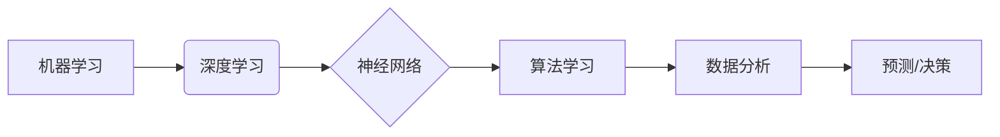

>  人工智能、机器学习、深度学习、神经网络、算法原理、代码实例、Python

## 1. 背景介绍

人工智能（AI）作为21世纪最具颠覆性的技术之一，正在深刻地改变着我们的生活。从智能手机的语音助手到自动驾驶汽车，AI技术的应用无处不在。而支撑AI发展的核心是各种强大的算法，它们赋予机器学习的能力，让机器能够像人类一样思考、学习和决策。

本篇文章将深入探讨AI人工智能的核心算法原理，并通过代码实例讲解，帮助读者理解这些算法的运作机制，以及如何在实际应用中加以运用。

## 2. 核心概念与联系

在深入学习AI算法之前，我们需要先了解一些核心概念：

* **机器学习（Machine Learning）：** 是一种人工智能技术，通过算法学习数据，从数据中发现模式和规律，从而进行预测或决策。
* **深度学习（Deep Learning）：** 是一种机器学习的子集，利用多层神经网络来模拟人类大脑的学习过程，能够处理更复杂的数据，并取得更优异的性能。
* **神经网络（Neural Network）：** 是一种模仿人脑神经元结构的算法模型，由多个神经元组成，通过连接和权重来学习数据。

**核心概念与联系流程图:**



## 3. 核心算法原理 & 具体操作步骤

### 3.1  算法原理概述

本篇文章将重点介绍以下几种常用的AI核心算法：

* **线性回归（Linear Regression）：** 用于预测连续数值，假设数据之间存在线性关系。
* **逻辑回归（Logistic Regression）：** 用于分类问题，预测数据属于某个类别或不属于某个类别。
* **决策树（Decision Tree）：** 通过一系列规则来进行分类或回归，易于理解和解释。
* **支持向量机（Support Vector Machine）：** 通过寻找最佳的分隔超平面来进行分类，能够处理高维数据。
* **k近邻算法（k-Nearest Neighbors）：** 根据数据点之间的距离进行分类或回归，简单易用。

### 3.2  算法步骤详解

**以线性回归为例，详细说明其算法步骤：**

1. **收集数据：** 收集包含输入特征和输出目标的训练数据。
2. **特征工程：** 对数据进行预处理，例如数据清洗、特征缩放等。
3. **模型构建：** 使用线性回归模型，假设数据之间存在线性关系，并通过最小二乘法求解模型参数。
4. **模型训练：** 使用训练数据训练模型，调整模型参数，使模型能够更好地拟合数据。
5. **模型评估：** 使用测试数据评估模型的性能，例如计算均方误差（MSE）等。
6. **模型调优：** 根据评估结果，调整模型参数或算法超参数，以提高模型性能。
7. **模型部署：** 将训练好的模型部署到实际应用场景中，用于预测或决策。

### 3.3  算法优缺点

**不同算法具有不同的优缺点，需要根据实际应用场景选择合适的算法：**

* **线性回归：** 优点：简单易懂，计算效率高；缺点：只能处理线性关系，对异常值敏感。
* **逻辑回归：** 优点：适用于分类问题，易于理解和解释；缺点：对非线性关系处理能力有限。
* **决策树：** 优点：易于理解和解释，可以处理非线性关系；缺点：容易过拟合，对数据噪声敏感。
* **支持向量机：** 优点：可以处理高维数据，具有较好的泛化能力；缺点：训练时间较长，参数设置较为复杂。
* **k近邻算法：** 优点：简单易用，无需训练模型；缺点：计算效率低，对数据规模敏感。

### 3.4  算法应用领域

AI算法广泛应用于各个领域，例如：

* **图像识别：** 用于识别图像中的物体、场景和人脸。
* **自然语言处理：** 用于理解和生成人类语言，例如机器翻译、文本摘要等。
* **语音识别：** 用于将语音转换为文本。
* **推荐系统：** 用于根据用户的历史行为推荐商品或内容。
* **医疗诊断：** 用于辅助医生诊断疾病。

## 4. 数学模型和公式 & 详细讲解 & 举例说明

### 4.1  数学模型构建

**以线性回归为例，其数学模型如下：**

$$
y = w_0 + w_1x_1 + w_2x_2 + ... + w_nx_n + \epsilon
$$

其中：

* $y$ 是输出目标变量。
* $x_1, x_2, ..., x_n$ 是输入特征变量。
* $w_0, w_1, w_2, ..., w_n$ 是模型参数，也称为权重。
* $\epsilon$ 是误差项。

### 4.2  公式推导过程

**最小二乘法是线性回归模型训练的核心算法，其目标是找到最优的模型参数，使模型预测值与实际值之间的误差最小。**

最小二乘法的公式如下：

$$
J(w) = \frac{1}{2}\sum_{i=1}^{m}(y_i - \hat{y}_i)^2
$$

其中：

* $J(w)$ 是损失函数，表示模型预测值与实际值之间的误差平方和。
* $m$ 是训练数据样本数量。
* $y_i$ 是第 $i$ 个样本的实际目标值。
* $\hat{y}_i$ 是第 $i$ 个样本的预测目标值。

**通过求解损失函数的最小值，可以得到最优的模型参数。**

### 4.3  案例分析与讲解

**假设我们有一个数据集，包含房屋面积和房屋价格的信息。**

我们想要使用线性回归模型来预测房屋价格。

**我们可以将房屋面积作为输入特征，房屋价格作为输出目标变量。**

**通过训练线性回归模型，我们可以得到一个模型参数，例如：**

$$
y = 5000 + 100x
$$

其中：

* $y$ 是房屋价格。
* $x$ 是房屋面积。

**这个模型表示，房屋面积每增加1平方米，房屋价格就会增加100元。**

## 5. 项目实践：代码实例和详细解释说明

### 5.1  开发环境搭建

**本项目使用Python语言进行开发，需要安装以下软件：**

* Python 3.x
* NumPy
* Pandas
* Scikit-learn

### 5.2  源代码详细实现

```python
import numpy as np
from sklearn.linear_model import LinearRegression
from sklearn.model_selection import train_test_split

# 准备数据
data = np.array([[100, 50000], [150, 70000], [200, 90000], [250, 110000]])
X = data[:, 0].reshape(-1, 1)  # 输入特征
y = data[:, 1]  # 输出目标变量

# 将数据分为训练集和测试集
X_train, X_test, y_train, y_test = train_test_split(X, y, test_size=0.2, random_state=42)

# 创建线性回归模型
model = LinearRegression()

# 训练模型
model.fit(X_train, y_train)

# 预测测试集数据
y_pred = model.predict(X_test)

# 评估模型性能
print('Coefficients:', model.coef_)
print('Intercept:', model.intercept_)
print('Mean Squared Error:', np.mean((y_test - y_pred)**2))
```

### 5.3  代码解读与分析

**代码首先准备了房屋面积和房屋价格的数据，并将数据分为训练集和测试集。**

**然后，创建了一个线性回归模型，并使用训练集数据训练模型。**

**训练完成后，可以使用模型预测测试集数据的房屋价格。**

**最后，评估模型的性能，例如计算均方误差。**

### 5.4  运行结果展示

**运行代码后，会输出模型的系数、截距以及均方误差等信息。**

**这些信息可以用来评估模型的性能。**

## 6. 实际应用场景

**线性回归算法广泛应用于各个领域，例如：**

* **房价预测：** 根据房屋面积、位置等特征预测房屋价格。
* **股票价格预测：** 根据股票历史数据预测股票价格。
* **销售预测：** 根据市场数据预测产品销售量。
* **广告效果预测：** 根据广告投放数据预测广告效果。

### 6.4  未来应用展望

随着人工智能技术的不断发展，线性回归算法将会在更多领域得到应用，例如：

* **个性化推荐：** 根据用户的行为数据推荐个性化的商品或内容。
* **医疗诊断辅助：** 根据患者的症状和病史预测疾病风险。
* **金融风险评估：** 根据客户的信用记录评估贷款风险。

## 7. 工具和资源推荐

### 7.1  学习资源推荐

* **书籍：**
    * 《Python机器学习》
    * 《深入理解机器学习》
* **在线课程：**
    * Coursera：机器学习
    * edX：人工智能导论
* **博客和网站：**
    * Towards Data Science
    * Machine Learning Mastery

### 7.2  开发工具推荐

* **Python：** 
* **NumPy：** 用于数值计算
* **Pandas：** 用于数据分析和处理
* **Scikit-learn：** 用于机器学习算法实现

### 7.3  相关论文推荐

* **《The Elements of Statistical Learning》**
* **《Pattern Recognition and Machine Learning》**

## 8. 总结：未来发展趋势与挑战

### 8.1  研究成果总结

AI人工智能领域取得了长足的进步，各种算法不断涌现，并取得了令人瞩目的成果。

### 8.2  未来发展趋势

未来，AI人工智能的发展趋势包括：

* **更深层次的学习：** 研究更深层次的神经网络模型，提高模型的学习能力和泛化能力。
* **更强大的计算能力：** 开发更强大的计算硬件，加速AI算法的训练和推理速度。
* **更广泛的应用场景：** 将AI技术应用到更多领域，例如医疗、教育、金融等。

### 8.3  面临的挑战

AI人工智能领域也面临着一些挑战，例如：

* **数据安全和隐私保护：** AI算法需要大量数据进行训练，如何保证数据安全和隐私保护是一个重要问题。
* **算法可解释性：** 许多AI算法是黑箱模型，难以解释其决策过程，这可能会导致算法的不可信赖。
* **伦理问题：** AI技术的应用可能会带来一些伦理问题，例如算法偏见、工作岗位替代等。

### 8.4  研究展望

未来，我们需要继续加强对AI人工智能的理论研究和应用探索，并积极应对其带来的挑战，推动AI技术朝着更加安全、可信赖、普惠的方向发展。

## 9. 附录：常见问题与解答

**常见问题：**

* **什么是机器学习？**
* **什么是深度学习？**
* **什么是神经网络？**
* **如何选择合适的AI算法？**
* **如何评估AI模型的性能？**

**解答：**

* **什么是机器学习？** 机器学习是一种人工智能技术，通过算法学习数据，从数据中发现模式和规律，从而进行预测或决策。
* **什么是深度学习？** 深度学习是一种机器学习的子集，利用多层神经网络来模拟人类大脑的学习过程，能够处理更复杂的数据，并取得更优异的性能。
* **什么是神经网络？** 神经网络是一种模仿人脑神经元结构的算法模型，由多个神经元组成，通过连接和权重来学习数据。
* **如何选择合适的AI算法？** 选择合适的AI算法需要根据实际应用场景的特点，例如数据类型、问题类型、模型复杂度等因素进行考虑。
* **如何评估AI模型的性能？** AI模型的性能可以通过各种指标进行评估，例如准确率、召回率、F1-score等。

**作者：禅与计算机程序设计艺术 / Zen and the Art of Computer Programming**


<end_of_turn>