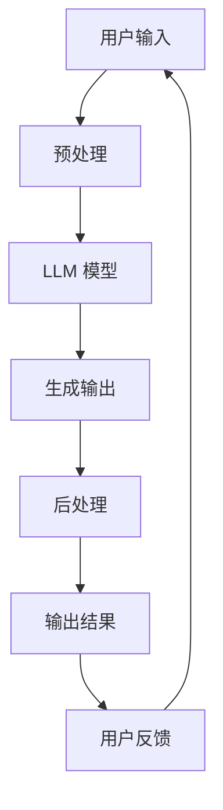

                 

**大语言模型（LLM）在电影互动体验中的应用**

## 1. 背景介绍

随着人工智能技术的发展，大语言模型（LLM）已经成为各行各业的关键技术之一。在电影行业，LLM 的应用正在改变观影体验，为观众提供更个性化、互动式的内容。本文将探讨 LLM 在电影互动体验中的应用，包括核心概念、算法原理、数学模型，以及项目实践和实际应用场景。

## 2. 核心概念与联系

### 2.1 大语言模型（LLM）简介

大语言模型是一种深度学习模型，旨在理解和生成人类语言。LLM 通过学习大量文本数据来理解语言结构、语义和上下文，从而能够生成人类般的文本。

### 2.2 LLM 在电影互动体验中的应用

LLM 可以为电影观众提供个性化的互动体验，如个性化评论、情感分析、场景描述生成等。此外，LLM 还可以帮助电影制片人和导演创作更好的剧本和故事情节。

### 2.3 系统架构

以下是 LLM 在电影互动体验中的系统架构 Mermaid 流程图：



## 3. 核心算法原理 & 具体操作步骤

### 3.1 算法原理概述

LLM 的核心算法是基于Transformer 模型的自注意力机制。Transformer 模型使用自注意力机制来理解输入序列中的上下文，并生成相应的输出序列。

### 3.2 算法步骤详解

1. **预处理**：对用户输入进行预处理，包括分词、去除停用词、词干提取等。
2. **LLM 模型**：将预处理后的输入传递给 LLM 模型，生成输出序列。
3. **后处理**：对模型输出进行后处理，包括去除重复词、拼接成句子等。
4. **输出结果**：将后处理后的输出结果返回给用户。
5. **用户反馈**：收集用户反馈，并根据反馈调整模型参数。

### 3.3 算法优缺点

**优点**：

* 可以理解上下文，生成人类般的文本。
* 可以为电影互动体验提供个性化的内容。

**缺点**：

* 计算资源需求高。
* 可能生成不准确或不相关的输出。

### 3.4 算法应用领域

LLM 在电影互动体验中的应用包括：

* 个性化评论生成。
* 情感分析。
* 场景描述生成。
* 故事情节创作。

## 4. 数学模型和公式 & 详细讲解 & 举例说明

### 4.1 数学模型构建

LLM 的数学模型基于Transformer 模型的自注意力机制。自注意力机制使用缩放点积注意力（Scaled Dot-Product Attention）和多头自注意力（Multi-Head Attention）来理解输入序列中的上下文。

### 4.2 公式推导过程

自注意力机制的公式如下：

$$Attention(Q, K, V) = softmax(\frac{QK^T}{\sqrt{d_k}})V$$

其中，Q、K、V 分别是查询（Query）、键（Key）、值（Value）矩阵，d_k 是键矩阵的维度。

多头自注意力的公式如下：

$$MultiHead(Q, K, V) = Concat(head_1,..., head_h)W^O$$

其中，head_i = Attention(QW^Q_i, KW^K_i, VW^V_i)，W^Q_i、W^K_i、W^V_i、W^O 是学习参数矩阵。

### 4.3 案例分析与讲解

例如，在个性化评论生成中，用户输入电影名称和观后感受，LLM 模型根据输入生成个性化评论。数学模型构建和公式推导过程如上所述。

## 5. 项目实践：代码实例和详细解释说明

### 5.1 开发环境搭建

开发环境包括 Python、PyTorch、Transformers 库等。以下是环境搭建命令：

```bash
pip install torch transformers
```

### 5.2 源代码详细实现

以下是个性化评论生成的示例代码：

```python
from transformers import pipeline

# 初始化 LLM 模型
nlp = pipeline('text-generation', model='t5-base', tokenizer='t5-base')

# 用户输入
user_input = "I loved the movie 'Inception'. The plot was amazing."

# 生成个性化评论
output = nlp(f"Write a review for {user_input}")

# 打印输出
print(output[0]['generated_text'])
```

### 5.3 代码解读与分析

代码首先初始化 LLM 模型，然后根据用户输入生成个性化评论。输出结果是生成的评论文本。

### 5.4 运行结果展示

运行结果示例：

```
I loved the movie 'Inception'. The plot was amazing. The visual effects were stunning and the story kept me on the edge of my seat. I highly recommend this movie to anyone who loves a good thriller.
```

## 6. 实际应用场景

### 6.1 个性化评论生成

LLM 可以为电影观众生成个性化评论，帮助他们表达自己的观后感受。

### 6.2 情感分析

LLM 可以分析电影评论的情感，帮助电影制片人和导演了解观众的反馈。

### 6.3 场景描述生成

LLM 可以根据电影剧本生成场景描述，帮助导演和摄影师设计场景布置。

### 6.4 未来应用展望

LLM 在电影行业的应用前景广阔，未来可能会应用于故事情节创作、电影推荐系统等领域。

## 7. 工具和资源推荐

### 7.1 学习资源推荐

* "Attention is All You Need" 论文：<https://arxiv.org/abs/1706.03762>
* "T5: Text-to-Text Transfer Transformer" 论文：<https://arxiv.org/abs/1910.10683>

### 7.2 开发工具推荐

* Hugging Face Transformers 库：<https://huggingface.co/transformers/>
* PyTorch：<https://pytorch.org/>

### 7.3 相关论文推荐

* "Movie Recommendation with Deep Learning"：<https://arxiv.org/abs/1511.06930>
* "Movie Review Sentiment Analysis using Deep Learning"：<https://ieeexplore.ieee.org/document/8454645>

## 8. 总结：未来发展趋势与挑战

### 8.1 研究成果总结

本文介绍了 LLM 在电影互动体验中的应用，包括核心概念、算法原理、数学模型，以及项目实践和实际应用场景。

### 8.2 未来发展趋势

LLM 在电影行业的应用前景广阔，未来可能会应用于故事情节创作、电影推荐系统等领域。

### 8.3 面临的挑战

LLM 的应用面临的挑战包括计算资源需求高、可能生成不准确或不相关的输出等。

### 8.4 研究展望

未来的研究方向包括提高 LLM 的准确性和效率，开发新的 LLM 应用领域等。

## 9. 附录：常见问题与解答

**Q：LLM 如何理解上下文？**

A：LLM 使用自注意力机制来理解输入序列中的上下文。自注意力机制使用缩放点积注意力和多头自注意力来理解输入序列中的上下文。

**Q：LLM 如何生成输出？**

A：LLM 使用Transformer 模型的编码器-解码器架构来生成输出序列。编码器理解输入序列中的上下文，解码器根据上下文生成输出序列。

**Q：LLM 的应用有哪些？**

A：LLM 的应用包括个性化评论生成、情感分析、场景描述生成、故事情节创作等。

## 作者：禅与计算机程序设计艺术 / Zen and the Art of Computer Programming

