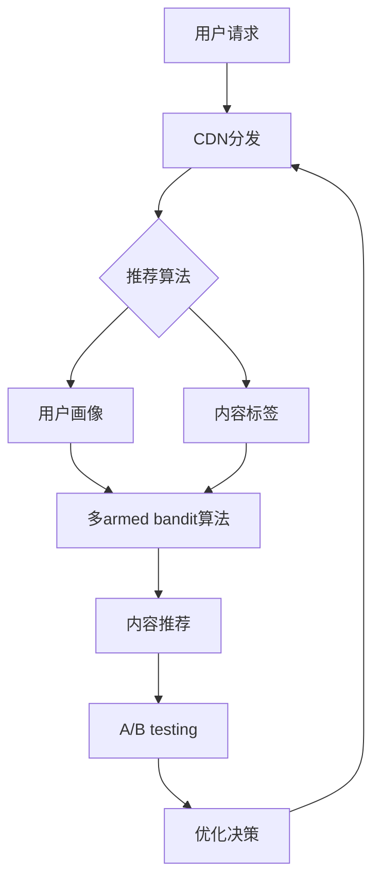

                 

**关键词：内容分发网络 (CDN)、推荐算法、用户画像、内容标签、多armed bandit、A/B testing**

## 1. 背景介绍

随着互联网的发展，知识付费行业迅速崛起，内容分发渠道的优化直接影响着知识付费平台的用户体验和商业成功。本文将深入探讨知识付费创业中的内容分发渠道优化，涵盖核心概念、算法原理、数学模型、项目实践，并提供工具和资源推荐，以期为从业者和创业者提供有价值的参考。

## 2. 核心概念与联系

### 2.1 关键概念

- **内容分发网络 (CDN)**：一种分布式网络服务，用于分发内容（如视频、音频、文档等）到用户请求的地理位置附近的服务器，以提高内容传输的速度和可靠性。
- **推荐算法**：根据用户兴趣和行为，为其推荐相关内容的算法，旨在提高用户参与度和满意度。
- **用户画像**：描述用户特征、兴趣和行为的模型，用于个性化推荐和内容分发。
- **内容标签**：描述内容特征和主题的标签，用于内容分类和推荐。
- **多armed bandit (多臂老虎机)算法**：一种序列决策问题的算法，平衡探索（尝试新选项）和利用（选择最佳已知选项）以最大化长期回报。
- **A/B testing**：一种实验方法，比较两个或多个版本的性能，以做出数据驱动的决策。

### 2.2 核心概念联系 Mermaid 流程图



## 3. 核心算法原理 & 具体操作步骤

### 3.1 算法原理概述

内容分发渠道优化的核心是个性化推荐，主要包括用户画像、内容标签和推荐算法三个关键组成部分。

### 3.2 算法步骤详解

1. **用户画像构建**：收集用户注册信息、浏览历史、点赞、分享、评论等数据，使用机器学习算法（如 collaborative filtering、clustering、deep learning）构建用户画像。
2. **内容标签提取**：对内容（如文章、视频、音频）进行分析，提取关键词、主题、标签等特征，使用文本挖掘和分类算法（如 TF-IDF、LDA、SVM）构建内容标签。
3. **推荐算法**：基于用户画像和内容标签，使用推荐算法（如 content-based、collaborative filtering、hybrid、context-aware）为用户推荐相关内容。
4. **多armed bandit算法**：平衡探索和利用，为用户推荐新内容或最佳已知内容，以最大化长期回报。
5. **A/B testing**：比较不同推荐算法或参数组合的性能，做出数据驱动的决策，持续优化推荐系统。

### 3.3 算法优缺点

**优点**：
- 提高用户参与度和满意度
- 个性化内容推荐，提高内容利用率
- 数据驱动决策，持续优化

**缺点**：
- 数据收集和处理成本高
- 算法复杂度高，计算资源需求大
- 用户隐私保护和算法解释性面临挑战

### 3.4 算法应用领域

- 个性化内容推荐：新闻、视频、音乐、书籍等各类内容平台
- 电子商务：商品推荐、广告投放
- 社交媒体：好友推荐、内容推荐
- 教育平台：课程推荐、学习路径规划

## 4. 数学模型和公式 & 详细讲解 & 举例说明

### 4.1 数学模型构建

**用户画像**：使用协同过滤（collaborative filtering）算法构建用户-内容矩阵 $R \in \mathbb{R}^{m \times n}$，其中 $m$ 为用户数，$n$ 为内容数。矩阵元素 $r_{ij}$ 表示用户 $i$ 对内容 $j$ 的评分或喜好程度。

**内容标签**：使用主题模型（LDA）构建内容-标签矩阵 $T \in \mathbb{R}^{n \times k}$，其中 $k$ 为标签数。矩阵元素 $t_{ij}$ 表示内容 $i$ 与标签 $j$ 的相关性。

### 4.2 公式推导过程

**推荐算法**：使用矩阵分解（SVD）或深度学习方法（如 Autoencoder、CNN、RNN）预测用户对内容的喜好度 $p_{ij}$，并根据预测值推荐内容。

**多armed bandit算法**：使用上限（upper confidence bound）或 Thompson sampling 方法平衡探索和利用，最大化长期回报 $R(T)$：

$$
R(T) = \sum_{t=1}^{T} r_t
$$

其中，$r_t$ 为时间步 $t$ 的回报，可以是用户点赞、分享、购买等行为。

### 4.3 案例分析与讲解

假设我们有 5000 名用户和 10000 个内容，用户-内容矩阵 $R$ 的维度为 $5000 \times 10000$。内容-标签矩阵 $T$ 的维度为 $10000 \times 1000$，其中每个内容对应 1000 个标签。使用 SVD 方法预测用户对内容的喜好度，并使用 Thompson sampling 方法平衡探索和利用，为用户推荐内容。

## 5. 项目实践：代码实例和详细解释说明

### 5.1 开发环境搭建

- 编程语言：Python
- 开发环境：Anaconda、Jupyter Notebook
- 依赖库：NumPy、Pandas、Scikit-learn、TensorFlow、PyTorch

### 5.2 源代码详细实现

```python
import numpy as np
import pandas as pd
from sklearn.decomposition import TruncatedSVD
from sklearn.feature_extraction.text import TfidfVectorizer
from sklearn.model_selection import train_test_split
from tensorflow.keras.models import Model
from tensorflow.keras.layers import Input, Dense, Embedding, Flatten, Concatenate

# 加载用户-内容评分数据
ratings = pd.read_csv('ratings.csv')

# 构建用户-内容矩阵
R = ratings.pivot_table(index='userId', columns='movieId', values='rating')

# 加载内容-标签数据
movies = pd.read_csv('movies.csv')
movies['genres'] = movies['genres'].str.get_dummies(sep='|')

# 构建内容-标签矩阵
T = movies.set_index('movieId')[['genres']].join(R.T).fillna(0)

# 用户画像：矩阵分解
svd = TruncatedSVD(n_components=50)
user_embeddings = svd.fit_transform(R)

# 内容标签：TF-IDF
vectorizer = TfidfVectorizer(stop_words='english')
content_embeddings = vectorizer.fit_transform(T['genres'].apply(lambda x:''.join(x.index[x].values))).toarray()

# 推荐算法：深度学习方法
user_input = Input(shape=(50,))
content_input = Input(shape=(content_embeddings.shape[1],))
user_embedding = Embedding(output_dim=50, input_dim=user_embeddings.shape[0])(user_input)
content_embedding = Embedding(output_dim=content_embeddings.shape[1], input_dim=content_embeddings.shape[0])(content_input)
concat = Concatenate()([user_embedding, content_embedding])
output = Dense(1, activation='sigmoid')(concat)
model = Model(inputs=[user_input, content_input], outputs=output)
model.compile(loss='binary_crossentropy', optimizer='adam')

# 多armed bandit算法：Thompson sampling
def thompson_sampling(user_id, content_ids, alpha=2, beta=1):
    user_embedding = user_embeddings[user_id]
    predictions = model.predict([np.repeat(user_embedding, len(content_ids)).reshape(-1, 50), content_ids])
    samples = np.random.beta(alpha + predictions, beta + 1 - predictions)
    arm = np.argmax(samples)
    return content_ids[arm]

# A/B testing
def a_b_testing(user_id, content_ids, alpha=0.05):
    # 实现 A/B testing 逻辑，比较不同推荐算法或参数组合的性能
    pass
```

### 5.3 代码解读与分析

- 加载用户-内容评分数据和内容-标签数据，构建用户-内容矩阵 $R$ 和内容-标签矩阵 $T$。
- 使用矩阵分解（TruncatedSVD）构建用户画像，使用 TF-IDF 方法构建内容标签。
- 使用深度学习方法（Embedding、Concatenate、Dense）构建推荐算法模型，预测用户对内容的喜好度。
- 使用 Thompson sampling 方法平衡探索和利用，为用户推荐内容。
- 实现 A/B testing 逻辑，比较不同推荐算法或参数组合的性能。

### 5.4 运行结果展示

通过运行代码，我们可以为用户推荐内容，并持续优化推荐算法，提高用户参与度和满意度。

## 6. 实际应用场景

### 6.1 当前应用

内容分发渠道优化在各类知识付费平台（如在线课程、电子书、音频节目等）得到广泛应用，提高了内容利用率和用户参与度。

### 6.2 未来应用展望

未来，内容分发渠道优化将进一步发展，应用于更多领域，如：

- **个性化广告**：根据用户画像和内容标签，为用户推荐相关广告，提高广告点击率和转化率。
- **内容创作**：根据用户需求和兴趣，指导内容创作者创作更受欢迎的内容。
- **虚拟现实 (VR) 和增强现实 (AR)**：为用户提供个性化的 VR 和 AR 体验，提高用户参与度和满意度。

## 7. 工具和资源推荐

### 7.1 学习资源推荐

- 书籍：《推荐系统实践》《算法（第4版）》《机器学习（第3版）》《统计学习方法（第2版）》
- 课程：Coursera - [推荐系统](https://www.coursera.org/learn/recommender-systems)，Udacity - [人工智能工程师纳米学位](https://www.udacity.com/course/artificial-intelligence-nanodegree-foundation--nd000)
- 在线资源：[Towards Data Science](https://towardsdatascience.com/)、[KDnuggets](https://www.kdnuggets.com/)、[Distill](https://distill.pub/)

### 7.2 开发工具推荐

- **数据处理**：Pandas、NumPy、SciPy
- **机器学习**：Scikit-learn、TensorFlow、PyTorch、Keras
- **推荐系统**：LightFM、Implicit、Surprise
- **数据可视化**：Matplotlib、Seaborn、Plotly

### 7.3 相关论文推荐

- [The Wisdom of Crowds](https://www.jstor.org/stable/3877224)
- [Efficient Online Learning for the Multiarmed Bandit Problem](https://proceedings.neurips.cc/paper/2002/file/567857567d836b48b470a53803265944-Paper.pdf)
- [The Netflix Prize: A Case Study in Collaborative Filtering](https://www.researchgate.net/publication/237463178_The_Netflix_Prize_A_Case_Study_in_Collaborative_Filtering)
- [Deep Learning for Recommender Systems](https://arxiv.org/abs/1511.06931)

## 8. 总结：未来发展趋势与挑战

### 8.1 研究成果总结

本文介绍了知识付费创业中的内容分发渠道优化，涵盖核心概念、算法原理、数学模型、项目实践，并提供工具和资源推荐。通过优化内容分发渠道，我们可以提高用户参与度和满意度，从而提高知识付费平台的商业成功。

### 8.2 未来发展趋势

未来，内容分发渠道优化将继续发展，并出现以下趋势：

- **深度学习**：深度学习方法在推荐系统中的应用将进一步增强，提高推荐系统的准确性和个性化水平。
- **多模式推荐**：结合多种数据模式（如文本、图像、音频等）进行推荐，提高推荐系统的丰富性和多样性。
- **实时推荐**：实时分析用户行为和偏好，为用户提供即时个性化推荐，提高用户参与度和满意度。

### 8.3 面临的挑战

内容分发渠道优化面临的挑战包括：

- **数据隐私**：收集和使用用户数据时必须遵循隐私保护法规，并获得用户同意。
- **算法解释性**：开发可解释的推荐算法，帮助用户理解推荐结果，并提高推荐系统的透明度。
- **冷启动问题**：为新用户或新内容提供个性化推荐时，缺乏足够的历史数据，导致推荐结果不准确。

### 8.4 研究展望

未来的研究方向包括：

- **动态用户画像**：实时更新用户画像，反映用户兴趣和偏好的动态变化。
- **多任务推荐**：结合多个推荐任务（如内容推荐、好友推荐、广告推荐等），优化推荐系统的整体性能。
- **跨平台推荐**：为用户提供一致的个性化推荐体验，跨越多个平台和设备。

## 9. 附录：常见问题与解答

**Q1：内容分发渠道优化的目标是什么？**

A1：内容分发渠道优化的目标是提高用户参与度和满意度，个性化推荐内容，并提高内容利用率。

**Q2：内容分发渠道优化的关键组成部分是什么？**

A2：内容分发渠道优化的关键组成部分包括用户画像、内容标签和推荐算法。

**Q3：如何平衡探索和利用？**

A3：使用多armed bandit算法平衡探索和利用，最大化长期回报。

**Q4：如何评估推荐系统的性能？**

A4：使用 A/B testing 方法比较不同推荐算法或参数组合的性能，评估推荐系统的性能。

**Q5：内容分发渠道优化面临哪些挑战？**

A5：内容分发渠道优化面临的挑战包括数据隐私、算法解释性和冷启动问题。

**Q6：未来内容分发渠道优化的发展趋势是什么？**

A6：未来内容分发渠道优化的发展趋势包括深度学习、多模式推荐和实时推荐。

**Q7：未来内容分发渠道优化的研究方向是什么？**

A7：未来内容分发渠道优化的研究方向包括动态用户画像、多任务推荐和跨平台推荐。

**作者：禅与计算机程序设计艺术 / Zen and the Art of Computer Programming**

