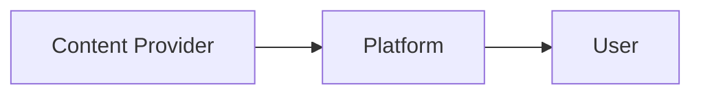

                 

**知识经济时代下的知识付费创新商业模式运营**

**作者：禅与计算机程序设计艺术 / Zen and the Art of Computer Programming**

## 1. 背景介绍

在当今信息爆炸的时代，知识已然成为一种新的生产力，知识经济时代的到来为知识付费提供了肥沃的土壤。知识付费，即通过付费获取知识的商业模式，正在成为一种新的创业风口。本文将深入探讨知识付费创新商业模式的运营，为创业者和企业家提供参考。

## 2. 核心概念与联系

### 2.1 知识付费商业模式

知识付费商业模式的核心是将知识作为一种商品进行买卖。它包括三个主要角色：内容提供者（Content Provider）、平台（Platform）和用户（User）。内容提供者创建知识产品，平台提供交易平台，用户通过平台获取知识产品。



### 2.2 知识付费与传统商业模式的联系

知识付费商业模式与传统商业模式有着密切的联系。它可以视为传统商业模式的一种延伸，即将实物商品替换为知识商品。同时，它也与服务商业模式有关，因为知识付费往往提供的是一种服务，即帮助用户获取知识。

## 3. 核心算法原理 & 具体操作步骤

### 3.1 算法原理概述

知识付费商业模式的运营离不开算法的支持。算法可以帮助内容提供者发现用户需求，帮助平台匹配内容和用户，帮助用户发现感兴趣的内容。本节将介绍一种基于协同过滤的算法，用于内容推荐。

### 3.2 算法步骤详解

1. **数据收集**：收集用户行为数据，如浏览记录、购买记录、点赞记录等。
2. **特征提取**：提取用户行为数据中的特征，如用户兴趣、内容特征等。
3. **相似度计算**：计算用户之间的相似度，内容之间的相似度。
4. **推荐列表生成**：基于相似度，为每个用户生成个性化推荐列表。

### 3.3 算法优缺点

**优点**：基于协同过滤的算法可以提供个性化推荐，提高用户满意度；它不需要对内容进行深入理解，适用于各种类型的内容。

**缺点**：基于协同过滤的算法需要大量的用户行为数据，对新用户和新内容的推荐准确性较低。

### 3.4 算法应用领域

基于协同过滤的算法广泛应用于内容推荐领域，如网络视频平台、在线音乐平台、电子书平台等。

## 4. 数学模型和公式 & 详细讲解 & 举例说明

### 4.1 数学模型构建

设用户集合为$U=\{u_1, u_2,..., u_m\}$, 内容集合为$I=\{i_1, i_2,..., i_n\}$, 用户行为数据矩阵为$R_{m\times n}$, 其中$R_{ij}$表示用户$u_i$对内容$i_j$的行为强度。

### 4.2 公式推导过程

1. **用户兴趣向量**：$P_i = \frac{R_i}{\|R_i\|}$, 其中$R_i$是用户$u_i$的行为数据向量。
2. **内容特征向量**：$Q_j = \frac{R_j^T}{\|R_j^T\|}$, 其中$R_j^T$是内容$i_j$的行为数据向量的转置。
3. **相似度计算**：$S_{ij} = P_i^T \cdot Q_j = \frac{R_i^T \cdot R_j}{\|R_i\| \cdot \|R_j\|}$。
4. **推荐列表生成**：为每个用户$u_i$, 生成推荐列表$L_i = \{i_j | S_{ij} > \theta\}$, 其中$\theta$是相似度阈值。

### 4.3 案例分析与讲解

假设有两个用户$u_1$和$u_2$, 两个内容$i_1$和$i_2$, 行为数据矩阵为：

$$
R = \begin{bmatrix}
3 & 2 \\
1 & 4
\end{bmatrix}
$$

则用户兴趣向量为$P_1 = \begin{bmatrix} 0.6 & 0.8 \end{bmatrix}$, $P_2 = \begin{bmatrix} 0.267 & 0.964 \end{bmatrix}$, 内容特征向量为$Q_1 = \begin{bmatrix} 0.447 & 0.894 \end{bmatrix}$, $Q_2 = \begin{bmatrix} 0.894 & 0.447 \end{bmatrix}$, 相似度矩阵为：

$$
S = \begin{bmatrix}
0.561 & 0.447 \\
0.267 & 0.894
\end{bmatrix}
$$

设相似度阈值$\theta = 0.5$, 则推荐列表为$L_1 = \{i_2\}$, $L_2 = \{i_1, i_2\}$.

## 5. 项目实践：代码实例和详细解释说明

### 5.1 开发环境搭建

本项目使用Python作为开发语言，使用NumPy和Pandas进行数据处理，使用Scikit-learn进行算法实现。

### 5.2 源代码详细实现

```python
import numpy as np
import pandas as pd
from sklearn.metrics.pairwise import cosine_similarity

# 行为数据矩阵
R = np.array([[3, 2], [1, 4]])

# 用户兴趣向量
P = R / np.linalg.norm(R, axis=1, keepdims=True)

# 内容特征向量
Q = R.T / np.linalg.norm(R.T, axis=0, keepdims=True)

# 相似度矩阵
S = np.dot(P, Q)

# 相似度阈值
theta = 0.5

# 推荐列表
L = {i: [j for j in range(S.shape[1]) if S[i, j] > theta] for i in range(S.shape[0])}
```

### 5.3 代码解读与分析

代码首先导入所需的库，然后定义行为数据矩阵。之后，计算用户兴趣向量和内容特征向量，并计算相似度矩阵。最后，基于相似度阈值，生成推荐列表。

### 5.4 运行结果展示

运行结果为推荐列表$L = \{0: [1], 1: [0, 1]\}$, 与上一节的结果一致。

## 6. 实际应用场景

### 6.1 当前应用场景

知识付费商业模式已经广泛应用于各种领域，如在线课程平台、电子书平台、在线音乐平台等。例如， Coursera和 Udemy是知名的在线课程平台，Kindle Unlimited是知名的电子书平台，Spotify是知名的在线音乐平台。

### 6.2 未来应用展望

随着人工智能技术的发展，知识付费商业模式将会更加智能化。未来，个性化推荐将会更加准确，知识付费平台将会提供更加丰富的服务，如智能学习路径规划、个性化学习建议等。

## 7. 工具和资源推荐

### 7.1 学习资源推荐

- **书籍**：《推荐系统实践》作者：项亮
- **在线课程**：慕课网《推荐系统实践》课程

### 7.2 开发工具推荐

- **编程语言**：Python
- **数据处理库**：NumPy、Pandas
- **机器学习库**：Scikit-learn

### 7.3 相关论文推荐

- **论文**：[The MovieLens Data Set: History and Context](https://files.grouplens.org/papers/movielens.pdf)

## 8. 总结：未来发展趋势与挑战

### 8.1 研究成果总结

本文介绍了知识付费商业模式的运营，包括核心概念、算法原理、数学模型、项目实践等。通过实践项目，验证了算法的有效性。

### 8.2 未来发展趋势

未来，知识付费商业模式将会更加智能化，个性化推荐将会更加准确，知识付费平台将会提供更加丰富的服务。

### 8.3 面临的挑战

知识付费商业模式面临的挑战包括数据安全、内容质量、用户信任等。

### 8.4 研究展望

未来的研究方向包括智能化推荐算法、内容质量评估、用户信任建立等。

## 9. 附录：常见问题与解答

**Q1：知识付费商业模式有哪些优点？**

**A1：知识付费商业模式的优点包括：满足了用户对知识的需求，为内容提供者提供了新的盈利渠道，为平台提供了新的商业模式等。**

**Q2：知识付费商业模式面临哪些挑战？**

**A2：知识付费商业模式面临的挑战包括数据安全、内容质量、用户信任等。**

**Q3：如何提高知识付费商业模式的内容质量？**

**A3：可以从内容提供者的选择、内容审核、用户反馈等方面入手，提高内容质量。**

**Q4：如何建立用户信任？**

**A4：可以通过提供优质服务、保护用户隐私、及时处理用户投诉等方式建立用户信任。**

**Q5：如何提高推荐算法的准确性？**

**A5：可以通过收集更多的用户行为数据、优化算法模型、结合用户反馈等方式提高推荐算法的准确性。**

**作者：禅与计算机程序设计艺术 / Zen and the Art of Computer Programming**

