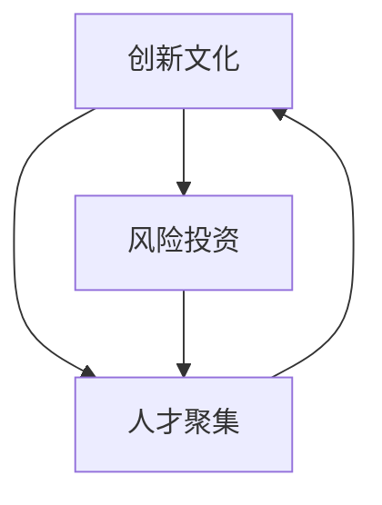

                 

**硅谷对世界的影响:科技变革浪潮**

**作者：禅与计算机程序设计艺术 / Zen and the Art of Computer Programming**

## 1. 背景介绍

硅谷，这个位于美国加州的狭长地带，因其丰富的硅矿而得名。然而，今天的硅谷已不再是单纯的矿产资源之地，而是全球科技创新的中心。从这里诞生了无数颠覆性的技术和产品，影响着世界的方方面面。本文将深入探讨硅谷对世界的影响，聚焦于其引领的科技变革浪潮。

## 2. 核心概念与联系

硅谷的成功离不开其独特的创新生态系统。这一系统的核心概念包括：

- **创新文化**：硅谷鼓励冒险和失败，认为失败是通往成功的必经之路。
- **风险投资**：硅谷的风投机构为初创企业提供资金，推动创新。
- **人才聚集**：硅谷吸引全球顶尖人才，推动技术进步。

这些概念是相互联系的，共同构成了硅谷的创新引擎。下图是这些概念的关系图：



## 3. 核心算法原理 & 具体操作步骤

### 3.1 算法原理概述

硅谷的成功离不开其背后的核心算法和技术。其中之一是**机器学习**算法。机器学习的目标是让计算机在未被明确编程的情况下学习，即从数据中学习。

### 3.2 算法步骤详解

机器学习算法的一般步骤包括：

1. **数据收集**：收集与问题相关的数据。
2. **数据预处理**：清洗、转换和标准化数据。
3. **特征选择/提取**：选择或提取数据中的关键特征。
4. **模型选择**：选择合适的机器学习模型。
5. **训练**：使用训练数据训练模型。
6. **评估**：评估模型的性能。
7. **优化**：优化模型的性能。
8. **部署**：将模型部署到生产环境中。

### 3.3 算法优缺点

机器学习算法的优点包括能够从数据中学习、适应性强、可以处理复杂的非线性关系。其缺点包括对大量数据的需求、可能出现过拟合或欠拟合、解释性差。

### 3.4 算法应用领域

机器学习广泛应用于图像识别、自然语言处理、推荐系统、自动驾驶等领域。

## 4. 数学模型和公式 & 详细讲解 & 举例说明

### 4.1 数学模型构建

在机器学习中，常用的数学模型之一是**线性回归**模型。其数学表达式为：

$$y = wx + b$$

其中，$y$是预测值，$x$是输入特征，$w$是权重，$b$是偏置项。

### 4.2 公式推导过程

线性回归模型的目标是最小化预测值和真实值之间的误差。误差函数为：

$$E = \frac{1}{n}\sum_{i=1}^{n}(y_i - \hat{y}_i)^2$$

其中，$y_i$是真实值，$\hat{y}_i$是预测值，$n$是样本数。通过最小化误差函数，可以求得最优的权重和偏置项。

### 4.3 案例分析与讲解

例如，假设我们要预测房价。输入特征$x$是房屋的面积，输出$y$是房屋的价格。通过收集数据并训练线性回归模型，我们可以得到权重$w$和偏置项$b$. 然后，我们可以使用这个模型预测未知房屋的价格。

## 5. 项目实践：代码实例和详细解释说明

### 5.1 开发环境搭建

要实现机器学习算法，我们需要Python、NumPy、Pandas、Scikit-learn等库。可以使用Anaconda来管理这些库。

### 5.2 源代码详细实现

以下是使用Scikit-learn实现线性回归的示例代码：

```python
from sklearn.linear_model import LinearRegression
from sklearn.model_selection import train_test_split
from sklearn.metrics import mean_squared_error

# 假设X和y是输入特征和输出
X_train, X_test, y_train, y_test = train_test_split(X, y, test_size=0.2, random_state=42)

model = LinearRegression()
model.fit(X_train, y_train)

y_pred = model.predict(X_test)

print('Mean Squared Error:', mean_squared_error(y_test, y_pred))
```

### 5.3 代码解读与分析

这段代码使用Scikit-learn的`LinearRegression`类来训练线性回归模型。`train_test_split`函数将数据分为训练集和测试集。`fit`方法用于训练模型，`predict`方法用于预测。最后，使用`mean_squared_error`函数计算预测值和真实值之间的均方误差。

### 5.4 运行结果展示

运行这段代码后，你会得到一个均方误差值。这个值越小，说明模型的预测越准确。

## 6. 实际应用场景

### 6.1 当前应用

机器学习广泛应用于各个领域，如搜索引擎、推荐系统、自动驾驶、医疗诊断等。

### 6.2 未来应用展望

未来，机器学习有望在更多领域得到应用，如城市规划、环境保护、基础设施维护等。此外，深度学习等更复杂的机器学习技术有望取得更大的突破。

## 7. 工具和资源推荐

### 7.1 学习资源推荐

推荐阅读《机器学习》一书，以及Andrew Ng的机器学习课程。

### 7.2 开发工具推荐

推荐使用Jupyter Notebook、Google Colab等工具来开发机器学习模型。

### 7.3 相关论文推荐

推荐阅读《深度学习》论文，以及其他相关的机器学习论文。

## 8. 总结：未来发展趋势与挑战

### 8.1 研究成果总结

硅谷的成功离不开其引领的科技变革浪潮。机器学习等技术正在改变世界，带来了巨大的变化和机遇。

### 8.2 未来发展趋势

未来，人工智能、物联网、区块链等技术有望取得更大的突破，带来更多的创新和变化。

### 8.3 面临的挑战

然而，这些技术也带来了挑战，如就业问题、隐私保护、技术垄断等。我们需要平衡技术进步和社会福祉。

### 8.4 研究展望

未来的研究方向包括深度学习、强化学习、自监督学习等。此外，解释性AI、可信AI等方向也将受到关注。

## 9. 附录：常见问题与解答

**Q：硅谷的成功秘诀是什么？**

**A：硅谷的成功离不开其独特的创新生态系统，包括创新文化、风险投资、人才聚集等。**

**Q：机器学习有哪些应用领域？**

**A：机器学习广泛应用于图像识别、自然语言处理、推荐系统、自动驾驶等领域。**

**Q：未来的研究方向是什么？**

**A：未来的研究方向包括深度学习、强化学习、自监督学习等。此外，解释性AI、可信AI等方向也将受到关注。**

**作者：禅与计算机程序设计艺术 / Zen and the Art of Computer Programming**

