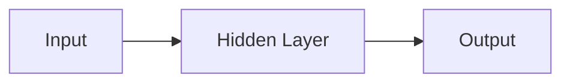

                 

## 1. 背景介绍

神经网络（Neural Network）是一种模拟人类大脑神经元网络的计算模型，是机器学习和深度学习的核心。自从1943年Warren McCulloch和Walter Pitts首次提出神经元模型以来，神经网络已经发展成为一个庞大而多样化的领域，在图像识别、自然语言处理、推荐系统等各种应用中取得了非凡的成功。

## 2. 核心概念与联系

### 2.1 关键概念

- **神经元（Neuron）**：神经网络的基本单位，模拟人类大脑中的神经元。
- **权重（Weight）**：神经元之间连接的强度，通过学习过程调整。
- **偏置（Bias）**：神经元的固有倾向，影响输出结果。
- **激活函数（Activation Function）**：引入非线性，使神经网络能够学习复杂的函数。

### 2.2 架构

神经网络由输入层、隐藏层和输出层组成。数据通过输入层进入网络，在隐藏层进行处理，最后由输出层生成结果。下图是一个简单的神经网络架构示例：



## 3. 核心算法原理 & 具体操作步骤

### 3.1 算法原理概述

神经网络的学习过程包括两个主要阶段：前向传播和反向传播。

- **前向传播（Forward Propagation）**：数据从输入层传递到输出层，生成预测结果。
- **反向传播（Backpropagation）**：计算梯度，更新权重和偏置，以最小化预测误差。

### 3.2 算法步骤详解

1. **初始化权重和偏置**：随机初始化神经元之间的连接强度和固有倾向。
2. **前向传播**：计算每层神经元的输出，直到输出层。
3. **计算误差**：比较预测结果和真实值，计算误差。
4. **反向传播**：计算梯度，更新权重和偏置。
5. **重复步骤2-4**：直到误差足够小，或达到最大迭代次数。

### 3.3 算法优缺点

**优点**：
- 可以学习复杂的非线性函数。
- 具有良好的泛化能力。
- 可以处理高维数据。

**缺点**：
- 训练过程计算量大，需要大量数据和计算资源。
- 易陷入局部最小值，导致收敛速度慢。
- 缺乏解释性，模型的决策过程不易理解。

### 3.4 算法应用领域

神经网络在各种领域都有广泛应用，包括：

- **图像识别**：如人脸识别、物体检测、图像分类等。
- **自然语言处理**：如文本分类、机器翻译、语言模型等。
- **推荐系统**：如电影推荐、商品推荐等。
- **自动驾驶**：如目标检测、路径规划等。

## 4. 数学模型和公式 & 详细讲解 & 举例说明

### 4.1 数学模型构建

神经网络的数学模型可以表示为：

$$y = f(wx + b)$$

其中，$x$是输入，$w$是权重，$b$是偏置，$f$是激活函数，$y$是输出。

### 4.2 公式推导过程

神经网络的学习过程可以使用梯度下降法最小化误差函数。误差函数通常选择均方误差（Mean Squared Error，MSE）：

$$E = \frac{1}{2}(y - \hat{y})^2$$

其中，$y$是真实值，$\hat{y}$是预测值。梯度下降法更新规则为：

$$w := w - \eta \frac{\partial E}{\partial w}$$

$$b := b - \eta \frac{\partial E}{\partial b}$$

其中，$\eta$是学习率。

### 4.3 案例分析与讲解

例如，考虑一个简单的二层全连接神经网络，用于回归问题。输入为$x \in \mathbb{R}^2$，输出为$y \in \mathbb{R}$。假设激活函数为ReLU，$w \in \mathbb{R}^{2 \times 1}$，$b \in \mathbb{R}$。则前向传播过程为：

$$\hat{y} = f(wx + b) = \max(0, w^Tx + b)$$

## 5. 项目实践：代码实例和详细解释说明

### 5.1 开发环境搭建

本项目使用Python和TensorFlow框架。需要安装以下库：

- Python 3.7+
- TensorFlow 2.0+
- NumPy
- Matplotlib

### 5.2 源代码详细实现

以下是一个简单的二层全连接神经网络实现：

```python
import numpy as np
import tensorflow as tf
from tensorflow.keras.models import Sequential
from tensorflow.keras.layers import Dense

# 定义模型
model = Sequential()
model.add(Dense(32, activation='relu', input_shape=(2,)))
model.add(Dense(1))

# 编译模型
model.compile(optimizer='adam', loss='mse')

# 训练模型
model.fit(x_train, y_train, epochs=100, batch_size=32)
```

### 5.3 代码解读与分析

- `Sequential()`创建一个线性模型。
- `Dense()`添加全连接层。第一层指定输入维度，后续层无需指定。
- `compile()`编译模型，指定优化器和损失函数。
- `fit()`训练模型，指定训练数据、迭代次数和批量大小。

### 5.4 运行结果展示

训练完成后，模型的损失函数值应接近于0。可以使用`model.evaluate(x_test, y_test)`评估模型在测试集上的表现。

## 6. 实际应用场景

### 6.1 当前应用

神经网络在各种领域都有广泛应用，如图像识别、自然语言处理、推荐系统等。例如，Facebook使用神经网络进行人脸识别，Amazon使用神经网络进行商品推荐。

### 6.2 未来应用展望

未来，神经网络有望在更多领域取得突破，如自动驾驶、医疗诊断、金融风险预测等。此外，生成式对抗网络（Generative Adversarial Networks，GAN）和变分自编码器（Variational Autoencoders，VAE）等新兴技术也有望取得更多成就。

## 7. 工具和资源推荐

### 7.1 学习资源推荐

- **书籍**："Deep Learning" by Ian Goodfellow, Yoshua Bengio, and Aaron Courville
- **在线课程**：Coursera的"Deep Learning Specialization"和Udacity的"Deep Learning"课程
- **博客**：KDNuggets（https://www.kdnuggets.com/）和Towards Data Science（https://towardsdatascience.com/）

### 7.2 开发工具推荐

- **框架**：TensorFlow、PyTorch、Keras
- **开发环境**：Jupyter Notebook、Google Colab
- **可视化工具**：TensorBoard、Matplotlib、Seaborn

### 7.3 相关论文推荐

- "A Neural Algorithm of Artistic Style" by Gatys et al.
- "Generative Adversarial Networks" by Goodfellow et al.
- "Deep Residual Learning for Image Recognition" by He et al.

## 8. 总结：未来发展趋势与挑战

### 8.1 研究成果总结

神经网络已经取得了非凡的成功，在各种领域都有广泛应用。然而，仍然存在许多挑战需要解决。

### 8.2 未来发展趋势

未来，神经网络有望在更多领域取得突破，如自动驾驶、医疗诊断、金融风险预测等。此外，新兴技术如GAN和VAE也有望取得更多成就。

### 8.3 面临的挑战

- **计算资源**：神经网络的训练过程计算量大，需要大量数据和计算资源。
- **解释性**：神经网络缺乏解释性，模型的决策过程不易理解。
- **泛化能力**：神经网络易陷入过拟合，导致泛化能力下降。

### 8.4 研究展望

未来的研究方向包括：

- **新的架构**：开发新的神经网络架构，如注意力机制、transformer等。
- **新的训练方法**：开发新的训练方法，如对抗训练、自监督学习等。
- **可解释性**：提高神经网络的可解释性，使模型的决策过程更易理解。

## 9. 附录：常见问题与解答

**Q：神经网络的学习过程需要大量数据吗？**

A：是的，神经网络的学习过程需要大量数据。数据量越大，模型的泛化能力越好。

**Q：神经网络易陷入局部最小值吗？**

A：是的，神经网络易陷入局部最小值，导致收敛速度慢。使用批量梯度下降法和适当的学习率可以减轻这个问题。

**Q：神经网络的解释性如何？**

A：神经网络缺乏解释性，模型的决策过程不易理解。然而，一些技术如LIME和SHAP可以帮助解释神经网络的决策过程。

**作者：禅与计算机程序设计艺术 / Zen and the Art of Computer Programming**

