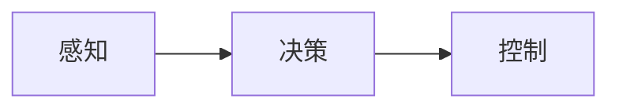
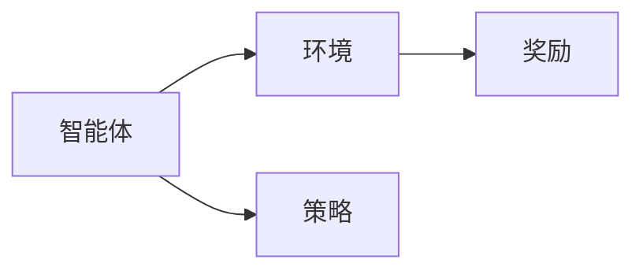

                 

# 端到端学习范式优化自动驾驶模型性能的案例启示 

**作者：禅与计算机程序设计艺术 / Zen and the Art of Computer Programming**

## 1. 背景介绍

随着自动驾驶技术的不断发展，端到端学习（End-to-End Learning）范式因其简单有效的特点而受到广泛关注。本文将深入探讨端到端学习范式，并通过一个实际案例展示如何优化自动驾驶模型性能。

## 2. 核心概念与联系

### 2.1 端到端学习范式

端到端学习是一种直接从感知数据到控制输出的学习范式，无需人工设计中间表示。其核心思想是将感知、决策和控制这三个环节整合为一个端到端的学习系统。



### 2.2 深度强化学习

端到端学习通常基于深度强化学习（Deep Reinforcement Learning）框架实现。深度强化学习结合了深度学习和强化学习，允许智能体在交互环境中学习最优策略。



## 3. 核心算法原理 & 具体操作步骤

### 3.1 算法原理概述

端到端学习算法的核心是使用深度神经网络表示策略函数，并通过反向传播优化策略函数，使智能体学习到最优策略。

### 3.2 算法步骤详解

1. **状态表示**：将感知数据（如图像、激光雷达数据）输入神经网络，提取表示当前状态的特征。
2. **策略函数**：使用神经网络表示策略函数，输出动作分布。
3. **采样与执行**：根据策略函数采样动作，执行动作并观察环境的转移和奖励。
4. **反向传播**：使用经验回放和梯度下降优化策略函数，使智能体学习到最优策略。

### 3.3 算法优缺点

**优点**：端到端学习简单有效，无需人工设计中间表示，可以学习复杂的非线性关系。

**缺点**：端到端学习对数据量和计算资源要求高，且学习到的策略难以解释。

### 3.4 算法应用领域

端到端学习在自动驾驶、机器人控制、游戏AI等领域有着广泛的应用。

## 4. 数学模型和公式 & 详细讲解 & 举例说明

### 4.1 数学模型构建

设状态空间为$\mathcal{S}$, 动作空间为$\mathcal{A}$, 奖励函数为$r(s, a, s')$, 策略函数为$\pi(a|s; \theta)$, 其中$\theta$是神经网络的参数。智能体的目标是最大化期望回报$J(\theta) = \mathbb{E}[\sum_{t=0}^{T-1} \gamma^t r(s_t, a_t, s_{t+1})]$, 其中$\gamma$是折扣因子。

### 4.2 公式推导过程

使用Policy Gradient方法优化策略函数，梯度为：

$$
\nabla J(\theta) = \mathbb{E}[\nabla_\theta \log \pi(a_t|s_t; \theta) \sum_{t'=t}^{T-1} \gamma^{t'-t} \nabla_{a_{t'}} Q^{\pi}(s_{t'}, a_{t'})]
$$

其中$Q^{\pi}(s, a)$是状态-动作值函数。使用经验回放和梯度下降优化策略函数。

### 4.3 案例分析与讲解

例如，在自动驾驶任务中，状态$s$可以是图像特征，动作$a$可以是方向盘转角和油门踏板位置，奖励$r$可以是避免碰撞和到达目的地的奖励。智能体学习到的策略函数$\pi(a|s; \theta)$输出动作分布，指导自动驾驶汽车行驶。

## 5. 项目实践：代码实例和详细解释说明

### 5.1 开发环境搭建

使用Python和TensorFlow构建端到端学习算法。安装必要的库，如`tensorflow`, `gym`, `numpy`, `matplotlib`.

### 5.2 源代码详细实现

```python
import tensorflow as tf
import numpy as np
import gym

# 定义神经网络模型
model = tf.keras.Sequential([
    tf.keras.layers.Dense(64, activation='relu', input_shape=(state_dim,)),
    tf.keras.layers.Dense(64, activation='relu'),
    tf.keras.layers.Dense(action_dim, activation='softmax')
])

# 定义优化器和损失函数
optimizer = tf.keras.optimizers.Adam(learning_rate=0.001)
loss_fn = tf.keras.losses.CategoricalCrossentropy()

# 定义训练步骤
@tf.function
def train_step(state, action, next_state, reward, done):
    with tf.GradientTape() as tape:
        probs = model(state, training=True)
        loss = loss_fn(action, probs)
        -reward * (1 - done)
    grads = tape.gradient(loss, model.trainable_variables)
    optimizer.apply_gradients(zip(grads, model.trainable_variables))
```

### 5.3 代码解读与分析

上述代码定义了端到端学习算法的训练步骤。状态输入神经网络，输出动作分布。使用交叉熵损失函数优化策略函数，使智能体学习到最优策略。

### 5.4 运行结果展示

通过训练端到端学习算法，智能体可以学习到在自动驾驶环境中行驶的策略。可以使用`matplotlib`绘制智能体的学习曲线，展示其性能的提高。

## 6. 实际应用场景

### 6.1 自动驾驶

端到端学习在自动驾驶领域有着广泛的应用。例如，DeepDrive项目使用端到端学习算法训练自动驾驶汽车在高速公路上行驶。

### 6.2 机器人控制

端到端学习也可以应用于机器人控制任务。例如，Google Brain团队使用端到端学习算法训练机器人学习走路。

### 6.3 未来应用展望

随着计算资源和数据量的增加，端到端学习有望在更多领域得到应用，如医疗、金融等。

## 7. 工具和资源推荐

### 7.1 学习资源推荐

- 书籍：《深度学习》作者：Ian Goodfellow, Yoshua Bengio, Aaron Courville
- 课程：Stanford CS221 - Artificial Intelligence: Principles and Techniques

### 7.2 开发工具推荐

- TensorFlow：<https://www.tensorflow.org/>
- Gym：<https://gym.openai.com/>

### 7.3 相关论文推荐

- [End-to-End Deep Learning for Self-Driving Cars](https://arxiv.org/abs/1604.07316)
- [Deep Reinforcement Learning for Continuous Control](https://arxiv.org/abs/1509.02971)

## 8. 总结：未来发展趋势与挑战

### 8.1 研究成果总结

端到端学习在自动驾驶和机器人控制等领域取得了显著成果，证明了其简单有效的优点。

### 8.2 未来发展趋势

端到端学习有望在更多领域得到应用，并与其他人工智能技术结合，如Transformer模型和生成式对抗网络。

### 8.3 面临的挑战

端到端学习对数据量和计算资源要求高，且学习到的策略难以解释。此外，端到端学习算法的稳定性和泛化能力仍需进一步提高。

### 8.4 研究展望

未来的研究方向包括但不限于：提高端到端学习算法的稳定性和泛化能力，开发新的端到端学习算法，并与其他人工智能技术结合。

## 9. 附录：常见问题与解答

**Q：端到端学习需要大量的数据吗？**

**A：**是的，端到端学习通常需要大量的数据来训练神经网络。在自动驾驶任务中，这通常意味着需要大量的真实驾驶数据或模拟数据。

**Q：端到端学习学习到的策略难以解释吗？**

**A：**是的，端到端学习学习到的策略通常难以解释。这是因为端到端学习使用神经网络表示策略函数，而神经网络的决策过程通常是非线性和复杂的。

**Q：端到端学习可以与其他人工智能技术结合吗？**

**A：**是的，端到端学习可以与其他人工智能技术结合。例如，端到端学习可以与Transformer模型结合，用于处理序列数据。又如，端到端学习可以与生成式对抗网络结合，用于生成合成数据。

## 结束语

端到端学习是一种简单有效的学习范式，在自动驾驶和机器人控制等领域取得了显著成果。然而，端到端学习仍面临着挑战，如对数据量和计算资源的要求高，学习到的策略难以解释等。未来的研究方向包括但不限于：提高端到端学习算法的稳定性和泛化能力，开发新的端到端学习算法，并与其他人工智能技术结合。

**作者：禅与计算机程序设计艺术 / Zen and the Art of Computer Programming**

（完）

