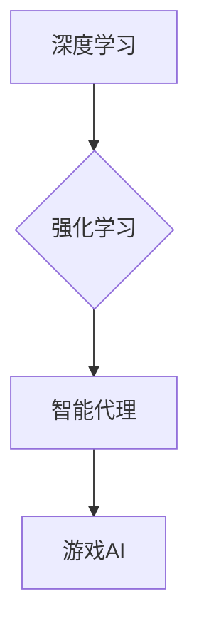

> 深度学习、智能代理、视频游戏、强化学习、游戏AI

## 1. 背景介绍

视频游戏作为一种娱乐和社交方式，近年来发展迅速，其技术水平也日益提高。其中，游戏人工智能（Game AI）作为游戏体验的重要组成部分，一直是游戏开发领域的研究热点。传统的基于规则的游戏AI往往难以应对复杂的游戏场景和玩家行为，而深度学习算法凭借其强大的学习能力和泛化能力，为构建更智能、更具挑战性的游戏AI提供了新的可能性。

智能深度学习代理（Intelligent Deep Learning Agents）是指能够通过深度学习算法学习和决策的游戏角色。这些代理可以自主学习游戏规则、策略和玩家行为模式，从而做出更智能、更符合人类游戏行为的决策。

## 2. 核心概念与联系

### 2.1 深度学习

深度学习是一种机器学习的子领域，它利用多层神经网络来模拟人类大脑的学习过程。深度学习算法能够从海量数据中自动提取特征，并学习复杂的模式和关系。

### 2.2 强化学习

强化学习是一种机器学习方法，它通过奖励和惩罚机制来训练智能代理。智能代理在与环境交互的过程中，会根据其采取的行动获得奖励或惩罚，并根据这些反馈调整其策略，以最大化累积的奖励。

### 2.3 游戏AI

游戏AI是指在视频游戏中模拟智能角色的行为和决策过程。传统的基于规则的游戏AI通常需要人工设计大量的规则和逻辑，而深度学习算法可以帮助游戏开发者构建更灵活、更智能的游戏AI。

**核心概念与联系流程图**



## 3. 核心算法原理 & 具体操作步骤

### 3.1 算法原理概述

智能深度学习代理在视频游戏场景中的应用主要基于强化学习算法。强化学习算法的核心思想是通过奖励机制来训练智能代理，使其在与环境交互的过程中学习最优策略。

在游戏场景中，智能代理可以看作是学习者，游戏环境可以看作是学习者所处的环境，游戏状态可以看作是环境的当前情况，智能代理采取的行动可以看作是学习者对环境的反应，游戏奖励可以看作是学习者对环境的反馈。

### 3.2 算法步骤详解

1. **环境建模:** 将游戏环境建模为一个状态空间和动作空间。状态空间表示游戏中的所有可能的状态，动作空间表示智能代理可以采取的所有动作。

2. **策略网络构建:** 使用深度神经网络构建策略网络，该网络将游戏状态作为输入，输出智能代理采取的动作概率分布。

3. **奖励函数设计:** 设计一个奖励函数，该函数将智能代理采取的行动和游戏状态映射到一个奖励值。奖励函数的设计至关重要，因为它决定了智能代理学习的方向。

4. **强化学习算法训练:** 使用强化学习算法，例如深度Q网络（DQN）或策略梯度算法，训练策略网络。训练过程包括智能代理与环境交互，根据奖励反馈更新策略网络的参数。

5. **策略部署:** 将训练好的策略网络部署到游戏环境中，使智能代理能够根据策略网络的输出做出决策。

### 3.3 算法优缺点

**优点:**

* 能够学习复杂的游戏策略。
* 具有较强的泛化能力，可以应用于不同的游戏场景。
* 可以通过调整奖励函数来控制智能代理的行为。

**缺点:**

* 训练过程可能需要大量的计算资源和时间。
* 奖励函数的设计需要经验和技巧。
* 智能代理的行为可能难以预测和解释。

### 3.4 算法应用领域

智能深度学习代理在视频游戏场景中的应用领域非常广泛，包括：

* **游戏角色控制:** 训练智能代理控制游戏角色，使其能够自主完成任务，例如探索地图、战斗敌人、收集资源等。
* **游戏难度调节:** 根据玩家的技能水平动态调整游戏难度，使游戏体验更加贴合玩家需求。
* **游戏剧情设计:** 利用智能代理生成游戏剧情，创造出更具随机性和趣味性的游戏体验。
* **游戏辅助工具:** 开发智能辅助工具，例如自动战斗、自动寻路等，帮助玩家提高游戏效率。

## 4. 数学模型和公式 & 详细讲解 & 举例说明

### 4.1 数学模型构建

在强化学习中，智能代理与环境交互的过程可以建模为马尔可夫决策过程（MDP）。MDP由以下几个要素组成：

* **状态空间 (S):** 表示游戏中的所有可能的状态。
* **动作空间 (A):** 表示智能代理可以采取的所有动作。
* **转移概率 (P):** 表示从一个状态到另一个状态的概率，取决于智能代理采取的动作。
* **奖励函数 (R):** 将智能代理采取的行动和游戏状态映射到一个奖励值。
* **折扣因子 (γ):** 表示未来奖励的权重，通常取值在0到1之间。

### 4.2 公式推导过程

智能代理的目标是学习一个策略 π，该策略将状态映射到动作，以最大化累积的奖励。

**Bellman方程:**

$$
V^{\pi}(s) = \max_{a \in A} \left[ R(s, a) + \gamma \sum_{s' \in S} P(s' | s, a) V^{\pi}(s') \right]
$$

其中：

* $V^{\pi}(s)$ 表示在策略 π 下，从状态 s 开始的期望累积奖励。
* $R(s, a)$ 表示在状态 s 下采取动作 a 的奖励。
* $P(s' | s, a)$ 表示从状态 s 采取动作 a 到状态 s' 的转移概率。

### 4.3 案例分析与讲解

例如，在游戏中，智能代理的目标是收集尽可能多的金币。我们可以设计一个奖励函数，将收集到一枚金币奖励 1 分，被敌人攻击惩罚 1 分。

通过训练深度Q网络，智能代理可以学习到从当前状态采取哪个动作可以获得最大的累积奖励，从而实现收集金币的目标。

## 5. 项目实践：代码实例和详细解释说明

### 5.1 开发环境搭建

* Python 3.x
* TensorFlow 或 PyTorch 深度学习框架
* OpenAI Gym 游戏环境库

### 5.2 源代码详细实现

```python
import gym
import tensorflow as tf

# 定义深度Q网络
class DQN(tf.keras.Model):
    def __init__(self, state_size, action_size):
        super(DQN, self).__init__()
        self.dense1 = tf.keras.layers.Dense(64, activation='relu')
        self.dense2 = tf.keras.layers.Dense(action_size)

    def call(self, state):
        x = self.dense1(state)
        return self.dense2(x)

# 创建游戏环境
env = gym.make('CartPole-v1')

# 定义超参数
state_size = env.observation_space.shape[0]
action_size = env.action_space.n
learning_rate = 0.001
gamma = 0.99
epsilon = 0.1

# 创建深度Q网络
model = DQN(state_size, action_size)
optimizer = tf.keras.optimizers.Adam(learning_rate)

# 训练循环
for episode in range(1000):
    state = env.reset()
    done = False
    total_reward = 0

    while not done:
        # 选择动作
        if tf.random.uniform(()) < epsilon:
            action = env.action_space.sample()
        else:
            action = tf.argmax(model(tf.expand_dims(state, 0))).numpy()[0]

        # 执行动作并获取奖励和下一个状态
        next_state, reward, done, _ = env.step(action)

        # 更新目标Q值
        target_q = reward + gamma * tf.reduce_max(model(tf.expand_dims(next_state, 0)))

        # 计算损失
        with tf.GradientTape() as tape:
            q_values = model(tf.expand_dims(state, 0))
            loss = tf.keras.losses.mean_squared_error(q_values[0, action], target_q)

        # 反向传播并更新模型参数
        gradients = tape.gradient(loss, model.trainable_variables)
        optimizer.apply_gradients(zip(gradients, model.trainable_variables))

        # 更新状态
        state = next_state

        # 更新总奖励
        total_reward += reward

    print(f'Episode: {episode}, Total Reward: {total_reward}')

# 保存模型
model.save('cartpole_dqn_model.h5')
```

### 5.3 代码解读与分析

这段代码实现了深度Q网络算法训练一个智能代理玩“CartPole”游戏。

* 首先，定义了深度Q网络模型，包含两层全连接神经网络。
* 然后，创建了游戏环境和定义了训练超参数。
* 训练循环中，智能代理根据策略网络输出的动作执行游戏动作，并根据奖励更新模型参数。
* 最后，保存训练好的模型。

### 5.4 运行结果展示

训练完成后，智能代理能够在“CartPole”游戏中保持平衡杆的平衡时间越来越长。

## 6. 实际应用场景

### 6.1 游戏角色控制

智能深度学习代理可以控制游戏角色，使其能够自主完成任务，例如探索地图、战斗敌人、收集资源等。例如，在RPG游戏中，智能代理可以控制角色自动战斗，根据敌人的攻击模式调整策略，提高战斗效率。

### 6.2 游戏难度调节

根据玩家的技能水平动态调整游戏难度，使游戏体验更加贴合玩家需求。例如，在射击游戏中，如果玩家表现出色，游戏可以增加敌人数量或提高敌人的攻击力，以保持游戏的挑战性。

### 6.3 游戏剧情设计

利用智能代理生成游戏剧情，创造出更具随机性和趣味性的游戏体验。例如，在冒险游戏中，智能代理可以根据玩家的选择生成不同的剧情分支，使游戏体验更加多样化。

### 6.4 未来应用展望

随着深度学习技术的不断发展，智能深度学习代理在视频游戏场景中的应用前景更加广阔。未来，我们可以期待看到更多更智能、更具挑战性的游戏AI，为玩家带来更沉浸式的游戏体验。

## 7. 工具和资源推荐

### 7.1 学习资源推荐

* **书籍:**
    * 《深度学习》 - Ian Goodfellow, Yoshua Bengio, Aaron Courville
    * 《强化学习：原理、算法和应用》 - Richard S. Sutton, Andrew G. Barto
* **在线课程:**
    * Coursera: 深度学习 Specialization
    * Udacity: 强化学习 Nanodegree

### 7.2 开发工具推荐

* **深度学习框架:** TensorFlow, PyTorch
* **游戏环境库:** OpenAI Gym, Unity ML-Agents

### 7.3 相关论文推荐

* **DQN:** Deep Q-Network
* **DDQN:** Double Deep Q-Network
* **A3C:** Asynchronous Advantage Actor-Critic

## 8. 总结：未来发展趋势与挑战

### 8.1 研究成果总结

近年来，深度学习算法在视频游戏场景中的应用取得了显著进展，智能深度学习代理能够学习复杂的游戏策略，并展现出令人惊叹的智能行为。

### 8.2 未来发展趋势

* **更强大的模型:** 研究更强大的深度学习模型，例如Transformer和Generative Adversarial Networks (GANs)，以提高智能代理的学习能力和表现力。
* **多智能体强化学习:** 研究多智能体强化学习算法，使多个智能代理能够协同合作完成任务，例如团队合作游戏。
* **可解释性:** 研究智能代理决策过程的可解释性，使人类能够更好地理解智能代理的行为，并提高其可信度