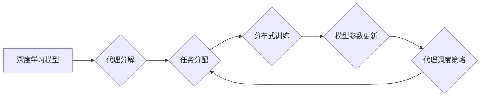

> 深度学习、代理调度、自适应学习、强化学习、资源管理

## 1. 背景介绍

随着人工智能技术的飞速发展，深度学习算法在各个领域取得了显著的成果。然而，深度学习模型的训练和部署通常需要大量的计算资源和时间。为了提高资源利用率和训练效率，自适应深度学习代理的调度策略成为一个重要的研究方向。

传统的深度学习训练方式通常采用集中式训练，所有数据和模型都集中在单个服务器上进行训练。这种方式在数据量较小、模型规模较小时可以有效，但随着数据规模和模型复杂度的增加，集中式训练面临着巨大的挑战：

* **资源瓶颈:** 集中式训练需要大量的计算资源，难以满足大规模数据和模型训练的需求。
* **训练时间长:** 集中式训练需要将所有数据一次性加载到内存中进行训练，训练时间较长。
* **模型更新效率低:** 模型更新需要将所有节点的梯度信息汇总到主节点进行更新，更新效率较低。

为了解决这些问题，自适应深度学习代理的调度策略应运而生。这种策略将深度学习模型分解成多个代理，每个代理负责处理一部分数据，并独立进行训练。代理之间通过通信机制共享模型参数和梯度信息，从而实现分布式训练。

## 2. 核心概念与联系

### 2.1 深度学习代理

深度学习代理是一个独立的计算单元，负责处理一部分数据并训练模型。代理可以运行在不同的硬件平台上，例如CPU、GPU、TPU等。代理之间通过通信机制共享模型参数和梯度信息，实现分布式训练。

### 2.2 代理调度策略

代理调度策略是指如何分配任务给代理，以及如何协调代理之间的通信和协作。调度策略的目标是最大化资源利用率、提高训练效率和保证模型的收敛性。

### 2.3 自适应学习

自适应学习是指代理根据训练数据和环境变化动态调整自己的行为和参数。例如，代理可以根据数据分布的变化调整模型的学习率，或者根据资源可用性的变化调整训练策略。

**核心概念与架构流程图:**



## 3. 核心算法原理 & 具体操作步骤

### 3.1 算法原理概述

自适应深度学习代理的调度策略通常基于强化学习算法。强化学习算法是一种机器学习算法，它通过奖励机制来训练代理学习最优的行为策略。

在自适应深度学习代理的调度策略中，代理可以看作是智能体，环境可以看作是深度学习训练环境。代理的目标是最大化奖励，奖励可以是训练效率、资源利用率等指标。

### 3.2 算法步骤详解

1. **环境建模:** 建立深度学习训练环境的模型，包括数据分布、资源可用性等信息。
2. **代理初始化:** 初始化代理的模型参数和行为策略。
3. **任务分配:** 根据代理的当前状态和环境信息，分配任务给代理。
4. **分布式训练:** 代理根据分配的任务进行训练，并更新模型参数。
5. **模型参数更新:** 代理将更新的模型参数发送给其他代理，进行模型参数融合。
6. **奖励计算:** 计算代理的奖励，奖励可以是训练效率、资源利用率等指标。
7. **策略更新:** 根据奖励信息，更新代理的行为策略，使其在未来能够获得更高的奖励。
8. **重复步骤3-7:** 直到代理的行为策略收敛，或者达到预设的训练目标。

### 3.3 算法优缺点

**优点:**

* **提高资源利用率:** 将深度学习模型分解成多个代理，可以充分利用多台机器的计算资源。
* **提高训练效率:** 分布式训练可以并行化训练过程，缩短训练时间。
* **自适应性强:** 代理可以根据环境变化动态调整自己的行为和参数，提高训练的鲁棒性。

**缺点:**

* **通信开销:** 代理之间需要频繁通信，这会增加通信开销。
* **模型同步问题:** 需要保证代理之间模型参数的同步，否则会影响训练效果。
* **调度策略设计复杂:** 设计有效的代理调度策略是一个复杂的任务，需要考虑多个因素。

### 3.4 算法应用领域

自适应深度学习代理的调度策略在以下领域具有广泛的应用前景:

* **大规模数据分析:** 处理海量数据进行分析和挖掘。
* **图像识别和视频处理:** 训练高精度图像识别和视频处理模型。
* **自然语言处理:** 训练更智能的聊天机器人和语言翻译系统。
* **药物研发:** 加速药物研发过程，发现新的药物候选物。

## 4. 数学模型和公式 & 详细讲解 & 举例说明

### 4.1 数学模型构建

假设有N个代理，每个代理负责处理一部分数据，并训练一个深度学习模型。代理的训练目标是最大化奖励函数R(s,a)，其中s表示代理的当前状态，a表示代理采取的动作。

奖励函数可以定义为：

$$R(s,a) = \alpha \cdot \frac{1}{T} + \beta \cdot \frac{1}{C}$$

其中：

* $\alpha$ 和 $\beta$ 是权重参数，用于平衡训练效率和资源利用率。
* $T$ 是代理完成任务所需的时间。
* $C$ 是代理使用的计算资源。

### 4.2 公式推导过程

代理的行为策略可以表示为一个概率分布P(a|s)，其中a表示代理采取的动作，s表示代理的当前状态。代理可以通过强化学习算法，例如Q学习或SARSA，来学习最优的行为策略。

Q学习算法的目标是学习一个Q值函数，Q(s,a)，该函数表示代理在状态s采取动作a的期望奖励。Q值函数的更新规则如下：

$$Q(s,a) = Q(s,a) + \alpha \cdot [r + \gamma \cdot \max_{a'} Q(s',a') - Q(s,a)]$$

其中：

* $\alpha$ 是学习率。
* $r$ 是代理在状态s采取动作a获得的奖励。
* $\gamma$ 是折扣因子，用于权衡未来的奖励。
* $s'$ 是代理从状态s采取动作a后进入的下一个状态。

### 4.3 案例分析与讲解

假设有一个图像识别任务，需要训练一个深度学习模型来识别不同类型的动物。可以使用自适应深度学习代理的调度策略来训练这个模型。

可以将图像数据集分成多个子集，每个子集分配给一个代理进行训练。代理可以根据图像子集的特征，调整自己的模型参数和训练策略。

通过代理之间的通信和协作，可以实现模型参数的融合，最终训练出一个高精度图像识别模型。

## 5. 项目实践：代码实例和详细解释说明

### 5.1 开发环境搭建

* 操作系统: Ubuntu 20.04
* Python 版本: 3.8
* 深度学习框架: TensorFlow 2.x
* 其他依赖库: numpy, matplotlib, seaborn

### 5.2 源代码详细实现

```python
# 代理类
class Agent:
    def __init__(self, model, lr):
        self.model = model
        self.lr = lr

    def train(self, data):
        # 使用模型训练数据
        # 更新模型参数
        pass

    def update_model(self, new_params):
        # 更新模型参数
        pass

# 调度策略类
class Scheduler:
    def __init__(self, agents, data_loader):
        self.agents = agents
        self.data_loader = data_loader

    def allocate_tasks(self):
        # 根据代理状态和数据分布分配任务
        pass

    def synchronize_models(self):
        # 协调代理之间模型参数的更新
        pass

# 主程序
if __name__ == "__main__":
    # 初始化代理和调度策略
    agents = [Agent(model, lr) for _ in range(num_agents)]
    scheduler = Scheduler(agents, data_loader)

    # 训练循环
    for epoch in range(num_epochs):
        scheduler.allocate_tasks()
        for agent in agents:
            agent.train(data)
        scheduler.synchronize_models()
```

### 5.3 代码解读与分析

* **代理类:** 每个代理负责处理一部分数据并训练模型。代理类包含模型、学习率等属性，以及训练和更新模型参数的方法。
* **调度策略类:** 调度策略类负责分配任务给代理，以及协调代理之间模型参数的更新。调度策略类可以根据代理的状态和环境信息，动态调整任务分配策略。
* **主程序:** 主程序初始化代理和调度策略，然后启动训练循环。在训练循环中，调度策略分配任务给代理，代理进行训练，调度策略协调模型参数更新。

### 5.4 运行结果展示

运行代码后，可以观察到代理的训练进度和模型性能指标的变化。

## 6. 实际应用场景

### 6.1 医疗影像分析

自适应深度学习代理可以用于处理大规模的医疗影像数据，例如X光片、CT扫描和MRI扫描。代理可以分别处理不同类型的影像数据，并训练不同的模型，从而提高影像分析的准确性和效率。

### 6.2 金融风险评估

自适应深度学习代理可以用于评估金融风险，例如信用风险和市场风险。代理可以分别处理不同类型的金融数据，例如客户信用记录和市场波动数据，并训练不同的模型，从而提高风险评估的准确性和及时性。

### 6.3 自动驾驶

自适应深度学习代理可以用于训练自动驾驶模型，例如车道保持和避障。代理可以分别处理不同类型的传感器数据，例如摄像头图像和雷达数据，并训练不同的模型，从而提高自动驾驶系统的安全性。

### 6.4 未来应用展望

随着人工智能技术的不断发展，自适应深度学习代理的调度策略将在更多领域得到应用，例如：

* **个性化教育:** 根据学生的学习情况，个性化推荐学习内容和训练策略。
* **智能制造:** 优化生产流程，提高生产效率和产品质量。
* **科学研究:** 加速科学发现，解决复杂科学问题。

## 7. 工具和资源推荐

### 7.1 学习资源推荐

* **书籍:**
    * 深度学习
    * 强化学习
* **在线课程:**
    * Coursera: 深度学习
    * Udacity: 强化学习
* **博客:**
    * OpenAI Blog
    * DeepMind Blog

### 7.2 开发工具推荐

* **深度学习框架:** TensorFlow, PyTorch, Keras
* **强化学习库:** OpenAI Gym, Stable Baselines3
* **云计算平台:** AWS, Azure, Google Cloud

### 7.3 相关论文推荐

* **Proximal Policy Optimization Algorithms**
* **Asynchronous Methods for Deep Reinforcement Learning**
* **Deep Reinforcement Learning with Double Q-Learning**

## 8. 总结：未来发展趋势与挑战

### 8.1 研究成果总结

自适应深度学习代理的调度策略是一个新兴的研究方向，取得了一些重要的成果。例如，研究人员开发了多种有效的调度策略，并将其应用于不同的领域，取得了显著的性能提升。

### 8.2 未来发展趋势

未来，自适应深度学习代理的调度策略将朝着以下方向发展:

* **更智能的调度策略:** 开发更智能的调度策略，能够更好地适应动态变化的环境。
* **更有效的资源利用:** 提高资源利用率，减少训练成本。
* **更广泛的应用场景:** 将自适应深度学习代理的调度策略应用于更多领域。

### 8.3 面临的挑战

自适应深度学习代理的调度策略仍然面临一些挑战:

* **通信开销:** 代理之间需要频繁通信，这会增加通信开销。
* **模型同步问题:** 需要保证