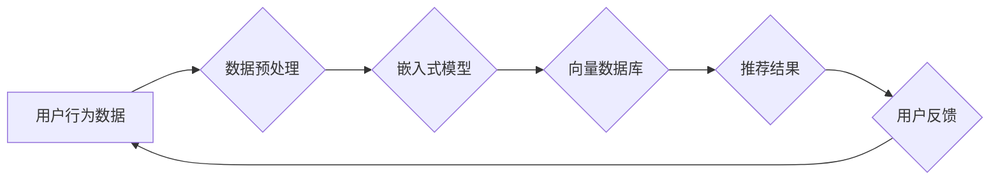

> AI, 向量数据库, 推荐系统, 实时性, 效率, 嵌入式表示, 检索

## 1. 背景介绍

在当今数据爆炸的时代，推荐系统已成为各大互联网平台的核心功能之一，其目的是根据用户的历史行为、偏好等信息，精准推荐用户感兴趣的内容，从而提升用户体验和平台活跃度。传统的基于内容的推荐和基于协同过滤的推荐方法，在面对海量数据和用户个性化需求时，存在着效率低下、冷启动问题等挑战。

近年来，随着深度学习技术的快速发展，基于嵌入式表示的推荐系统逐渐成为研究热点。该方法将用户和物品映射到高维向量空间中，通过计算向量之间的相似度进行推荐。然而，传统的基于内存的嵌入式表示存储和检索方式，在处理海量数据时，面临着存储空间和查询效率的瓶颈。

向量数据库作为一种专门用于存储和检索高维向量的数据库，凭借其高效的查询能力和可扩展性，为基于嵌入式表示的推荐系统提供了新的解决方案。

## 2. 核心概念与联系

**2.1 向量数据库**

向量数据库是一种专门用于存储和检索高维向量的数据库。它利用专门的索引结构和查询算法，能够高效地计算向量之间的相似度，并快速返回最相似的向量。

**2.2 嵌入式表示**

嵌入式表示是指将用户、物品等实体映射到低维向量空间中的技术。通过训练深度学习模型，将实体的语义信息编码到向量中，使得向量能够反映实体之间的语义相似度。

**2.3 实时推荐系统**

实时推荐系统是指能够根据用户实时行为，快速响应并提供个性化推荐的推荐系统。它需要具备高效率的查询能力和低延迟响应时间。

**2.4 核心架构**



**2.5 核心概念联系**

在基于向量数据库的实时推荐系统中，用户行为数据首先经过预处理，然后输入到嵌入式模型中，将用户和物品映射到高维向量空间。这些向量存储在向量数据库中，并通过高效的查询算法，计算用户向量与物品向量的相似度，从而生成推荐结果。用户对推荐结果的反馈会被收集并反馈到系统中，用于模型训练和优化，实现推荐系统的持续迭代和提升。

## 3. 核心算法原理 & 具体操作步骤

**3.1 算法原理概述**

基于向量数据库的实时推荐系统主要依赖于以下核心算法：

* **嵌入式表示学习:** 利用深度学习模型，将用户和物品映射到低维向量空间，使得向量能够反映实体之间的语义相似度。
* **向量相似度计算:** 计算用户向量与物品向量之间的相似度，常用的方法包括余弦相似度、欧氏距离等。
* **向量检索:** 在向量数据库中高效地检索与用户向量最相似的物品向量。

**3.2 算法步骤详解**

1. **数据预处理:** 对用户行为数据进行清洗、转换和特征提取，例如将用户历史购买记录转化为用户兴趣向量。
2. **嵌入式模型训练:** 利用深度学习模型，例如Word2Vec、GloVe、BERT等，训练嵌入式模型，将用户和物品映射到低维向量空间。
3. **向量数据库构建:** 将训练好的嵌入式向量存储在向量数据库中，并构建相应的索引结构，例如Faiss、Annoy等。
4. **实时推荐:** 当用户发出请求时，首先根据用户的行为特征生成用户向量，然后在向量数据库中检索与用户向量最相似的物品向量，并根据相似度排序，返回推荐结果。

**3.3 算法优缺点**

**优点:**

* **高效的查询能力:** 向量数据库能够高效地计算向量之间的相似度，并快速返回最相似的向量。
* **可扩展性:** 向量数据库能够根据需要扩展存储空间和查询能力。
* **个性化推荐:** 嵌入式表示能够捕捉用户和物品之间的语义相似度，实现个性化推荐。

**缺点:**

* **模型训练成本:** 训练高质量的嵌入式模型需要大量的计算资源和数据。
* **数据稀疏性:** 当用户和物品数量庞大时，数据稀疏性问题可能会影响推荐效果。

**3.4 算法应用领域**

基于向量数据库的实时推荐系统广泛应用于以下领域:

* **电商推荐:** 推荐商品、优惠券、促销活动等。
* **内容推荐:** 推荐新闻、视频、音乐、书籍等。
* **社交推荐:** 推荐好友、群组、话题等。
* **搜索引擎:** 提升搜索结果的精准度和相关性。

## 4. 数学模型和公式 & 详细讲解 & 举例说明

**4.1 数学模型构建**

假设用户集合为U，物品集合为I，用户u的兴趣向量为u，物品i的特征向量为i。

**4.2 公式推导过程**

常用的向量相似度计算方法包括余弦相似度和欧氏距离。

* **余弦相似度:**

$$
\text{cosine}(u, i) = \frac{u \cdot i}{||u|| ||i||}
$$

其中，u·i表示用户向量u和物品向量i的点积，||u||和||i||分别表示用户向量u和物品向量i的模长。

* **欧氏距离:**

$$
\text{euclidean}(u, i) = ||u - i||
$$

其中，||u - i||表示用户向量u和物品向量i之间的欧氏距离。

**4.3 案例分析与讲解**

假设用户u的兴趣向量为[0.2, 0.5, 0.8]，物品i的特征向量为[0.1, 0.4, 0.7]。

* **余弦相似度:**

$$
\text{cosine}(u, i) = \frac{(0.2 \times 0.1) + (0.5 \times 0.4) + (0.8 \times 0.7)}{(\sqrt{0.2^2 + 0.5^2 + 0.8^2})(\sqrt{0.1^2 + 0.4^2 + 0.7^2})} \approx 0.8
$$

* **欧氏距离:**

$$
\text{euclidean}(u, i) = \sqrt{(0.2 - 0.1)^2 + (0.5 - 0.4)^2 + (0.8 - 0.7)^2} \approx 0.2
$$

从计算结果可以看出，余弦相似度和欧氏距离都能够反映用户u和物品i之间的相似度，但余弦相似度更注重方向上的相似性，而欧氏距离更注重距离上的相似性。

## 5. 项目实践：代码实例和详细解释说明

**5.1 开发环境搭建**

* Python 3.7+
* PyTorch 1.7+
* Faiss 1.7+

**5.2 源代码详细实现**

```python
import torch
from faiss import IndexFlatL2

# 嵌入式模型
class EmbeddingModel(torch.nn.Module):
    def __init__(self, embedding_dim):
        super(EmbeddingModel, self).__init__()
        self.embedding_dim = embedding_dim

    def forward(self, input_data):
        # 嵌入式模型的具体实现
        return embeddings

# 向量数据库
index = IndexFlatL2(embedding_dim)

# 数据加载
user_data = ...
item_data = ...

# 嵌入式表示学习
embeddings = EmbeddingModel()(user_data)
index.add(embeddings)

# 实时推荐
user_vector = EmbeddingModel()(user_data)
distances, indices = index.search(user_vector, k=10)

# 返回推荐结果
recommended_items = [item_data[i] for i in indices[0]]
```

**5.3 代码解读与分析**

* 嵌入式模型: 使用 PyTorch 定义了一个简单的嵌入式模型，可以根据实际需求进行修改和扩展。
* 向量数据库: 使用 Faiss 库构建了一个基于 L2 距离的向量数据库。
* 数据加载: 加载用户和物品数据，并进行预处理。
* 嵌入式表示学习: 使用嵌入式模型将用户和物品映射到低维向量空间。
* 实时推荐: 根据用户的行为特征生成用户向量，在向量数据库中检索与用户向量最相似的物品向量，并返回推荐结果。

**5.4 运行结果展示**

运行代码后，将返回用户最相关的 10 个物品，并可以根据实际需求进行展示和交互。

## 6. 实际应用场景

**6.1 电商推荐**

在电商平台，基于向量数据库的实时推荐系统可以根据用户的历史购买记录、浏览记录、收藏记录等信息，推荐用户可能感兴趣的商品。例如，当用户浏览了一款运动鞋时，系统可以根据用户的兴趣向量，推荐其他类型的运动鞋、运动服饰等相关商品。

**6.2 内容推荐**

在内容平台，例如新闻网站、视频网站、音乐平台等，基于向量数据库的实时推荐系统可以根据用户的阅读历史、观看历史、点赞历史等信息，推荐用户可能感兴趣的内容。例如，当用户阅读了一篇科技新闻时，系统可以根据用户的兴趣向量，推荐其他类型的科技新闻、科技博客文章等相关内容。

**6.3 社交推荐**

在社交平台，例如微信、QQ、微博等，基于向量数据库的实时推荐系统可以根据用户的社交关系、兴趣爱好、行为模式等信息，推荐用户可能感兴趣的朋友、群组、话题等。例如，当用户加入了一个兴趣小组时，系统可以根据用户的兴趣向量，推荐其他成员、相关话题等。

**6.4 搜索引擎**

在搜索引擎，基于向量数据库的实时推荐系统可以根据用户的搜索历史、点击记录、反馈信息等信息，提升搜索结果的精准度和相关性。例如，当用户搜索“智能手机”时，系统可以根据用户的兴趣向量，推荐与智能手机相关的商品、新闻、视频等内容。

**6.5 未来应用展望**

随着人工智能技术的不断发展，基于向量数据库的实时推荐系统将应用于更多领域，例如个性化教育、医疗诊断、金融理财等。

## 7. 工具和资源推荐

**7.1 学习资源推荐**

* **书籍:**
    * 《深度学习》
    * 《推荐系统实践》
* **在线课程:**
    * Coursera: 深度学习
    * Udacity: 机器学习工程师
* **博客:**
    * Towards Data Science
    * Machine Learning Mastery

**7.2 开发工具推荐**

* **Python:** 
    * PyTorch
    * TensorFlow
* **向量数据库:**
    * Faiss
    * Annoy
    * Milvus

**7.3 相关论文推荐**

* **BERT:** Devlin, J., Chang, M. W., Lee, K., & Toutanova, K. (2018). BERT: Pre-training of deep bidirectional transformers for language understanding. arXiv preprint arXiv:1810.04805.
* **Faiss:** Johnson, M., & Kulis, B. (2018). Fast approximate nearest neighbors with automatic algorithm configuration. In Proceedings of the 2018 IEEE International Conference on Data Mining (pp. 1-10). IEEE.

## 8. 总结：未来发展趋势与挑战

**8.1 研究成果总结**

基于向量数据库的实时推荐系统取得了显著的成果，在提升推荐精准度、个性化程度、效率等方面表现出色。

**8.2 未来发展趋势**

* **模型复杂度提升:** 探索更深、更复杂的嵌入式模型，例如Transformer、Graph Neural Networks等，以更好地捕捉用户和物品之间的复杂关系。
* **数据融合:** 将多种数据类型，例如文本、图像、音频等融合在一起，构建更全面的用户和物品表示。
* **个性化增强:** 基于用户行为、偏好、上下文等信息，实现更精准的个性化推荐。
* **实时性提升:** 利用分布式计算、云计算等技术，进一步提升推荐系统的实时性。

**8.3 面临的挑战**

* **数据稀疏性:** 当用户和物品数量庞大时，数据稀疏性问题可能会影响推荐效果。
* **模型训练成本:** 训练高质量的嵌入式模型需要大量的计算资源和数据。
* **隐私保护:** 如何保护用户隐私数据，是基于向量数据库的实时推荐系统面临的重要挑战。

**8.4 研究展望**

未来，基于向量数据库的实时推荐系统将朝着更智能、更个性化、更安全的方向发展，为用户提供更优质的体验。


## 9. 附录：常见问题与解答

**9.1 如何选择合适的向量数据库？**

选择合适的向量数据库需要根据实际应用场景和需求进行考虑，例如数据规模、查询效率、支持的算法等。

**9.2 如何处理数据稀疏性问题？**

数据稀疏性问题可以通过以下方法进行处理:

* **数据聚合:** 将用户和物品进行聚类，将稀疏数据进行聚合。
* **迁移学习:** 利用预训练模型，迁移知识到新的数据上。
* **负采样:** 在训练过程中，随机抽取负样本，提高模型的鲁棒性。

**9.3 如何保证用户隐私数据安全？**

可以采用以下方法保证用户隐私数据安全:

* **数据加密:** 对用户数据进行加密，防止未经授权的访问。
* **联邦学习:** 在不共享原始数据的情况下，利用分布式训练，实现模型训练。
* **差分隐私:** 通过添加噪声，保护用户数据隐私。


作者：禅与计算机程序设计艺术 / Zen and the Art of Computer Programming 
<end_of_turn>