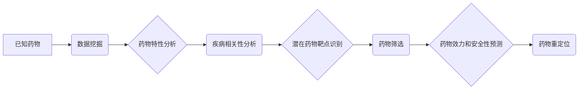

> 药物重定位，人工智能，机器学习，深度学习，药物发现，数据挖掘，案例分析

## 1. 背景介绍

药物研发是一个漫长而昂贵的过程，通常需要花费数十亿美元和数年的时间才能将一种新药推向市场。传统药物发现方法依赖于高通量筛选和结构生物学等技术，但这些方法效率低下，成功率低。近年来，人工智能（AI）技术在药物研发领域取得了显著进展，为加速药物发现和开发提供了新的思路。

药物重定位是指利用已知药物治疗新的疾病或适应症的过程。传统的药物重定位方法主要依赖于文献检索和专家经验，效率低下。而AI技术可以利用海量的数据和强大的计算能力，从多个角度分析药物和疾病之间的关系，从而提高药物重定位的效率和成功率。

## 2. 核心概念与联系

**2.1 药物重定位的概念**

药物重定位是指利用已知药物治疗新的疾病或适应症的过程。

**2.2 人工智能在药物重定位中的应用**

AI技术可以应用于药物重定位的各个阶段，包括：

* **目标识别:** 利用AI算法分析疾病相关的基因、蛋白质和通路，识别潜在的药物靶点。
* **药物筛选:** 利用AI算法从已知药物库中筛选出具有治疗特定疾病潜力的药物。
* **预测药物效力和安全性:** 利用AI算法预测药物对特定疾病的疗效和安全性。
* **优化药物剂量和给药方案:** 利用AI算法优化药物的剂量和给药方案，提高疗效和安全性。

**2.3 AI技术与药物重定位的联系**

AI技术可以帮助药物重定位克服传统方法的局限性，提高效率和成功率。



## 3. 核心算法原理 & 具体操作步骤

**3.1 算法原理概述**

药物重定位的核心算法原理主要基于机器学习和深度学习技术。

* **机器学习:** 利用已知的药物和疾病数据训练机器学习模型，使模型能够预测新的药物和疾病之间的关系。常见的机器学习算法包括支持向量机（SVM）、决策树、随机森林和神经网络等。
* **深度学习:** 深度学习是一种更高级的机器学习技术，利用多层神经网络来学习复杂的特征和模式。深度学习算法在药物重定位领域取得了显著的成果，例如卷积神经网络（CNN）和循环神经网络（RNN）。

**3.2 算法步骤详解**

1. **数据收集和预处理:** 收集相关药物和疾病数据，并进行清洗、标准化和特征提取等预处理工作。
2. **模型训练:** 利用机器学习或深度学习算法训练模型，使模型能够预测新的药物和疾病之间的关系。
3. **模型评估:** 利用测试数据评估模型的性能，例如准确率、召回率和F1-score等。
4. **药物筛选:** 利用训练好的模型从已知药物库中筛选出具有治疗特定疾病潜力的药物。
5. **实验验证:** 对筛选出的药物进行实验验证，确认其对特定疾病的疗效和安全性。

**3.3 算法优缺点**

**优点:**

* **提高效率:** AI技术可以加速药物重定位过程，缩短研发周期。
* **降低成本:** AI技术可以减少药物研发成本，提高投资回报率。
* **提高成功率:** AI技术可以提高药物重定位的成功率，开发出更多有效的药物。

**缺点:**

* **数据依赖:** AI技术依赖于高质量的数据，数据不足或质量差会影响模型性能。
* **算法解释性:** 一些AI算法的解释性较差，难以理解模型的决策过程。
* **伦理问题:** AI技术在药物研发中的应用可能引发伦理问题，例如数据隐私和算法偏见等。

**3.4 算法应用领域**

AI技术在药物重定位领域具有广泛的应用前景，例如：

* **癌症治疗:** 重定位现有药物治疗新的癌症类型。
* **传染病治疗:** 重定位现有药物治疗新的传染病。
* **罕见病治疗:** 重定位现有药物治疗罕见病。
* **神经退行性疾病治疗:** 重定位现有药物治疗阿尔茨海默病、帕金森病等神经退行性疾病。

## 4. 数学模型和公式 & 详细讲解 & 举例说明

**4.1 数学模型构建**

在药物重定位中，可以使用多种数学模型来描述药物和疾病之间的关系。例如，可以使用图论模型来表示药物和疾病之间的相互作用，可以使用机器学习模型来预测药物对疾病的疗效。

**4.2 公式推导过程**

这里以支持向量机（SVM）为例，推导其在药物重定位中的应用公式。

SVM是一种监督学习算法，用于分类和回归问题。在药物重定位中，可以使用SVM将药物和疾病进行分类，例如将具有治疗特定疾病潜力的药物与其他药物区分开来。

SVM的目标是找到一个超平面，将不同类别的药物和疾病分开。超平面的方程可以表示为：

```latex
w^T x + b = 0
```

其中：

* $w$ 是超平面的法向量。
* $x$ 是药物或疾病的特征向量。
* $b$ 是超平面的截距。

SVM的目标函数是最大化超平面的间隔，即最大化不同类别的药物和疾病到超平面的距离。

**4.3 案例分析与讲解**

例如，可以使用SVM将具有治疗癌症潜力的药物与其他药物区分开来。

* **数据:** 收集癌症患者的临床数据和药物使用数据。
* **特征提取:** 从临床数据和药物使用数据中提取特征，例如患者的年龄、性别、肿瘤类型、药物的化学结构等。
* **模型训练:** 利用SVM算法训练模型，将具有治疗癌症潜力的药物与其他药物区分开来。
* **模型评估:** 利用测试数据评估模型的性能，例如准确率、召回率和F1-score等。

## 5. 项目实践：代码实例和详细解释说明

**5.1 开发环境搭建**

* 操作系统：Ubuntu 20.04
* Python 版本：3.8
* 必要的库：pandas, numpy, scikit-learn, tensorflow

**5.2 源代码详细实现**

```python
import pandas as pd
from sklearn.model_selection import train_test_split
from sklearn.svm import SVC
from sklearn.metrics import accuracy_score

# 加载数据
data = pd.read_csv('drug_data.csv')

# 特征选择和数据预处理
X = data[['chemical_structure', 'target_protein']]
y = data['disease']

# 数据分割
X_train, X_test, y_train, y_test = train_test_split(X, y, test_size=0.2, random_state=42)

# 模型训练
model = SVC(kernel='rbf')
model.fit(X_train, y_train)

# 模型预测
y_pred = model.predict(X_test)

# 模型评估
accuracy = accuracy_score(y_test, y_pred)
print(f'模型准确率: {accuracy}')
```

**5.3 代码解读与分析**

* 代码首先加载药物数据，并选择相关的特征和目标变量。
* 然后，将数据分割为训练集和测试集。
* 接着，使用支持向量机（SVM）算法训练模型。
* 最后，使用训练好的模型对测试数据进行预测，并计算模型的准确率。

**5.4 运行结果展示**

运行代码后，会输出模型的准确率。

## 6. 实际应用场景

**6.1 药物重定位案例分析**

* **案例一:** 利用AI技术重定位抗生素治疗新的细菌感染。
* **案例二:** 利用AI技术重定位抗癌药物治疗新的癌症类型。

**6.2 未来应用展望**

* **个性化药物治疗:** 利用AI技术为患者提供个性化的药物治疗方案。
* **药物组合疗法:** 利用AI技术发现新的药物组合疗法，提高治疗效果。
* **药物研发加速:** 利用AI技术加速药物研发过程，缩短研发周期。

## 7. 工具和资源推荐

**7.1 学习资源推荐**

* **书籍:**
    * Deep Learning for Drug Discovery and Development
    * Artificial Intelligence in Drug Discovery
* **在线课程:**
    * Coursera: Machine Learning
    * edX: Deep Learning

**7.2 开发工具推荐**

* **Python:** 广泛用于机器学习和深度学习开发。
* **TensorFlow:** 开源深度学习框架。
* **PyTorch:** 开源深度学习框架。

**7.3 相关论文推荐**

* **Nature:** Deep learning for drug discovery
* **Science:** Artificial intelligence in drug discovery

## 8. 总结：未来发展趋势与挑战

**8.1 研究成果总结**

AI技术在药物重定位领域取得了显著进展，为加速药物发现和开发提供了新的思路。

**8.2 未来发展趋势**

* **模型复杂度提升:** 开发更复杂、更强大的AI模型，提高药物重定位的准确率和效率。
* **数据规模扩大:** 收集和整合更多的数据，提高模型的训练质量和泛化能力。
* **跨学科合作:** 加强跨学科合作，将AI技术与其他领域的技术相结合，例如生物信息学、化学和药理学。

**8.3 面临的挑战**

* **数据质量:** AI技术依赖于高质量的数据，数据不足或质量差会影响模型性能。
* **算法解释性:** 一些AI算法的解释性较差，难以理解模型的决策过程。
* **伦理问题:** AI技术在药物研发中的应用可能引发伦理问题，例如数据隐私和算法偏见等。

**8.4 研究展望**

未来，AI技术将在药物重定位领域发挥越来越重要的作用，为人类健康做出更大的贡献。


## 9. 附录：常见问题与解答

**9.1 Q: AI技术在药物重定位中的应用有哪些局限性？**

**A:** AI技术在药物重定位中的应用仍然存在一些局限性，例如数据质量、算法解释性和伦理问题等。

**9.2 Q: 如何提高AI技术在药物重定位中的准确率？**

**A:** 可以通过以下方式提高AI技术在药物重定位中的准确率：

* 收集和整合更多高质量的数据。
* 开发更复杂、更强大的AI模型。
* 使用更有效的特征提取方法。
* 进行更深入的模型评估和优化。


作者：禅与计算机程序设计艺术 / Zen and the Art of Computer Programming 
<end_of_turn>