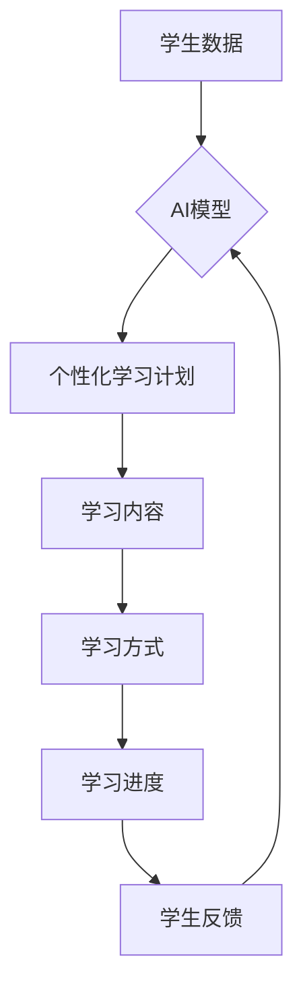

> AI, 个性化学习, 教育科技, 机器学习, 深度学习, 自然语言处理, 人工智能

## 1. 背景介绍

教育一直是人类社会发展的重要基石，而传统的教育模式往往难以满足每个学生个性化的学习需求。随着人工智能技术的飞速发展，AI驱动的个性化学习逐渐成为教育领域的热点话题。

传统的教育模式通常采用“一刀切”的教学方法，将所有学生按照相同的标准进行教学，忽略了学生个体差异。这种模式导致一些学生学习进度过快，感到枯燥乏味，而另一些学生学习进度过慢，难以跟上课程进度。

AI驱动的个性化学习旨在通过人工智能技术，为每个学生提供定制化的学习体验，帮助他们更好地理解知识，提高学习效率。

## 2. 核心概念与联系

**2.1 个性化学习**

个性化学习是指根据学生的个体差异，定制化的学习计划、学习内容、学习方式和学习进度。它强调学生的自主学习、探索学习和实践学习，旨在帮助学生更好地理解知识，提高学习兴趣和学习能力。

**2.2 人工智能 (AI)**

人工智能是指模拟人类智能行为的计算机系统。AI技术涵盖了机器学习、深度学习、自然语言处理等多个领域，能够帮助我们自动分析数据、识别模式、做出决策等。

**2.3 AI驱动的个性化学习**

AI驱动的个性化学习是指利用人工智能技术，为每个学生提供个性化的学习体验。它通过分析学生的学习数据，例如学习进度、学习偏好、学习风格等，为学生定制化的学习计划、学习内容、学习方式和学习进度。

**2.4 架构图**



## 3. 核心算法原理 & 具体操作步骤

**3.1 算法原理概述**

AI驱动的个性化学习主要依赖于机器学习算法，例如：

* **推荐系统算法:** 用于推荐个性化的学习内容，例如书籍、视频、练习题等。
* **知识图谱算法:** 用于构建知识网络，帮助学生理解知识之间的关系。
* **自然语言处理算法:** 用于分析学生的学习文本，例如作业、笔记、讨论等，了解学生的学习状态和学习需求。

**3.2 算法步骤详解**

1. **数据收集:** 收集学生的学习数据，例如学习进度、学习偏好、学习风格等。
2. **数据预处理:** 对收集到的数据进行清洗、转换和特征提取。
3. **模型训练:** 利用机器学习算法，对预处理后的数据进行训练，构建个性化学习模型。
4. **个性化学习计划生成:** 根据学生的学习数据和模型预测，生成个性化的学习计划，包括学习内容、学习方式和学习进度。
5. **学习过程监控:** 持续监控学生的学习过程，根据学生的反馈和学习情况，动态调整学习计划。

**3.3 算法优缺点**

* **优点:**

    * 可以根据学生的个体差异，提供个性化的学习体验。
    * 可以提高学生的学习效率和学习兴趣。
    * 可以帮助教师更好地了解学生的学习状态和学习需求。

* **缺点:**

    * 需要大量的学习数据进行模型训练。
    * 模型的准确性取决于数据的质量和算法的复杂度。
    * 需要考虑数据隐私和安全问题。

**3.4 算法应用领域**

* **在线教育平台:** 为学生提供个性化的学习路径和学习内容。
* **智能辅导系统:** 为学生提供个性化的学习指导和反馈。
* **教育游戏:** 通过游戏的方式，帮助学生学习知识和技能。

## 4. 数学模型和公式 & 详细讲解 & 举例说明

**4.1 数学模型构建**

个性化学习模型可以采用多种数学模型，例如：

* **线性回归模型:** 用于预测学生的学习成绩。
* **逻辑回归模型:** 用于预测学生的学习状态，例如是否理解了某个知识点。
* **支持向量机模型:** 用于分类学生，例如将学生分为不同的学习能力组。

**4.2 公式推导过程**

例如，线性回归模型的公式如下：

$$y = \beta_0 + \beta_1x_1 + \beta_2x_2 + ... + \beta_nx_n + \epsilon$$

其中：

* $y$ 是预测变量，例如学生的学习成绩。
* $x_1, x_2, ..., x_n$ 是自变量，例如学生的学习时间、学习效率等。
* $\beta_0, \beta_1, ..., \beta_n$ 是模型参数，需要通过训练数据进行估计。
* $\epsilon$ 是误差项。

**4.3 案例分析与讲解**

假设我们想要预测学生的数学成绩，我们可以使用线性回归模型。

* 自变量：学生的学习时间、学习效率等。
* 预测变量：学生的数学成绩。

通过训练数据，我们可以估计模型参数 $\beta_0, \beta_1, ..., \beta_n$。然后，我们可以使用这个模型来预测新学生的数学成绩。

## 5. 项目实践：代码实例和详细解释说明

**5.1 开发环境搭建**

* Python 3.x
* TensorFlow 或 PyTorch
* Jupyter Notebook

**5.2 源代码详细实现**

```python
import tensorflow as tf

# 定义模型
model = tf.keras.models.Sequential([
    tf.keras.layers.Dense(64, activation='relu', input_shape=(5,)),
    tf.keras.layers.Dense(1)
])

# 编译模型
model.compile(optimizer='adam', loss='mse')

# 训练模型
model.fit(X_train, y_train, epochs=10)

# 预测
predictions = model.predict(X_test)
```

**5.3 代码解读与分析**

* 我们使用 TensorFlow 库构建了一个简单的线性回归模型。
* 模型包含两个全连接层，第一个层有 64 个神经元，第二个层输出一个值，代表学生的数学成绩。
* 我们使用 Adam 优化器和均方误差损失函数来训练模型。
* 我们训练了 10 个 epochs，即模型在训练数据上迭代了 10 次。
* 最后，我们使用训练好的模型来预测测试数据的数学成绩。

**5.4 运行结果展示**

* 我们可以使用评估指标，例如均方根误差 (RMSE)，来评估模型的性能。
* RMSE 越小，模型的预测精度越高。

## 6. 实际应用场景

**6.1 在线教育平台**

* 为学生提供个性化的学习路径和学习内容。
* 根据学生的学习进度和学习情况，动态调整学习计划。
* 为学生提供个性化的学习指导和反馈。

**6.2 智能辅导系统**

* 为学生提供个性化的学习指导和反馈。
* 帮助学生理解知识点，解决学习难题。
* 跟踪学生的学习进度，及时发现学习问题。

**6.3 教育游戏**

* 通过游戏的方式，帮助学生学习知识和技能。
* 提高学生的学习兴趣和学习效率。
* 提供个性化的游戏体验，满足学生的不同学习需求。

**6.4 未来应用展望**

* AI驱动的个性化学习将更加智能化、个性化和自动化。
* 将更加广泛地应用于各个教育领域，例如小学、中学、大学、职业教育等。
* 将帮助学生更好地理解知识，提高学习效率，实现个性化学习目标。

## 7. 工具和资源推荐

**7.1 学习资源推荐**

* **书籍:**
    * 《深度学习》
    * 《机器学习》
    * 《人工智能：一种现代方法》
* **在线课程:**
    * Coursera
    * edX
    * Udacity

**7.2 开发工具推荐**

* **Python:**
    * TensorFlow
    * PyTorch
    * scikit-learn
* **Jupyter Notebook:**
    * 用于编写和运行 Python 代码

**7.3 相关论文推荐**

* **Personalized Learning with Deep Learning**
* **A Survey of Personalized Learning Systems**
* **The Promise and Challenges of AI-Powered Personalized Learning**

## 8. 总结：未来发展趋势与挑战

**8.1 研究成果总结**

AI驱动的个性化学习取得了显著的进展，为教育领域带来了新的机遇。

* AI算法能够有效地分析学生的学习数据，为学生提供个性化的学习体验。
* AI驱动的个性化学习能够提高学生的学习效率和学习兴趣。

**8.2 未来发展趋势**

* AI驱动的个性化学习将更加智能化、个性化和自动化。
* 将更加广泛地应用于各个教育领域，例如小学、中学、大学、职业教育等。
* 将与其他教育技术融合，例如虚拟现实、增强现实等，创造更加沉浸式的学习体验。

**8.3 面临的挑战**

* 数据隐私和安全问题。
* 模型的准确性和可靠性。
* 算法的解释性和可解释性。
* 教育资源的公平性和可及性。

**8.4 研究展望**

* 研究更有效的 AI 算法，提高模型的准确性和可靠性。
* 研究更可解释的 AI 算法，帮助教师和学生更好地理解模型的决策过程。
* 研究如何解决数据隐私和安全问题，确保学生数据的安全和隐私。
* 研究如何使 AI驱动的个性化学习更加公平、可及，为所有学生提供平等的学习机会。

## 9. 附录：常见问题与解答

**9.1 如何保证学生数据的隐私和安全？**

* 使用加密技术保护学生数据的传输和存储。
* 遵循数据隐私法规，例如 GDPR 和 CCPA。
* 获得学生的知情同意，明确使用学生的个人数据的方式和目的。

**9.2 如何评估 AI驱动的个性化学习的有效性？**

* 使用评估指标，例如学习成绩、学习效率、学习兴趣等。
* 进行 A/B 测试，比较使用 AI 驱动的个性化学习和传统教学方法的学生学习效果。
* 收集学生的反馈，了解他们对 AI 驱动的个性化学习的体验和感受。


作者：禅与计算机程序设计艺术 / Zen and the Art of Computer Programming 
<end_of_turn>