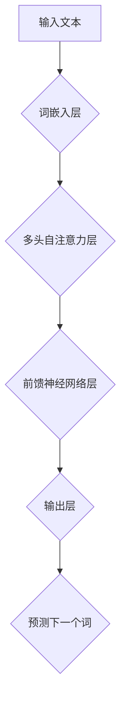

> ChatGPT, GPT-3, Transformer, 自然语言处理, 深度学习, 语言模型

## 1. 背景介绍

近年来，人工智能（AI）技术取得了飞速发展，其中自然语言处理（NLP）领域取得了突破性进展。ChatGPT作为一款基于Transformer架构的强大语言模型，引起了广泛关注。它能够进行流畅、自然的对话，并完成多种文本生成任务，例如写诗、创作故事、翻译文本等。本文将深入探讨ChatGPT的工作原理，揭示其背后的技术奥秘。

## 2. 核心概念与联系

ChatGPT的核心是**Transformer**架构，它是一种专门设计用于处理序列数据的深度神经网络结构。与传统的循环神经网络（RNN）相比，Transformer具有以下优势：

* **并行计算能力强:** Transformer可以并行处理输入序列中的所有元素，大大提高了训练速度。
* **长距离依赖建模能力强:** Transformer通过**自注意力机制**可以捕捉输入序列中任意两个元素之间的关系，即使它们相隔很远，也能有效建模长距离依赖。

**ChatGPT的架构**

**核心概念解释:**

* **词嵌入层:** 将输入文本中的每个词转换为稠密的向量表示，以便神经网络进行处理。
* **多头自注意力层:**  捕捉输入序列中每个词与其他词之间的关系，学习词语之间的上下文信息。
* **前馈神经网络层:** 对自注意力层的输出进行进一步处理，提取更深层次的语义特征。
* **输出层:**  根据输入序列和学习到的语义特征，预测下一个词。

## 3. 核心算法原理 & 具体操作步骤

### 3.1  算法原理概述

ChatGPT的核心算法是**基于Transformer的语言模型训练**。训练过程可以概括为以下步骤：

1. **数据预处理:** 收集大量文本数据，并进行清洗、分词、标记等预处理操作。
2. **模型训练:** 使用预处理后的数据训练Transformer模型，通过反向传播算法不断调整模型参数，使模型能够生成更符合语义的文本。
3. **模型评估:** 使用测试数据评估模型的性能，例如困惑度（perplexity）等指标。
4. **模型部署:** 将训练好的模型部署到服务器上，提供API接口供用户调用。

### 3.2  算法步骤详解

1. **词嵌入:** 将输入文本中的每个词转换为稠密的向量表示。可以使用预训练的词嵌入模型，例如Word2Vec或GloVe，或者使用自训练的方式学习词嵌入。
2. **多头自注意力:** 对词嵌入向量进行多头自注意力操作，捕捉每个词与其他词之间的关系。
3. **前馈神经网络:** 对自注意力层的输出进行前馈神经网络处理，提取更深层次的语义特征。
4. **输出层:** 使用softmax函数将前馈神经网络的输出转换为概率分布，预测下一个词。

### 3.3  算法优缺点

**优点:**

* **强大的文本生成能力:** ChatGPT能够生成流畅、自然的文本，并完成多种文本生成任务。
* **长距离依赖建模能力强:** Transformer架构能够有效建模长距离依赖，使得模型能够理解更复杂的文本结构。
* **并行计算能力强:** Transformer可以并行处理输入序列，提高了训练速度。

**缺点:**

* **训练成本高:** Transformer模型参数量大，训练需要大量的计算资源和时间。
* **数据依赖性强:** 模型性能取决于训练数据的质量和数量。
* **缺乏常识推理能力:** ChatGPT主要基于统计学习，缺乏人类的常识推理能力。

### 3.4  算法应用领域

ChatGPT在以下领域具有广泛的应用前景：

* **聊天机器人:** 开发更智能、更自然的聊天机器人。
* **文本摘要:** 自动生成文本摘要，提高信息获取效率。
* **机器翻译:** 实现更准确、更流畅的机器翻译。
* **代码生成:** 自动生成代码，提高开发效率。
* **创意写作:** 辅助人类进行创意写作，例如写诗、创作故事等。

## 4. 数学模型和公式 & 详细讲解 & 举例说明

### 4.1  数学模型构建

ChatGPT的核心数学模型是**Transformer**架构，它基于以下几个关键数学概念：

* **词嵌入:** 将每个词映射到一个稠密的向量空间中，例如Word2Vec或GloVe模型。
* **自注意力机制:** 计算每个词与其他词之间的相关性，并赋予每个词不同的权重。
* **多头注意力:** 使用多个注意力头并行计算，捕捉不同层次的语义关系。
* **前馈神经网络:** 对自注意力层的输出进行非线性变换，提取更深层次的语义特征。

### 4.2  公式推导过程

**自注意力机制公式:**

$$
Attention(Q, K, V) = softmax(\frac{QK^T}{\sqrt{d_k}})V
$$

其中：

* $Q$：查询矩阵
* $K$：键矩阵
* $V$：值矩阵
* $d_k$：键向量的维度
* $softmax$：softmax函数

**多头注意力机制公式:**

$$
MultiHead(Q, K, V) = Concat(head_1, head_2, ..., head_h)W_O
$$

其中：

* $head_i$：第 $i$ 个注意力头的输出
* $h$：注意力头的数量
* $W_O$：最终输出层的权重矩阵

### 4.3  案例分析与讲解

假设我们有一个句子“The cat sat on the mat”，我们使用自注意力机制计算每个词与其他词之间的相关性。

* “The”与“cat”的相关性较高，因为它们是主语和谓语。
* “cat”与“sat”的相关性较高，因为它们是主语和谓语。
* “sat”与“on”的相关性较高，因为它们是动词和介词。

通过自注意力机制，模型能够捕捉到这些词语之间的语义关系，从而更好地理解句子的含义。

## 5. 项目实践：代码实例和详细解释说明

### 5.1  开发环境搭建

ChatGPT的开发环境需要以下软件：

* Python 3.6+
* PyTorch 或 TensorFlow
* CUDA 和 cuDNN (如果使用GPU训练)

### 5.2  源代码详细实现

ChatGPT的源代码主要包含以下部分：

* **词嵌入层:** 使用预训练的词嵌入模型，例如Word2Vec或GloVe。
* **多头自注意力层:** 实现多头自注意力机制，并使用PyTorch或TensorFlow构建网络结构。
* **前馈神经网络层:** 使用全连接层和激活函数构建前馈神经网络。
* **输出层:** 使用softmax函数将前馈神经网络的输出转换为概率分布，预测下一个词。

### 5.3  代码解读与分析

ChatGPT的代码实现主要围绕以下几个方面：

* **数据加载和预处理:** 将文本数据加载到内存中，并进行分词、标记等预处理操作。
* **模型定义:** 使用PyTorch或TensorFlow构建Transformer模型的网络结构。
* **模型训练:** 使用反向传播算法训练模型，并使用优化器更新模型参数。
* **模型评估:** 使用测试数据评估模型的性能，例如困惑度（perplexity）等指标。

### 5.4  运行结果展示

训练好的ChatGPT模型可以用于以下任务：

* **文本生成:** 输入一段文本，模型可以生成后续的文本。
* **文本摘要:** 输入一篇长文章，模型可以生成一个简短的摘要。
* **机器翻译:** 输入一段文本，模型可以将其翻译成另一种语言。

## 6. 实际应用场景

ChatGPT在以下实际应用场景中展现出强大的能力：

### 6.1  聊天机器人

ChatGPT可以用于开发更智能、更自然的聊天机器人，例如客服机器人、陪伴机器人等。

### 6.2  文本摘要

ChatGPT可以自动生成文本摘要，例如新闻文章、会议记录等，提高信息获取效率。

### 6.3  机器翻译

ChatGPT可以实现更准确、更流畅的机器翻译，例如将英文翻译成中文。

### 6.4  未来应用展望

ChatGPT在未来将有更广泛的应用前景，例如：

* **教育领域:** 用于个性化学习、智能辅导等。
* **医疗领域:** 用于辅助诊断、生成医疗报告等。
* **法律领域:** 用于法律文本分析、合同生成等。

## 7. 工具和资源推荐

### 7.1  学习资源推荐

* **书籍:**
    * 《深度学习》
    * 《自然语言处理》
* **在线课程:**
    * Coursera: 自然语言处理
    * edX: 深度学习
* **博客:**
    * The Gradient
    * Towards Data Science

### 7.2  开发工具推荐

* **Python:** 
* **PyTorch:** 深度学习框架
* **TensorFlow:** 深度学习框架
* **Hugging Face:** 预训练模型库

### 7.3  相关论文推荐

* **Attention Is All You Need:** https://arxiv.org/abs/1706.03762
* **BERT: Pre-training of Deep Bidirectional Transformers for Language Understanding:** https://arxiv.org/abs/1810.04805

## 8. 总结：未来发展趋势与挑战

### 8.1  研究成果总结

ChatGPT的成功发展标志着Transformer架构在自然语言处理领域的巨大进步。它展现了深度学习在文本生成、理解和翻译方面的强大能力。

### 8.2  未来发展趋势

ChatGPT的未来发展趋势包括：

* **模型规模更大:** 训练更大的模型，提升模型的性能和能力。
* **多模态学习:** 将文本与其他模态数据（例如图像、音频）进行融合，实现更全面的理解和生成。
* **可解释性增强:** 研究如何提高模型的可解释性，让模型的决策过程更加透明。

### 8.3  面临的挑战

ChatGPT也面临一些挑战：

* **数据偏见:** 模型训练数据可能存在偏见，导致模型输出结果存在偏差。
* **安全风险:** 模型可能被用于生成恶意内容，例如虚假新闻、网络攻击等。
* **伦理问题:** 模型的应用可能引发一些伦理问题，例如隐私保护、责任归属等。

### 8.4  研究展望

未来研究方向包括：

* **解决数据偏见问题:** 开发新的数据预处理方法和模型训练算法，减少模型输出结果的偏差。
* **增强模型安全性:** 研究如何防止模型被用于恶意目的，并开发相应的安全机制。
* **探讨模型伦理问题:** 积极探讨模型的应用伦理问题，并制定相应的规范和政策。

## 9. 附录：常见问题与解答

**Q1: ChatGPT和GPT-3有什么区别？**

**A1:** ChatGPT是基于GPT-3模型训练的，但它进行了进一步的微调，使其更擅长对话任务。

**Q2: 如何使用ChatGPT？**

**A2:** 可以通过OpenAI的API接口调用ChatGPT模型。

**Q3: ChatGPT的训练数据是什么？**

**A3:** ChatGPT的训练数据包括大量的文本数据，例如书籍、文章、代码等。

**Q4: ChatGPT的性能如何？**

**A4:** ChatGPT在文本生成、理解和翻译等任务上表现出色，但它仍然存在一些局限性，例如缺乏常识推理能力。

**Q5: ChatGPT的未来发展趋势是什么？**

**A5:** ChatGPT的未来发展趋势包括模型规模更大、多模态学习、可解释性增强等。

作者：禅与计算机程序设计艺术 / Zen and the Art of Computer Programming 
<end_of_turn>