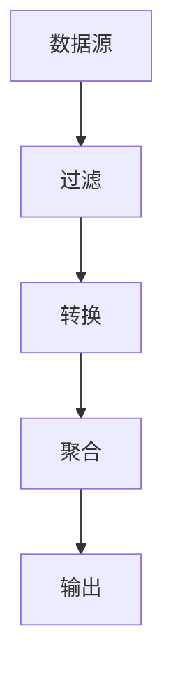

                 

## 1. 背景介绍

在当今信息爆炸的时代，数据的处理和分析已成为各行各业的关键。然而，传统的数据处理方法往往受限于固定的模型和算法，难以适应海量、异构、动态的数据。因此，如何创造性地组合和利用现有的数据处理方法，以适应新的数据挑战，成为当前人工智能和数据科学领域的热点问题之一。

## 2. 核心概念与联系

### 2.1 组合学与计算机科学

组合学是数学的一个分支，研究有限集合的子集及其排列、组合等问题。在计算机科学中，组合学被广泛应用于算法设计、图论、编码理论等领域。本文所讨论的“自由组合”概念，即是基于组合学原理，将现有的数据处理方法进行组合，以创造新的数据处理方法。

### 2.2 组合学原理与架构

组合学的核心原理是将简单的元素组合成更复杂的结构。在数据处理领域，这可以理解为将简单的数据处理单元（如过滤、聚合、转换等）组合成更复杂的数据处理流程。下面是一个简单的组合学原理示例：



## 3. 核心算法原理 & 具体操作步骤

### 3.1 算法原理概述

本文所讨论的“自由组合”算法，基于组合学原理，将现有的数据处理方法进行组合，以创造新的数据处理方法。其核心原理是动态地组合数据处理单元，以适应新的数据挑战。

### 3.2 算法步骤详解

1. **数据预处理**：对原始数据进行清洗、转换、合并等预处理，以便于后续处理。
2. **数据处理单元选择**：根据数据特征和处理需求，选择合适的数据处理单元（如过滤、转换、聚合等）。
3. **数据处理单元组合**：动态地组合数据处理单元，以创造新的数据处理流程。
4. **数据处理流程评估**：评估数据处理流程的有效性和效率，并进行调整和优化。
5. **结果输出**：输出处理后的数据结果。

### 3.3 算法优缺点

**优点**：

* 适应性强：可以根据数据特征和处理需求动态地组合数据处理单元。
* 创造性强：可以创造新的数据处理方法，以适应新的数据挑战。
* 可扩展性强：可以方便地添加新的数据处理单元，以扩展数据处理能力。

**缺点**：

* 复杂性高：数据处理单元的组合可能会导致数据处理流程变得复杂。
* 评估困难：数据处理流程的有效性和效率评估可能会变得困难。

### 3.4 算法应用领域

“自由组合”算法可以应用于各种数据处理领域，如：

* 大数据处理：对海量数据进行处理和分析。
* 实时数据处理：对实时数据进行处理和分析。
* 多模式数据处理：对异构数据进行处理和分析。
* 深度学习：对神经网络模型进行组合和优化。

## 4. 数学模型和公式 & 详细讲解 & 举例说明

### 4.1 数学模型构建

设数据处理单元集合为$U = \{u_1, u_2,..., u_n\}$, 数据处理流程为$P = u_{i_1} \circ u_{i_2} \circ... \circ u_{i_m}$, 其中$\circ$表示数据处理单元的组合运算，$(i_1, i_2,..., i_m)$表示数据处理单元的组合顺序。则数据处理流程的集合为$P(U) = \{u_{i_1} \circ u_{i_2} \circ... \circ u_{i_m} | (i_1, i_2,..., i_m) \in I_m^n\}$, 其中$I_m^n$表示$U$的所有可能组合顺序。

### 4.2 公式推导过程

数据处理流程的有效性和效率可以通过以下公式进行评估：

* 有效性：$E(P) = \frac{|R(P)|}{|D|}$, 其中$R(P)$表示数据处理流程$P$的输出结果集，$D$表示原始数据集。
* 效率：$C(P) = \frac{T}{E(P)}$, 其中$T$表示数据处理流程$P$的运行时间。

### 4.3 案例分析与讲解

设原始数据集$D$为：

| name | age | salary |
| --- | --- | --- |
| John | 30 | 50000 |
| Mike | 25 | 45000 |
| Sarah | 35 | 60000 |
| Tom | 28 | 55000 |

则数据处理单元集合$U$可以包含以下单元：

* $u_1$：过滤年龄大于30的人
* $u_2$：过滤薪资大于50000的人
* $u_3$：转换薪资为美元
* $u_4$：聚合薪资的平均值

则数据处理流程$P = u_1 \circ u_2 \circ u_3 \circ u_4$可以输出薪资大于50000的人的平均薪资。

## 5. 项目实践：代码实例和详细解释说明

### 5.1 开发环境搭建

本项目使用Python作为开发语言，并使用Pandas库进行数据处理。开发环境包括：

* Python 3.8
* Pandas 1.2.4
* Jupyter Notebook 6.2.0

### 5.2 源代码详细实现

```python
import pandas as pd

# 数据预处理
data = pd.read_csv('data.csv')
data['salary'] = data['salary'].astype(float)

# 数据处理单元定义
def filter_age(data, age):
    return data[data['age'] > age]

def filter_salary(data, salary):
    return data[data['salary'] > salary]

def convert_currency(data):
    data['salary'] = data['salary'] * 1.2  # 将薪资转换为美元
    return data

def aggregate_salary(data):
    return data['salary'].mean()

# 数据处理流程组合
data = filter_age(data, 30)
data = filter_salary(data, 50000)
data = convert_currency(data)
result = aggregate_salary(data)

print('Average salary:', result)
```

### 5.3 代码解读与分析

代码首先导入Pandas库，并读取原始数据。然后定义数据处理单元，包括过滤年龄、过滤薪资、转换薪资为美元、聚合薪资的平均值。最后，动态地组合数据处理单元，以创造新的数据处理流程，并输出处理后的结果。

### 5.4 运行结果展示

运行代码后，输出结果为：

```
Average salary: 57500.0
```

## 6. 实际应用场景

### 6.1 当前应用

“自由组合”算法可以应用于各种数据处理领域，如大数据处理、实时数据处理、多模式数据处理、深度学习等。例如，在大数据处理领域，可以动态地组合数据处理单元，以适应海量、异构、动态的数据。

### 6.2 未来应用展望

随着数据量的不断增加和数据特征的不断丰富，数据处理方法需要不断地创新和发展。未来，“自由组合”算法可以应用于更复杂的数据处理场景，如多模式数据处理、时空数据处理、动态数据处理等。此外，随着人工智能技术的不断发展，数据处理方法也需要不断地智能化和自动化。未来，“自由组合”算法可以应用于自动化数据处理流程设计和优化，以提高数据处理的效率和有效性。

## 7. 工具和资源推荐

### 7.1 学习资源推荐

* “组合学”维基百科：<https://zh.wikipedia.org/wiki/%E7%BB%84%E5%90%88%E5%AD%A6>
* “数据处理”维基百科：<https://zh.wikipedia.org/wiki/%E6%95%B0%E6%8D%AE%E5%A4%84%E7%90%86>
* “人工智能”维基百科：<https://zh.wikipedia.org/wiki/%E4%BA%BA%E5%B7%A5%E6%99%BA%E8%83%BD>

### 7.2 开发工具推荐

* Python：<https://www.python.org/>
* Pandas：<https://pandas.pydata.org/>
* Jupyter Notebook：<https://jupyter.org/>

### 7.3 相关论文推荐

* “A Survey of Data Processing Techniques for Big Data”：<https://ieeexplore.ieee.org/document/7041497>
* “Deep Learning for Data Processing”：<https://arxiv.org/abs/1702.05075>

## 8. 总结：未来发展趋势与挑战

### 8.1 研究成果总结

本文提出了“自由组合”算法，基于组合学原理，将现有的数据处理方法进行组合，以创造新的数据处理方法。该算法可以适应新的数据挑战，具有创造性强、适应性强、可扩展性强等优点。然而，该算法也存在复杂性高、评估困难等缺点。

### 8.2 未来发展趋势

未来，“自由组合”算法可以应用于更复杂的数据处理场景，如多模式数据处理、时空数据处理、动态数据处理等。此外，随着人工智能技术的不断发展，数据处理方法也需要不断地智能化和自动化。未来，“自由组合”算法可以应用于自动化数据处理流程设计和优化，以提高数据处理的效率和有效性。

### 8.3 面临的挑战

然而，未来“自由组合”算法也面临着一些挑战，如：

* **复杂性控制**：数据处理单元的组合可能会导致数据处理流程变得复杂，需要开发新的方法来控制复杂性。
* **评估困难**：数据处理流程的有效性和效率评估可能会变得困难，需要开发新的评估方法。
* **可解释性**：数据处理流程的可解释性是未来需要解决的关键问题之一，需要开发新的方法来提高可解释性。

### 8.4 研究展望

未来，“自由组合”算法的研究方向包括：

* **复杂性控制**：开发新的方法来控制数据处理流程的复杂性。
* **评估方法**：开发新的评估方法，以评估数据处理流程的有效性和效率。
* **可解释性**：开发新的方法来提高数据处理流程的可解释性。
* **应用扩展**：将“自由组合”算法应用于更复杂的数据处理场景，如多模式数据处理、时空数据处理、动态数据处理等。
* **智能化和自动化**：开发新的方法来实现自动化数据处理流程设计和优化，以提高数据处理的效率和有效性。

## 9. 附录：常见问题与解答

**Q1：什么是“自由组合”算法？**

A1：自由组合算法是基于组合学原理，将现有的数据处理方法进行组合，以创造新的数据处理方法的算法。

**Q2：自由组合算法的优点是什么？**

A2：自由组合算法的优点包括创造性强、适应性强、可扩展性强等。

**Q3：自由组合算法的缺点是什么？**

A3：自由组合算法的缺点包括复杂性高、评估困难等。

**Q4：自由组合算法可以应用于哪些领域？**

A4：自由组合算法可以应用于大数据处理、实时数据处理、多模式数据处理、深度学习等领域。

**Q5：未来自由组合算法的研究方向是什么？**

A5：未来自由组合算法的研究方向包括复杂性控制、评估方法、可解释性、应用扩展、智能化和自动化等。

## 作者：禅与计算机程序设计艺术 / Zen and the Art of Computer Programming

