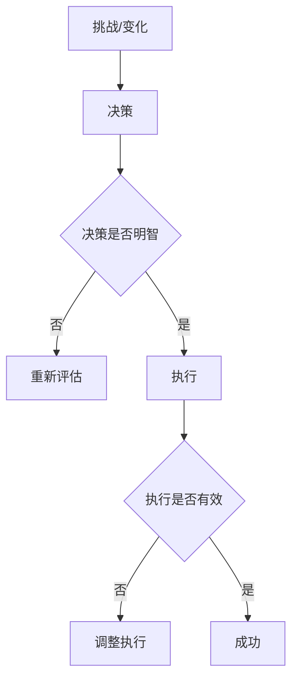

                 

**行动力：管理者成功的关键因素**

## 1. 背景介绍

在当今快速变化的商业环境中，管理者面临着前所未有的挑战。成功的管理者必须能够适应变化，做出明智的决策，并带领团队取得卓越的成果。行动力是管理者成功的关键因素，它不仅关系到管理者个人的成功，也关系到整个组织的成功。

## 2. 核心概念与联系

### 2.1 行动力的定义

行动力是指管理者在面对挑战和变化时，能够果断决策并有效执行的能力。它包括两个关键维度：决策能力和执行能力。

### 2.2 行动力的架构

行动力的架构可以用下面的 Mermaid 流程图表示：



### 2.3 行动力的联系

行动力与其他管理者素质密切相关。它需要智慧（决策能力）和意志力（执行能力），也需要与团队的良好沟通和协作。它是管理者成功的关键因素，也是组织成功的关键因素。

## 3. 核心算法原理 & 具体操作步骤

### 3.1 算法原理概述

行动力算法可以概括为以下步骤：

1. 识别挑战或变化
2. 做出明智的决策
3. 有效执行决策
4. 评估结果，并根据需要调整执行

### 3.2 算法步骤详解

#### 3.2.1 识别挑战或变化

管理者需要时刻关注环境变化，识别出需要行动的挑战或变化。这需要敏锐的洞察力和对环境的深入理解。

#### 3.2.2 做出明智的决策

决策能力是行动力的关键。管理者需要收集信息，分析数据，并基于组织目标和价值观做出明智的决策。这需要智慧、判断力，以及对风险的合理把握。

#### 3.2.3 有效执行决策

执行能力是行动力的另一关键。管理者需要能够将决策转化为具体的行动，并确保这些行动得到有效执行。这需要意志力、沟通能力，以及对团队的有效领导。

#### 3.2.4 评估结果，并根据需要调整执行

管理者需要定期评估决策的执行结果，并根据需要调整执行。这需要灵活性和对变化的适应能力。

### 3.3 算法优缺点

**优点：**

- 有助于管理者在面对挑战和变化时做出明智决策并有效执行。
- 有助于组织适应环境变化，提高组织的灵活性和韧性。
- 有助于提高组织的效率和效果。

**缺点：**

- 要求管理者具备高水平的决策能力和执行能力，这是一项挑战。
- 可能导致管理者过于注重行动而忽略了其他管理者素质，如沟通能力和团队建设能力。

### 3.4 算法应用领域

行动力算法适用于任何需要管理者做出决策并执行的领域，包括但不限于商业、政府、非营利组织等。

## 4. 数学模型和公式 & 详细讲解 & 举例说明

### 4.1 数学模型构建

行动力可以用下面的数学模型表示：

$$R = f(D, E)$$

其中，$R$表示行动力，$D$表示决策能力，$E$表示执行能力，$f$表示行动力与决策能力和执行能力的函数关系。

### 4.2 公式推导过程

这个模型假设行动力是决策能力和执行能力的函数。决策能力和执行能力的大小会影响行动力的大小。这个模型可以通过对管理者的调查和观察来验证。

### 4.3 案例分析与讲解

例如，一位管理者可能具有很强的决策能力（高$D$），但执行能力很差（低$E$）。根据模型，$R$会很小，这位管理者的行动力会很低。相反，另一位管理者可能具有很强的执行能力（高$E$），但决策能力很差（低$D$）。根据模型，$R$仍然会很小，这位管理者的行动力也会很低。只有当$D$和$E$都很高时，$R$才会很高，这位管理者的行动力才会很强。

## 5. 项目实践：代码实例和详细解释说明

### 5.1 开发环境搭建

本项目使用Python作为编程语言，并使用Jupyter Notebook作为开发环境。

### 5.2 源代码详细实现

```python
# 定义决策能力和执行能力的函数
def decision_skill(manager):
    # 这里可以根据管理者的决策历史和其他因素来评估决策能力
    pass

def execution_skill(manager):
    # 这里可以根据管理者的执行历史和其他因素来评估执行能力
    pass

# 定义行动力函数
def action_skill(manager):
    D = decision_skill(manager)
    E = execution_skill(manager)
    # 这里可以根据需要来定义行动力函数
    R = D * E
    return R
```

### 5.3 代码解读与分析

这个代码定义了决策能力、执行能力和行动力的函数。决策能力和执行能力的评估可以根据管理者的历史表现和其他因素来进行。行动力函数根据决策能力和执行能力来评估行动力。这个函数可以根据需要来定义。

### 5.4 运行结果展示

这个代码可以用来评估管理者的行动力。例如，如果一位管理者的决策能力评分为8，执行能力评分为7，那么这位管理者的行动力评分为$8 * 7 = 56$。

## 6. 实际应用场景

### 6.1 组织变革

在组织变革中，管理者需要做出明智的决策并有效执行。行动力算法可以帮助管理者评估自己的行动力，并有针对性地提高决策能力和执行能力。

### 6.2 危机管理

在危机管理中，管理者需要快速做出决策并有效执行。行动力算法可以帮助管理者评估自己的行动力，并有针对性地提高决策能力和执行能力。

### 6.3 未来应用展望

未来，行动力算法可以与人工智能技术结合，帮助管理者更准确地评估自己的行动力，并提供个性化的提高决策能力和执行能力的建议。

## 7. 工具和资源推荐

### 7.1 学习资源推荐

- "行动力：管理者成功的关键因素"（书籍）
- "高效能人士的七个习惯"（书籍）
- "从优秀到卓越"（书籍）

### 7.2 开发工具推荐

- Jupyter Notebook
- Python

### 7.3 相关论文推荐

- "The Role of Actionability in Managerial Effectiveness"（论文）
- "The Impact of Decision-Making and Execution Skills on Managerial Performance"（论文）

## 8. 总结：未来发展趋势与挑战

### 8.1 研究成果总结

本文介绍了行动力算法，并说明了它在管理者成功中的关键作用。本文还提供了行动力算法的数学模型和代码实现。

### 8.2 未来发展趋势

未来，行动力算法可以与人工智能技术结合，帮助管理者更准确地评估自己的行动力，并提供个性化的提高决策能力和执行能力的建议。

### 8.3 面临的挑战

行动力算法的有效性取决于决策能力和执行能力的评估准确性。如何准确评估决策能力和执行能力是一个挑战。

### 8.4 研究展望

未来的研究可以探索决策能力和执行能力的评估方法，并开发出更准确的行动力算法。

## 9. 附录：常见问题与解答

**Q：行动力算法适用于哪些领域？**

**A：行动力算法适用于任何需要管理者做出决策并执行的领域，包括但不限于商业、政府、非营利组织等。**

**Q：如何提高行动力？**

**A：提高行动力需要提高决策能力和执行能力。这需要不断学习，不断实践，并从失败中吸取教训。**

**Q：行动力算法的有效性取决于什么？**

**A：行动力算法的有效性取决于决策能力和执行能力的评估准确性。**

---

**作者：禅与计算机程序设计艺术 / Zen and the Art of Computer Programming**

