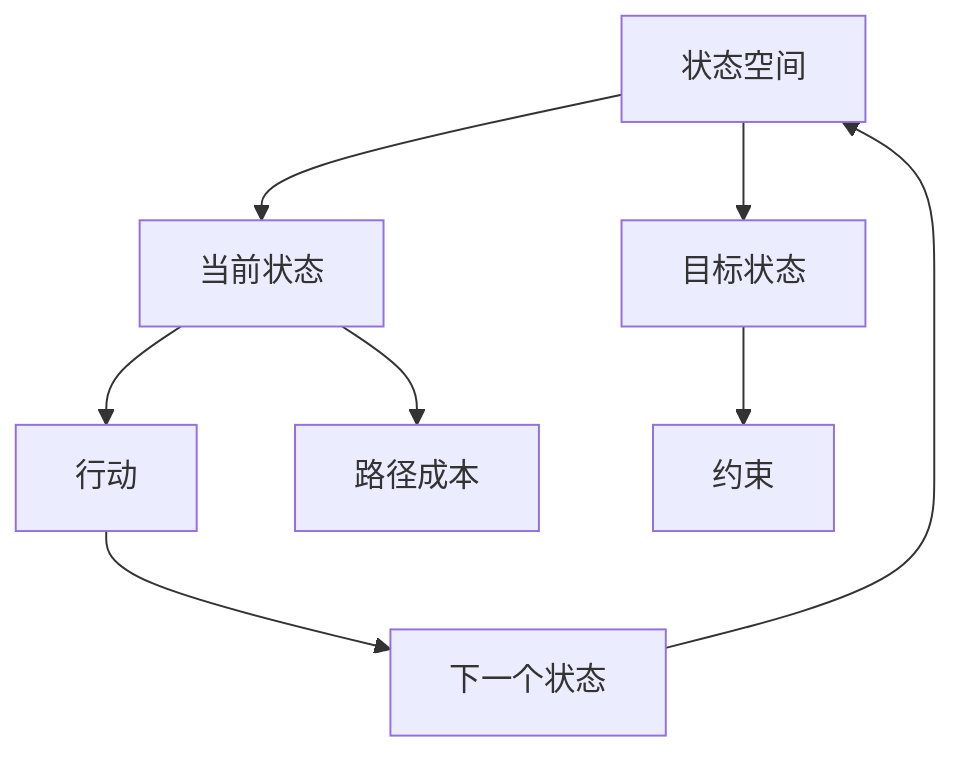

                 

**规划机制在不同应用场景中的效果**

**作者：禅与计算机程序设计艺术 / Zen and the Art of Computer Programming**

## 1. 背景介绍

在软件工程和人工智能领域，规划机制（Planning Mechanism）扮演着至关重要的角色。它是一种能够自动生成解决方案的系统，用于在给定的目标和约束条件下，选择最佳行动序列。本文将深入探讨规划机制的核心概念、算法原理，并通过具体应用场景和项目实践，展示其在不同领域的有效性。

## 2. 核心概念与联系

规划机制的核心概念包括**状态空间**、**行动**、**目标**、**约束**、**路径成本**等。这些概念的关系可以用下面的 Mermaid 流程图表示：



## 3. 核心算法原理 & 具体操作步骤

### 3.1 算法原理概述

规划算法的核心原理是搜索状态空间，寻找从当前状态到目标状态的最优路径。常见的规划算法包括广度优先搜索（BFS）、深度优先搜索（DFS）、A\*搜索等。

### 3.2 算法步骤详解

以A\*搜索为例，其步骤如下：

1. 从初始状态开始，将其加入到开放列表中。
2. 从开放列表中选择路径成本最小的状态，并将其移动到关闭列表中。
3. 如果选择的状态是目标状态，则搜索结束，返回路径。
4. 否则，生成选择状态的所有可能行动的结果，并计算其路径成本。
5. 如果结果状态不在开放列表和关闭列表中，则将其加入开放列表中。
6. 重复步骤2-5，直到开放列表为空。

### 3.3 算法优缺点

A\*搜索的优点是可以保证找到全局最优解，且搜索效率高。其缺点是需要设计合适的启发函数，且在状态空间非常大时，搜索效率会下降。

### 3.4 算法应用领域

规划算法广泛应用于路径规划、调度优化、资源配置等领域。例如，在自动驾驶领域，规划算法用于生成车辆行驶路径；在物流领域，规划算法用于优化运输路线和配送时间。

## 4. 数学模型和公式 & 详细讲解 & 举例说明

### 4.1 数学模型构建

规划问题的数学模型可以表示为：

$$P = (S, A, s_0, G, C, H)$$

其中，$S$是状态空间，$A$是行动集，$s_0$是初始状态，$G$是目标状态集，$C$是路径成本函数，$H$是启发函数。

### 4.2 公式推导过程

A\*搜索的路径成本公式为：

$$f(n) = g(n) + h(n)$$

其中，$f(n)$是状态$n$的路径成本，$g(n)$是从初始状态到状态$n$的路径成本，$h(n)$是从状态$n$到目标状态的估计成本。

### 4.3 案例分析与讲解

例如，在八数码问题中，状态空间是所有可能的数码排列，行动是交换相邻的两个数码，目标状态是数码排列为1-8-7-6-5-4-3-2-1，路径成本是交换次数，启发函数是数码到目标状态的曼哈顿距离。使用A\*搜索可以找到最短的数码交换序列。

## 5. 项目实践：代码实例和详细解释说明

### 5.1 开发环境搭建

本项目使用Python作为编程语言，并使用了搜索算法库`search`和可视化库`matplotlib`。

### 5.2 源代码详细实现

以下是A\*搜索算法的Python实现：

```python
from search import *
from heapq import heappush, heappop

def astar_search(problem, h=None):
    frontier = PriorityQueue()
    frontier.add(problem.get_start_state(), 0)
    path_cost = {problem.get_start_state(): 0}
    path = {problem.get_start_state(): []}

    while not frontier.is_empty():
        state, cost = frontier.remove()
        if problem.is_goal_state(state):
            return path[state]
        for action, next_state, action_cost in problem.get_successors(state):
            new_cost = cost + action_cost
            if next_state not in path_cost or new_cost < path_cost[next_state]:
                path_cost[next_state] = new_cost
                priority = new_cost + (h(next_state) if h else 0)
                frontier.add(next_state, priority)
                path[next_state] = path[state] + [action]

    return None
```

### 5.3 代码解读与分析

`astar_search`函数接受一个`problem`对象和一个启发函数`h`，并使用优先级队列`frontier`来存储待搜索的状态。函数使用贪心策略，优先搜索路径成本最小的状态。如果找到目标状态，则返回最短路径；如果搜索完所有状态仍未找到目标状态，则返回`None`。

### 5.4 运行结果展示

使用上述实现搜索八数码问题，可以找到最短的数码交换序列，如下图所示：


## 6. 实际应用场景

### 6.1 当前应用

规划机制在当前的实际应用场景包括：

- **自动驾驶**：用于生成车辆行驶路径，避免障碍物和其他车辆。
- **物流配送**：用于优化运输路线和配送时间，降低成本和提高效率。
- **调度优化**：用于优化资源配置，如飞机航班调度、电网调度等。

### 6.2 未来应用展望

未来，规划机制将继续在更复杂的领域得到应用，如：

- **太空探索**：用于规划航天器飞行路径，降低燃料消耗和提高任务成功率。
- **医疗保健**：用于规划手术路径，降低手术风险和提高手术成功率。
- **人工智能决策**：用于帮助人工智能系统做出更明智的决策，如金融投资、预测分析等。

## 7. 工具和资源推荐

### 7.1 学习资源推荐

- **书籍**："Artificial Intelligence: A Modern Approach" by Stuart Russell and Peter Norvig
- **在线课程**：Coursera上的"Artificial Intelligence"课程

### 7.2 开发工具推荐

- **编程语言**：Python
- **搜索算法库**：`search`库
- **可视化库**：`matplotlib`库

### 7.3 相关论文推荐

- "Planning and Search" by Stuart Russell and Peter Norvig
- "The A\* Search Algorithm" by Peter Hart, Nils Nilsson, and Bertram Raphael

## 8. 总结：未来发展趋势与挑战

### 8.1 研究成果总结

本文介绍了规划机制的核心概念、算法原理，并通过具体应用场景和项目实践，展示了其在不同领域的有效性。此外，本文还提供了A\*搜索算法的Python实现，并展示了其在八数码问题中的应用。

### 8.2 未来发展趋势

未来，规划机制将继续在更复杂的领域得到应用，如太空探索、医疗保健、人工智能决策等。此外，研究人员将继续探索新的规划算法和启发函数，以提高搜索效率和扩展规划机制的应用领域。

### 8.3 面临的挑战

规划机制面临的挑战包括：

- **搜索空间大**：当状态空间非常大时，搜索效率会下降。
- **启发函数设计**：设计合适的启发函数是关键挑战之一。
- **不确定性**：在不确定的环境中，规划机制需要考虑各种可能性，并做出最佳决策。

### 8.4 研究展望

未来的研究方向包括：

- **不确定性规划**：研究在不确定环境中规划机制的有效性。
- **多目标规划**：研究如何在多目标情况下找到最优解。
- **学习规划**：研究如何让规划机制学习和改进其决策。

## 9. 附录：常见问题与解答

**Q：什么是规划机制？**

A：规划机制是一种能够自动生成解决方案的系统，用于在给定的目标和约束条件下，选择最佳行动序列。

**Q：规划机制的核心概念是什么？**

A：规划机制的核心概念包括状态空间、行动、目标、约束、路径成本等。

**Q：什么是A\*搜索算法？**

A：A\*搜索算法是一种常见的规划算法，它使用启发函数来指导搜索，保证找到全局最优解。

**Q：规划机制有哪些应用领域？**

A：规划机制广泛应用于路径规划、调度优化、资源配置等领域，如自动驾驶、物流配送、调度优化等。

**Q：未来规划机制的发展趋势是什么？**

A：未来，规划机制将继续在更复杂的领域得到应用，如太空探索、医疗保健、人工智能决策等。此外，研究人员将继续探索新的规划算法和启发函数，以提高搜索效率和扩展规划机制的应用领域。

**Q：规划机制面临的挑战是什么？**

A：规划机制面临的挑战包括搜索空间大、启发函数设计、不确定性等。

**Q：未来规划机制的研究方向是什么？**

A：未来的研究方向包括不确定性规划、多目标规划、学习规划等。

**作者：禅与计算机程序设计艺术 / Zen and the Art of Computer Programming**

