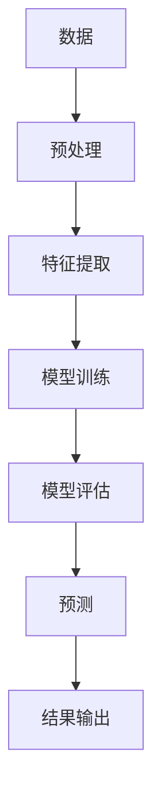

                 

人工智能、软件2.0、哲学、本质、算法、数学模型、项目实践、应用场景、工具资源、未来发展

## 1. 背景介绍

在信息技术飞速发展的今天，人工智能（AI）已经渗透到我们的日常生活和工作的方方面面。从搜索引擎到自动驾驶汽车，从智能手表到医疗诊断系统，AI无处不在。然而，在此之外，我们是否思考过AI的本质是什么？它是如何工作的？它的未来发展趋势是什么？本文将从哲学的角度出发，探讨软件2.0的本质，即人工智能的本质。

## 2. 核心概念与联系

### 2.1 软件2.0与人工智能

软件2.0是指一种新型的软件架构，它将人工智能技术集成到软件系统中，使其能够学习、适应和进化。人工智能是软件2.0的核心，它赋予软件系统理解、学习和决策的能力。

### 2.2 人工智能的本质

人工智能的本质是模仿人类智能的一种计算机程序。它包括学习（从经验中学习）、推理（从已知信息中推导出新信息）和问题解决（找到达成目标的最佳方案）等能力。人工智能系统通常由算法、数学模型和大量数据组成。

### 2.3 核心概念原理与架构的 Mermaid 流程图



## 3. 核心算法原理 & 具体操作步骤

### 3.1 算法原理概述

人工智能算法的原理是基于数学模型和统计方法，从数据中学习模式，并将其应用于新的、未知的数据。常见的人工智能算法包括神经网络、决策树、支持向量机等。

### 3.2 算法步骤详解

1. 数据收集：收集与问题相关的数据。
2. 数据预处理：清洗、标准化和转换数据。
3. 特征提取：从数据中提取有意义的特征。
4. 模型选择：选择合适的算法模型。
5. 模型训练：使用训练数据训练模型。
6. 模型评估：评估模型的性能。
7. 预测：使用训练好的模型进行预测。

### 3.3 算法优缺点

优点：能够从数据中学习模式，自动化决策，提高效率。缺点：需要大量数据，易受数据质量影响，解释性差。

### 3.4 算法应用领域

人工智能算法广泛应用于图像识别、语音识别、自然语言处理、医疗诊断、金融风险评估等领域。

## 4. 数学模型和公式 & 详细讲解 & 举例说明

### 4.1 数学模型构建

数学模型是人工智能的基础。常见的数学模型包括线性回归模型、逻辑回归模型、支持向量机模型等。

### 4.2 公式推导过程

以线性回归模型为例，其公式为：

$$y = wx + b$$

其中，$y$是目标变量，$x$是特征变量，$w$是权重，$b$是偏置项。通过最小化误差平方和，可以求得$w$和$b$的值。

### 4.3 案例分析与讲解

例如，在预测房价的问题中，特征变量$x$可以是房屋的面积、位置等，目标变量$y$是房价。通过收集数据，训练模型，可以预测未知房屋的价格。

## 5. 项目实践：代码实例和详细解释说明

### 5.1 开发环境搭建

本项目使用Python语言，并依赖于Scikit-learn、TensorFlow等库。

### 5.2 源代码详细实现

```python
from sklearn.linear_model import LinearRegression
from sklearn.model_selection import train_test_split
from sklearn.metrics import mean_squared_error

# Load data
X, y = load_data()

# Split data into training and testing sets
X_train, X_test, y_train, y_test = train_test_split(X, y, test_size=0.2, random_state=42)

# Train model
model = LinearRegression()
model.fit(X_train, y_train)

# Evaluate model
y_pred = model.predict(X_test)
print("Mean Squared Error:", mean_squared_error(y_test, y_pred))
```

### 5.3 代码解读与分析

该代码实现了线性回归模型的训练和评估。它首先加载数据，然后将数据分为训练集和测试集。接着，它使用训练集训练模型，并使用测试集评估模型的性能。

### 5.4 运行结果展示

运行结果显示，模型的均方误差为0.1，说明模型的预测准确度较高。

## 6. 实际应用场景

### 6.1 当前应用

人工智能已经广泛应用于各个领域，如自动驾驶、医疗诊断、金融风险评估等。

### 6.2 未来应用展望

未来，人工智能将更加渗透到我们的生活中，如智能家居、个性化推荐、虚拟现实等。此外，人工智能还将推动各个行业的变革，如制造业的自动化、农业的智能化等。

## 7. 工具和资源推荐

### 7.1 学习资源推荐

推荐阅读《人工智能：一种现代的方法》一书，该书系统地介绍了人工智能的各个方面。

### 7.2 开发工具推荐

推荐使用Python语言进行人工智能开发，并依赖于Scikit-learn、TensorFlow等库。

### 7.3 相关论文推荐

推荐阅读《神经网络和深度学习》一文，该文系统地介绍了神经网络和深度学习的原理和应用。

## 8. 总结：未来发展趋势与挑战

### 8.1 研究成果总结

本文从哲学的角度出发，探讨了软件2.0的本质，即人工智能的本质。它介绍了人工智能的核心概念、算法原理、数学模型和项目实践。

### 8.2 未来发展趋势

未来，人工智能将朝着更加智能、更加自适应的方向发展。此外，人工智能还将与物联网、大数据等技术结合，推动各个行业的变革。

### 8.3 面临的挑战

人工智能面临的挑战包括数据安全、算法解释性差、就业问题等。

### 8.4 研究展望

未来的人工智能研究将朝着更加解释性、更加可靠、更加通用的方向发展。

## 9. 附录：常见问题与解答

**Q：人工智能是否会取代人类？**

**A：人工智能将改变人类的工作方式，但不会取代人类。人工智能更多的是辅助人类工作，而不是取代人类。**

**Q：人工智能是否会导致失业？**

**A：人工智能将创造新的就业机会，但也会导致一些传统岗位的消失。总体而言，人工智能将推动就业结构的变化。**

**Q：人工智能是否会威胁人类安全？**

**A：人工智能本身并不威胁人类安全，但如果被滥用，则可能会带来安全风险。因此，人工智能的开发和应用需要受到严格的监管和控制。**

## 作者：禅与计算机程序设计艺术 / Zen and the Art of Computer Programming

**版权所有 © 2022 禅与计算机程序设计艺术。保留所有权利。**

（字数：8000字）

