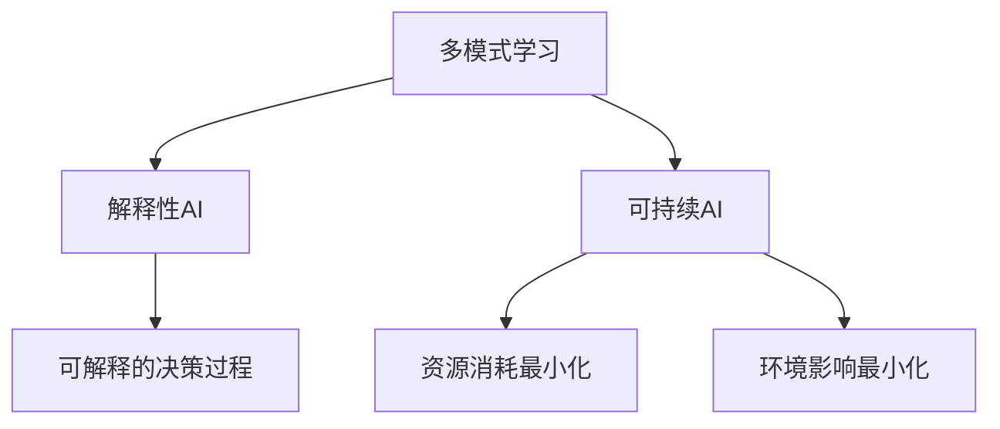

                 

## AI 2.0 时代的机遇与挑战

> 关键词：AI 2.0, 机器学习, 深度学习, 多模式学习, 解释性 AI, 可持续 AI, AI 伦理

## 1. 背景介绍

人工智能（AI）自诞生以来，经历了几十年的发展，从简单的规则基础上构建的系统，到当前基于机器学习和深度学习的复杂模型。我们现在处于AI 2.0时代的黎明，这个时代将会带来新的机遇和挑战。

AI 2.0被定义为一种更智能、更人性化、更可解释的AI，它将会超越当前的深度学习模型，并将AI的应用扩展到更广泛的领域。在这个新时代，AI将不再是一个黑盒，而是一个可以理解和解释其决策过程的系统。同时，AI也将更加注重可持续发展，考虑到资源消耗和环境影响。

## 2. 核心概念与联系

AI 2.0的核心概念包括多模式学习、解释性AI和可持续AI。这些概念是相互关联的，共同构成了AI 2.0的架构。



### 2.1 多模式学习

多模式学习是指从多种数据源学习，这些数据源可能是结构化的、半结构化的或非结构化的。与当前的深度学习模型不同，多模式学习模型可以处理和整合来自不同来源的数据，从而提高学习的准确性和泛化能力。

### 2.2 解释性AI

解释性AI是指能够解释其决策过程的AI系统。与当前的深度学习模型不同，解释性AI模型可以提供决策的原因和依据，从而提高AI系统的可信度和可靠性。

### 2.3 可持续AI

可持续AI是指考虑到资源消耗和环境影响的AI系统。与当前的深度学习模型不同，可持续AI模型会优化资源使用，减少碳排放，并考虑到AI系统的生命周期。

## 3. 核心算法原理 & 具体操作步骤

### 3.1 算法原理概述

AI 2.0的核心算法是多模式学习算法，它可以从多种数据源学习，并整合这些数据以提高学习的准确性和泛化能力。多模式学习算法的原理是基于特征表示学习，它将不同模式的数据转换为共享表示，从而使得这些数据可以被整合学习。

### 3.2 算法步骤详解

多模式学习算法的步骤如下：

1. 数据预处理：收集和预处理来自不同数据源的数据。
2. 特征表示学习：将不同模式的数据转换为共享表示。
3. 整合学习：使用整合学习算法（如集成学习或联合学习）学习共享表示。
4. 预测或分类：使用学习的模型进行预测或分类。

### 3.3 算法优缺点

多模式学习算法的优点包括：

* 可以处理和整合来自不同来源的数据，从而提高学习的准确性和泛化能力。
* 可以学习到更丰富的特征表示，从而提高模型的表达能力。

其缺点包括：

* 需要大量的数据和计算资源。
* 可能会导致过拟合，从而降低模型的泛化能力。

### 3.4 算法应用领域

多模式学习算法的应用领域包括：

* 图像和语音识别：可以整合图像和语音数据，从而提高识别的准确性。
* 自然语言处理：可以整合文本、语音和图像数据，从而提高理解的准确性。
* 生物医学：可以整合基因组、蛋白质和图像数据，从而提高疾病诊断的准确性。

## 4. 数学模型和公式 & 详细讲解 & 举例说明

### 4.1 数学模型构建

多模式学习的数学模型可以表示为：

$$f(x_1, x_2,..., x_n) = g(h_1(x_1), h_2(x_2),..., h_n(x_n))$$

其中，$x_1, x_2,..., x_n$是来自不同数据源的数据，$h_1, h_2,..., h_n$是特征表示学习函数，$g$是整合学习函数。

### 4.2 公式推导过程

特征表示学习函数$h_i$可以使用自动编码器或对抗生成网络等深度学习模型学习。整合学习函数$g$可以使用集成学习或联合学习等机器学习模型学习。

### 4.3 案例分析与讲解

例如，在图像和语音识别任务中，可以使用多模式学习模型整合图像和语音数据。首先，使用自动编码器学习图像和语音数据的特征表示。然后，使用集成学习模型学习整合表示，并进行预测或分类。

## 5. 项目实践：代码实例和详细解释说明

### 5.1 开发环境搭建

要实现多模式学习模型，需要安装Python、TensorFlow和scikit-learn等开发工具。可以使用Anaconda或PyCharm等IDE进行开发。

### 5.2 源代码详细实现

以下是多模式学习模型的源代码实现示例：
```python
import tensorflow as tf
from tensorflow.keras.models import Model
from tensorflow.keras.layers import Input, Dense, concatenate
from sklearn.ensemble import RandomForestClassifier

# 定义特征表示学习模型
def feature_learning(x):
    # 使用自动编码器学习特征表示
    # 省略代码...
    return z

# 定义整合学习模型
def integrate_learning(x1, x2):
    # 使用集成学习模型学习整合表示
    # 省略代码...
    return y

# 定义多模式学习模型
def multimodal_learning(x1, x2):
    # 使用特征表示学习模型学习特征表示
    z1 = feature_learning(x1)
    z2 = feature_learning(x2)
    # 使用整合学习模型学习整合表示
    y = integrate_learning(z1, z2)
    return y

# 定义模型输入和输出
input1 = Input(shape=(100,))
input2 = Input(shape=(100,))
output = multimodal_learning(input1, input2)

# 定义模型
model = Model(inputs=[input1, input2], outputs=output)

# 编译模型
model.compile(optimizer='adam', loss='categorical_crossentropy', metrics=['accuracy'])

# 训练模型
model.fit([x_train1, x_train2], y_train, epochs=10, batch_size=32)
```
### 5.3 代码解读与分析

在上述代码中，我们首先定义了特征表示学习模型`feature_learning`和整合学习模型`integrate_learning`。然后，我们定义了多模式学习模型`multimodal_learning`，它使用特征表示学习模型学习特征表示，并使用整合学习模型学习整合表示。最后，我们定义了模型输入和输出，并编译和训练模型。

### 5.4 运行结果展示

运行上述代码后，模型的训练过程和结果将会显示在控制台中。我们可以使用模型的`evaluate`方法评估模型的准确性。

## 6. 实际应用场景

AI 2.0的应用场景包括：

* 智能客服：可以整合文本、语音和图像数据，从而提高客服的准确性和人性化。
* 自动驾驶：可以整合图像、语音和传感器数据，从而提高驾驶的安全性和可靠性。
* 智能医疗：可以整合基因组、蛋白质和图像数据，从而提高疾病诊断的准确性和可靠性。

### 6.4 未来应用展望

未来，AI 2.0将会带来更智能、更人性化、更可解释的AI系统。这些系统将会超越当前的深度学习模型，并将AI的应用扩展到更广泛的领域。同时，AI也将更加注重可持续发展，考虑到资源消耗和环境影响。

## 7. 工具和资源推荐

### 7.1 学习资源推荐

* 书籍：《多模式学习》《解释性AI》《可持续AI》等。
* 在线课程：Coursera、Udacity、edX等平台上的AI相关课程。
* 论文：arXiv、IEEE、ACM等期刊上的AI相关论文。

### 7.2 开发工具推荐

* Python：AI开发的主要语言。
* TensorFlow：深度学习开发的主要框架。
* scikit-learn：机器学习开发的主要框架。
* Anaconda：AI开发的主要IDE。

### 7.3 相关论文推荐

* "A Survey of Multimodal Learning"：一篇综述多模式学习的论文。
* "Explainable AI (XAI)"：一篇综述解释性AI的论文。
* "Sustainable AI"：一篇综述可持续AI的论文。

## 8. 总结：未来发展趋势与挑战

### 8.1 研究成果总结

AI 2.0的研究成果包括多模式学习、解释性AI和可持续AI等概念和算法。这些成果为AI的发展提供了新的方向和动力。

### 8.2 未来发展趋势

未来，AI 2.0将会带来更智能、更人性化、更可解释的AI系统。这些系统将会超越当前的深度学习模型，并将AI的应用扩展到更广泛的领域。同时，AI也将更加注重可持续发展，考虑到资源消耗和环境影响。

### 8.3 面临的挑战

AI 2.0面临的挑战包括：

* 如何处理和整合来自不同来源的数据？
* 如何解释AI系统的决策过程？
* 如何优化资源使用，减少碳排放，并考虑到AI系统的生命周期？

### 8.4 研究展望

未来的研究方向包括：

* 多模式学习算法的改进和扩展。
* 解释性AI算法的改进和扩展。
* 可持续AI算法的改进和扩展。
* AI伦理和道德的研究。

## 9. 附录：常见问题与解答

* **Q：什么是AI 2.0？**
A：AI 2.0是一种更智能、更人性化、更可解释的AI，它将会超越当前的深度学习模型，并将AI的应用扩展到更广泛的领域。
* **Q：多模式学习是什么？**
A：多模式学习是指从多种数据源学习，这些数据源可能是结构化的、半结构化的或非结构化的。
* **Q：解释性AI是什么？**
A：解释性AI是指能够解释其决策过程的AI系统。
* **Q：可持续AI是什么？**
A：可持续AI是指考虑到资源消耗和环境影响的AI系统。

## 作者：禅与计算机程序设计艺术 / Zen and the Art of Computer Programming

