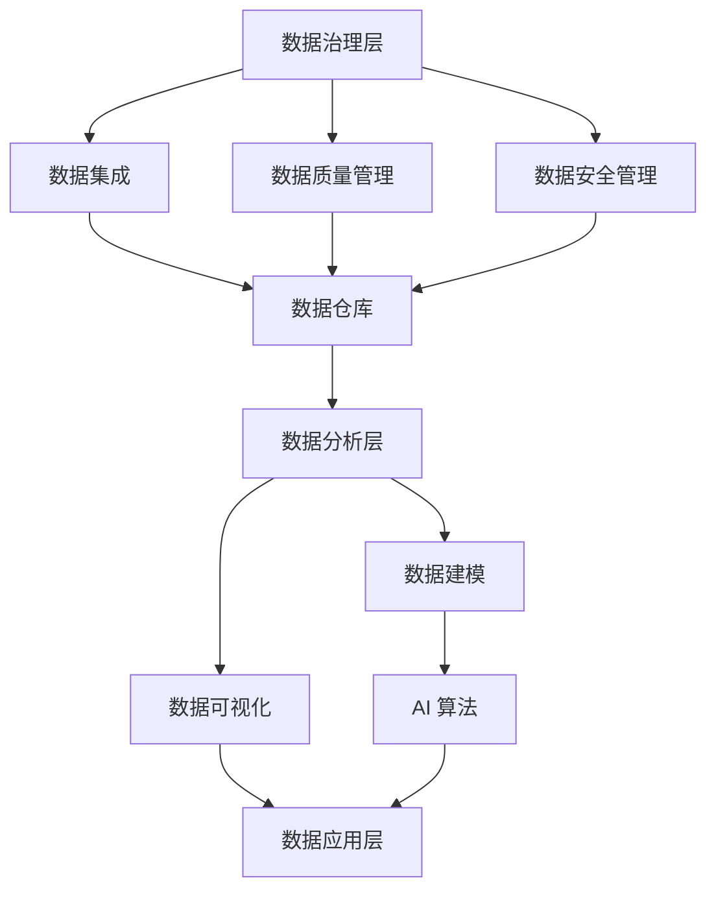

                 

**AI DMP 数据基建：数据分析与洞察**

> 关键词：数据中台（Data Mesh）、数据分析（Data Analysis）、AI（Artificial Intelligence）、数据治理（Data Governance）、数据驱动决策（Data-Driven Decision Making）

## 1. 背景介绍

在当今数据爆炸的时代，企业面临着海量数据的挑战。如何有效地管理、分析和利用这些数据，已成为企业提高竞争力的关键。数据中台（Data Mesh）是一种新型的数据架构，它通过将数据治理和数据分析集成到企业的数字化转型中，帮助企业实现数据驱动决策。本文将深入探讨AI DMP（AI-powered Data Mesh Platform）在数据分析和洞察中的应用，并提供实践指南。

## 2. 核心概念与联系

### 2.1 数据中台（Data Mesh）原理

数据中台是一种面向数据的架构，它将数据治理、数据分析和数据应用集成在一起。数据中台的核心理念是将数据视为企业的关键资产，并通过数据治理和数据分析，帮助企业提高数据的价值。


### 2.2 AI 在数据中台中的作用

AI 在数据中台中的作用是帮助企业从海量数据中提取有价值的洞察。AI 算法可以自动学习数据模式，并帮助企业预测趋势、识别异常情况，从而支持数据驱动决策。

### 2.3 AI DMP 架构

AI DMP 是一种基于数据中台的平台，它集成了 AI 算法，帮助企业实现数据分析和洞察。AI DMP 的核心架构包括数据治理层、数据分析层和数据应用层。



## 3. 核心算法原理 & 具体操作步骤

### 3.1 算法原理概述

AI DMP 中常用的算法包括机器学习算法、深度学习算法和自然语言处理算法等。这些算法可以帮助企业从结构化数据、半结构化数据和非结构化数据中提取有价值的洞察。

### 3.2 算法步骤详解

1. **数据预处理**：清洗、转换和标准化数据，以便于后续分析。
2. **特征工程**：提取数据中的特征，为后续的机器学习算法提供输入。
3. **模型选择**：根据数据特性和业务需求，选择合适的机器学习算法。
4. **模型训练**：使用训练数据集训练机器学习模型。
5. **模型评估**：评估模型的性能，并进行调优。
6. **预测和分析**：使用训练好的模型对新数据进行预测和分析。

### 3.3 算法优缺点

**优点**：

* 自动学习数据模式，无需人工干预。
* 可以处理大规模、高维度的数据。
* 可以发现人工难以发现的数据模式和关系。

**缺点**：

* 算法复杂，需要专业的数据科学家进行开发和维护。
* 算法的性能受数据质量和算法参数的影响。
* 算法的解释性较差，难以理解其决策过程。

### 3.4 算法应用领域

AI DMP 中的算法可以应用于各种领域，包括但不限于：

* 销售预测：预测未来的销售量，帮助企业进行库存管理和销售策略优化。
* 客户细分：将客户细分为不同的群组，帮助企业进行个性化营销。
* 客户流失预测：预测客户流失的可能性，帮助企业进行客户挽留策略。
* 产品推荐：根据用户的行为和偏好，为其推荐相关产品。

## 4. 数学模型和公式 & 详细讲解 & 举例说明

### 4.1 数学模型构建

在 AI DMP 中，常用的数学模型包括线性回归模型、逻辑回归模型、决策树模型和神经网络模型等。这些模型都可以通过数学公式表示。

### 4.2 公式推导过程

以线性回归模型为例，其数学公式为：

$$y = β_0 + β_1x_1 + β_2x_2 +... + β_nx_n + ε$$

其中，$y$ 是目标变量，$x_1, x_2,..., x_n$ 是自变量，$β_0, β_1, β_2,..., β_n$ 是回归系数，$ε$ 是误差项。

回归系数可以通过最小二乘法进行估计：

$$\hat{β} = (X^TX)^{-1}X^Ty$$

其中，$X$ 是自变量矩阵，$y$ 是目标变量向量。

### 4.3 案例分析与讲解

假设我们要预测某电商平台的销量，自变量包括产品价格、产品评分和产品类别等。我们可以使用线性回归模型进行预测。首先，我们需要收集相关数据，并进行数据预处理。然后，我们可以使用 Python 的 scikit-learn 库训练线性回归模型：

```python
from sklearn.linear_model import LinearRegression
from sklearn.model_selection import train_test_split
from sklearn.metrics import mean_squared_error

# 假设 X 是自变量矩阵，y 是目标变量向量
X_train, X_test, y_train, y_test = train_test_split(X, y, test_size=0.2, random_state=42)

model = LinearRegression()
model.fit(X_train, y_train)

# 进行预测
y_pred = model.predict(X_test)

# 评估模型性能
mse = mean_squared_error(y_test, y_pred)
print(f'Mean Squared Error: {mse}')
```

## 5. 项目实践：代码实例和详细解释说明

### 5.1 开发环境搭建

在开始项目实践之前，我们需要搭建开发环境。我们推荐使用 Python 和 Jupyter Notebook 作为开发环境。此外，我们还需要安装相关的库，如 pandas、numpy、scikit-learn、matplotlib 和 seaborn 等。

### 5.2 源代码详细实现

以下是一个简单的 AI DMP 项目实践的源代码实现：

```python
import pandas as pd
import numpy as np
from sklearn.model_selection import train_test_split
from sklearn.linear_model import LinearRegression
from sklearn.metrics import mean_squared_error

# 加载数据
data = pd.read_csv('sales_data.csv')

# 数据预处理
data = data.dropna()
X = data[['price', 'rating', 'category']]
y = data['sales']

# 特征工程
X = pd.get_dummies(X, drop_first=True)

# 数据集分割
X_train, X_test, y_train, y_test = train_test_split(X, y, test_size=0.2, random_state=42)

# 模型训练
model = LinearRegression()
model.fit(X_train, y_train)

# 进行预测
y_pred = model.predict(X_test)

# 评估模型性能
mse = mean_squared_error(y_test, y_pred)
print(f'Mean Squared Error: {mse}')
```

### 5.3 代码解读与分析

在上述代码中，我们首先加载数据，并进行数据预处理。然后，我们进行特征工程，将类别变量进行 one-hot 编码。接着，我们将数据集分为训练集和测试集。我们使用线性回归模型进行模型训练，并对测试集进行预测。最后，我们评估模型的性能，使用均方误差（Mean Squared Error）作为评估指标。

### 5.4 运行结果展示

运行上述代码后，我们可以得到模型的均方误差。均方误差越小，说明模型的性能越好。我们可以根据均方误差调整模型的参数，并进行模型优化。

## 6. 实际应用场景

AI DMP 可以应用于各种实际场景，以下是一些常见的应用场景：

### 6.1 客户细分

企业可以使用 AI DMP 将客户细分为不同的群组，从而进行个性化营销。例如，企业可以根据客户的购买历史、浏览历史和社交媒体行为等数据，将客户细分为高价值客户、中价值客户和低价值客户等群组。

### 6.2 销售预测

企业可以使用 AI DMP 预测未来的销量，从而进行库存管理和销售策略优化。例如，企业可以根据历史销量数据、季节因素、促销活动等数据，预测未来的销量。

### 6.3 客户流失预测

企业可以使用 AI DMP 预测客户流失的可能性，从而进行客户挽留策略。例如，企业可以根据客户的购买历史、客服投诉记录、社交媒体行为等数据，预测客户流失的可能性。

### 6.4 产品推荐

企业可以使用 AI DMP 根据用户的行为和偏好，为其推荐相关产品。例如，电商平台可以根据用户的浏览历史、购买历史和点赞记录等数据，为其推荐相关产品。

### 6.5 未来应用展望

随着 AI 技术的不断发展，AI DMP 的应用场景将会不断扩展。未来，AI DMP 将会帮助企业实现更加智能化的数据分析和决策，从而提高企业的竞争力。

## 7. 工具和资源推荐

### 7.1 学习资源推荐

* **书籍**：
	+ "Python for Data Analysis" by Wes McKinney
	+ "Hands-On Machine Learning with Scikit-Learn, Keras, and TensorFlow" by Aurélien Géron
	+ "Deep Learning" by Ian Goodfellow, Yoshua Bengio, and Aaron Courville
* **在线课程**：
	+ Coursera - "Machine Learning" by Stanford University
	+ edX - "Introduction to Machine Learning with Python" by Microsoft
	+ Udacity - "Intro to Machine Learning with Python Nanodegree Foundation"

### 7.2 开发工具推荐

* **编程语言**：Python
* **开发环境**：Jupyter Notebook, PyCharm, Visual Studio Code
* **数据处理库**：pandas, NumPy, scikit-learn, TensorFlow, PyTorch
* **数据可视化库**：matplotlib, seaborn, Plotly

### 7.3 相关论文推荐

* "Data Mesh: The Modern Data Architecture" by Zhamak Dehghani
* "Machine Learning: A Probabilistic Perspective" by Kevin P. Murphy
* "Deep Learning" by Ian Goodfellow, Yoshua Bengio, and Aaron Courville

## 8. 总结：未来发展趋势与挑战

### 8.1 研究成果总结

本文介绍了 AI DMP 在数据分析和洞察中的应用，并提供了实践指南。我们讨论了 AI DMP 的核心概念和架构，并介绍了常用的算法和数学模型。我们还提供了项目实践的代码实例，并介绍了 AI DMP 的实际应用场景。

### 8.2 未来发展趋势

未来，AI DMP 的发展趋势包括：

* **自动化**：AI DMP 将会实现更加自动化的数据分析和决策，从而提高企业的效率和竞争力。
* **实时分析**：AI DMP 将会实现实时数据分析，帮助企业及时发现数据模式和关系。
* **多模式学习**：AI DMP 将会结合多种学习模式，如监督学习、非监督学习和强化学习等，从而提高数据分析的准确性和有效性。

### 8.3 面临的挑战

AI DMP 面临的挑战包括：

* **数据质量**：数据质量直接影响 AI DMP 的性能。企业需要投入大量资源进行数据治理，以确保数据的准确性和完整性。
* **算法复杂性**：AI 算法复杂，需要专业的数据科学家进行开发和维护。企业需要投入大量资源进行人才培养和引进。
* **解释性**：AI 算法的解释性较差，难以理解其决策过程。企业需要投入大量资源进行算法解释和可视化。

### 8.4 研究展望

未来，AI DMP 的研究展望包括：

* **自适应学习**：研究自适应学习算法，帮助 AI DMP 适应数据的变化。
* **多模态学习**：研究多模态学习算法，帮助 AI DMP 处理结构化数据、半结构化数据和非结构化数据。
* **联邦学习**：研究联邦学习算法，帮助 AI DMP 实现数据的分布式处理和保护。

## 9. 附录：常见问题与解答

**Q1：什么是 AI DMP？**

AI DMP 是一种基于数据中台的平台，它集成了 AI 算法，帮助企业实现数据分析和洞察。

**Q2：AI DMP 与传统的数据分析平台有什么区别？**

AI DMP 与传统的数据分析平台的区别在于，AI DMP 结合了 AI 算法，帮助企业从海量数据中提取有价值的洞察。此外，AI DMP 还实现了数据治理和数据分析的集成，帮助企业提高数据的价值。

**Q3：AI DMP 可以应用于哪些领域？**

AI DMP 可以应用于各种领域，包括但不限于销售预测、客户细分、客户流失预测和产品推荐等。

**Q4：如何开始 AI DMP 项目？**

开始 AI DMP 项目的第一步是搭建开发环境，并收集相关数据。然后，我们需要进行数据预处理和特征工程。接着，我们选择合适的算法，并进行模型训练和评估。最后，我们对新数据进行预测和分析。

**Q5：AI DMP 面临哪些挑战？**

AI DMP 面临的挑战包括数据质量、算法复杂性和解释性等。

**Q6：未来 AI DMP 的发展趋势是什么？**

未来 AI DMP 的发展趋势包括自动化、实时分析和多模式学习等。

**Q7：如何学习 AI DMP？**

我们推荐阅读相关的书籍和在线课程，并进行实践项目。我们还推荐关注相关的学术论文和开发工具。

**Q8：如何评估 AI DMP 的性能？**

我们可以使用均方误差（Mean Squared Error）等指标评估 AI DMP 的性能。我们还可以进行 A/B 测试，比较 AI DMP 的性能和传统的数据分析平台。

**Q9：如何保护 AI DMP 的数据安全？**

我们可以使用数据加密、访问控制和审计等技术保护 AI DMP 的数据安全。我们还可以使用联邦学习算法，实现数据的分布式处理和保护。

**Q10：如何应用 AI DMP 进行数据驱动决策？**

我们可以使用 AI DMP 从海量数据中提取有价值的洞察，并将其应用于决策过程。我们还可以使用 AI DMP 进行预测和模拟，帮助企业进行决策优化。

## 作者：禅与计算机程序设计艺术 / Zen and the Art of Computer Programming

