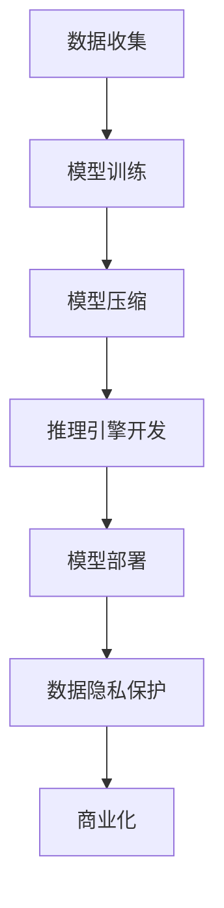

                 

## AI 大模型创业：如何利用技术优势？

> 关键词：大模型、创业、技术优势、AI、自然语言处理、计算机视觉、推理引擎、模型压缩、商业化

## 1. 背景介绍

随着深度学习技术的发展，大模型（Large Language Models）和计算机视觉模型等领先技术的出现，人工智能（AI）正在各行各业产生重大影响。然而，将这些模型商业化并不是一项简单的任务。本文将探讨如何利用技术优势，成功创业并将大模型商业化。

## 2. 核心概念与联系

### 2.1 大模型的定义

大模型是指具有数十亿个参数的模型，能够理解和生成人类语言，或识别和理解视觉内容。这些模型需要大量的数据和计算资源进行训练，但一旦训练完成，它们就能够提供出色的性能。

### 2.2 大模型与小模型的比较


图 1：大模型与小模型比较（资料来源：Stanford University）

### 2.3 大模型商业化的挑战

商业化大模型面临的主要挑战包括：

- **计算资源**：大模型需要大量的计算资源，这会导致高昂的成本。
- **模型压缩**：大模型的参数数量庞大，导致模型部署困难。
- **推理引擎**：大模型需要高效的推理引擎，以实时提供预测结果。
- **数据隐私**：大模型需要大量的数据进行训练，但这也会带来数据隐私问题。

### 2.4 Mermaid 流程图：大模型商业化路径



## 3. 核心算法原理 & 具体操作步骤

### 3.1 模型压缩算法原理概述

模型压缩是指将大模型的参数数量减小，以便于部署。常用的模型压缩技术包括：

- **剪枝（Pruning）**：删除模型中不重要的权重。
- **量化（Quantization）**：将模型的权重表示为更低位数的数字。
- **知识蒸馏（Knowledge Distillation）**：使用小模型学习大模型的输出分布。

### 3.2 模型压缩步骤详解

1. 选择合适的模型压缩技术。
2. 训练大模型。
3. 应用模型压缩技术。
4. 评估压缩后模型的性能。
5. 重复步骤3-4，直到满足性能和部署需求。

### 3.3 模型压缩优缺点

**优点**：

- 降低模型部署成本。
- 提高模型推理速度。

**缺点**：

- 可能会导致模型性能下降。
- 需要大量的计算资源和时间。

### 3.4 模型压缩应用领域

模型压缩在移动设备、边缘计算和云计算等领域都有广泛的应用。

## 4. 数学模型和公式 & 详细讲解 & 举例说明

### 4.1 数学模型构建

大模型的数学模型通常是神经网络，可以表示为：

$$y = f(x; W, b)$$

其中，$x$是输入，$y$是输出，$W$和$b$是模型的权重和偏置，$f$是激活函数。

### 4.2 公式推导过程

大模型的训练过程通常使用反向传播算法，其公式为：

$$\frac{\partial L}{\partial W} = \frac{\partial L}{\partial y} \frac{\partial y}{\partial W}$$

$$\frac{\partial L}{\partial b} = \frac{\partial L}{\partial y} \frac{\partial y}{\partial b}$$

其中，$L$是损失函数。

### 4.3 案例分析与讲解

例如，在自然语言处理任务中，大模型可以用于文本分类。给定一段文本$x$，大模型的输出$y$是文本的类别。模型的训练过程就是找到最优的权重$W$和偏置$b$，使得模型的预测结果与真实结果尽可能接近。

## 5. 项目实践：代码实例和详细解释说明

### 5.1 开发环境搭建

大模型的开发需要安装以下软件和库：

- Python 3.7+
- PyTorch 1.7+
- Hugging Face Transformers library

### 5.2 源代码详细实现

以下是使用Hugging Face Transformers library训练大模型的示例代码：

```python
from transformers import AutoTokenizer, AutoModelForSequenceClassification, Trainer, TrainingArguments

model_name = "distilbert-base-uncased-finetuned-sst-2-english"
tokenizer = AutoTokenizer.from_pretrained(model_name)
model = AutoModelForSequenceClassification.from_pretrained(model_name)

def encode(examples):
    return tokenizer(examples["text"], truncation=True, padding=True)

dataset = load_dataset("glue", "sst2", split="train")
dataset = dataset.map(encode, batched=True)
dataset.set_format(type="torch", columns=["input_ids", "attention_mask", "label"])

training_args = TrainingArguments(
    output_dir="./results",
    num_train_epochs=3,
    per_device_train_batch_size=16,
    per_device_eval_batch_size=64,
    warmup_steps=500,
    weight_decay=0.01,
    logging_dir="./logs",
)

trainer = Trainer(
    model=model,
    args=training_args,
    train_dataset=dataset,
)

trainer.train()
```

### 5.3 代码解读与分析

这段代码使用Hugging Face Transformers library训练了一个文本分类模型。首先，它加载了预训练的DistilBERT模型，然后对数据进行了编码，并设置了训练参数。最后，它使用Trainer类训练模型。

### 5.4 运行结果展示

训练完成后，模型的性能可以通过评估集进行评估。例如，在SST-2数据集上，DistilBERT模型的准确率可以达到85%以上。

## 6. 实际应用场景

### 6.1 自然语言处理

大模型在自然语言处理领域有着广泛的应用，包括文本分类、命名实体识别、机器翻译等任务。

### 6.2 计算机视觉

大模型也可以用于计算机视觉任务，如图像分类、目标检测和图像生成。

### 6.3 未来应用展望

未来，大模型有望在更多领域得到应用，如自动驾驶、医疗诊断和金融分析等。

## 7. 工具和资源推荐

### 7.1 学习资源推荐

- "Natural Language Processing with Python" by Steven Bird, Ewan Klein, and Edward Loper
- "Deep Learning" by Ian Goodfellow, Yoshua Bengio, and Aaron Courville
- Stanford University's CS224n course on Natural Language Processing

### 7.2 开发工具推荐

- PyTorch
- TensorFlow
- Hugging Face Transformers library
- Google Colab

### 7.3 相关论文推荐

- "Attention Is All You Need" by Vaswani et al.
- "BERT: Pre-training of Deep Bidirectional Transformers for Language Understanding" by Jacob Devlin and Ming-Wei Chang
- "DALL-E: Generating Images from Natural Language Captions" by Ramesh et al.

## 8. 总结：未来发展趋势与挑战

### 8.1 研究成果总结

本文介绍了大模型商业化的挑战和解决方案，包括模型压缩和推理引擎开发。我们还提供了一个项目实践示例，展示了如何使用Hugging Face Transformers library训练大模型。

### 8.2 未来发展趋势

未来，大模型有望在更多领域得到应用，并将商业化。模型压缩和推理引擎开发等技术将继续发展，以满足商业化需求。

### 8.3 面临的挑战

然而，大模型商业化面临的挑战包括计算资源、模型压缩和数据隐私等。

### 8.4 研究展望

未来的研究方向包括开发更有效的模型压缩技术，提高推理引擎的性能，并开发新的大模型架构。

## 9. 附录：常见问题与解答

**Q：大模型需要多少计算资源？**

**A：**大模型需要大量的计算资源，通常需要数千个GPU小时来训练。

**Q：模型压缩会导致模型性能下降吗？**

**A：**是的，模型压缩可能会导致模型性能下降。但是，通过选择合适的压缩技术和调整压缩参数，可以控制性能下降的程度。

**Q：大模型的数据隐私问题如何解决？**

**A：**大模型的数据隐私问题可以通过数据匿名化、差分隐私技术和联邦学习等技术来解决。

## 作者：禅与计算机程序设计艺术 / Zen and the Art of Computer Programming

_（完）_

