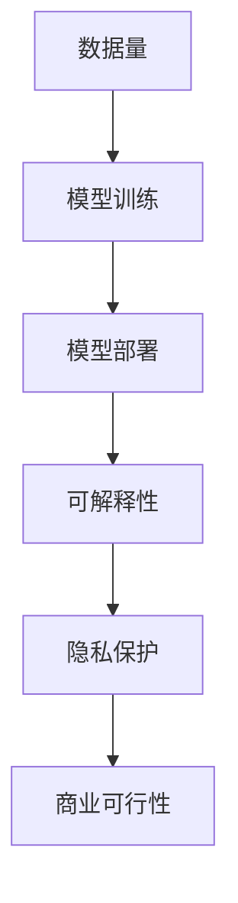

                 

## AI 大模型原理与应用：大模型是一个好的商业模式吗

> 关键词：大模型、商业模式、自然语言处理、计算机视觉、推理、预测、泛化能力、数据量、计算资源、模型训练、模型部署、可解释性、隐私保护

## 1. 背景介绍

当前，人工智能（AI）领域正在经历一场革命，其核心驱动力是大模型（Large Language Models，LLMs）和大型视觉模型（Large Vision Models，LVMs）的崛起。这些模型通过处理海量数据，学习到丰富的表示，从而展现出强大的泛化能力。然而，大模型是否是一个好的商业模式，仍然是一个有待探讨的问题。本文将深入剖析大模型的原理与应用，并就其商业可行性进行分析。

## 2. 核心概念与联系

### 2.1 大模型的定义

大模型是指具有数十亿甚至数千亿参数的模型，通过处理大量数据，学习到丰富的表示，从而展现出强大的泛化能力。大模型通常采用Transformer结构，具有自注意力机制，能够处理长序列数据。

### 2.2 大模型与小模型的区别

大模型与小模型的区别主要体现在模型参数数量、数据量、计算资源需求和泛化能力上。大模型需要更多的数据和计算资源，但其泛化能力通常更强，能够处理更复杂的任务。

### 2.3 大模型的应用领域

大模型的应用领域主要包括自然语言处理（NLP）和计算机视觉（CV）。在NLP领域，大模型可以用于文本生成、翻译、问答系统等任务。在CV领域，大模型可以用于图像分类、目标检测、图像生成等任务。

### 2.4 大模型的商业可行性

大模型的商业可行性取决于其模型训练、模型部署、可解释性、隐私保护等因素。大模型需要大量的数据和计算资源，模型训练成本高昂。此外，大模型的可解释性和隐私保护也面临挑战。



## 3. 核心算法原理 & 具体操作步骤

### 3.1 算法原理概述

大模型的核心算法是Transformer，其具有自注意力机制，能够处理长序列数据。大模型通常采用预训练和微调的方式进行训练。

### 3.2 算法步骤详解

大模型的训练过程包括以下步骤：

1. 数据预处理：对数据进行清洗、标记、切分等预处理操作。
2. 模型预训练：使用大量数据对模型进行预训练，学习到丰富的表示。
3. 模型微调：根据具体任务对模型进行微调，优化模型性能。
4. 模型评估：对模型进行评估，测试其泛化能力。

### 3.3 算法优缺点

大模型的优点包括：

* 强大的泛化能力，能够处理复杂任务。
* 可以通过微调适应新任务，具有良好的可扩展性。
* 可以学习到丰富的表示，为下游任务提供有用的特征。

大模型的缺点包括：

* 需要大量的数据和计算资源，模型训练成本高昂。
* 可解释性和隐私保护面临挑战。
* 训练过程需要大量的时间和资源。

### 3.4 算法应用领域

大模型的应用领域主要包括自然语言处理（NLP）和计算机视觉（CV）。在NLP领域，大模型可以用于文本生成、翻译、问答系统等任务。在CV领域，大模型可以用于图像分类、目标检测、图像生成等任务。

## 4. 数学模型和公式 & 详细讲解 & 举例说明

### 4.1 数学模型构建

大模型的数学模型通常基于Transformer结构，具有自注意力机制。大模型的数学模型可以表示为：

$$M(\theta; x) = f(x; \theta)$$

其中，$\theta$表示模型参数，$x$表示输入数据，$f$表示模型函数。

### 4.2 公式推导过程

大模型的训练过程通常采用最大似然估计的方式，其目标函数为：

$$L(\theta) = -\log P(y|x;\theta)$$

其中，$y$表示标签，$P(y|x;\theta)$表示模型预测的概率分布。

### 4.3 案例分析与讲解

例如，在文本生成任务中，大模型的目标是预测下一个单词。给定前$n$个单词$x_1, x_2, \ldots, x_n$，大模型的目标是预测下一个单词$x_{n+1}$。大模型的数学模型可以表示为：

$$P(x_{n+1}|x_1, x_2, \ldots, x_n) = \text{softmax}(Wx_n + b)$$

其中，$W$和$b$表示模型参数，$\text{softmax}$表示softmax函数。

## 5. 项目实践：代码实例和详细解释说明

### 5.1 开发环境搭建

大模型的开发环境通常需要GPU加速，推荐使用NVIDIA GPUs和CUDA。此外，还需要安装PyTorch、Transformers等深度学习框架。

### 5.2 源代码详细实现

大模型的源代码通常采用Python编写，并使用深度学习框架进行实现。以下是大模型训练过程的伪代码：

```python
import torch
from transformers import AutoModel, AutoTokenizer

# 加载预训练模型
model = AutoModel.from_pretrained("bert-base-uncased")
tokenizer = AutoTokenizer.from_pretrained("bert-base-uncased")

# 加载数据
data = load_data()

# 训练模型
model.train()
for epoch in range(num_epochs):
    for batch in data:
        inputs = tokenizer(batch["text"], padding=True, truncation=True, max_length=512, return_tensors="pt").to(device)
        labels = torch.tensor(batch["label"]).to(device)
        outputs = model(**inputs, labels=labels)
        loss = outputs.loss
        loss.backward()
        optimizer.step()
        optimizer.zero_grad()

# 保存模型
model.save_pretrained("./model")
```

### 5.3 代码解读与分析

上述代码首先加载预训练模型，然后加载数据，并对模型进行训练。在训练过程中，模型使用交叉熵损失函数计算损失，并使用反向传播算法更新模型参数。最后，保存模型。

### 5.4 运行结果展示

大模型的运行结果通常体现在其泛化能力上。例如，在文本生成任务中，大模型可以生成连贯、流畅的文本。在计算机视觉任务中，大模型可以准确地识别图像中的目标。

## 6. 实际应用场景

### 6.1 自然语言处理

大模型在自然语言处理领域具有广泛的应用，包括文本生成、翻译、问答系统等任务。例如，大模型可以用于生成新闻标题、翻译外文文档、回答用户提问等。

### 6.2 计算机视觉

大模型在计算机视觉领域也具有广泛的应用，包括图像分类、目标检测、图像生成等任务。例如，大模型可以用于识别图像中的物体、检测图像中的目标、生成新的图像等。

### 6.3 未来应用展望

大模型的未来应用将会更加广泛，包括自动驾驶、医疗影像分析、虚拟助手等领域。此外，大模型还将推动跨模态学习、多模态学习等新方向的发展。

## 7. 工具和资源推荐

### 7.1 学习资源推荐

* "Attention is All You Need"：大模型的开创性工作，介绍了Transformer结构和自注意力机制。
* "Language Models are Few-Shot Learners"：介绍了大模型在少样本学习中的应用。
* "DALL-E：Zero-Shot Text-to-Image Generation with a Transformer"：介绍了大模型在图像生成中的应用。

### 7.2 开发工具推荐

* Hugging Face Transformers：一个开源的深度学习框架，提供了大量预训练模型和工具。
* PyTorch：一个流行的深度学习框架，支持动态计算图和GPU加速。
* NVIDIA GPUs和CUDA：大模型的开发通常需要GPU加速，NVIDIA GPUs和CUDA是推荐的选择。

### 7.3 相关论文推荐

* "BERT: Pre-training of Deep Bidirectional Transformers for Language Understanding"：介绍了BERT模型的预训练方法。
* "RoBERTa: A Robustly Optimized BERT Pretraining Approach"：介绍了RoBERTa模型的预训练方法。
* "T5: Text-to-Text Transfer Transformer"：介绍了T5模型的预训练方法。

## 8. 总结：未来发展趋势与挑战

### 8.1 研究成果总结

大模型在自然语言处理和计算机视觉领域取得了显著的成果，展现出强大的泛化能力。然而，大模型的商业可行性仍然面临挑战。

### 8.2 未来发展趋势

未来，大模型的发展趋势将包括：

* 模型规模进一步扩大，参数数量达到千亿甚至万亿级别。
* 模型训练方法不断优化，降低模型训练成本。
* 模型可解释性和隐私保护得到改进，提高模型的可信度。
* 模型在更多领域得到应用，推动跨模态学习和多模态学习的发展。

### 8.3 面临的挑战

大模型面临的挑战包括：

* 模型训练成本高昂，需要大量的数据和计算资源。
* 模型可解释性和隐私保护面临挑战，需要开发新的技术解决方案。
* 模型部署面临挑战，需要开发新的分布式训练和部署技术。

### 8.4 研究展望

未来，大模型的研究将会聚焦于以下方向：

* 模型训练方法的优化，降低模型训练成本。
* 模型可解释性和隐私保护的改进，提高模型的可信度。
* 模型在更多领域的应用，推动跨模态学习和多模态学习的发展。
* 模型部署技术的开发，提高模型的可用性和可靠性。

## 9. 附录：常见问题与解答

### 9.1 大模型与小模型的区别是什么？

大模型与小模型的区别主要体现在模型参数数量、数据量、计算资源需求和泛化能力上。大模型需要更多的数据和计算资源，但其泛化能力通常更强，能够处理更复杂的任务。

### 9.2 大模型的商业可行性如何？

大模型的商业可行性取决于其模型训练、模型部署、可解释性、隐私保护等因素。大模型需要大量的数据和计算资源，模型训练成本高昂。此外，大模型的可解释性和隐私保护也面临挑战。

### 9.3 大模型的未来发展趋势是什么？

未来，大模型的发展趋势将包括模型规模进一步扩大，模型训练方法不断优化，模型可解释性和隐私保护得到改进，模型在更多领域得到应用，推动跨模态学习和多模态学习的发展。

## 作者：禅与计算机程序设计艺术 / Zen and the Art of Computer Programming

