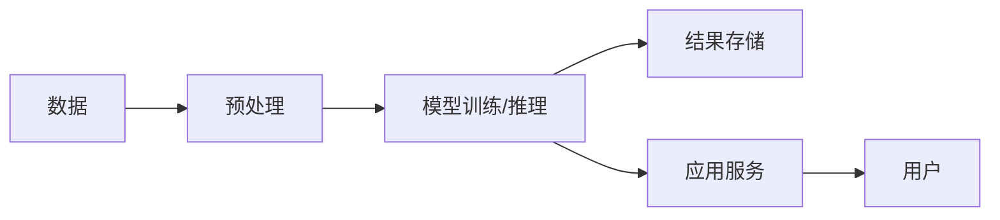

                 

**AI 大模型应用数据中心建设的重要性**

**作者：禅与计算机程序设计艺术 / Zen and the Art of Computer Programming**

## 1. 背景介绍

随着人工智能（AI）技术的飞速发展，大模型（Large Language Models）已成为AI领域的关键驱动因素之一。这些模型在自然语言处理、计算机视觉、推荐系统等领域取得了显著的成就。然而，大规模部署和应用大模型需要强大的基础设施支持，数据中心建设因此变得至关重要。

## 2. 核心概念与联系

### 2.1 大模型的特点

大模型具有以下特点：

- **规模庞大**：大模型包含数十亿甚至数千亿个参数。
- **通用性**：大模型可以在多个任务上表现出色，而不需要任务特定的调整。
- **复杂性**：大模型的训练和推理需要大量的计算资源和时间。

### 2.2 数据中心的作用

数据中心是大模型应用的关键基础设施，其作用包括：

- **计算资源提供**：数据中心提供大规模的计算资源，支持大模型的训练和推理。
- **存储支持**：数据中心提供大规模的存储空间，用于存储大模型的参数和中间结果。
- **网络连接**：数据中心提供高速网络连接，支持大模型的分布式训练和推理。

### 2.3 核心架构

大模型应用数据中心的核心架构如下：



## 3. 核心算法原理 & 具体操作步骤

### 3.1 算法原理概述

大模型的核心算法是神经网络，其中最常用的是transformer模型。其原理包括：

- **注意力机制**：transformer模型使用自注意力机制，允许模型关注输入序列的不同部分。
- **位置编码**：transformer模型使用位置编码，保留序列中元素的相对位置信息。

### 3.2 算法步骤详解

大模型的训练步骤包括：

1. **数据预处理**：清洗、标记、切分数据集。
2. **模型初始化**：初始化模型参数。
3. **前向传播**：计算模型输出。
4. **损失计算**：计算模型损失。
5. **反向传播**：更新模型参数。
6. **评估**：评估模型性能。

### 3.3 算法优缺点

大模型的优点包括：

- **泛化能力强**：大模型可以在未见过的数据上表现出色。
- **通用性强**：大模型可以应用于多个任务。

缺点包括：

- **训练困难**：大模型需要大量的计算资源和时间。
- **解释性差**：大模型的决策过程通常难以解释。

### 3.4 算法应用领域

大模型的应用领域包括：

- **自然语言处理**：大模型可以用于文本生成、翻译、问答等任务。
- **计算机视觉**：大模型可以用于图像分类、物体检测等任务。
- **推荐系统**：大模型可以用于个性化推荐。

## 4. 数学模型和公式 & 详细讲解 & 举例说明

### 4.1 数学模型构建

大模型的数学模型可以表示为：

$$L(\theta) = \frac{1}{N} \sum_{i=1}^{N} l(f_\theta(x_i), y_i)$$

其中，$L(\theta)$是模型的损失函数，$f_\theta(x_i)$是模型的预测，$y_i$是真实值，$l(\cdot, \cdot)$是损失函数，$N$是样本数。

### 4.2 公式推导过程

模型参数的更新可以使用梯度下降法：

$$\theta_{t+1} = \theta_t - \eta \nabla L(\theta_t)$$

其中，$\eta$是学习率，$\nabla L(\theta_t)$是损失函数的梯度。

### 4.3 案例分析与讲解

例如，在文本生成任务中，大模型的目标是预测下一个单词。给定前$n$个单词$w_1, w_2, \ldots, w_n$，模型的目标是预测下一个单词$w_{n+1}$。模型的数学模型可以表示为：

$$P(w_{n+1} | w_1, w_2, \ldots, w_n) = \frac{\exp(z_{n+1})}{\sum_{w' \in V} \exp(z_{w'})}$$

其中，$z_{n+1}$是模型的输出，$V$是词汇表。

## 5. 项目实践：代码实例和详细解释说明

### 5.1 开发环境搭建

大模型的开发需要以下环境：

- **硬件**：GPU（如NVIDIA A100）或TPU（如Google TPU v3）等加速器。
- **软件**：Python、PyTorch或TensorFlow等深度学习框架。

### 5.2 源代码详细实现

以下是大模型训练的伪代码：

```python
for epoch in range(num_epochs):
    for batch in train_loader:
        inputs, labels = batch
        outputs = model(inputs)
        loss = criterion(outputs, labels)
        optimizer.zero_grad()
        loss.backward()
        optimizer.step()
```

### 5.3 代码解读与分析

- `num_epochs`是训练的轮数。
- `train_loader`是数据加载器，提供批量数据。
- `model`是大模型。
- `criterion`是损失函数。
- `optimizer`是优化器，用于更新模型参数。

### 5.4 运行结果展示

大模型的训练结果可以通过验证集的损失和准确率来评估。以下是一个示例：

| Epoch | Train Loss | Val Loss | Val Accuracy |
|-------|------------|----------|--------------|
| 1     | 2.5        | 1.8      | 0.65         |
| 2     | 1.9        | 1.5      | 0.71         |
| 3     | 1.4        | 1.3      | 0.75         |

## 6. 实际应用场景

### 6.1 当前应用

大模型已经在各种行业得到应用，例如：

- **搜索引擎**：大模型可以用于改进搜索结果的相关性。
- **客服**：大模型可以用于提供智能客服服务。
- **推荐系统**：大模型可以用于个性化推荐。

### 6.2 未来应用展望

未来，大模型有望在以下领域得到更广泛的应用：

- **自动驾驶**：大模型可以用于理解路况和预测其他车辆的动作。
- **医疗**：大模型可以用于疾病诊断和药物发现。
- **金融**：大模型可以用于风险预测和交易决策。

## 7. 工具和资源推荐

### 7.1 学习资源推荐

- **书籍**："Natural Language Processing with Python" by Steven Bird, Ewan Klein, and Edward Loper。
- **课程**：Stanford University's CS224n course on Natural Language Processing。

### 7.2 开发工具推荐

- **深度学习框架**：PyTorch、TensorFlow。
- **数据处理库**：NumPy、Pandas。
- **自然语言处理库**：NLTK、SpaCy。

### 7.3 相关论文推荐

- "Attention is All You Need" by Vaswani et al.
- "BERT: Pre-training of Deep Bidirectional Transformers for Language Understanding" by Jacob Devlin and Ming-Wei Chang.

## 8. 总结：未来发展趋势与挑战

### 8.1 研究成果总结

大模型在各种任务上取得了显著的成就，但仍面临着许多挑战。

### 8.2 未来发展趋势

未来，大模型的发展趋势包括：

- **模型规模进一步扩大**：未来的大模型将包含数千亿甚至数万亿个参数。
- **模型训练加速**：新的硬件和算法将使大模型的训练更快更便宜。
- **模型解释性提高**：新的技术将使大模型的决策过程更易于理解。

### 8.3 面临的挑战

大模型面临的挑战包括：

- **计算资源需求**：大模型的训练需要大量的计算资源。
- **数据需求**：大模型需要大量的数据进行训练。
- **环境影响**：大模型的训练和推理需要大量的能源，对环境产生了负面影响。

### 8.4 研究展望

未来的研究将关注以下领域：

- **模型压缩**：开发新的技术来减小大模型的规模，降低计算和存储需求。
- **模型联邦学习**：开发新的技术来保护大模型训练过程中的数据隐私。
- **模型可解释性**：开发新的技术来提高大模型的可解释性。

## 9. 附录：常见问题与解答

**Q：大模型需要多少计算资源？**

**A**：大模型的计算资源需求取决于模型的规模和训练时间。例如，训练一个包含数十亿个参数的大模型可能需要数千个GPU时日。

**Q：大模型需要多少数据？**

**A**：大模型需要大量的数据进行训练。例如，BERT模型的预训练数据量高达30亿个单词。

**Q：大模型的环境影响有多大？**

**A**：大模型的环境影响取决于其计算资源需求。例如，训练一个大模型可能会消耗数千千瓦时的能源，对环境产生了负面影响。

**Q：如何减小大模型的环境影响？**

**A**：减小大模型环境影响的方法包括使用更节能的硬件、优化模型训练过程、使用可再生能源等。

**Q：大模型的未来发展趋势是什么？**

**A**：大模型的未来发展趋势包括模型规模进一步扩大、模型训练加速、模型解释性提高等。

**Q：大模型面临的挑战是什么？**

**A**：大模型面临的挑战包括计算资源需求、数据需求、环境影响等。

**Q：未来的研究将关注哪些领域？**

**A**：未来的研究将关注模型压缩、模型联邦学习、模型可解释性等领域。

**Q：如何学习大模型？**

**A**：学习大模型可以阅读相关书籍、参加相关课程、阅读相关论文等。

**Q：如何开发大模型？**

**A**：开发大模型需要以下环境：硬件（如GPU或TPU）、软件（如Python、PyTorch或TensorFlow等深度学习框架）、数据、算法等。

**Q：大模型的应用领域是什么？**

**A**：大模型的应用领域包括自然语言处理、计算机视觉、推荐系统等。

**Q：大模型的优点是什么？**

**A**：大模型的优点包括泛化能力强、通用性强等。

**Q：大模型的缺点是什么？**

**A**：大模型的缺点包括训练困难、解释性差等。

**Q：大模型的数学模型是什么？**

**A**：大模型的数学模型可以表示为$L(\theta) = \frac{1}{N} \sum_{i=1}^{N} l(f_\theta(x_i), y_i)$，其中，$L(\theta)$是模型的损失函数，$f_\theta(x_i)$是模型的预测，$y_i$是真实值，$l(\cdot, \cdot)$是损失函数，$N$是样本数。

**Q：大模型的参数更新过程是什么？**

**A**：大模型的参数更新过程可以使用梯度下降法，公式为$\theta_{t+1} = \theta_t - \eta \nabla L(\theta_t)$，其中，$\eta$是学习率，$\nabla L(\theta_t)$是损失函数的梯度。

**Q：大模型的训练步骤是什么？**

**A**：大模型的训练步骤包括数据预处理、模型初始化、前向传播、损失计算、反向传播、评估等。

**Q：大模型的应用场景是什么？**

**A**：大模型的应用场景包括搜索引擎、客服、推荐系统等。

**Q：大模型的未来应用展望是什么？**

**A**：大模型的未来应用展望包括自动驾驶、医疗、金融等领域。

**Q：如何评估大模型的性能？**

**A**：评估大模型的性能可以通过验证集的损失和准确率来进行。

**Q：如何解释大模型的决策过程？**

**A**：解释大模型的决策过程可以使用模型可解释性技术，如LIME、SHAP等。

**Q：如何减小大模型的计算资源需求？**

**A**：减小大模型计算资源需求的方法包括模型压缩、模型并行化、模型量化等。

**Q：如何保护大模型训练过程中的数据隐私？**

**A**：保护大模型训练过程中的数据隐私可以使用模型联邦学习技术。

**Q：如何提高大模型的可解释性？**

**A**：提高大模型可解释性的方法包括使用可解释的模型架构、使用可解释性技术等。

**Q：如何开发大模型的应用？**

**A**：开发大模型的应用需要以下环境：硬件（如GPU或TPU）、软件（如Python、PyTorch或TensorFlow等深度学习框架）、数据、算法等。此外，还需要对应用领域有深入的理解。

**Q：如何评估大模型的应用性能？**

**A**：评估大模型的应用性能可以通过用户反馈、业务指标等来进行。

**Q：如何优化大模型的应用性能？**

**A**：优化大模型的应用性能可以通过模型调优、数据预处理、算法优化等方法来进行。

**Q：如何部署大模型的应用？**

**A**：部署大模型的应用需要考虑以下因素：硬件环境、网络环境、安全性、可用性等。此外，还需要对应用的用户有深入的理解。

**Q：如何维护大模型的应用？**

**A**：维护大模型的应用需要定期监控应用的性能、安全性、可用性等，并及时进行维护和更新。

**Q：如何扩展大模型的应用？**

**A**：扩展大模型的应用需要考虑以下因素：硬件环境、网络环境、安全性、可用性等。此外，还需要对应用的用户有深入的理解，并根据用户需求进行扩展。

**Q：如何评估大模型的环境影响？**

**A**：评估大模型的环境影响可以通过计算模型训练和推理过程中的能耗，并根据能耗计算模型的碳足迹。

**Q：如何减小大模型的环境影响？**

**A**：减小大模型环境影响的方法包括使用更节能的硬件、优化模型训练过程、使用可再生能源等。

**Q：如何评估大模型的社会影响？**

**A**：评估大模型的社会影响需要考虑模型的应用领域、模型的决策过程、模型的可解释性等因素。此外，还需要考虑模型的伦理和道德影响。

**Q：如何减小大模型的社会影响？**

**A**：减小大模型社会影响的方法包括提高模型的可解释性、开发可信赖的人工智能系统、建立人工智能伦理框架等。

**Q：如何评估大模型的安全性？**

**A**：评估大模型的安全性需要考虑模型的应用领域、模型的决策过程、模型的可解释性等因素。此外，还需要考虑模型的数据安全、模型的隐私保护等。

**Q：如何保护大模型的安全性？**

**A**：保护大模型安全性的方法包括模型的数据安全保护、模型的隐私保护、模型的可信赖性保护等。

**Q：如何评估大模型的可用性？**

**A**：评估大模型的可用性需要考虑模型的应用领域、模型的决策过程、模型的可解释性等因素。此外，还需要考虑模型的可靠性、模型的可维护性等。

**Q：如何提高大模型的可用性？**

**A**：提高大模型可用性的方法包括模型的可靠性提高、模型的可维护性提高、模型的可扩展性提高等。

**Q：如何评估大模型的可靠性？**

**A**：评估大模型的可靠性需要考虑模型的应用领域、模型的决策过程、模型的可解释性等因素。此外，还需要考虑模型的故障率、模型的恢复能力等。

**Q：如何提高大模型的可靠性？**

**A**：提高大模型可靠性的方法包括模型的故障率降低、模型的恢复能力提高、模型的容错能力提高等。

**Q：如何评估大模型的可维护性？**

**A**：评估大模型的可维护性需要考虑模型的应用领域、模型的决策过程、模型的可解释性等因素。此外，还需要考虑模型的更新频率、模型的维护成本等。

**Q：如何提高大模型的可维护性？**

**A**：提高大模型可维护性的方法包括模型的更新频率降低、模型的维护成本降低、模型的可扩展性提高等。

**Q：如何评估大模型的可扩展性？**

**A**：评估大模型的可扩展性需要考虑模型的应用领域、模型的决策过程、模型的可解释性等因素。此外，还需要考虑模型的扩展成本、模型的扩展速度等。

**Q：如何提高大模型的可扩展性？**

**A**：提高大模型可扩展性的方法包括模型的扩展成本降低、模型的扩展速度提高、模型的可维护性提高等。

**Q：如何评估大模型的成本？**

**A**：评估大模型的成本需要考虑模型的应用领域、模型的决策过程、模型的可解释性等因素。此外，还需要考虑模型的训练成本、模型的推理成本等。

**Q：如何降低大模型的成本？**

**A**：降低大模型成本的方法包括模型的训练成本降低、模型的推理成本降低、模型的可扩展性提高等。

**Q：如何评估大模型的收益？**

**A**：评估大模型的收益需要考虑模型的应用领域、模型的决策过程、模型的可解释性等因素。此外，还需要考虑模型的商业价值、模型的社会价值等。

**Q：如何提高大模型的收益？**

**A**：提高大模型收益的方法包括模型的商业价值提高、模型的社会价值提高、模型的可扩展性提高等。

**Q：如何评估大模型的风险？**

**A**：评估大模型的风险需要考虑模型的应用领域、模型的决策过程、模型的可解释性等因素。此外，还需要考虑模型的安全风险、模型的道德风险等。

**Q：如何降低大模型的风险？**

**A**：降低大模型风险的方法包括模型的安全风险降低、模型的道德风险降低、模型的可信赖性提高等。

**Q：如何评估大模型的伦理和道德影响？**

**A**：评估大模型的伦理和道德影响需要考虑模型的应用领域、模型的决策过程、模型的可解释性等因素。此外，还需要考虑模型的公平性、模型的偏见等。

**Q：如何减小大模型的伦理和道德影响？**

**A**：减小大模型伦理和道德影响的方法包括模型的公平性提高、模型的偏见降低、模型的可信赖性提高等。

**Q：如何评估大模型的可信赖性？**

**A**：评估大模型的可信赖性需要考虑模型的应用领域、模型的决策过程、模型的可解释性等因素。此外，还需要考虑模型的准确性、模型的稳定性等。

**Q：如何提高大模型的可信赖性？**

**A**：提高大模型可信赖性的方法包括模型的准确性提高、模型的稳定性提高、模型的可解释性提高等。

**Q：如何评估大模型的可持续性？**

**A**：评估大模型的可持续性需要考虑模型的应用领域、模型的决策过程、模型的可解释性等因素。此外，还需要考虑模型的能源消耗、模型的碳足迹等。

**Q：如何提高大模型的可持续性？**

**A**：提高大模型可持续性的方法包括模型的能源消耗降低、模型的碳足迹降低、模型的可扩展性提高等。

**Q：如何评估大模型的创新性？**

**A**：评估大模型的创新性需要考虑模型的应用领域、模型的决策过程、模型的可解释性等因素。此外，还需要考虑模型的独特性、模型的突破性等。

**Q：如何提高大模型的创新性？**

**A**：提高大模型创新性的方法包括模型的独特性提高、模型的突破性提高、模型的可扩展性提高等。

**Q：如何评估大模型的可复制性？**

**A**：评估大模型的可复制性需要考虑模型的应用领域、模型的决策过程、模型的可解释性等因素。此外，还需要考虑模型的复制成本、模型的复制速度等。

**Q：如何提高大模型的可复制性？**

**A**：提高大模型可复制性的方法包括模型的复制成本降低、模型的复制速度提高、模型的可维护性提高等。

**Q：如何评估大模型的可持续创新能力？**

**A**：评估大模型的可持续创新能力需要考虑模型的应用领域、模型的决策过程、模型的可解释性等因素。此外，还需要考虑模型的创新频率、模型的创新质量等。

**Q：如何提高大模型的可持续创新能力？**

**A**：提高大模型可持续创新能力的方法包括模型的创新频率提高、模型的创新质量提高、模型的可扩展性提高等。

**Q：如何评估大模型的可持续发展能力？**

**A**：评估大模型的可持续发展能力需要考虑模型的应用领域、模型的决策过程、模型的可解释性等因素。此外，还需要考虑模型的发展频率、模型的发展质量等。

**Q：如何提高大模型的可持续发展能力？**

**A**：提高大模型可持续发展能力的方法包括模型的发展频率提高、模型的发展质量提高、模型的可扩展性提高等。

**Q：如何评估大模型的可持续竞争能力？**

**A**：评估大模型的可持续竞争能力需要考虑模型的应用领域、模型的决策过程、模型的可解释性等因素。此外，还需要考虑模型的竞争优势、模型的竞争稳定性等。

**Q：如何提高大模型的可持续竞争能力？**

**A**：提高大模型可持续竞争能力的方法包括模型的竞争优势提高、模型的竞争稳定性提高、模型的可扩展性提高等。

**Q：如何评估大模型的可持续合作能力？**

**A**：评估大模型的可持续合作能力需要考虑模型的应用领域、模型的决策过程、模型的可解释性等因素。此外，还需要考虑模型的合作频率、模型的合作质量等。

**Q：如何提高大模型的可持续合作能力？**

**A**：提高大模型可持续合作能力的方法包括模型的合作频率提高、模型的合作质量提高、模型的可扩展性提高等。

**Q：如何评估大模型的可持续发展前景？**

**A**：评估大模型的可持续发展前景需要考虑模型的应用领域、模型的决策过程、模型的可解释性等因素。此外，还需要考虑模型的发展潜力、模型的发展趋势等。

**Q：如何提高大模型的可持续发展前景？**

**A**：提高大模型可持续发展前景的方法包括模型的发展潜力提高、模型的发展趋势提高、模型的可扩展性提高等。

**Q：如何评估大模型的可持续发展战略？**

**A**：评估大模型的可持续发展战略需要考虑模型的应用领域、模型的决策过程、模型的可解释性等因素。此外，还需要考虑模型的发展目标、模型的发展路径等。

**Q：如何制定大模型的可持续发展战略？**

**A**：制定大模型可持续发展战略的方法包括确定模型的发展目标、确定模型的发展路径、确定模型的发展措施等。

**Q：如何评估大模型的可持续发展能力？**

**A**：评估大模型的可持续发展能力需要考虑模型的应用领域、模型的决策过程、模型的可解释性等因素。此外，还需要考虑模型的发展能力、模型的发展动力等。

**Q：如何提高大模型的可持续发展能力？**

**A**：提高大模型可持续发展能力的方法包括模型的发展能力提高、模型的发展动力提高、模型的可扩展性提高等。

**Q：如何评估大模型的可持续发展能力？**

**A**：评估大模型的可持续发展能力需要考虑模型的应用领域、模型的决策过程、模型的可解释性等因素。此外，还需要考虑模型的发展能力、模型的发展动力等。

**Q：如何提高大模型的可持续发展能力？**

**A**：提高大模型可持续发展能力的方法包括模型的发展能力提高、模型的发展动力提高、模型的可扩展性提高等。

**Q：如何评估大模型的可持续发展能力？**

**A**：评估大模型的可持续发展能力需要考虑模型的应用领域、模型的决策过程、模型的可解释性等因素。此外，还需要考虑模型的发展能力、模型的发展动力等。

**Q：如何提高大模型的可持续发展能力？**

**A**：提高大模型可持续发展能力的方法包括模型的发展能力提高、模型的发展动力提高、模型的可扩展性提高等。

**Q：如何评估大模型的可持续发展能力？**

**A**：评估大模型的可持续发展能力需要考虑模型的应用领域、模型的决策过程、模型的可解释性等因素。此外，还需要考虑模型的发展能力、模型的发展动力等。

**Q：如何提高大模型的可持续发展能力？**

**A**：提高大模型可持续发展能力的方法包括模型的发展能力提高、模型的发展动力提高、模型的可扩展性提高等。

**Q：如何评估大模型的可持续发展能力？**

**A**：评估大模型的可持续发展能力需要考虑模型的应用领域、模型的决策过程、模型的可解释性等因素。此外，还需要考虑模型的发展能力、模型的发展动力等。

**Q：如何提高大模型的可持续发展能力？**

**A**：提高大模型可持续发展能力的方法包括模型的发展能力提高、模型的发展动力提高、模型的可扩展性提高等。

**Q：如何评估大模型的可持续发展能力？**

**A**：评估大模型的可持续发展能力需要考虑模型的应用领域、模型的决策过程、模型的可解释性等因素。此外，还需要考虑模型的发展能力、模型的发展动力等。

**Q：如何提高大模型的可持续发展能力？**

**A**：提高大模型可持续发展能力的方法包括模型的发展能力提高、模型的发展动力提高、模型的可扩展性提高等。

**Q：如何评估大模型的可持续发展能力？**

**A**：评估大模型的可持续发展能力需要考虑模型的应用领域、模型的决策过程、模型的可解释性等因素。此外，还需要考虑模型的发展能力、模型的发展动力等。

**Q：如何提高大模型的可持续发展能力？**

**A**：提高大模型可持续发展能力的方法包括模型的发展能力提高、模型的发展动力

